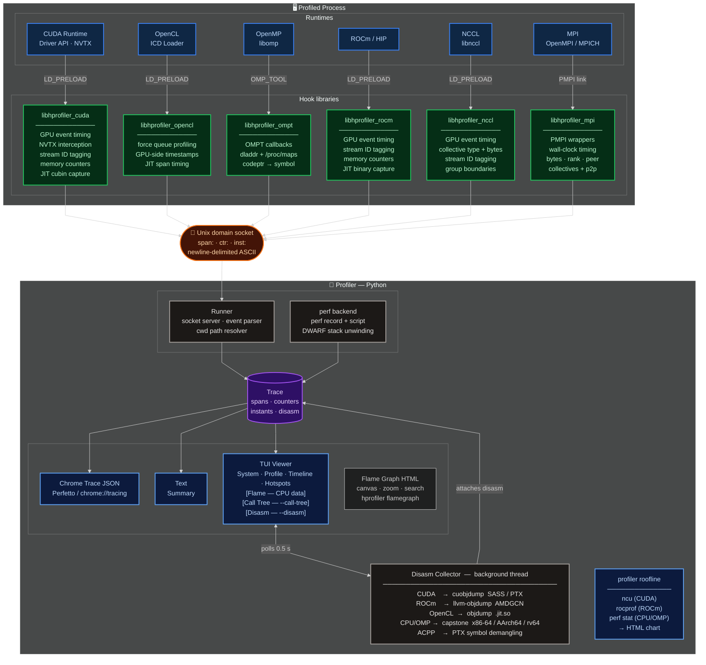

# Profiler — Documentation

A command-line CPU/GPU profiler with a terminal UI that traces programs across
OpenMP, OpenCL, CUDA, ROCm, NCCL, and MPI. CPU sampling is provided via Linux
perf. Supports JIT-compiled
kernels (ACPP/AdaptiveCpp, nvcc, etc.) with per-kernel disassembly. GPU-accurate
kernel timing is captured via CUDA/HIP event pairs. NVTX annotations are
intercepted without requiring libnvToolsExt.

---

## Table of Contents

1. [Quick Start](#1-quick-start)
2. [Installation and Build](#2-installation-and-build)
3. [CLI Reference](#3-cli-reference)
4. [Backend Reference](#4-backend-reference)
5. [TUI Viewer](#5-tui-viewer)
6. [Output Formats](#6-output-formats)
7. [JIT Compilation and ACPP](#7-jit-compilation-and-acpp)
8. [Disassembly](#8-disassembly)
9. [Roofline Analysis](#9-roofline-analysis)
10. [Architecture Overview](#10-architecture-overview)
11. [Implementation Details](#11-implementation-details)
12. [Wire Protocol](#12-wire-protocol)
13. [Performance Overhead](#13-performance-overhead)
14. [Extending the Profiler](#14-extending-the-profiler)
15. [AI Performance Analysis](#15-ai-performance-analysis)

---

## 1. Quick Start

```bash
# Build the C hook libraries
python3 hprofiler build

# See which backends are available on your system
python3 hprofiler backends

# Profile an OpenMP program (clang-compiled for OMPT support)
python3 hprofiler run --backend openmp -- ./my_omp_program

# Profile a CUDA program
python3 hprofiler run --backend cuda,cpu -- ./my_cuda_app

# Profile with per-kernel disassembly (adds Disasm tab to TUI)
python3 hprofiler run --backend cuda --disasm -- ./my_cuda_app

# Roofline chart — TUI viewer by default (requires plotly + kaleido)
python3 hprofiler roofline --backend cuda -- ./my_cuda_app
python3 hprofiler roofline --backend openmp -- ./my_omp_program
python3 hprofiler roofline --html --backend cuda -- ./my_cuda_app  # browser instead

# Flame graph — TUI viewer by default (requires plotly + kaleido)
python3 hprofiler flamegraph -- ./my_program
python3 hprofiler flamegraph --html -- ./my_program                # browser instead

# Profile a ROCm/HIP program
python3 hprofiler run --backend rocm -- ./my_hip_app

# Profile with all available backends (auto-detected)
python3 hprofiler run -- ./my_program

# Save trace to a specific file
python3 hprofiler run --backend cuda --output my_trace.json -- ./my_program

# View a previously saved trace in the TUI
python3 hprofiler view my_program.hprofiler.json

# View with disassembly
python3 hprofiler view --disasm my_program.hprofiler.json

# Print a text summary without opening the TUI
python3 hprofiler run --no-ui -- ./my_program
```

---

## 2. Installation and Build

### Requirements

| Component | Requirement |
|-----------|-------------|
| Python | 3.10+ |
| Python packages | `click`, `textual`, `rich`, `capstone>=5.0` |
| C compiler | GCC 9+ or Clang 12+ |
| CMake | 3.16+ |
| CPU backend | Linux `perf` tool |
| OpenMP backend | `libomp` (LLVM) — not GCC's `libgomp` (see §4) |
| CUDA backend | CUDA Runtime installed (`libcuda.so`) |
| OpenCL backend | Any ICD loader (`libOpenCL.so`) |
| ROCm backend | ROCm installed at `/opt/rocm` |
| NCCL backend | CUDA Runtime + `libnccl.so` at runtime |
| MPI backend | Any MPI implementation (`mpicc` at build time) |
| Disasm (CUDA AoT) | `cuobjdump` (CUDA toolkit) |
| Disasm (CPU/ELF) | `capstone>=5.0` (fast path) or `objdump` / `llvm-objdump` |
| Disasm (ROCm) | `llvm-objdump` |
| Roofline (CUDA) | `ncu` (Nsight Compute, ships with CUDA toolkit) |
| Roofline (CPU/OpenMP) | `perf stat` (linux-tools) |
| Roofline (ROCm) | `rocprof` (ships with ROCm) |

### Install Python dependencies

```bash
pip install click textual rich capstone
pip install plotly "kaleido==0.2.1"   # required for TUI flamegraph/roofline viewers
# kaleido 0.2.1 specifically — 0.3+ requires an external Chrome install and breaks on clusters
```

### Build the C hook libraries

```bash
python3 hprofiler build
# or manually:
cmake -S . -B build -DCMAKE_BUILD_TYPE=Release
cmake --build build -j$(nproc)
```

Built libraries are placed in `build/lib/`:

```
build/lib/
├── libhprofiler_cuda.so      # CUDA Runtime + Driver API + NVTX hook
├── libhprofiler_opencl.so    # OpenCL API hook
├── libhprofiler_ompt.so      # OpenMP OMPT tool
├── libhprofiler_rocm.so      # ROCm/HIP hook (only if ROCm is found)
├── libhprofiler_nccl.so      # NCCL multi-GPU collectives hook
└── libhprofiler_mpi.so       # MPI PMPI profiling hook (built with mpicc)
```

### Run without installing

The `hprofiler` script at the project root runs directly with Python's module
path already configured. No `pip install` of the package is needed.

---

## 3. CLI Reference

### `hprofiler run`

Profile a program and optionally open the TUI viewer.

```
hprofiler run [OPTIONS] -- COMMAND [ARGS...]
```

| Option | Default | Description |
|--------|---------|-------------|
| `--backend`, `-b` | `auto` | Comma-separated list of backends to enable |
| `--output`, `-o` | `<prog>.hprofiler.json` | Path for the Chrome Trace JSON output file |
| `--ui / --no-ui` | `--ui` | Open the TUI viewer after profiling |
| `--summary / --no-summary` | `--summary` | Print the text summary after profiling |
| `--perf-freq` | `9999` | Sampling frequency in Hz (CPU/perf backend only) |
| `--perf-callgraph` | — | Call-graph method: `fp`, `dwarf`, or `lbr` |
| `--disasm / --no-disasm` | `--no-disasm` | Collect per-kernel disassembly after the run; adds the Disasm tab to the TUI |
| `--call-tree / --no-call-tree` | `--no-call-tree` | Capture CPU call stacks at every API interception point; adds the Call Tree tab to the TUI. Requires the profiled binary to be compiled with `-fno-omit-frame-pointer -rdynamic`. Adds ~50 µs per intercepted call — do not use during benchmarking. |

Always separate the profiler's options from the target program with `--`:

```bash
# Correct
hprofiler run --backend cuda -- ./app --iterations 1000

# Wrong — --iterations would be parsed as a profiler option
hprofiler run --backend cuda ./app --iterations 1000
```

**Backend names:** `cpu`, `cuda`, `opencl`, `rocm`, `openmp`, `nccl`, `mpi`, `likwid`
**Aliases:** `omp` = `openmp`, `hip` = `rocm`, `cl` = `opencl`, `perf` = `cpu`, `hwc` = `likwid`

```bash
# Multiple backends
hprofiler run --backend cuda,openmp,cpu -- ./app

# Auto-detect everything available
hprofiler run -- ./app

# With disassembly (adds Disasm tab in TUI)
hprofiler run --backend cuda --disasm -- ./app
```

---

### `hprofiler view`

Open the TUI viewer for a previously saved trace file.

```
hprofiler view [OPTIONS] TRACE_FILE
```

| Option | Default | Description |
|--------|---------|-------------|
| `--disasm / --no-disasm` | `--no-disasm` | Collect disassembly in the background; adds the Disasm tab |

```bash
hprofiler view my_program.hprofiler.json
hprofiler view --disasm my_program.hprofiler.json
```

Disassembly is collected in a background thread when `--disasm` is passed, so
the TUI opens immediately and the Disasm tab populates after a few seconds.

---

### `hprofiler roofline`

Generate a roofline chart using **hardware performance counters**.
This re-runs the application under a profiling tool (`ncu`, `rocprof`, or
`perf stat`) to collect exact FLOPs and DRAM bandwidth measurements.

By default a **native TUI viewer** is opened inline in the terminal using the
Kitty graphics protocol (or Sixel/iTerm2 as fallback). Pass `--html` to skip
the TUI and open the HTML file in a browser instead.

Requires: `pip install plotly "kaleido==0.2.1"`

```
hprofiler roofline [OPTIONS] [-- COMMAND [ARGS...] | TRACE_FILE]
```

| Option | Default | Description |
|--------|---------|-------------|
| `--backend`, `-b` | — | Backend for hardware counters: `cuda`, `rocm`, `openmp`, or `cpu` |
| `--output`, `-o` | `<prog>.roofline.html` | Output HTML file (always written) |
| `--html` | off | Open browser instead of TUI viewer |

**TUI keyboard controls:**

| Key | Action |
|-----|--------|
| `n` / `p` | Cycle kernels — show crosshairs with headroom annotation |
| Esc | Deselect kernel / hide crosshairs |
| `+` / `=` | Zoom in |
| `-` | Zoom out |
| `←` `→` `↑` `↓` | Pan |
| `r` | Reset zoom |
| `w` | Open HTML version in browser |
| `q` | Quit |

**Terminal requirements:** kitty, WezTerm, Ghostty (Kitty graphics protocol),
iTerm2, or xterm/mlterm (Sixel). Falls back to browser-open when no inline-image
protocol is detected.

**Mode 1 — run with hardware counters (recommended):**

```bash
# CUDA: uses ncu (Nsight Compute)
hprofiler roofline --backend cuda -- ./my_cuda_app

# CPU / OpenMP: uses perf stat
hprofiler roofline --backend openmp -- ./my_omp_program

# ROCm: uses rocprof
hprofiler roofline --backend rocm -- ./my_hip_app
```

**Mode 2 — from a saved trace (disasm-based estimates, less accurate):**

```bash
hprofiler roofline my_program.hprofiler.json
```

**Required tools per backend:**

| Backend | Tool | Install |
|---------|------|---------|
| `cuda` | `ncu` (Nsight Compute) | Ships with CUDA toolkit |
| `rocm` | `rocprof` | Ships with ROCm |
| `cpu`, `openmp` | `perf stat` | `apt install linux-tools-$(uname -r)` |

**Permissions:** Hardware counter access is restricted on many systems by
default. If you see "no counter data collected":

```bash
# Fix for CUDA (persist across reboots):
sudo sh -c 'echo "options nvidia NVreg_RestrictProfilingToAdminUsers=0" \
  > /etc/modprobe.d/nvprofiling.conf'
sudo update-initramfs -u && sudo reboot

# Fix for perf (temporary):
sudo sh -c 'echo 0 > /proc/sys/kernel/perf_event_paranoid'
```

**CPU/OpenMP notes:**
- `perf stat` automatically skips events not supported by the CPU (e.g.
  `fp_arith_inst_retired.512b_packed_single` on non-AVX-512 machines) and
  retries with the remaining events.
- Output handles both comma-separated (`2,582,617`) and space-separated
  (`2 582 617`) thousands separators, and hybrid CPU architectures that report
  separate `cpu_core/` and `cpu_atom/` PMU counters (which are summed).

---

### `hprofiler summary`

Print a text summary of a saved trace file without opening the TUI.

```
hprofiler summary [OPTIONS] TRACE_FILE
```

| Option | Default | Description |
|--------|---------|-------------|
| `--top`, `-n` | `20` | Number of top hotspots to print |

```bash
hprofiler summary --top 10 my_program.hprofiler.json
```

---

### `hprofiler backends`

List all backends and whether they are available on the current machine.

```bash
hprofiler backends
```

```
Available backends:

  cpu          ✓ available   CPU sampling via Linux perf (DWARF call-graph, JIT-aware)
  cuda         ✗ unavailable CUDA Runtime + Driver API tracing via LD_PRELOAD
  opencl       ✓ available   OpenCL command-queue profiling via LD_PRELOAD
  rocm         ✗ unavailable ROCm/HIP kernel tracing via LD_PRELOAD
  openmp       ✓ available   OpenMP parallel region / task tracing via OMPT
  likwid       ✓ available   Hardware PMU counters via likwid-perfctr
  mpi          ✓ available   MPI operation tracing via PMPI
  nccl         ✗ unavailable NCCL collective tracing via LD_PRELOAD
```

---

### `hprofiler flamegraph`

Generate an interactive flame graph by profiling COMMAND with Linux `perf record`.

By default a **native TUI viewer** is opened inline in the terminal using the
Kitty graphics protocol (or Sixel/iTerm2 as fallback). Pass `--html` to skip
the TUI and open the HTML file in a browser instead.

Requires: `pip install plotly "kaleido==0.2.1"`

```
hprofiler flamegraph [OPTIONS] -- COMMAND [ARGS...]
```

| Option | Default | Description |
|--------|---------|-------------|
| `--backend`, `-b` | — | Inject backend hooks so GPU/MPI API overhead appears in CPU stacks |
| `--output`, `-o` | `<prog>.flamegraph.html` | Output HTML file (always written) |
| `--callgraph` | `fp` | Call-graph method: `fp` (frame-pointer), `dwarf`, or `lbr` |
| `--freq`, `-F` | `99` | perf sampling frequency in Hz |
| `--html` | off | Open browser instead of TUI viewer |

**TUI keyboard controls:**

| Key | Action |
|-----|--------|
| click | Zoom into that frame |
| `u` / Esc | Zoom out one level |
| `r` | Reset to full view |
| `/` | Search — highlight frames matching substring |
| `w` | Open HTML version in browser |
| `q` | Quit |

**Terminal requirements:** kitty, WezTerm, Ghostty (Kitty graphics protocol),
iTerm2, or xterm/mlterm (Sixel). Falls back to browser-open when no inline-image
protocol is detected.

**HTML output:** A single self-contained HTML file (Plotly-based icicle chart).
Open in any browser — no server or internet connection required.

**Orientation:** Root frame at top, leaf frames at bottom (icicle / top-down convention).

**With `--backend`:** Backend hooks are injected via `LD_PRELOAD` so the CPU
stacks captured by `perf` include time spent inside GPU API calls:

- `cudaLaunchKernel` / `clEnqueueNDRangeKernel` — kernel launch overhead
- `cudaDeviceSynchronize` / `clFinish` — CPU blocking while GPU runs
- `MPI_Allreduce` / `MPI_Barrier` — collective synchronisation wait
- `hipLaunchKernel` — ROCm launch overhead

```bash
# CPU-only flame graph
hprofiler flamegraph -- ./my_program

# CUDA program — shows GPU API overhead in CPU stacks
hprofiler flamegraph --backend cuda -- ./cuda_app

# For binaries compiled without -fno-omit-frame-pointer use dwarf unwinding
hprofiler flamegraph --callgraph dwarf --backend cuda -- ./cuda_app

# ACPP SYCL targeting CUDA
ACPP_VISIBILITY_MASK=cuda hprofiler flamegraph --backend cuda -- ./sycl_app
```

**Requirements:**
- `perf` installed (`apt install linux-tools-$(uname -r)`)
- `perf_event_paranoid` ≤ 1 for user-space sampling: `sudo sh -c 'echo 1 > /proc/sys/kernel/perf_event_paranoid'`
- Compile with `-fno-omit-frame-pointer` for the `fp` call-graph method (default); otherwise use `--callgraph dwarf`

---

### `hprofiler build`

Compile the C hook libraries using CMake.

```
hprofiler build [OPTIONS]
```

| Option | Default | Description |
|--------|---------|-------------|
| `--build-dir` | `build` | CMake build directory |
| `--jobs`, `-j` | `nproc` | Parallel build jobs |

---

## 4. Backend Reference

### `cpu` — Linux perf

Uses `perf record` with DWARF call-graph unwinding for accurate stack capture
even in programs that use frame-pointer-omitting compiler optimizations.

**Requirements:**
- `perf` installed (`apt install linux-tools-$(uname -r)`)
- Read access to `/proc/sys/kernel/perf_event_paranoid` (value ≤ 1 recommended)

**How it works:** Runs `perf record -g -F<freq> --call-graph=dwarf` in parallel
with the profiled process, then runs `perf script` after the process exits and
parses the folded stack output into CPU span events.

**JIT note:** DWARF unwinding works with JIT-compiled code if the JIT emits
`/tmp/perf-<pid>.map` entries (LLVM/OpenJDK convention). ACPP with the LLVM
backend does this automatically.

```bash
hprofiler run --backend cpu --perf-freq 199 -- ./my_program
```

---

### `cuda` — CUDA Runtime + Driver API + NVTX

Injects `libhprofiler_cuda.so` via `LD_PRELOAD` to wrap CUDA API calls.

**Wrapped functions:**

| Function | Category | Tags |
|----------|---------|------|
| `cudaLaunchKernel` | `cuda` | `type=kernel,grid=NxNxN,block=NxNxN,stream=N` |
| `cuLaunchKernel` (driver API) | `cuda` | `type=kernel,grid=...,stream=N` |
| `cudaMemcpy` | `cuda` | `type=memcpy,dir=HtoD,bytes=N` |
| `cudaMemcpyAsync` | `cuda` | `type=memcpy_async,bytes=N,stream=N` |
| `cuMemcpyHtoDAsync` | `memory` | `type=HtoD,bytes=N,stream=N` |
| `cuMemcpyDtoHAsync` | `memory` | `type=DtoH,bytes=N,stream=N` |
| `cudaMalloc` / `cudaMallocManaged` | `memory` | `type=alloc,bytes=N` |
| `cudaFree` | `memory` | `type=free` |
| `cudaDeviceSynchronize` / `cuCtxSynchronize` | `sync` | `type=sync` |
| `cudaStreamSynchronize` / `cuStreamSynchronize` | `sync` | `type=sync,stream=N` |
| `nvtxRangePushA/W/Ex` + `nvtxRangePop` | `nvtx` | `type=nvtx_range` |

**GPU-accurate kernel timing:** The hook creates `cudaEvent_t` pairs around
each kernel launch. At each sync point the pending events are flushed and
`cudaEventElapsedTime` gives the true GPU execution time.

**NVTX range interception:** Fully replaced — no `libnvToolsExt.so` required.
NVTX v3 (header-only inline API) is not intercepted.

**GPU memory counters:** `cudaMalloc`/`cudaFree` emit counter events tracking
the running total of device allocations.

**Stream ID tagging:** Every kernel/memcpy span carries `stream=N`. The TUI
Timeline groups CUDA spans into `cuda/stream-N` lanes.

**JIT kernel capture:** `cuModuleLoadData` is wrapped; the PTX/fatbinary blob
is saved to `/tmp/hprofiler_cubin_<pid>_<n>.bin` for post-run disassembly.

**Requirements:** `libcuda.so.1` on the library path, or `nvidia-smi` present.

**Static CUDA runtime support:** Binaries compiled with `libcudart_static.a`
(nvcc default) don't resolve `cudaXxx` symbols from LD_PRELOAD.  hprofiler
works around this by intercepting `dlopen`/`dlsym`: the static runtime still
calls `dlopen("libcuda.so.1")` + `dlsym(handle, "cuLaunchKernel")` to reach
the driver API, and hprofiler redirects those lookups to its own wrappers.
If the binary was linked before this was supported, rebuild with
`-cudart shared` in LDFLAGS for guaranteed coverage.

**TODO — CUPTI backend (issue for future work):** NVIDIA's
[CUPTI](https://docs.nvidia.com/cuda/cupti/) provides a subscriber/callback
API (`cuptiSubscribe`, `cuptiEnableDomain`) that hooks at the driver level,
works regardless of static/dynamic linking, and gives hardware-accurate
timestamps.  A CUPTI backend would be a more robust alternative to the
current `dlsym` intercept for static-runtime binaries.  Requires
`cupti.h` + `libcupti.so` from the CUDA toolkit.

```bash
hprofiler run --backend cuda -- ./my_cuda_program
```

---

### `opencl` — OpenCL

Injects `libhprofiler_opencl.so` via `LD_PRELOAD`. Forces
`CL_QUEUE_PROFILING_ENABLE` on every queue, captures GPU-side kernel and
buffer-transfer timestamps, and emits `jit` spans for `clBuildProgram`.

```bash
hprofiler run --backend opencl -- ./my_ocl_program
```

---

### `openmp` — OpenMP (OMPT)

Loads `libhprofiler_ompt.so` via `OMP_TOOL_LIBRARIES`. Uses the OpenMP 5.0
Tools Interface (OMPT).

**Registered callbacks:**

| Callback | Category | What it captures |
|----------|---------|-----------------|
| `ompt_callback_parallel_begin/end` | `openmp` | `parallel_region` spans |
| `ompt_callback_work` | `openmp` | `omp_loop`, `omp_sections`, `omp_taskloop`, etc. |
| `ompt_callback_task_create` | `openmp` | `omp_task_create` spans (one per `#pragma omp task`) |
| `ompt_callback_task_schedule` | `openmp` | `omp_task` execution spans (start → complete/yield) |
| `ompt_callback_sync_region` | `sync` | Barriers, `taskwait`, `taskgroup` |
| `ompt_callback_target begin/end` | `openmp` | GPU offload spans |

**Note on task callbacks:** `task_create` and `task_schedule` use enum values 5 and 6 per the OpenMP 5.0 specification. `task_create` is called from user-code context so call-tree capture works for it. `task_schedule` is called from the runtime worker thread, so its call stack does not include `main` even with `--call-tree`.

**Critical requirement:** The profiled program must link against **LLVM's
`libomp`**, not GCC's `libgomp`. GCC's `libgomp` on Ubuntu 24.04 does not
implement the OMPT interface.

```bash
# Compile with clang to get libomp
clang -O2 -fopenmp -o my_program my_program.c

# Verify
ldd ./my_program | grep -E "gomp|omp"
# Good:  libomp.so.5 => /lib/x86_64-linux-gnu/libomp.so.5
# Bad:   libgomp.so.1 => /lib/x86_64-linux-gnu/libgomp.so.1
```

```bash
hprofiler run --backend openmp -- ./my_omp_program
```

---

### `rocm` — ROCm / HIP

Injects `libhprofiler_rocm.so` via `LD_PRELOAD`. Uses `hipEvent_t` pairs for
GPU-accurate kernel timing, tracks device memory with counter events, groups
spans by stream ID, and saves JIT binaries for disassembly.

**Requirements:** ROCm installed at `/opt/rocm` with `libamdhip64.so`.

```bash
hprofiler run --backend rocm -- ./my_hip_program
```

---

### `nccl` — NCCL Multi-GPU Collectives

Injects `libhprofiler_nccl.so` via `LD_PRELOAD`. Wraps NCCL collective and
point-to-point operations, measuring **GPU-accurate duration** using
`cudaEvent_t` pairs (same mechanism as the CUDA hook). Falls back to wall-clock
timing if CUDA event functions are not available.

**No NCCL headers required** — the hook uses minimal type stubs and resolves
all NCCL symbols at runtime via `dlsym(RTLD_NEXT, ...)`.

**Wrapped functions:**

| Function | Tag | Description |
|----------|-----|-------------|
| `ncclAllReduce` | `type=allreduce` | All-to-all reduction |
| `ncclBroadcast` | `type=broadcast` | One-to-all broadcast |
| `ncclReduce` | `type=reduce` | Many-to-one reduction |
| `ncclAllGather` | `type=allgather` | All-to-all gather |
| `ncclReduceScatter` | `type=reduce_scatter` | Reduce + scatter |
| `ncclSend` | `type=send,peer=N` | Point-to-point send |
| `ncclRecv` | `type=recv,peer=N` | Point-to-point receive |
| `ncclGroupStart` / `ncclGroupEnd` | `type=group` | Group-operation boundary span |

Every span carries `bytes=N` (count × dtype size) and `stream=ID`.

**Stream ID tracking:** Each unique `cudaStream_t` pointer is assigned a
sequential integer ID (1, 2, 3, …). Stream 0 means the default/null stream.
Up to 512 streams are tracked; beyond that, spans are tagged `stream=-1`.

**Group operations:** `ncclGroupStart` / `ncclGroupEnd` nest correctly — only
the outermost pair emits a `ncclGroup` span covering the full group duration.

**Requirements:** CUDA Runtime (`libcuda.so`) must be loaded in the same
process for GPU-accurate timing. NCCL itself need not be present at build time.

```bash
# Profile NCCL collectives alongside CUDA kernels
hprofiler run --backend cuda,nccl -- ./my_multi_gpu_app
```

---

### `mpi` — MPI Point-to-Point and Collectives

Provides `libhprofiler_mpi.so`, built with `mpicc`. Uses the **PMPI profiling
interface** — the MPI standard requires every conforming implementation to
expose `PMPI_*` wrappers, so no `LD_PRELOAD` or `dlsym` tricks are needed.
Link the library alongside the program.

**Wrapped functions:**

| Category | Functions |
|----------|----------|
| Point-to-point | `MPI_Send`, `MPI_Recv`, `MPI_Isend`, `MPI_Irecv`, `MPI_Ssend`, `MPI_Bsend`, `MPI_Wait`, `MPI_Waitall` |
| Collectives | `MPI_Bcast`, `MPI_Reduce`, `MPI_Allreduce`, `MPI_Alltoall`, `MPI_Allgather`, `MPI_Scatter`, `MPI_Gather`, `MPI_Barrier`, `MPI_Scan` |
| One-sided | `MPI_Put`, `MPI_Get`, `MPI_Accumulate` |
| Lifecycle | `MPI_Init`, `MPI_Init_thread`, `MPI_Finalize` |

Every span is in category `mpi` and carries `type=<call>`, `bytes=N`
(count × datatype size), `rank=<own rank>`, and where applicable `peer=<rank>`
and `tag=N`.

**Timing:** All timings are **wall-clock** from `CLOCK_MONOTONIC` on the host
calling thread. For blocking collectives (`MPI_Allreduce`, `MPI_Barrier`, etc.)
this measures the full synchronisation cost including waiting for the slowest
rank.

**Datatype sizes:** Common built-in MPI types are resolved by a static table.
Unknown derived datatypes fall back to `PMPI_Type_size`.

**Build and use:**

```bash
# Build
mpicc -shared -fPIC -o libhprofiler_mpi.so hooks/mpi_hook/mpi_hook.c -ldl -lpthread
# Or: cmake --build build -- libhprofiler_mpi

# Run (no --backend flag needed — link or preload the library directly)
mpirun -np 4 env LD_PRELOAD=build/lib/libhprofiler_mpi.so \
              HPROFILER_SOCKET=/tmp/hprofiler.sock ./my_mpi_app

# Combined with hprofiler run (MPI backend auto-injects the library)
hprofiler run --backend mpi -- mpirun -np 4 ./my_mpi_app
```

**Note:** The MPI hook uses wall-clock host timing only. It does not intercept
MPI-3 RMA epochs or non-blocking collective progress; `MPI_Wait` / `MPI_Waitall`
spans cover the wait time but not the underlying network transfer time.

---

### `likwid` — Hardware PMU Counters

Wraps the target command with `likwid-perfctr` to collect hardware performance
counter data over the full program run. Results are emitted as `CounterEvent`
records in the trace and appear in the TUI Overview tab.

**Requirements:** `likwid-perfctr` in PATH (`apt install likwid` or build from
[github.com/RRZE-HPC/likwid](https://github.com/RRZE-HPC/likwid)). PMU access
requires either root or:

```bash
sudo sysctl -w kernel.perf_event_paranoid=-1
sudo sysctl -w kernel.nmi_watchdog=0
```

**Configuration (environment variables):**

| Variable | Default | Description |
|----------|---------|-------------|
| `HPROFILER_LIKWID_GROUP` | `FLOPS_DP` | Counter group to collect |
| `HPROFILER_LIKWID_CORES` | all cores | CPU core range, e.g. `0-7` |

**Common counter groups:**

| Group | What it measures |
|-------|-----------------|
| `FLOPS_DP` | Double-precision FLOPs and MFLOP/s |
| `FLOPS_SP` | Single-precision FLOPs and MFLOP/s |
| `MEM` | DRAM bandwidth (read/write GB/s) |
| `L2` / `L3` | Cache hit/miss rates |
| `BRANCH` | Branch prediction miss rate |
| `CLOCK` | CPI / clock frequency (always works, no special permissions) |

Per-core values are stored as `likwid.core<N>.<metric>` counters; an aggregate
(`likwid.total.<metric>` for rates, `likwid.avg.<metric>` for latency/CPI) is
also emitted.

```bash
HPROFILER_LIKWID_GROUP=MEM hprofiler run --backend likwid -- ./my_program
```

---

## 5. TUI Viewer

The TUI is built with [Textual](https://textual.textualize.io/). Four tabs are
always present; additional tabs appear conditionally based on recorded data:

| Tab | When shown |
|-----|-----------|
| System | Always |
| Profile | Always |
| Timeline | Always |
| Hotspots | Always |
| Flame | Only when CPU/perf samples are present (`--backend cpu` or `auto`) |
| Call Tree | Only when `--call-tree` was passed during `hprofiler run` |
| Disasm | Only when `--disasm` is passed to `run` or `view` |

### System Tab

Hardware info card: command, hostname, total duration, active backends. Per-device
block showing: compute capability, SM/core count, clock speed, FP16/FP32/FP64/
Tensor TFLOP/s peaks, memory bandwidth, VRAM, and ridge point with a
compute-vs-memory-bound hint. CPU section (when CPU data present): IPC, LLC miss
rate, branch miss rate, and peak RSS.

### Profile Tab

Activity dashboard: for CUDA/ROCm backends shows kernel active %, sync overhead %,
GPU efficiency %, kernel count and average duration. Time breakdown by category
with proportional bars. Top-12 hotspots table with name, category, share%, total,
average, and invocation count. A **Bottleneck Advisor** section provides actionable
tips derived from the hardware counter and activity data.

### Timeline Tab

A scrollable Gantt-style view. Lanes are grouped by (category, thread) for most
backends. CUDA and ROCm spans with a `stream` tag are grouped into per-stream
lanes (`cuda/stream-0`, `cuda/stream-1`, etc.) so kernel overlap across streams
is visible.

**Keyboard controls:**

| Key | Action |
|-----|--------|
| `←` / `→` | Scroll left / right |
| `↑` / `↓` | Pan up / down (when lanes overflow screen) |
| `+` / `=` | Zoom in (2×) |
| `-` | Zoom out |
| `r` | Reset zoom, scroll, and pan |

### Hotspots Tab

A filterable, sortable table of all events grouped by function name and
category. Type to filter by name; press `s` to cycle the sort column.

| Column | Description |
|--------|-------------|
| Function | Symbol or API call name |
| Backend | Category |
| Count | Number of invocations |
| Total / Avg / Min / Max | Duration statistics |
| % | Fraction of total profiled time |

### Flame Graph Tab *(only shown when CPU/perf data is present)*

CPU sample data (from the `cpu` / perf backend) as horizontal bars sorted by
total time. Only shown when at least one CPU span is present in the trace.

### Call Tree Tab *(only shown when `--call-tree` was used)*

A from-main call tree built from CPU call stacks captured at every intercepted
API call. Only shown when the trace was recorded with `--call-tree`.

**Two tree-building modes:**

- **Stack-based** (default when `--call-tree` is active): Each API span's full
  call stack is captured via `backtrace()` at interception time. Frames are
  reversed (innermost-first → root-first) and merged into a trie rooted at
  `_start` / `main`. This gives accurate from-main call paths.

- **Temporal containment** (fallback): When no stack data is present, the tree
  is inferred from span start/end nesting on a per-thread basis. Less accurate
  than stack-based but works without `--call-tree`.

**Requirements for stack-based mode:** The profiled binary must be compiled with
`-fno-omit-frame-pointer -rdynamic`. Without `-rdynamic`, symbol names resolve
via `dladdr` (works for shared-library symbols but not static functions).

**Keyboard controls:**

| Key | Action |
|-----|--------|
| `e` | Expand all nodes |
| `u` | Collapse all nodes |
| `↑` / `↓` | Navigate the tree |

**Known limitation:** OMPT callbacks for `task_schedule`, `sync_region`, and
`work` are invoked by the OpenMP runtime from worker threads. Their call stacks
do not include `main` even with `--call-tree`. Only `task_create` and
`parallel_begin` callbacks fire from user-code context and show the full call
path from `main`.

### Disasm Tab *(only shown when `--disasm` is passed)*

Per-kernel disassembly with instruction-level color coding.

**Left pane** — kernel list:
- `✓` prefix when disassembly is available
- **Arch** column: `ptx`, `sass`, `amdgcn`, `x86-64`, `aarch64`, `rv64`, or `—` while loading
- **Total** — cumulative profiled time

**Right pane** — annotated assembly, color-coded by instruction type:

| Color | Instruction class | Label |
|-------|-------------------|-------|
| Bright green | FP32 / single-precision SIMD (`vaddps`, `fadd v0.4s`) | `vsp` |
| Cyan | FP64 / double-precision SIMD (`vaddpd`, `fmul v0.2d`) | `vdp` |
| Orange | SIMD load / store (`vmovaps`, `vgatherdps`, `ld1`) | `vld` |
| Dark green | Integer / misc SIMD (`vpxor`, `vpcmpeq`) | `vec` |
| Steel blue | Scalar ALU | `scl` |
| Yellow | Scalar memory (load / store / atomic) | `mem` |
| Bright blue | Multiply-accumulate / FMA (`vfmadd*`, `fmadd`) | `fma` |
| Magenta | Branch / call / return | `ctl` |
| Red | Barrier / fence / sync | `syn` |

**Bottom bar** — instruction-mix percentages. The sub-type breakdown for vector
instructions lets you see the FP32 (`vsp`), FP64 (`vdp`), memory (`vld`), and
integer (`vec`) fractions at a glance. Percentages always cover the complete
function, not just the visible 500-line window.

**Keyboard controls:**

| Key | Action |
|-----|--------|
| `↑` / `↓` | Select kernel in list |

**Loading behavior:** Disassembly runs in a background thread immediately after
the run. The TUI opens instantly; the Disasm tab populates within a few seconds.

---

## 6. Output Formats

### Chrome Trace / Perfetto JSON

Every `hprofiler run` saves a `.json` file in
[Chrome Trace Format](https://docs.google.com/document/d/1CvAClvFfyA5R-PhYUmn5OOQtYMH4h6I0nSsKchNAySU).
It can be opened in **[ui.perfetto.dev](https://ui.perfetto.dev)** or
`chrome://tracing`.

`ts` and `dur` fields are in **microseconds**. The `metadata` block records the
command, backends, hostname, and `cwd` (used to resolve relative binary paths
when reloading).

### Flame Graph HTML

`hprofiler flamegraph` writes a self-contained interactive HTML file.

The flame graph data is embedded as a JSON tree in a `<script>` tag and
rendered at load time onto a `<canvas>` element. No external dependencies,
no server, no internet connection required — open the file directly in any
browser. The canvas renderer re-draws on every zoom/search/resize event;
performance is proportional to the number of visible frames, not the total
frame count.

**File size:** typically 10–50 KB for a 60-second profile of a moderate
workload (a few thousand unique stacks).

### Roofline HTML

`hprofiler roofline` writes a self-contained interactive HTML file. Open it in
any browser; no server required.

### Text Summary

Printed to stdout after each run (unless `--no-summary`). Groups spans by
(name, category), sorts by total time, shows count / total / avg / pct.

### OpenTelemetry (OTLP) Export

hprofiler can export profiling data to any
[OTLP](https://opentelemetry.io/docs/specs/otlp/)-compatible collector via HTTP
or to a JSON file. No extra Python packages required — the exporter is built on
the standard library.

**CLI options (on `run` and `view`):**

| Option | Description |
|--------|-------------|
| `--otlp-endpoint URL` | POST to an OTLP HTTP collector, e.g. `http://localhost:4318` |
| `--otlp-file PATH` | Write OTLP traces JSON to a file |

Both options can be combined (export to file *and* send live).

**Usage:**

```bash
# Send live during a profiling run
hprofiler run --backend cuda --otlp-endpoint http://localhost:4318 -- ./app

# Write to file
hprofiler run --backend cuda --otlp-file trace.otlp.json -- ./app

# Export from a saved trace (no re-run)
hprofiler view --otlp-endpoint http://localhost:4318 app.hprofiler.json
hprofiler view --otlp-file trace.otlp.json app.hprofiler.json

# Replay a saved OTLP file to any collector
curl -X POST http://localhost:4318/v1/traces \
     -H 'Content-Type: application/json' -d @trace.otlp.json
```

**Compatible backends (OTLP/HTTP port 4318):**
[Grafana Alloy](https://grafana.com/docs/alloy/),
[otelcol](https://opentelemetry.io/docs/collector/),
[Jaeger ≥ 1.35](https://www.jaegertracing.io/),
[Grafana Tempo](https://grafana.com/docs/tempo/),
DataDog Agent, Honeycomb, New Relic, and any other OTLP receiver.

**Data model mapping:**

| hprofiler | OTLP |
|-----------|------|
| `SpanEvent` | Span — all root-level (no parent inference) |
| `InstantEvent` | Zero-duration Span |
| `CounterEvent` | Gauge metric (POSTed to `/v1/metrics`) |
| `TraceMetadata` | Resource attributes (`service.name`, `host.name`, `process.pid`, …) |
| `Category` | InstrumentationScope name (`hprofiler.cuda`, `hprofiler.openmp`, …) |
| `SpanEvent.tags` | Span attributes (`hprofiler.tag.<key>`) |
| `SpanEvent.pid/tid` | `process.pid`, `thread.id` attributes |

**Flat span structure:** hprofiler spans have no parent-child relationships —
CUDA kernels are not linked to the host thread that launched them in the OTLP
output. All spans appear as independent root spans grouped by category
(InstrumentationScope). This is a known limitation of v1; parent inference from
timing overlap is a future extension.

**Time alignment:** hprofiler timestamps are monotonic-relative and are
converted to Unix epoch nanoseconds at export time using
`time.time_ns() − time.monotonic_ns()`. The error is sub-millisecond for
immediately post-run exports.

**Implementation:** `src/output/otlp.py`

---

## 7. JIT Compilation and ACPP

[ACPP (AdaptiveCpp / hipSYCL)](https://github.com/AdaptiveCpp/AdaptiveCpp)
compiles SYCL kernels to CUDA, ROCm, OpenCL, or a generic LLVM IR (SSCP)
target. Each mode is handled differently:

### ACPP targeting CUDA (JIT mode)

```bash
ACPP_VISIBILITY_MASK=cuda hprofiler run --backend cuda -- ./acpp_program
```

ACPP compiles SYCL kernels to PTX at startup via `cuModuleLoadData`. The
profiler's CUDA hook intercepts this call and saves the PTX blob to
`/tmp/hprofiler_cubin_<pid>_<n>.bin`. After the run, the profiler parses the
PTX, demangles ACPP kernel symbols (e.g. `_Z18__acpp_sscp_kernel...ZZ10test_Relax...`
→ `test_Relax`), and populates the Disasm tab with the PTX listing.

### ACPP targeting ROCm/HIP (JIT mode)

```bash
ACPP_VISIBILITY_MASK=hip hprofiler run --backend rocm -- ./acpp_program
```

`hipModuleLoadData` is intercepted; the AMDGCN ELF blob is saved to
`/tmp/hprofiler_rocm_<pid>_<n>.bin` and disassembled with `llvm-objdump`.

### ACPP with OpenMP backend

```bash
ACPP_VISIBILITY_MASK=omp hprofiler run --backend openmp -- ./acpp_omp_program
```

ACPP maps SYCL kernels to `#pragma omp parallel for` in its runtime library.
You will see `parallel_region` and `omp_loop` spans. The Disasm tab shows the
ACPP runtime's OMP dispatch function (resolved via `/proc/self/maps`).

### ACPP targeting OpenCL / SSCP

```bash
hprofiler run --backend opencl -- ./acpp_ocl_program
hprofiler run --backend opencl,cpu -- ./acpp_sscp_program
```

OpenCL queues get profiling forced on. `clBuildProgram` time appears as `jit`
spans. For SSCP CPU execution, add `--backend cpu` for actual compute timing.

---

## 8. Disassembly

The profiler collects per-kernel disassembly after every run when `--disasm` is
passed. Collection runs in a background thread — the TUI is not blocked.

### How kernels are disassembled

| Backend | Source | Tool | Arch tag |
|---------|--------|------|----------|
| CUDA AoT | Fatbinary in ELF | `cuobjdump --dump-sass` / `--dump-ptx` | `sass` / `ptx` |
| CUDA JIT (ACPP) | PTX from `cuModuleLoadData` | Built-in PTX parser | `ptx` |
| ROCm AoT | ELF sections | `llvm-objdump` | `amdgcn` |
| ROCm JIT (ACPP) | AMDGCN ELF from `hipModuleLoadData` | `llvm-objdump` | `amdgcn` |
| OpenCL JIT | `.jit.so` emitted by ACPP SSCP | `objdump` | `x86-64` / `aarch64` |
| OpenMP / CPU | ELF symbol at `codeptr_ra` | `capstone` (fast) or `objdump` | `x86-64` / `aarch64` / `rv64` |

### CPU / OpenMP disasm pipeline

For CPU and OpenMP backends the OMPT hook records a `codeptr_ra` for every
span. The profiler:

1. Resolves the address to a symbol name via `dladdr()` or `/proc/self/maps`.
2. Looks up the symbol's address and size with `nm -S --defined-only`.
3. Reads only those function bytes from the ELF file (no subprocess) and
   disassembles with [capstone](https://www.capstone-engine.org/) (~40ms vs
   ~1500ms for `objdump` on the whole binary).
4. Falls back to `objdump` if capstone is not installed.

The architecture is auto-detected from the ELF `e_machine` field
(`_elf_arch()` helper) so x86-64, AArch64, and RISC-V binaries all get the
correct instruction classifier without any user configuration.

### Instruction classifier

`classify(arch, mnemonic, operands) → InsnType` dispatches to
per-architecture classifiers:

| Classifier | Architectures | Key heuristics |
|-----------|--------------|----------------|
| `classify_x86` | x86-64, amd64 | FMA (`vfmadd*`) → COMPUTE before SIMD checks; YMM/ZMM ops → `vsp`/`vdp`/`vld`/`vec`; `vmov*/vbroadcast*/vgather*` → VEC_MEM; `*ps/*ss` suffix → VEC_SP; `*pd/*sd` suffix → VEC_DP |
| `classify_aarch64` | AArch64, ARM64 | FMA first (`fmadd/madd`) → COMPUTE; `v`-register with `.4s`/`.2s`/`.8h` → VEC_SP; `.2d`/`.1d` → VEC_DP; `ld1`–`ld4`/`st1`–`st4` and SVE `ld1w`/`st1d` → VEC_MEM; `ldr/str` variants → MEMORY |
| `classify_rv64` | RISC-V 64, RV32 | `vfmadd*` → COMPUTE; `vle*/vse*/vlm*` → VEC_MEM; `vf*` → VEC_SP (FP RVV); `v*` → VECTOR (integer RVV); `fmadd.s/d` → COMPUTE; `fadd.s/d` → SCALAR; `flw/fld` → MEMORY |
| `classify_sass` | NVIDIA SASS | `LDG/STG` → MEMORY; `FFMA/HMMA` → COMPUTE; `BAR/MEMBAR` → SYNC |
| `classify_amdgcn` | AMD GCN | `v_*_f32/f16` → VEC_SP; `v_*_f64` → VEC_DP; other `v_*` → VECTOR; `s_*` → SCALAR; `ds_/global_/buffer_` → MEMORY |
| `classify_ptx` | CUDA PTX IR | `ld/st/atom` → MEMORY; `fma/mad` → COMPUTE; `bar/membar` → SYNC |

**`InsnType` values:**

| Value | Label | Meaning |
|-------|-------|---------|
| `vec_sp` | `vsp` | FP32 / single-precision SIMD |
| `vec_dp` | `vdp` | FP64 / double-precision SIMD |
| `vec_mem` | `vld` | SIMD load / store |
| `vector` | `vec` | Integer / misc SIMD (catch-all) |
| `scalar` | `scl` | Scalar ALU |
| `memory` | `mem` | Scalar load / store / atomic |
| `compute` | `fma` | FMA / multiply-accumulate |
| `control` | `ctl` | Branch / call / return |
| `sync` | `syn` | Barrier / fence |

### ARM64 / AArch64 support

`_disasm_elf_capstone` auto-detects the ELF architecture:
- `e_machine = 62` → x86-64 → `CS_ARCH_X86 / CS_MODE_64`
- `e_machine = 183` → AArch64 → `CS_ARCH_ARM64 / CS_MODE_ARM`
- `e_machine = 243` → RISC-V → `CS_ARCH_RISCV / CS_MODE_RISCV64` *(capstone ≥ 5.0)*

FMA instructions (`fmadd s0, s1, s2, s3`) are checked before SIMD so scalar
FP FMA correctly stays in COMPUTE rather than being pulled into a SIMD bucket.
Lane qualifiers in operands (`.4s`, `.2d`, `z0.s`, `z0.d`) determine the SP/DP
split for NEON and SVE instructions.

### RISC-V support

RISC-V ELF binaries (`e_machine = 243`) are handled by:
- capstone ≥ 5.0 for the fast path (auto-detected from ELF header)
- `objdump` fallback (the instruction format is identical to x86 objdump output;
  only the classifier changes)

RVV (RISC-V Vector Extension) mnemonics are classified as:
- `vle32.v`, `vse32.v`, `vlm.v` → VEC_MEM (vector load/store)
- `vfadd.vv`, `vfmul.vf` → VEC_SP (FP RVV — precision from VTYPE configuration)
- `vfmadd.vv`, `vfwmacc.vv` → COMPUTE (FP vector FMA)
- `vadd.vv`, `vmul.vx`, `vsetvli` → VECTOR (integer RVV)

### Tips

- **CUDA AoT:** install `cuobjdump` from the CUDA toolkit.
- **CPU/OpenMP fast path:** install `capstone >= 5.0` (`pip install capstone`).
- **ROCm disasm:** install `llvm-objdump` (`apt install llvm`).
- **Instruction-mix percentages** always count the complete function, including
  instructions not visible due to the 500-line display cap.

---

## 9. Roofline Analysis

The `profiler roofline` command generates an interactive HTML roofline chart
using **real hardware performance counters**, not disasm estimates.

### CUDA — ncu (Nsight Compute)

Collects per-kernel metrics:

| Metric | Meaning |
|--------|---------|
| `sm__sass_thread_inst_executed_op_ffma_pred_on.sum` | FP32 FMA count |
| `sm__sass_thread_inst_executed_op_fadd/fmul_pred_on.sum` | FP32 add/mul |
| `sm__sass_thread_inst_executed_op_dfma/dadd/dmul_pred_on.sum` | FP64 |
| `sm__sass_thread_inst_executed_op_hfma_pred_on.sum` | FP16 |
| `dram__bytes.sum` | DRAM read + write bytes |
| `l2tex__t_bytes.sum` | L2 cache traffic |

The application is re-run under `ncu --target-processes all`. If `ncu` produces
no counter data (empty CSV), a `CounterPermissionError` is raised with
instructions to disable `NVreg_RestrictProfilingToAdminUsers`.

### ROCm — rocprof

Collects `SQ_INSTS_VALU_*` and `TCC_EA_*` counters, then computes:
- FP32 ops = `SQ_INSTS_VALU_ADD_F32 + SQ_INSTS_VALU_MUL_F32 + SQ_INSTS_VALU_FMA_F32 × 2`
- DRAM bytes = `(TCC_EA_RDREQ_sum + TCC_EA_WRREQ_sum) × 32`

### CPU / OpenMP — perf stat

Collects `fp_arith_inst_retired.*` events and `LLC-load-misses`:

| Event | FLOPs |
|-------|-------|
| `scalar_single` | ×1 |
| `128b_packed_single` (SSE) | ×4 |
| `256b_packed_single` (AVX2) | ×8 |
| `512b_packed_single` (AVX-512) | ×16 |

DRAM bytes = `LLC-load-misses × 64`.

**Robustness:** Events unsupported by the CPU (e.g. AVX-512 on non-AVX-512
machines) are detected from perf's `"Unable to find event on a PMU of"` error
message and stripped one-by-one; `perf stat` is retried with the remaining
events. The parser handles:
- Both comma (`2,582,617`) and narrow-no-break-space (`2 582 617`) thousands
  separators (the latter appears with European locale settings)
- Hybrid CPU architectures where events appear as `cpu_core/event/` and
  `cpu_atom/event/` — the values are summed across PMUs
- Wall-clock elapsed time (`seconds time elapsed`) for computing achieved
  throughput

---

## 10. Architecture Overview



### Data flow summary

1. `hprofiler run` creates a Unix domain socket and sets `HPROFILER_SOCKET`.
2. C hook libraries are injected via `LD_PRELOAD` (CUDA, OpenCL, ROCm, NCCL), the OMPT tool via `OMP_TOOL_LIBRARIES`, and the MPI hook via PMPI link-time interposition.
3. Each hook streams newline-delimited `span:` / `ctr:` / `stk:` records as API calls are intercepted. `stk:` records are emitted only when `HPROFILER_CALLSTACK=1` (set by `--call-tree`).
4. The Python receiver matches `stk:` records to their preceding `span:` by `(pid, tid, start_ns)` and attaches the call stack to the `SpanEvent`.
5. After the process exits, the `Trace` is serialized to Chrome Trace JSON.
5. When `--disasm` is passed, a background thread starts `_collect_disasm`:
   - CUDA: parses PTX/cubin blobs from `/tmp/hprofiler_cubin_*.bin`
   - ROCm: parses AMDGCN blobs from `/tmp/hprofiler_rocm_*.bin`
   - OpenCL JIT: disassembles ACPP `.jit.so` files
   - OpenMP/CPU: resolves `sym=` / `lib=,offset=` tags to ELF symbols; auto-detects
     x86-64, AArch64, or RISC-V from `e_machine`; uses capstone (fast) or objdump
6. The TUI's Disasm tab (shown only when `--disasm`) polls `trace.disasm` every 0.5 s.
7. `profiler roofline` is a separate pass that re-runs the application under
   `ncu` / `rocprof` / `perf stat` to collect exact hardware counter measurements.

---

## 11. Implementation Details

### `src/core/events.py` — Event model

Three event types, all immutable dataclasses:

```
SpanEvent      name, category, start_ns, duration_ns, pid, tid, tags, stack_frames
InstantEvent   name, category, timestamp_ns, pid, tid, tags
CounterEvent   name, category, timestamp_ns, value, unit, pid
```

`stack_frames` on `SpanEvent` is a list of symbol names (innermost-first) attached
by the Python receiver when a matching `stk:` record arrives. Populated only when
the trace was recorded with `--call-tree`. Serialized as `_stack` in the Chrome
Trace JSON `args` dict and restored on `load_trace_from_json`.

All timestamps are **absolute nanoseconds** from `CLOCK_MONOTONIC`.

### `src/core/trace.py` — Trace container

`Trace` provides: `spans`, `instants`, `counters` views; `aggregated_stats()`
(grouped by name+category, sorted by total time); `lanes()` (per-stream lanes
for CUDA/ROCm, per-thread for others); `disasm` dict populated post-run.

`TraceMetadata` stores command, args, backends, hostname, and `cwd` (working
directory at run time — used to resolve relative binary paths when reloading).

### `src/core/runner.py` — Process runner

`Runner.run()` creates a Unix socket, injects hooks via env vars, starts the
accept/parse loop, waits for the process to exit, then optionally runs
`_collect_disasm` in a daemon background thread and returns immediately.

### `src/disasm/extractor.py` — Disassembly engine

| Function | Purpose |
|----------|---------|
| `_elf_arch(path)` | Reads ELF `e_machine` → returns `"x86-64"`, `"aarch64"`, or `"rv64"` |
| `_disasm_elf_capstone(path, addr, size, name)` | Fast ELF disasm via capstone; auto-detects x86-64 / AArch64 / RISC-V |
| `disasm_elf(path, symbol, arch)` | `objdump` fallback; arch now set from `_elf_arch()` |
| `disasm_cuda_cubin(path)` | Parse CUDA fatbinary or PTX blob |
| `disasm_cuda_sass(path)` | `cuobjdump --dump-sass` |
| `disasm_cuda_ptx(path)` | `cuobjdump --dump-ptx` |
| `disasm_rocm_binary(path)` | `llvm-objdump` on AMDGCN ELF |
| `_parse_ptx_text(text, source)` | Parse PTX source into `KernelDisasm` |
| `_acpp_kernel_short(mangled)` | Demangle ACPP kernel name |

`_disasm_elf_capstone` reads only the target function's bytes (ELF section
header walk, no subprocess). Typical time: ~40ms regardless of binary size.
Supports x86-64 (`CS_ARCH_X86/CS_MODE_64`), AArch64 (`CS_ARCH_ARM64`), and
RISC-V 64 (`CS_ARCH_RISCV/CS_MODE_RISCV64`, requires capstone ≥ 5.0).

The CPU/OpenMP objdump fallback now calls `_elf_arch(target_path)` instead of
hard-coding `"x86-64"`, so AArch64 and RISC-V binaries get the right classifier.

### `src/disasm/classifier.py` — Instruction type classifier

See §8 for the full `InsnType` table and per-architecture rules.

Key design decisions:
- **FMA checked before SIMD** in x86 and AArch64 classifiers — ensures
  `vfmadd231ps ymm0, …` stays in COMPUTE rather than being pulled into VEC_SP.
- **x86 vector sub-type** is determined by `_x86_vec_subtype()`: `vmov*/vbroadcast*/vgather*` → VEC_MEM; `*ps/*ss` suffix → VEC_SP; `*pd/*sd` → VEC_DP.
- **AArch64 vector sub-type** uses lane qualifiers in operands: `.4s`/`.2s`/`.8h` → VEC_SP; `.2d`/`.1d` → VEC_DP; `ld1`–`ld4`/`st1`–`st4` → VEC_MEM.
- **RISC-V** (`classify_rv64`): `vf*` prefix → VEC_SP; `v*` prefix → VECTOR; `vle*/vse*` → VEC_MEM; `fmadd.s/d` → COMPUTE; remaining `f*` → SCALAR.
- **AMDGCN** sub-types: `v_*_f32/f16` → VEC_SP; `v_*_f64` → VEC_DP; other `v_*` → VECTOR.

### `src/analysis/hwcounters.py` — Hardware counter collection

`collect(backend, command, env)` dispatches to:

| Function | Tool | Backend |
|----------|------|---------|
| `collect_cuda(command)` | `ncu --csv --log-file` | `cuda` |
| `collect_rocm(command)` | `rocprof -i counters.txt` | `rocm` |
| `collect_cpu(command)` | `perf stat -e ...` | `cpu`, `openmp`, `opencl` |

`collect_cuda`: if the CSV log is empty (which happens when
`NVreg_RestrictProfilingToAdminUsers=1` silently blocks counter access), a
`CounterPermissionError` is raised with specific fix instructions. Falls back
to reading `stdout` in case some ncu versions write CSV there instead of the
log file.

`collect_cpu`: retries with unsupported events removed. On each `"Bad event
name"` error from perf, `_extract_bad_perf_event()` parses the
`"Unable to find event on a PMU of '<name>'"` message and removes that event
before retrying. `_parse_perf_stat()` handles:
- Space-separated numbers with narrow no-break space (` `) thousands
  separators (strips all non-digit characters via `re.sub(r"[^\d]", "", ...)`)
- Hybrid CPU `cpu_core/event/` and `cpu_atom/event/` PMU prefixes (stripped,
  then values summed across PMU entries for the same logical event)
- Wall-clock elapsed time (`seconds time elapsed` with `,` or `.` decimal
  separator) for computing achieved throughput in `KernelCounters.duration_ns`

### `src/analysis/roofline.py` — Roofline model

`_FLOPS[arch][InsnType]` maps instruction types to estimated FLOPs per
instruction. Added entries:
- `x86`: VEC_SP=16.0 (YMM FP32 ×8), VEC_DP=8.0 (YMM FP64 ×4), VEC_MEM=0.0
- `aarch64`: VEC_SP=8.0 (NEON FP32 ×4), VEC_DP=4.0 (NEON FP64 ×2)
- `rv64`: VEC_SP=4.0, VEC_DP=2.0 (LMUL=1 baseline)

`metrics_from_counters(counters, device)` builds `KernelMetrics` from hardware
counter data. `compute_kernel_metrics(span, kd, device)` uses disasm instruction
counts as a fallback estimate.

### `src/ui/app.py` — Textual TUI

`ProfilerApp.compose()` includes tabs conditionally:

- **Flame** tab: included only when `any(s.category == Category.CPU for s in trace.spans)`
- **Call Tree** tab: included only when `any(s.stack_frames for s in trace.spans)`
- **Disasm** tab: included only when `collect_disasm=True`

`CallTreeWidget` uses Textual's `Tree` widget. It calls `_ct_build()` which
selects between two tree-building strategies:

- **Stack-based** (`_ct_build_from_stacks`): iterates spans that have
  `stack_frames`, reverses each frame list (innermost→outermost), and merges
  into a trie (`_StackNode`). Nodes are aggregated by name + category.
- **Temporal containment** (`_ct_build_raw` + `_ct_aggregate`): groups spans
  per thread, uses a stack algorithm to infer parent/child from start/end
  nesting, then aggregates sibling nodes with the same name.

Keyboard shortcuts: `e` = expand all, `u` = collapse all.

The Disasm mix bar iterates `[VEC_SP, VEC_DP, VEC_MEM, VECTOR, COMPUTE,
MEMORY, SCALAR, CONTROL, SYNC]` so vector sub-types appear grouped together.

---

## 12. Wire Protocol

All C hooks communicate with the profiler via a Unix domain stream socket.
The socket path is passed via the `HPROFILER_SOCKET` environment variable.
Data is newline-terminated ASCII, one record per line.

### Span record

```
span:<cat>:<pid>:<tid>:<start_ns>:<dur_ns>:<name>[:<key=val,...>]
```

**Common tags:**

| Backend | Tag | Meaning |
|---------|-----|---------|
| `cuda`, `rocm` | `type=kernel,grid=NxNxN,block=NxNxN` | Launch configuration |
| `cuda`, `rocm` | `stream=N` | Sequential stream ID (0 = default) |
| `memory` | `type=memcpy,bytes=N` | Transfer size |
| `memory` | `type=alloc,bytes=N` | Device allocation |
| `openmp` | `sym=<mangled>` | Symbol resolved via `dladdr()` |
| `openmp` | `lib=<path>,offset=0x<n>` | Library + static offset (fallback) |
| `openmp` | `type=work,count=N` | Work-sharing iteration count |
| `nvtx` | `type=nvtx_range` | NVTX push/pop range |
| `jit` | `type=jit_load,path=<so>` | ACPP SSCP `.jit.so` loaded |
| `nccl` | `type=allreduce\|broadcast\|...` | Collective type |
| `nccl` | `bytes=N,stream=ID` | Transfer size and CUDA stream |
| `nccl` | `type=group` | `ncclGroupStart/End` boundary |
| `nccl` | `peer=N` | Target rank for `ncclSend`/`ncclRecv` |
| `mpi` | `type=send\|recv\|allreduce\|...` | MPI call type |
| `mpi` | `bytes=N,rank=R,peer=P,tag=T` | Message size, own rank, remote rank |

### Call-stack record *(emitted only when `HPROFILER_CALLSTACK=1`)*

Immediately follows the `span:` record it annotates, while the socket mutex is
still held. The `start_ns` field matches the preceding span for correlation.

```
stk:<pid>:<tid>:<start_ns>:<frame0>;<frame1>;...
```

Frames are in **innermost-first** order (as returned by `backtrace()`). The
Python receiver reverses them to build a root→leaf call tree. Frame names are
extracted from `backtrace_symbols()`, with `dladdr()` as a fallback for PIE
binaries. C++ names are demangled via `__cxa_demangle`. Hook and runtime frames
are filtered out using a prefix skip-list (`libhprofiler_`, `libcuda`, `libmpi`,
`libgomp`, `libomp`, etc.). Semicolons within names are replaced with commas
to avoid ambiguity with the field separator.

**Set by** `--call-tree` flag → `HPROFILER_CALLSTACK=1` in the child environment.

### Counter record

```
ctr:<cat>:<pid>:<ts_ns>:<name>:<value>[:<unit>]
```

### Instant record

```
inst:<cat>:<pid>:<tid>:<ts_ns>:<name>
```

### C-side socket management

Each hook connects once in its `__attribute__((constructor))`. A per-process
`pthread_mutex_t` serializes all `send()` calls. The socket is closed in
`__attribute__((destructor))` after flushing pending GPU-event timing data.

`send_all()` (in each hook) loops until all bytes are written, handling partial
writes. If `send()` returns `EPIPE` or any error, the socket is closed and
`g_sock = -1`; the next `emit_span` call triggers a reconnect attempt via
`ensure_connected()`. Span records longer than the format buffer (2 KB) are
detected by checking `snprintf`'s return value and silently dropped rather than
sending a truncated/unparseable line.

---

## 13. Performance Overhead

### Where overhead comes from

Every intercepted API call (kernel launch, memcpy, sync, collective) does the
following before returning to the application:

1. Grab a per-process mutex
2. Call `clock_gettime(CLOCK_MONOTONIC)` to record start time
3. Call the real API function
4. Call `clock_gettime` again for end time
5. Format a 100–200 byte ASCII record with `snprintf`
6. Write it to a Unix domain socket with `send()`
7. Release the mutex

Steps 1–7 are synchronous and on the application's calling thread. Typical
overhead per intercepted call on a modern Linux system:

| Operation | Overhead |
|-----------|----------|
| `clock_gettime` (vDSO, 2×) | ~10–20 ns |
| `snprintf` (one format string) | ~200–500 ns |
| `send()` to local Unix socket | ~1–5 µs when socket buffer has space |
| Mutex lock + unlock | ~10–30 ns (uncontended) |
| **Total per call** | **~2–6 µs typical** |

For most programs this is invisible. It becomes measurable when:

- **Very short kernels** (< 10 µs GPU duration) — the 2–6 µs hook cost is a
  significant fraction of the kernel's time. Use `--no-ui --no-summary` to
  minimize Python-side processing if overhead is a concern.
- **High-frequency calls** (> 100k calls/sec) — e.g., many small OpenMP loop
  iterations. OMPT callbacks have the same overhead per callback.
- **Contended mutex** — multiple threads launching kernels simultaneously will
  serialize on the socket write mutex. In practice, CUDA streams are usually
  driven from one host thread, so contention is rare.

### `--call-tree` overhead

When `--call-tree` is active (`HPROFILER_CALLSTACK=1`), each intercepted API
call additionally runs `emit_callstack()` while the socket mutex is held. This
adds:

| Operation | Measured cost (this machine) |
|-----------|------------------------------|
| `backtrace()` (up to 32 frames) | ~4 µs |
| `backtrace_symbols()` (malloc + symbol lookup) | ~47 µs |
| `dladdr()` fallback (PIE binaries without `-rdynamic`) | ~44 µs |
| `__cxa_demangle()` per frame | <1 µs (cached after first call) |
| **Total per intercepted call** | **~50 µs** (with `-rdynamic`) or **~90 µs** (without) |

`backtrace_symbols()` dominates — it performs a `malloc` and a `/proc/self/maps`
scan per frame. Building with `-rdynamic` eliminates the `dladdr` fallback path.

**Impact by workload:**

| Workload | Calls | Added overhead |
|----------|-------|----------------|
| MPI collectives (large, infrequent) | 10–100 | 0.5–5 ms — negligible |
| CUDA kernels (moderate density) | 100–1 000 | 5–50 ms — measurable |
| CUDA kernels (tight loop) | 10 000+ | 500 ms+ — significant |
| OpenMP tasks | 10–1 000 | 0.5–50 ms |

**Without `--call-tree`:** zero overhead — `emit_callstack()` returns immediately
on the `if (!g_callstack) return;` guard. Never use `--call-tree` during
benchmarking; it is intended for debugging call paths only.

**Thread contention:** The socket mutex is held for the entire `emit_callstack()`
duration (~50 µs), so multi-threaded programs will see threads serializing behind
each other for this period in addition to the `emit_span()` mutex hold time.

### Socket buffer behaviour

The socket is a Unix domain stream socket. The kernel provides a buffer
(typically 208 KB). As long as the Python receiver consumes data fast enough,
`send()` returns immediately without blocking. If the buffer fills up (very
high event rates with a slow Python process), `send()` will block until space
is available. The hook does **not** drop events silently — it blocks the
application thread instead.

If non-blocking behavior is needed for a latency-critical workload, disable
the profiler for the hot region using the NVTX `nvtxRangePush/Pop` pattern
(already intercepted) or use `--no-ui` to minimize receiver overhead.

### TUI Timeline rendering performance

The Timeline widget uses fully vectorised numpy rendering:

- **Spatial index**: `np.searchsorted` on sorted per-lane start arrays clips
  computation to only the spans that overlap the visible viewport — O(log n)
  per render call regardless of total span count.
- **Numpy accumulation**: pixel activity and dominant-function color are
  computed with numpy broadcast + diff/cumsum — no Python loop over spans.
- **Measured render times** (20-render average, single CUDA lane, 200-wide terminal):

| Span count | Full view | 64× zoom |
|------------|-----------|----------|
| 10k spans | 1.5 ms | 1.2 ms |
| 100k spans | 7 ms | 1.7 ms |
| 250k spans | 8 ms | 2.3 ms |

The TUI remains responsive at 250k spans at all zoom levels.

### Known limitations

| Area | Limitation | Workaround |
|------|-----------|------------|
| **Synchronous IPC** | Each intercepted call blocks on a Unix socket write. At very high rates (>100k calls/s), this adds measurable latency. | Reduce profiling scope; use `--backend cuda` only (not `--backend cuda,cpu,opencl`). |
| **OpenCL GPU timing accuracy** | GPU-side timestamps are converted to wall-clock time using a single calibration sample at first event. Sub-millisecond kernels may have ±50 µs timestamp error. | Use CUDA or ROCm backends for accurate short-kernel timing. |
| **CUDA GPU timing latency** | `cudaEventElapsedTime` is called at sync points, not immediately after each kernel. Kernels appear in the trace with GPU-accurate duration but a slight delay in when they are recorded. | Expected behaviour; all durations are accurate. |
| **NCCL stream tracking** | Tracks up to 512 unique CUDA streams per process. Beyond that, all excess streams are tagged `stream=-1`. | Rare in practice; most multi-GPU programs use 1–16 streams. |
| **Roofline bandwidth model** | Uses HBM (DRAM) bandwidth as the memory-bound ceiling. L2-resident kernels with high reuse will appear memory-bound on the chart even though they run at L2 bandwidth (2–4× higher). | Treat the roofline as a conservative lower bound for cache-resident workloads. |
| **OpenCL semantic depth** | OpenCL only shows host-API events (kernel name, memcpy size). Intra-kernel constructs (barriers, local memory, work-group size) are not visible. OpenMP shows construct-level detail via OMPT. | Expected: OpenCL has no host-visible construct callback API. |
| **NVTX v3** | NVTX v3 (header-only, inline-expanded API) is not intercepted by LD_PRELOAD. Only NVTX v2 (library-dispatched) calls are captured. | Compile with `NVTX_DISABLE` or use `nvtxRangePushA` (v2 path). |
| **snprintf truncation** | Span records longer than 2048 bytes (e.g., extremely long kernel names + many tags) are silently dropped. | Unlikely in practice; kernel names from `nm`/CUDA are typically < 256 chars. |

---

## 14. Extending the Profiler

### Adding a new backend

1. Create `src/backends/mybackend.py`:

```python
from .base import Backend
from pathlib import Path

_HOOK_LIB = Path(__file__).parent.parent.parent / "build" / "lib" / "libhprofiler_mybackend.so"

class MyBackend(Backend):
    name = "mybackend"
    description = "My custom backend"

    def is_available(self) -> bool:
        return _HOOK_LIB.exists()

    def preload_libs(self) -> list[str]:
        return [str(_HOOK_LIB)] if _HOOK_LIB.exists() else []
```

2. Register it in `src/backends/__init__.py`.
3. Write the C hook in `hooks/mybackend/mybackend.c` following the wire
   protocol from §12.
4. Add a `CMakeLists.txt` and include it in `hooks/CMakeLists.txt`.

### Adding a new instruction classifier

1. Add a `classify_myarch()` function in `src/disasm/classifier.py` following
   the existing pattern (precompile regexes, check in priority order).
2. Register it in `classify()`.
3. Add `InsnType → float` entries in `_FLOPS["myarch"]` in `roofline.py`.
4. Add `e_machine` detection in `_elf_arch()` and `_disasm_elf_capstone()`
   in `extractor.py`.

### Consuming the trace programmatically

```python
from src.ui.app import load_trace_from_json

trace = load_trace_from_json("my_program.hprofiler.json")

# Top 10 hotspots
for row in trace.aggregated_stats()[:10]:
    print(f"{row['name']:40} {row['total_ns']/1e6:.2f}ms  {row['pct']:.1f}%")

# All CUDA kernel spans longer than 1ms
for span in trace.spans:
    if span.category.value == "cuda" and span.duration_ns > 1_000_000:
        print(span.name, span.tags.get("stream"), span.duration_ns / 1e6)

# GPU memory usage over time
for ctr in trace.counters:
    if ctr.name == "gpu_memory_bytes":
        print(f"t={ctr.timestamp_ns/1e9:.3f}s  {ctr.value/1e6:.1f} MB")

# Access disassembly (may need a short wait if called right after load)
import time; time.sleep(2)
for name, kd in trace.disasm.items():
    mix = kd.itype_pcts()
    from src.disasm.classifier import InsnType
    print(f"{name}: {kd.arch}  "
          f"vsp={mix.get(InsnType.VEC_SP, 0):.0f}%  "
          f"vdp={mix.get(InsnType.VEC_DP, 0):.0f}%  "
          f"vld={mix.get(InsnType.VEC_MEM, 0):.0f}%  "
          f"fma={mix.get(InsnType.COMPUTE, 0):.0f}%  "
          f"mem={mix.get(InsnType.MEMORY, 0):.0f}%")
```

## 15. AI Performance Analysis

The `analyze` command and `--analyze` flag on `run` drive an agentic LLM workflow that reads profiling data, calls analysis tools to drill into bottlenecks, and writes a structured performance report.

---

### 15.1 CLI Reference

#### `hprofiler analyze`

```
hprofiler analyze [OPTIONS] [TRACE_FILE | -- COMMAND...]

Two modes:
  1. Existing trace:  hprofiler analyze trace.hprofiler.json
  2. Profile first:   hprofiler analyze --backend cuda -- ./app
```

| Option | Description |
|--------|-------------|
| `--llm PROVIDER` | `anthropic` \| `openai` \| `ollama` \| `openai-compat`  (default: auto-detect) |
| `--llm-model MODEL` | Model name accepted by the provider (see §15.2) |
| `--llm-endpoint URL` | Base URL for `openai-compat` or custom Ollama host |
| `--llm-api-key KEY` | API key (overrides env-var defaults) |
| `--output-report PATH` | Save Markdown report to file |
| `--compare TRACE_B` | Compare two traces — report improvements and regressions |
| `--backend BACKENDS` | Backends when profiling a new command (same as `run`) |
| `--output PATH` | Trace file path when profiling a new command |

#### `hprofiler run --analyze`

```
hprofiler run --analyze [--llm ...] [--llm-model ...] ... -- COMMAND
```

Runs the profiler normally, then immediately analyses the captured trace. All `analyze` LLM options are available:

| Option | Description |
|--------|-------------|
| `--analyze` | Enable AI analysis after profiling |
| `--llm PROVIDER` | Provider (same as `analyze` command) |
| `--llm-model MODEL` | Model name |
| `--llm-endpoint URL` | Base URL override |
| `--llm-api-key KEY` | API key override |
| `--analysis-report PATH` | Save report to Markdown file |

---

### 15.2 Provider and Model Selection

#### Auto-detection order

When `--llm` is not set, hprofiler detects the provider from the environment in this order:

1. `ANTHROPIC_API_KEY` is set → use Anthropic (`claude-sonnet-4-6` default)
2. `OPENAI_API_KEY` is set → use OpenAI (`gpt-4o` default)
3. Ollama responds at `http://localhost:11434` → use Ollama (`llama3.1:8b` default)
4. None found → error with setup instructions

#### Supported providers and models

| Provider | `--llm` value | Default model | Notes |
|----------|--------------|---------------|-------|
| Anthropic | `anthropic` | `claude-sonnet-4-6` | Best tool-use quality |
| OpenAI | `openai` | `gpt-4o` | Standard function calling |
| Ollama | `ollama` | `llama3.1:8b` | Local, free, private |
| Any OpenAI-compat | `openai-compat` | (required) | vLLM, LM Studio, Groq, Together.ai, … |

**Using any model:** pass any model string the provider accepts via `--llm-model`:

```bash
# Anthropic
hprofiler analyze --llm anthropic --llm-model claude-opus-4-8 trace.json
hprofiler analyze --llm anthropic --llm-model claude-haiku-4-5-20251001 trace.json

# OpenAI
hprofiler analyze --llm openai --llm-model o1 trace.json
hprofiler analyze --llm openai --llm-model gpt-4o-mini trace.json

# Ollama — any locally pulled model
ollama pull qwen2.5:32b
hprofiler analyze --llm ollama --llm-model qwen2.5:32b trace.json

ollama pull deepseek-r1:7b
hprofiler analyze --llm ollama --llm-model deepseek-r1:7b trace.json

# Custom endpoint (vLLM, Groq, Together.ai, …)
hprofiler analyze \
  --llm openai-compat \
  --llm-endpoint https://api.groq.com/openai/v1 \
  --llm-api-key gsk_... \
  --llm-model llama-3.1-70b-versatile \
  trace.json
```

#### Persistent configuration via environment variables

```bash
export HPROFILER_LLM_PROVIDER=ollama
export HPROFILER_LLM_MODEL=qwen2.5:32b
# HPROFILER_LLM_API_KEY  — use instead of / alongside ANTHROPIC_API_KEY / OPENAI_API_KEY
# HPROFILER_LLM_ENDPOINT — base URL for openai-compat or custom Ollama host
# OLLAMA_HOST            — Ollama server URL (default: http://localhost:11434)
```

Command-line flags take priority over environment variables.

---

### 15.3 How the Agent Works

The analysis runs as a multi-turn agentic loop:

```
1. Build Tier-1 context (always included):
   run metadata, hardware caps, time breakdown by category, top-15 hotspots,
   GPU utilisation, memory transfer summary, hardware counters, roofline data,
   and parent→child span hierarchy sample

2. Send context + system prompt to LLM with tool definitions

3. LLM reasons about the data and may call tools:
   - get_hotspots        — top N spans, filtered by category or minimum duration
   - get_kernel_details  — p50/p90 latency, tag details for a named kernel
   - get_memory_profile  — H2D/D2H/D2D breakdown with effective bandwidth
   - get_timeline_phases — per-bucket activity % (finds idle gaps and bubbles)
   - get_sync_analysis   — synchronisation overhead with parent-link attribution
   - get_mpi_communication — MPI operation breakdown, bytes, send-wait pairs
   - query_spans         — flexible filter/sort query across all spans

4. Tool results are fed back as the next turn

5. Loop runs for up to 8 turns (configurable), then the LLM writes its report

6. Report is rendered to the terminal via Rich markdown
```

**Graceful degradation:** if the model does not support tool use (some base models, very small quantised models), the agent automatically falls back to a single-shot analysis with the full Tier-1 context in the prompt — no tools are called, but the report is still produced.

**No new dependencies:** all HTTP calls use Python's standard-library `urllib.request`. The `rich` library (already a hprofiler dependency) renders the report.

---

### 15.4 Report Format

The LLM is instructed to produce a structured Markdown report:

```markdown
## Executive Summary
2–3 sentences on the biggest bottleneck and root cause.

## Top Bottlenecks (ranked by impact)
### 1. [Name] — [Root Cause Category]
- **Evidence:** specific timing and percentage
- **Root cause:** WHY it is slow
- **Fix:** specific code change or configuration
- **Estimated impact:** rough speedup or saved time

## Secondary Observations
Brief bullets on other issues worth addressing.

## Optimization Roadmap
[HIGH] most impactful change
[MED]  moderate impact
[LOW]  low-effort cleanup
```

---

### 15.5 Trace Comparison

```bash
# Profile two variants and compare
hprofiler run --no-ui -o before.json -- ./app --naive
hprofiler run --no-ui -o after.json  -- ./app --optimised
hprofiler analyze --compare before.json after.json
```

The comparison context includes:
- Wall time delta (absolute and %)
- Per-category time deltas
- Hotspot-level before/after table

The LLM reports on: improvements, regressions, unchanged areas, and likely causes.

---

### 15.6 Code Structure

```
src/analysis/
  llm/
    __init__.py          factory + auto-detection (create_provider, auto_detect)
    base.py              LLMProvider ABC, ToolCall, ChatResponse dataclasses
    anthropic.py         Anthropic Messages API via urllib.request
    openai_compat.py     OpenAI / Ollama / vLLM / any compatible endpoint
  context.py             Trace → structured profile dict (Tier-1 context)
  agent_tools.py         Tool definitions (OpenAI format) + implementations
  agent.py               Multi-turn agentic loop + compare_traces
  report.py              Rich terminal output + Markdown file writer
```

#### Adding a new tool

1. Add a tool definition to `TOOL_DEFINITIONS` in `agent_tools.py` (OpenAI function-calling format)
2. Add a handler function `_my_tool(trace, **kwargs) -> str` (returns JSON string)
3. Register it in the `_handlers` dict inside `execute_tool`

The handler receives the `Trace` object and any arguments the LLM passes. Return a compact JSON string (the LLM reads it as a tool result).

#### Adding a new LLM provider

Subclass `LLMProvider` from `src/analysis/llm/base.py` and implement `chat()`. The method receives messages in OpenAI internal format; translate to your provider's wire format and back. Register the new provider name in `create_provider()` in `src/analysis/llm/__init__.py`.

---

### 15.7 Planned: LLM-Triggered Re-Profiling

**Current limitation:** the agent only has access to data already captured in the loaded trace. If it identifies a bottleneck that requires a different profiling strategy — e.g., "I need roofline data for this kernel" or "re-run with `--backend mpi` to see communication breakdown" — it cannot act on that insight; it can only describe what additional profiling *would* show.

**Planned feature:** expose a `run_profile` tool that lets the agent trigger a new profiling run during the analysis loop.

```
run_profile(command, backends, extra_env) → trace_id
```

The agent would be able to:
- Re-run with a different backend combination (e.g., add `cpu` to an existing `rocm` run)
- Re-run with `--backend likwid` to collect hardware counters it's missing
- Re-run with `HPROFILER_LIKWID_GROUP=MEM` to measure DRAM bandwidth specifically
- Launch a roofline pass (`ncu`/`rocprof`) on a suspected compute-bound kernel

Results from the new run would be loaded into a secondary `Trace` and made available to subsequent tool calls. The agent would then compare the original and follow-up traces to build a more complete picture.

**Design considerations:**
- Re-running is destructive for benchmarks (warm caches, GPU state, MPI startup cost) — the tool needs a `dry_run` preview mode so the agent can show the user what it intends to run before executing
- Some profiling passes (e.g., `ncu`) require elevated permissions or add significant overhead — the agent must surface this as a warning
- The loop turn limit (`max_turns`) would need to account for the latency of re-runs (could be seconds to minutes)

---

### 15.9 Privacy Considerations

All profiling data sent to the LLM includes:
- Kernel/function names from the profiled binary
- Timing and counter data
- Hostname, command-line arguments, and backends used

**Ollama is fully local** — no data leaves your machine. For cloud providers (Anthropic, OpenAI, any openai-compat endpoint), review the provider's data handling policy before profiling sensitive workloads.

To avoid sending sensitive argument values, use `--no-summary` and review what `context_to_str()` would include for your trace before enabling cloud analysis.
