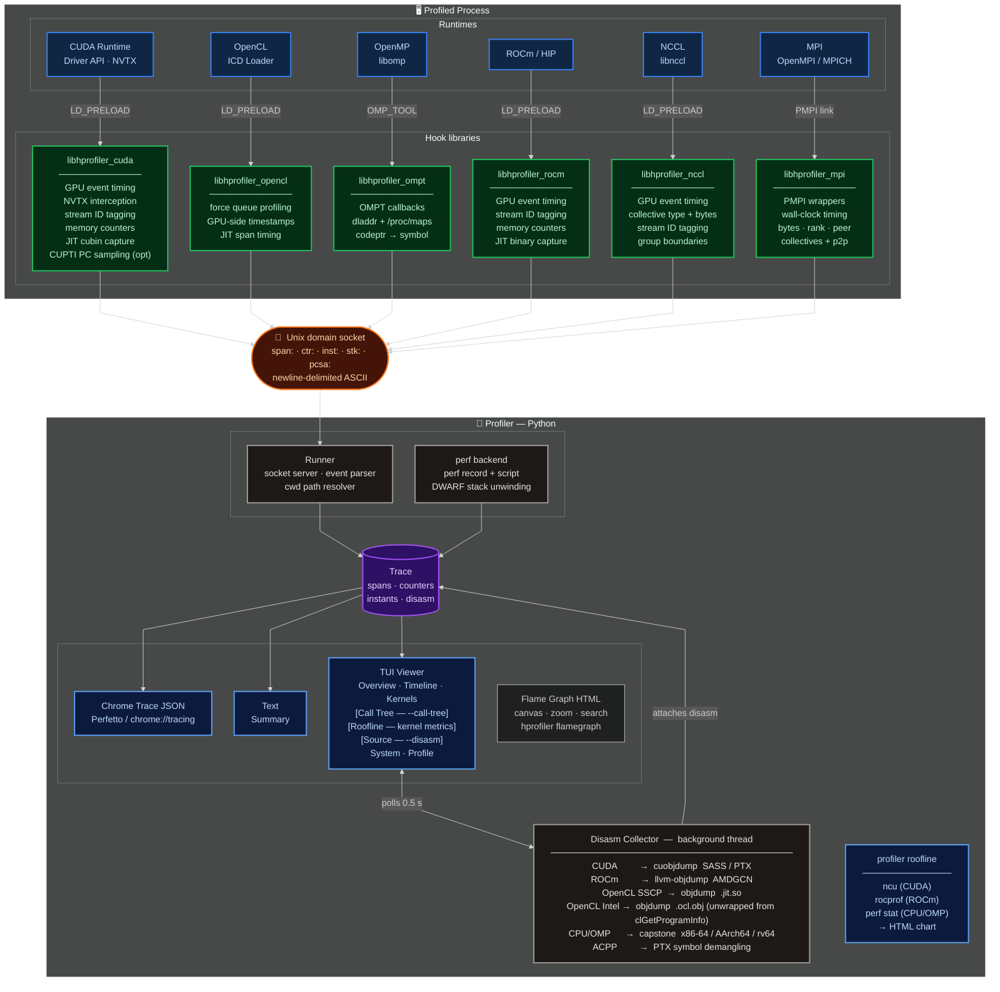

# Profiler — Documentation

A command-line CPU/GPU profiler with a terminal UI that traces programs across
OpenMP, OpenCL, CUDA, ROCm, NCCL, and MPI. CPU sampling is provided via Linux
perf. Supports JIT-compiled
kernels (ACPP/AdaptiveCpp, nvcc, etc.) with per-kernel disassembly. GPU-accurate
kernel timing is captured via CUDA/HIP event pairs. NVTX annotations are
intercepted without requiring libnvToolsExt.

Its core contribution is **cross-layer causal attribution**: one dependency
graph built directly over every backend active in a single run — not a
separate per-runtime trace merged after the fact — with each edge tagged by
how directly the data proves it (§18), a formally-computed (not heuristic)
critical path, and a collection/observability design aimed at low
perturbation and full-stack visibility (§13, §19). See "Implementation
Status" immediately below for what's verified end-to-end vs. what remains
unverified on this development machine's specific hardware, and why.

---

## Implementation Status: Cross-Layer Causal Attribution

The sections below were built across seven pieces of work, each addressing
a specific, named gap (resolved MPI matching and communicator identity;
confidence-graded, formally-computed critical paths; real GPU
execution-start timing; a lock-free collection path; OS-level scheduler
visibility; multi-node clock alignment; and quantitative accuracy
validation instead of crash-only testing). Verification depth differs
per piece **because this specific development machine's hardware/
privileges differ per piece** — a broken NVIDIA driver, no AMD GPU, no
real multi-rank MPI (confirmed a PMI/KVS rank-discovery failure in this
machine's MPICH/UCX/PMIx setup, unrelated to hprofiler), and no root/
CAP_BPF — not because some pieces were designed or tested less carefully
than others. Each row states exactly what was and wasn't possible to
confirm here, so nothing is implicitly overstated.

| # | Piece | Status | Verified how | Docs |
|---|---|---|---|---|
| 1 | MPI protocol semantics (resolved wildcard matching, `Waitany`/`Waitsome`/`Test*`/`Cancel`, communicator identity) | ✅ **Verified end-to-end** | Real hook built + `LD_PRELOAD`ed into a fixture; actual wire-protocol bytes captured over a real `AF_UNIX` socket and parsed with the production parser (`tests/integration/test_mpi_protocol.py`, 8 tests) | §4 `mpi`, §12 |
| 2 | Typed causal DAG: edge confidence tiers + formal DAG longest-path DP (replaces the old greedy walk) | ✅ **Verified end-to-end** | 27 hand-computed unit tests (`tests/test_criticalpath.py`), including a constructed case proving the DP finds a materially better (650ns vs. 60ns) answer than the old algorithm on the same graph | §18 |
| 3 | GPU lifecycle split: real exec-start via reference-event calibration (`xs=` tag) | ⚠️ **Compile-verified only** | Clean `gcc -Wall -Wextra` compile of `cuda_hook.c`/`rocm_hook.c`, clean rebuild via the real CMake path, integrated into the DP (unit-tested against synthetic `xs=` tags) — **never run against a real GPU** (this machine's NVIDIA driver is broken, no AMD GPU present) | §4 `cuda`, §18, §13 |
| 4 | Collection-path redesign: lock-free per-thread ring buffer (removes mutex+socket from the hot path) | ✅ **Primitive verified in isolation**; ⚠️ **not wired into any hook** | Concurrent correctness stress test, exact drop-counter accounting, FIFO-under-wraparound, ThreadSanitizer-clean, and real measured overhead (1.5–58x faster than today's mutex+`send()` pattern, depending on thread count) — deliberately not integrated into any hook's actual `emit_span()` this pass (see §13 for why) | §13 |
| 5 | eBPF OS-level scheduler tracer (off-CPU/wakeup/migrate visibility) | ⚠️ **Compiled, linked, and run to the exact expected privilege wall — never loaded into a kernel** | `bpftool gen skeleton` independently confirms the compiled object's structure (fully offline check); running it reaches libbpf's internal probe-load self-test and fails with `EPERM`, precisely the error `kernel.unprivileged_bpf_disabled=2` should produce, handled gracefully — the kernel BPF verifier itself has never run against it | §19 |
| 6 | Multi-node design: clock-offset estimation (Cristian's algorithm) + trace merging | ✅ **Python side (merge, validation, offset arithmetic) verified end-to-end**; ⚠️ **C-side round-trip capture compile-verified only** | 14 unit tests including an asymmetric-latency case proving the error bound brackets the real error, plus a real CLI run merging two actual traces (confirmed correct pid remapping) — the C-side round-trip exchange itself has never executed a real 2+-rank exchange (same MPI multi-rank limitation as #1's cross-process piece) | §20 |
| 7 | Validation suite: aggregate precision/recall + determinism checks (vs. crash-only testing) | ✅ **Verified** | 100%/100% precision/recall across 22 hand-constructed ground-truth edges spanning all three confidence tiers; 35 determinism trials (7 scenarios × 5 random reorderings) with byte-identical results | §18, `tests/validation/` |

Every ⚠️ item is re-stated with full detail, including the exact command
and error that was reached, in its own section and in §13's Known
Limitations table — this summary exists so that detail doesn't have to be
hunted for, not to replace it.

---

## Table of Contents

1. [Quick Start](#1-quick-start)
2. [Installation and Build](#2-installation-and-build)
3. [CLI Reference](#3-cli-reference)
4. [Backend Reference](#4-backend-reference)
5. [TUI Viewer](#5-tui-viewer)
6. [Output Formats](#6-output-formats)
7. [JIT Compilation and ACPP](#7-jit-compilation-and-acpp)
8. [Disassembly](#8-disassembly)
9. [Roofline Analysis](#9-roofline-analysis)
10. [Architecture Overview](#10-architecture-overview)
11. [Implementation Details](#11-implementation-details)
12. [Wire Protocol](#12-wire-protocol)
13. [Performance Overhead](#13-performance-overhead)
14. [Extending the Profiler](#14-extending-the-profiler)
15. [AI Performance Analysis](#15-ai-performance-analysis)
16. [Call-Path Analysis, CCT, and GPU Starvation](#16-call-path-analysis-cct-and-gpu-starvation)
17. [POP-Style Efficiency Analysis](#17-pop-style-efficiency-analysis)
18. [Critical Path and Cross-Runtime Blame Attribution](#18-critical-path-and-cross-runtime-blame-attribution)
19. [OS-Level Observability (eBPF Scheduler Tracer)](#19-os-level-observability-ebpf-scheduler-tracer)
20. [Multi-Node Trace Merging and Clock Synchronization](#20-multi-node-trace-merging-and-clock-synchronization)

---

## 1. Quick Start

```bash
# Build the C hook libraries
python3 hprofiler build

# See which backends are available on your system
python3 hprofiler backends

# Profile an OpenMP program (clang-compiled for OMPT support)
python3 hprofiler run --backend openmp -- ./my_omp_program

# Profile a CUDA program
python3 hprofiler run --backend cuda,cpu -- ./my_cuda_app

# Profile with per-kernel disassembly (adds Disasm tab to TUI)
python3 hprofiler run --backend cuda --disasm -- ./my_cuda_app

# Roofline chart — TUI viewer by default (requires plotly + kaleido)
python3 hprofiler roofline --backend cuda -- ./my_cuda_app
python3 hprofiler roofline --backend openmp -- ./my_omp_program
python3 hprofiler roofline --html --backend cuda -- ./my_cuda_app  # browser instead

# Flame graph — TUI viewer by default (requires plotly + kaleido)
python3 hprofiler flamegraph -- ./my_program
python3 hprofiler flamegraph --html -- ./my_program                # browser instead

# Profile a ROCm/HIP program
python3 hprofiler run --backend rocm -- ./my_hip_app

# Profile with all available backends (auto-detected)
python3 hprofiler run -- ./my_program

# Save trace to a specific file
python3 hprofiler run --backend cuda --output my_trace.json -- ./my_program

# View a previously saved trace in the TUI
python3 hprofiler view my_program.hprofiler.json

# View with disassembly
python3 hprofiler view --disasm my_program.hprofiler.json

# Print a text summary without opening the TUI
python3 hprofiler run --no-ui -- ./my_program
```

---

## 2. Installation and Build

### Requirements

| Component | Requirement |
|-----------|-------------|
| Python | 3.10+ |
| Python packages | `click`, `textual`, `rich`, `capstone>=5.0` |
| C compiler | GCC 9+ or Clang 12+ |
| CMake | 3.16+ |
| CPU backend | Linux `perf` tool |
| OpenMP backend | `libomp` (LLVM) — not GCC's `libgomp` (see §4) |
| CUDA backend | CUDA Runtime installed (`libcuda.so`) |
| OpenCL backend | Any ICD loader (`libOpenCL.so`) |
| ROCm backend | `libamdhip64.so` findable via ldconfig, `$ROCM_PATH`/`$ROCM_HOME`, or a system/`/opt/rocm*` lib dir (not required to be exactly `/opt/rocm`) |
| NCCL backend | CUDA Runtime + `libnccl.so` at runtime |
| MPI backend | Any MPI implementation with `mpicc`, **or** a Cray Programming Environment (`$CRAY_MPICH_DIR` + the `cc` compiler wrapper) — no `mpicc` needed there |
| Call-path unwinding (optional) | `libunwind-dev` (apt) / `libunwind-devel` (dnf) — for accurate C++ stack capture without frame pointers |
| Disasm (CUDA AoT) | `cuobjdump` (CUDA toolkit) |
| Disasm (CPU/ELF) | `capstone>=5.0` (fast path) or `objdump` / `llvm-objdump` |
| Disasm (ROCm) | `llvm-objdump` |
| Roofline (CUDA) | `ncu` (Nsight Compute, ships with CUDA toolkit) |
| Roofline (CPU/OpenMP) | `perf stat` (linux-tools) |
| Roofline (ROCm) | `rocprof` (ships with ROCm) |
| GUI (optional) | `PySide6>=6.5` — popup Qt/QML viewer (`hprofiler run --gui`, `hprofiler gui <trace.json>`); falls back to the TUI automatically if unavailable, so nothing else needs this |
| GUI (optional, system lib) | `libxcb-cursor0` (Debian/Ubuntu) / `xcb-util-cursor` (RHEL/Rocky/Fedora/conda-forge) — Qt ≥6.5's `xcb` platform plugin hard-requires this to open a window over X11 (including `ssh -X`/`-Y`), even though PySide6 itself imports fine without it |

### Install Python dependencies

```bash
pip install click textual rich capstone
pip install plotly "kaleido==0.2.1"   # required for TUI flamegraph/roofline viewers
# kaleido 0.2.1 specifically — 0.3+ requires an external Chrome install and breaks on clusters

pip install "hprofiler[gui]"          # optional: popup Qt/QML viewer instead of the TUI
```

If the GUI opens the TUI instead of the popup window, or fails with `Could not
load the Qt platform plugin "xcb"`, the system library above is missing —
PySide6 can't install it (it isn't a PyPI package). On a machine without root
(e.g. an HPC login node), install it without sudo via:

```bash
conda install -c conda-forge xcb-util-cursor   # or: spack install xcb-util-cursor
export LD_LIBRARY_PATH="$CONDA_PREFIX/lib:$LD_LIBRARY_PATH"   # conda activation doesn't always set this
```

If installing it isn't an option at all, Qt's built-in VNC platform plugin
sidesteps `xcb` entirely (no X11 involved) at the cost of needing a separate
VNC viewer + SSH tunnel instead of direct X forwarding:

```bash
export QT_QPA_PLATFORM='vnc:addr=127.0.0.1:port=5901:size=1280x800'
hprofiler gui trace.hprofiler.json
# then, from your local machine: ssh -L 5901:localhost:5901 <login-node>
# and point a VNC viewer (TigerVNC, RealVNC, macOS Screen Sharing) at localhost:5901
```

`addr=127.0.0.1` is not optional here — the open-source Qt VNC plugin has no
built-in authentication, so keep it loopback-only and reachable only through
your own SSH tunnel on a shared login node.

### Build the C hook libraries

```bash
python3 hprofiler build
# or manually:
cmake -S . -B build -DCMAKE_BUILD_TYPE=Release
cmake --build build -j$(nproc)
```

Built libraries are placed in `build/lib/`:

```
build/lib/
├── libhprofiler_cuda.so      # CUDA Runtime + Driver API + NVTX hook
├── libhprofiler_opencl.so    # OpenCL API hook
├── libhprofiler_ompt.so      # OpenMP OMPT tool
├── libhprofiler_rocm.so      # ROCm/HIP hook (only if ROCm is found)
├── libhprofiler_nccl.so      # NCCL multi-GPU collectives hook
└── libhprofiler_mpi.so       # MPI PMPI profiling hook (built with mpicc)
```

### Run without installing

The `hprofiler` script at the project root runs directly with Python's module
path already configured. No `pip install` of the package is needed.

---

## 3. CLI Reference

### `hprofiler run`

Profile a program and optionally open the TUI viewer.

```
hprofiler run [OPTIONS] -- COMMAND [ARGS...]
```

| Option | Default | Description |
|--------|---------|-------------|
| `--backend`, `-b` | `auto` | Comma-separated list of backends to enable |
| `--output`, `-o` | `<prog>.hprofiler.json` | Path for the Chrome Trace JSON output file |
| `--ui / --no-ui` | `--ui` | Open the TUI viewer after profiling |
| `--summary / --no-summary` | `--summary` | Print the text summary after profiling |
| `--perf-freq` | `9999` | Sampling frequency in Hz (CPU/perf backend only) |
| `--perf-callgraph` | — | Call-graph method: `fp`, `dwarf`, or `lbr` |
| `--disasm / --no-disasm` | `--no-disasm` | Collect per-kernel disassembly after the run; adds the Disasm tab to the TUI |
| `--gpu-pc-sampling` | off | Enable CUPTI PC sampling for per-instruction GPU heat and stall annotation (CUDA only; **AoT-compiled kernels only** — see note). `libcupti.so` is loaded at runtime via `dlopen` — no recompile or CUPTI headers needed. Adds **Heat %** and **Stall** columns to the Disasm tab. Requires `--disasm`. |
| `--call-tree / --no-call-tree` | `--no-call-tree` | Capture C++ call stacks at every API interception point; adds the Call Tree tab to the TUI and a CCT hotspot section to the text summary. When libunwind is available (detected at build time), unwinding is accurate without requiring `-fno-omit-frame-pointer`. Source file:line annotations are resolved automatically via `addr2line` / `llvm-symbolizer` when available. Adds ~5–50 µs per intercepted call — do not use during benchmarking. |

Always separate the profiler's options from the target program with `--`:

```bash
# Correct
hprofiler run --backend cuda -- ./app --iterations 1000

# Wrong — --iterations would be parsed as a profiler option
hprofiler run --backend cuda ./app --iterations 1000
```

**Backend names:** `cpu`, `cuda`, `opencl`, `rocm`, `openmp`, `nccl`, `mpi`, `likwid`
**Aliases:** `omp` = `openmp`, `hip` = `rocm`, `cl` = `opencl`, `perf` = `cpu`, `hwc` = `likwid`

```bash
# Multiple backends
hprofiler run --backend cuda,openmp,cpu -- ./app

# Auto-detect everything available
hprofiler run -- ./app

# With disassembly (adds Disasm tab in TUI)
hprofiler run --backend cuda --disasm -- ./app
```

---

### `hprofiler view`

Open the TUI viewer for a previously saved trace file.

```
hprofiler view [OPTIONS] TRACE_FILE
```

| Option | Default | Description |
|--------|---------|-------------|
| `--disasm / --no-disasm` | `--no-disasm` | Collect disassembly in the background; adds the Disasm tab |

```bash
hprofiler view my_program.hprofiler.json
hprofiler view --disasm my_program.hprofiler.json
```

Disassembly is collected in a background thread when `--disasm` is passed, so
the TUI opens immediately and the Disasm tab populates after a few seconds.

---

### `hprofiler roofline`

Generate a roofline chart using **hardware performance counters**.
This re-runs the application under a profiling tool (`ncu`, `rocprof`, or
`perf stat`) to collect exact FLOPs and DRAM bandwidth measurements.

By default a **native TUI viewer** is opened inline in the terminal using the
Kitty graphics protocol (or Sixel/iTerm2 as fallback). Pass `--html` to skip
the TUI and open the HTML file in a browser instead.

Requires: `pip install plotly "kaleido==0.2.1"`

```
hprofiler roofline [OPTIONS] [-- COMMAND [ARGS...] | TRACE_FILE]
```

| Option | Default | Description |
|--------|---------|-------------|
| `--backend`, `-b` | — | Backend for hardware counters: `cuda`, `rocm`, `openmp`, or `cpu` |
| `--output`, `-o` | `<prog>.roofline.html` | Output HTML file (always written) |
| `--html` | off | Open browser instead of TUI viewer |

**TUI keyboard controls:**

| Key | Action |
|-----|--------|
| `n` / `p` | Cycle kernels — show crosshairs with headroom annotation |
| Esc | Deselect kernel / hide crosshairs |
| `+` / `=` | Zoom in |
| `-` | Zoom out |
| `←` `→` `↑` `↓` | Pan |
| `r` | Reset zoom |
| `w` | Open HTML version in browser |
| `q` | Quit |

**Terminal requirements:** kitty, WezTerm, Ghostty (Kitty graphics protocol),
iTerm2, or xterm/mlterm (Sixel). Falls back to browser-open when no inline-image
protocol is detected.

**Mode 1 — run with hardware counters (recommended):**

```bash
# CUDA: uses ncu (Nsight Compute)
hprofiler roofline --backend cuda -- ./my_cuda_app

# CPU / OpenMP: uses perf stat
hprofiler roofline --backend openmp -- ./my_omp_program

# ROCm: uses rocprof
hprofiler roofline --backend rocm -- ./my_hip_app
```

**Mode 2 — from a saved trace (disasm-based estimates, less accurate):**

```bash
hprofiler roofline my_program.hprofiler.json
```

This mode counts each *static* disassembly line once per thread — it has no
information about dynamic execution counts. For any kernel containing a
loop (stencils, iterative solvers, anything with a trip count > 1), this
**under-estimates** true FLOPs/bytes roughly in proportion to the loop's
trip count (100 real loop iterations of FP work → roughly 100x less
`est_flops` than actually executed). Prefer Mode 1 (hardware counters) for
looping kernels; Mode 2 is most reliable for straight-line (unrolled,
non-looping) kernel bodies.

**Required tools per backend:**

| Backend | Tool | Install |
|---------|------|---------|
| `cuda` | `ncu` (Nsight Compute) | Ships with CUDA toolkit |
| `rocm` | `rocprof` | Ships with ROCm |
| `cpu`, `openmp` | `perf stat` | `apt install linux-tools-$(uname -r)` |

**Permissions:** Hardware counter access is restricted on many systems by
default. If you see "no counter data collected":

```bash
# Fix for CUDA (persist across reboots):
sudo sh -c 'echo "options nvidia NVreg_RestrictProfilingToAdminUsers=0" \
  > /etc/modprobe.d/nvprofiling.conf'
sudo update-initramfs -u && sudo reboot

# Fix for perf (temporary):
sudo sh -c 'echo 0 > /proc/sys/kernel/perf_event_paranoid'
```

**CPU/OpenMP notes:**
- `perf stat` automatically skips events not supported by the CPU (e.g.
  `fp_arith_inst_retired.512b_packed_single` on non-AVX-512 machines) and
  retries with the remaining events.
- Output handles both comma-separated (`2,582,617`) and space-separated
  (`2 582 617`) thousands separators, and hybrid CPU architectures that report
  separate `cpu_core/` and `cpu_atom/` PMU counters (which are summed).

---

### `hprofiler summary`

Print a text summary of a saved trace file without opening the TUI.

```
hprofiler summary [OPTIONS] TRACE_FILE
```

| Option | Default | Description |
|--------|---------|-------------|
| `--top`, `-n` | `20` | Number of top hotspots to print |

```bash
hprofiler summary --top 10 my_program.hprofiler.json
```

---

### `hprofiler efficiency`

Print a POP-style parallel efficiency breakdown for a saved trace. See §17
for the full formula tree and what's exact vs. approximate.

```
hprofiler efficiency [OPTIONS] TRACE_FILE
```

| Option | Default | Description |
|--------|---------|-------------|
| `--baseline TRACE` | none | A trace of the same program at a lower rank/thread count, for Computational Scaling |
| `--interconnect-bw GB/S` | none | Peak interconnect bandwidth, to turn achieved NCCL bus bandwidth into an efficiency % |
| `--critical-path` / `--no-critical-path` | `--critical-path` | Also run critical-path analysis to compute Serialization Efficiency |

```bash
hprofiler efficiency trace.json
hprofiler efficiency trace.json --baseline trace_1rank.json --interconnect-bw 300
```

---

### `hprofiler critical-path`

Compute and print the N-way cross-runtime critical path for a saved trace.
See §18 for the dependency model, its scope, and the single-node limitation.

```
hprofiler critical-path [OPTIONS] TRACE_FILE
```

| Option | Default | Description |
|--------|---------|-------------|
| `--top`, `-n` | `15` | Number of top categories to show in each breakdown |
| `--export FILE` | none | Write the trace back out as Chrome Trace JSON with critical-path spans tagged `on_critical_path=1`, for highlighting in Perfetto |

```bash
hprofiler critical-path trace.json
hprofiler critical-path trace.json --export trace.critpath.json
```

---

### `hprofiler merge-nodes`

Merge multiple per-node traces from a multi-node run onto one timeline. See
§20 for the clock-offset model and what's verified vs. not.

```
hprofiler merge-nodes [OPTIONS] TRACE_FILES...
```

| Option | Default | Description |
|--------|---------|-------------|
| `-o`, `--output` | *(required)* | Where to write the merged trace (Chrome Trace JSON) |
| `--offset-ns NS` | none | Explicit per-node clock offset in ns, repeatable, same order as `TRACE_FILES` — overrides embedded `HPROFILER_CLOCK_SYNC` counters for that node |

```bash
hprofiler merge-nodes node0.json node1.json node2.json -o merged.json
hprofiler merge-nodes node0.json node1.json -o merged.json --offset-ns 0 --offset-ns 15000
hprofiler critical-path merged.json   # analyze across node boundaries
```

---

### `hprofiler backends`

List all backends and whether they are available on the current machine.

```bash
hprofiler backends
```

```
Available backends:

  cpu          ✓ available   CPU sampling via Linux perf (DWARF call-graph, JIT-aware)
  cuda         ✗ unavailable CUDA Runtime + Driver API tracing via LD_PRELOAD
  opencl       ✓ available   OpenCL command-queue profiling via LD_PRELOAD
  rocm         ✗ unavailable ROCm/HIP kernel tracing via LD_PRELOAD
  openmp       ✓ available   OpenMP parallel region / task tracing via OMPT
  likwid       ✓ available   Hardware PMU counters via likwid-perfctr
  mpi          ✓ available   MPI operation tracing via PMPI
  nccl         ✗ unavailable NCCL collective tracing via LD_PRELOAD
```

---

### `hprofiler flamegraph`

Generate an interactive flame graph by profiling COMMAND with Linux `perf record`.

By default a **native TUI viewer** is opened inline in the terminal using the
Kitty graphics protocol (or Sixel/iTerm2 as fallback). Pass `--html` to skip
the TUI and open the HTML file in a browser instead.

Requires: `pip install plotly "kaleido==0.2.1"`

```
hprofiler flamegraph [OPTIONS] -- COMMAND [ARGS...]
```

| Option | Default | Description |
|--------|---------|-------------|
| `--backend`, `-b` | — | Inject backend hooks so GPU/MPI API overhead appears in CPU stacks |
| `--output`, `-o` | `<prog>.flamegraph.html` | Output HTML file (always written) |
| `--callgraph` | `fp` | Call-graph method: `fp` (frame-pointer), `dwarf`, or `lbr` |
| `--freq`, `-F` | `99` | perf sampling frequency in Hz |
| `--html` | off | Open browser instead of TUI viewer |

**TUI keyboard controls:**

| Key | Action |
|-----|--------|
| click | Zoom into that frame |
| `u` / Esc | Zoom out one level |
| `r` | Reset to full view |
| `/` | Search — highlight frames matching substring |
| `w` | Open HTML version in browser |
| `q` | Quit |

**Terminal requirements:** kitty, WezTerm, Ghostty (Kitty graphics protocol),
iTerm2, or xterm/mlterm (Sixel). Falls back to browser-open when no inline-image
protocol is detected.

**HTML output:** A single self-contained HTML file (Plotly-based icicle chart).
Open in any browser — no server or internet connection required.

**Orientation:** Root frame at top, leaf frames at bottom (icicle / top-down convention).

**With `--backend`:** Backend hooks are injected via `LD_PRELOAD` so the CPU
stacks captured by `perf` include time spent inside GPU API calls:

- `cudaLaunchKernel` / `clEnqueueNDRangeKernel` — kernel launch overhead
- `cudaDeviceSynchronize` / `clFinish` — CPU blocking while GPU runs
- `MPI_Allreduce` / `MPI_Barrier` — collective synchronisation wait
- `hipLaunchKernel` — ROCm launch overhead

```bash
# CPU-only flame graph
hprofiler flamegraph -- ./my_program

# CUDA program — shows GPU API overhead in CPU stacks
hprofiler flamegraph --backend cuda -- ./cuda_app

# For binaries compiled without -fno-omit-frame-pointer use dwarf unwinding
hprofiler flamegraph --callgraph dwarf --backend cuda -- ./cuda_app

# ACPP SYCL targeting CUDA
ACPP_VISIBILITY_MASK=cuda hprofiler flamegraph --backend cuda -- ./sycl_app
```

**Requirements:**
- `perf` installed (`apt install linux-tools-$(uname -r)`)
- `perf_event_paranoid` ≤ 1 for user-space sampling: `sudo sh -c 'echo 1 > /proc/sys/kernel/perf_event_paranoid'`
- Compile with `-fno-omit-frame-pointer` for the `fp` call-graph method (default); otherwise use `--callgraph dwarf`

---

### `hprofiler build`

Compile the C hook libraries using CMake.

```
hprofiler build [OPTIONS]
```

| Option | Default | Description |
|--------|---------|-------------|
| `--build-dir` | `build` | CMake build directory |
| `--jobs`, `-j` | `nproc` | Parallel build jobs |

---

## 4. Backend Reference

### `cpu` — Linux perf

Uses `perf record` with DWARF call-graph unwinding for accurate stack capture
even in programs that use frame-pointer-omitting compiler optimizations.

**Requirements:**
- `perf` installed (`apt install linux-tools-$(uname -r)`)
- Read access to `/proc/sys/kernel/perf_event_paranoid` (value ≤ 1 recommended)

**How it works:** Runs `perf record -g -F<freq> --call-graph=dwarf` in parallel
with the profiled process, then runs `perf script` after the process exits and
parses the folded stack output into CPU span events.

**JIT note:** DWARF unwinding works with JIT-compiled code if the JIT emits
`/tmp/perf-<pid>.map` entries (LLVM/OpenJDK convention). ACPP with the LLVM
backend does this automatically.

```bash
hprofiler run --backend cpu --perf-freq 199 -- ./my_program
```

---

### `cuda` — CUDA Runtime + Driver API + NVTX

Injects `libhprofiler_cuda.so` via `LD_PRELOAD` to wrap CUDA API calls.

**Wrapped functions:**

| Function | Category | Tags |
|----------|---------|------|
| `cudaLaunchKernel` | `cuda` | `type=kernel,grid=NxNxN,block=NxNxN,stream=N` |
| `cuLaunchKernel` (driver API) | `cuda` | `type=kernel,grid=...,stream=N` |
| `cudaMemcpy` | `cuda` | `type=memcpy,dir=HtoD,bytes=N` |
| `cudaMemcpyAsync` | `cuda` | `type=memcpy_async,bytes=N,stream=N` |
| `cuMemcpyHtoDAsync` | `memory` | `type=HtoD,bytes=N,stream=N` |
| `cuMemcpyDtoHAsync` | `memory` | `type=DtoH,bytes=N,stream=N` |
| `cudaMalloc` / `cudaMallocManaged` | `memory` | `type=alloc,bytes=N` |
| `cudaFree` | `memory` | `type=free` |
| `cudaDeviceSynchronize` / `cuCtxSynchronize` | `sync` | `type=sync` |
| `cudaStreamSynchronize` / `cuStreamSynchronize` | `sync` | `type=sync,stream=N` |
| `nvtxRangePushA/W/Ex` + `nvtxRangePop` | `nvtx` | `type=nvtx_range` |

**GPU-accurate kernel timing:** The hook creates `cudaEvent_t` pairs around
each kernel launch. The end-of-kernel event is recorded (`cuEventRecord`)
*before* acquiring the pending-kernel mutex so that no CUDA API call is ever
made while holding a lock — avoiding potential deadlock with CUDA's internal
serialisation. At each sync point the pending events are flushed and
`cudaEventElapsedTime` gives the true GPU execution time.

**Exec-start calibration (`xs=` tag) — GPU lifecycle split:** `start_ns` on
a kernel span is the CPU-side *launch-call* time, not when the GPU actually
began executing it — under stream queue backlog (several kernels launched
back-to-back on a busy stream), only the first can start immediately; the
rest wait on the GPU for however long their predecessors take, but
`start_ns` alone reports every one of them as if it began at launch-call
time. Every kernel/memcpy span additionally carries `xs=<ns>`: the real
GPU-timeline execution-start wall-clock time, from a one-time reference-
event calibration (record a calibration `cudaEvent_t`, synchronize on it
immediately, pair it with a CPU wall-clock reading taken at that same
instant — mirrors `opencl_hook.c`'s `cl_calibrate_if_needed`; a `cudaEvent_t`
recorded into a stream completes exactly when the GPU's execution reaches
that point in the stream's FIFO queue, and this holds across streams since
CUDA events mark points on one single per-device timeline). Purely
additive — never changes what `start_ns`/`duration_ns` mean, so anything
reading spans without knowing about `xs=` is unaffected.
`src/analysis/criticalpath.py`'s dependency-graph DP (§18) prefers `xs=`
over `start_ns` when computing causal gate/gap times for GPU spans, so idle-
time attribution around a queued kernel is accurate even though the
Timeline/roofline/CCT views still show `start_ns` (deliberately — "when I
issued this kernel" is itself useful information for a programmer
optimizing their code's launch pattern, a different question than "what
was on the critical path").

**Verification status:** compile-checked only (`gcc -Wall -Wextra` clean,
and via the real `./hprofiler build` CMake path) — **not independently
verified against real kernel execution**, since this development machine
has no working CUDA GPU (broken NVIDIA driver, see §13 Known Limitations).
The logic mirrors `opencl_hook.c`'s calibration technique, which *is*
hardware-verified, but treat `xs=` as unverified on real hardware until
confirmed on a working CUDA/ROCm GPU.

**NVTX range interception:** Fully replaced — no `libnvToolsExt.so` required.
NVTX v3 (header-only inline API) is not intercepted.

**GPU memory counters:** `cudaMalloc`/`cudaFree` emit counter events tracking
the running total of device allocations.

**Stream ID tagging:** Every kernel/memcpy span carries `stream=N`. The TUI
Timeline groups CUDA spans into `cuda/stream-N` lanes.

**JIT kernel capture:** `cuModuleLoadData` is wrapped; the PTX/fatbinary blob
is saved to `/tmp/hprofiler_cubin_<pid>_<n>.bin` for post-run disassembly.

**Requirements:** `libcuda.so.1` on the library path, or `nvidia-smi` present.

**Required: link with the shared CUDA runtime.** hprofiler injects itself via
LD_PRELOAD, which only intercepts symbols resolved at runtime from shared
libraries.  Your binary **must** be linked against the dynamic CUDA runtime:

```bash
# nvcc
nvcc -cudart shared -o myapp myapp.cu

# CMake (add to CMakeLists.txt)
set_target_properties(myapp PROPERTIES CUDA_RUNTIME_LIBRARY Shared)
```

The default (`libcudart_static.a`) bakes the runtime into the binary at compile
time, so LD_PRELOAD wrappers are never called and hprofiler will capture
**0 events**.  Switching to `-cudart shared` has no runtime performance impact —
kernel execution, memory bandwidth, and timing are identical either way; only
the binary size changes (~10–20 MB smaller).

**Known limitation (static runtime):** If you cannot recompile, binaries linked
with `libcudart_static.a` will show 0 events. The CUPTI PC sampling path
(`--gpu-pc-sampling`) also requires the hook to be loaded, so it has the same
requirement.

**CUPTI PC sampling** is available via `--gpu-pc-sampling` (see §3 and §8).
`libcupti.so` is loaded at runtime with `dlopen` — no recompile or CUPTI
headers are needed. When `libcupti.so` is absent, the flag is silently ignored.

```bash
hprofiler run --backend cuda -- ./my_cuda_program
hprofiler run --backend cuda --disasm --gpu-pc-sampling -- ./my_cuda_program
```

---

### `opencl` — OpenCL

Injects `libhprofiler_opencl.so` via `LD_PRELOAD`. Forces
`CL_QUEUE_PROFILING_ENABLE` on every queue, captures GPU-side kernel and
buffer-transfer timestamps via event callbacks, and emits `jit` spans for
`clBuildProgram`.

**Wrapped functions:**

| Function | Category | What is captured |
|----------|----------|-----------------|
| `clCreateCommandQueue` / `clCreateCommandQueueWithProperties` | — | Forces `CL_QUEUE_PROFILING_ENABLE` on every queue |
| `clEnqueueNDRangeKernel` / `clEnqueueTask` | `opencl` | GPU-side kernel duration from `CL_PROFILING_COMMAND_START/END` |
| `clEnqueueReadBuffer` / `clEnqueueWriteBuffer` / `clEnqueueCopyBuffer` | `opencl` | Buffer transfer timing |
| `clBuildProgram` | `jit` | JIT compile time; extracts compiled binary for disassembly |
| `clFinish` / `clWaitForEvents` | `sync` | Host-side synchronisation barriers |

**JIT binary extraction for disassembly:** After every successful `clBuildProgram`
call the hook calls `clGetProgramInfo(CL_PROGRAM_BINARIES)` to retrieve the
compiled binary. The binary is saved to `/tmp/hprofiler_ocl_<pid>_<n>.bin` and
a `jit_load` span is emitted so the disassembly extractor picks it up.

- **ACPP SSCP / POCL:** the binary is a standard ELF relocatable — `objdump`
  reads it directly.
- **Intel CPU OCL (`libintelocl.so`):** the driver wraps the compiled x86-64 ELF
  inside a proprietary outer ELF (`e_type = 0xff04`). The hook's
  `_unwrap_intel_ocl()` function detects this format, locates the `.ocl.obj`
  section (a standard `elf64-x86-64` relocatable), and saves only that inner
  object — making it readable by `nm` and `objdump` for the Disasm tab.

**RTLD_DEEPBIND compatibility:** ACPP loads its OCL backend
(`librt-backend-ocl.so`) in a private `RTLD_DEEPBIND` namespace, which causes
`dlsym(RTLD_NEXT, "cl...")` to return NULL inside the hook. The hook's
`find_real_ocl()` helper falls back to `dlopen("libOpenCL.so.1", RTLD_NOLOAD)`
(which works across namespaces) to resolve real OpenCL symbols even when the
library is not visible via `RTLD_NEXT`. The fallback handle is opened exactly
once via `pthread_once` — safe when multiple driver threads call into the hook
concurrently at startup.

```bash
hprofiler run --backend opencl -- ./my_ocl_program

# ACPP SYCL targeting Intel CPU OCL with disassembly
ACPP_VISIBILITY_MASK=ocl hprofiler run --backend opencl,cpu --disasm -- ./app
```

---

### `openmp` — OpenMP (OMPT + direct GOMP_* interception)

Two independent capture paths, **both always injected together** whenever
this backend is active — which OpenMP runtime the profiled binary actually
links against isn't known in advance, so rather than guess, both are
covered and whichever is irrelevant for a given binary is a harmless
no-op (it intercepts symbol names that binary never calls).

**Path 1 — OMPT** (`libhprofiler_ompt.so`, loaded via `OMP_TOOL_LIBRARIES`
and also `LD_PRELOAD`ed so its `dlopen()` interposer is in the global
interposition chain, not just a private-namespace plugin): uses the
OpenMP 5.0 Tools Interface. **Requires LLVM's `libomp`** — GCC's `libgomp`
does not implement OMPT in typical distro/vendor builds (confirmed
empirically: `nm -D libgomp.so.1 | grep ompt` finds no OMPT symbols
exported at all on Ubuntu 24.04/GCC 13). Registered callbacks:

| Callback | Category | What it captures |
|----------|---------|-----------------|
| `ompt_callback_parallel_begin/end` | `openmp` | `parallel_region` spans |
| `ompt_callback_work` | `openmp` | `omp_loop`, `omp_sections`, `omp_taskloop`, etc. |
| `ompt_callback_task_create` | `openmp` | `omp_task_create` spans (one per `#pragma omp task`) |
| `ompt_callback_task_schedule` | `openmp` | `omp_task` execution spans (start → complete/yield) |
| `ompt_callback_sync_region` | `sync` | Barriers, `taskwait`, `taskgroup` |
| `ompt_callback_target begin/end` | `openmp` | GPU offload spans |

**Note on task callbacks:** `task_create` and `task_schedule` use enum values 5 and 6 per the OpenMP 5.0 specification. `task_create` is called from user-code context so call-tree capture works for it. `task_schedule` is called from the runtime worker thread, so its call stack does not include `main` even with `--call-tree`.

**Thread-safe startup:** All OpenMP worker threads start simultaneously at thread-pool creation. The `cb_thread_begin` callback is invoked concurrently on every worker. The hook serialises socket initialisation inside this callback with `g_sock_mutex` so exactly one thread performs `connect()` regardless of pool size.

```bash
# Compile with clang to get libomp
clang -O2 -fopenmp -o my_program my_program.c
ldd ./my_program | grep -E "gomp|omp"   # Good: libomp.so.5   Bad: libgomp.so.1
```

**Finding `libomp` on HPC/Cray clusters:** besides the usual distro package
paths, the backend also checks `/opt/rocm*/llvm/lib/` and
`/opt/rocm*/lib/llvm/lib/` (ROCm ships its own Clang+libomp), and honors
`$ROCM_PATH`/`$ROCM_HOME`/`$LLVM_HOME`/`$LLVM_ROOT`/`$LLVM_PATH` if set:

```bash
module load rocm  # or equivalent on your system
export ROCM_PATH=/opt/rocm-6.3.3   # adjust to the loaded version
hprofiler backends   # openmp should now show available
```

That fixes *detection* of an OMPT-capable `libomp` somewhere on the
system — it does **not** mean the profiled binary is linked against it.
GROMACS/Fortran/plain-C codes built by a typical HPC module-system
toolchain (`cpeGNU`, plain `gcc`/`gfortran`, …) are overwhelmingly linked
against GNU's `libgomp` instead, regardless of what `libomp` `hprofiler
backends` found — for those, Path 2 below is what actually captures
events; OMPT will produce 0.

**Path 2 — direct `GOMP_*` interception** (`libhprofiler_gomp.so`,
`hooks/gomp_hook/gomp_hook.c`, `LD_PRELOAD`ed unconditionally): for
binaries linked against **GNU's `libgomp`**. Rather than depend on
libgomp's OMPT support — unreliable, and per the above, often entirely
absent — this intercepts libgomp's own public ABI directly, the same
LD_PRELOAD function-interposition mechanism every other hook in this
codebase already uses, applied to the `GOMP_*` symbol family GCC-generated
code calls directly for every `#pragma omp` construct instead of a vendor
tools callback API. No detection/availability check beyond the hook itself
being built — it has no dependency on `libomp` or on libgomp having any
particular capability.

```bash
gcc -O2 -fopenmp -o my_program my_program.c
ldd ./my_program | grep -E "gomp|omp"   # libgomp.so.1 -> this path
hprofiler run --backend openmp -- ./my_program   # same command either way
```

**Intercepted constructs** (span category `openmp` unless noted):

| Construct | Span(s) | Notes |
|---|---|---|
| `GOMP_parallel` | `omp_parallel_region` — one per participating thread | Per-thread visibility via a trampoline function substituted for the region body, not just the initiating thread's outer-call duration — matches OMPT's per-thread granularity (`ompt_callback_implicit_task`) despite not using OMPT at all |
| `GOMP_loop_{dynamic,guided,runtime}_start`/`GOMP_loop_nonmonotonic_{dynamic,guided}_start`/`GOMP_loop_maybe_nonmonotonic_runtime_start`, closed by `GOMP_loop_end`/`_end_nowait` | `omp_work_loop`/`omp_work_loop_nowait` | Both the plain and "nonmonotonic"/"maybe_nonmonotonic" variants are intercepted since which one a given compiler/flags combination emits isn't assumed — verified empirically (see limitation below) that GCC 13 emits the nonmonotonic ones by default |
| `GOMP_barrier` | `omp_barrier` (category `sync`) | Both explicit `#pragma omp barrier` and a work-sharing construct's own implicit end-of-region barrier (compiler-inserted call to the same function) |
| `GOMP_critical_start`/`_end`, `GOMP_critical_name_start`/`_end` | `omp_critical_wait` (category `sync`, the acquisition-wait duration) + `omp_critical_hold` (the time actually spent inside the section) as two separate spans | Named (`critical(name)`) sections tagged `named=1` |
| `GOMP_single_start` | `omp_single` instant event | Emitted only on the one thread selected to execute the region (`GOMP_single_start`'s own return value) |

**Known limitation — unchunked (and, per GCC 13's actual lowering,
chunked) `schedule(static)` loops are not directly observable as a
distinct span.** Verified empirically by inspecting a real compiled test
binary's imported symbols (`nm -D -u`, at both `-O0` and `-O2`): GCC
computes a static loop's per-thread iteration range via **inline
arithmetic**, calling no `GOMP_loop_*` function at all — there is nothing
to intercept for the loop's start. Its trailing implicit barrier (unless
`nowait`) still goes through `GOMP_barrier`, so it's not entirely
invisible, but no `omp_work_loop` span is emitted for it — a real,
documented limitation of ABI-level interception (as opposed to OMPT,
which gets a callback for this case too via `ompt_callback_work`), not a
bug. `schedule(dynamic)`/`schedule(guided)`/`schedule(runtime)` — which
inherently require runtime dispatch, unlike static — are unaffected and
fully captured.

**Also not covered in this version:** `GOMP_task`/`GOMP_taskwait` (the
task ABI has changed more across GCC versions than the constructs above;
getting a calling-convention wrong risks crashing the profiled program,
and this was not verified against a specific enough range of GCC
versions to risk it), `sections`, `doacross`, `target` offload, and the
legacy split `GOMP_parallel_start`/`_end` ABI (superseded by combined
`GOMP_parallel` since GCC 4.9).

**Verification status:** unlike most of this project's other recent
hardware-dependent work, this was fully verifiable on this development
machine (real `gcc`/`libgomp` present) — built, compiled against a real
GCC-linked-to-libgomp test fixture, and run end-to-end through the actual
`hprofiler run` CLI (`tests/integration/test_gomp_hook.py`,
`tests/integration/run_matrix.sh`'s `gomp` section). Caught and fixed two
real bugs during that verification: (1) the symbol-name assumption above
(plain vs. nonmonotonic loop variants) was wrong until checked against a
real compiled binary; (2) an event-loss-at-process-exit race (missing a
destructor to flush/drain the socket before the process tears down,
unlike `mpi_hook.c`'s `MPI_Finalize`-based flush or ompt_tool.c's OMPT
`finalize` callback) — caused a barrier-span count to be flaky (7 vs. the
correct 8) until fixed; stable across repeated runs afterward. **Not yet
confirmed on the real HPC cluster (Dardel) whose GROMACS/libgomp mismatch
motivated building this** — the GCC version and exact code paths GROMACS
exercises there haven't been checked against what was verified here.

---

### `rocm` — ROCm / HIP

Injects `libhprofiler_rocm.so` via `LD_PRELOAD`. Uses `hipEvent_t` pairs for
GPU-accurate kernel timing, tracks device memory with counter events, groups
spans by stream ID, and saves JIT binaries for disassembly. Kernel/memcpy
spans also carry the same `xs=<ns>` exec-start calibration tag as the `cuda`
backend (`hipEvent_t`/`hipEventElapsedTime` have the same FIFO-completion
semantics `cudaEvent_t` does) — see the `cuda` section above for the full
rationale; also compile-checked only here, no AMD GPU on this development
machine to verify against.

**Requirements:** `libamdhip64.so` findable at runtime. Checked, in order: the
system ldconfig cache; `$ROCM_PATH`/`$ROCM_HOME` (if set) plus their `lib`/
`lib64` subdirs; `/opt/rocm`, `/usr/local/rocm`, and any `/opt/rocm-*` /
`/usr/local/rocm-*` versioned install (newest version picked first, by
numeric — not lexicographic — sort); and common system lib dirs
(`/usr/lib/x86_64-linux-gnu`, `/usr/lib64`, `/usr/lib`, `/usr/lib/aarch64-linux-gnu`).
A full ROCm SDK at `/opt/rocm` is *not* required — a standalone
`libamdhip64` runtime package (e.g. Debian/Ubuntu's `libamdhip64-5`) is
enough for the hook to load; ROCm's own `hipcc`/headers are only needed to
compile the HIP program being profiled.

```bash
hprofiler run --backend rocm -- ./my_hip_program
```

---

### `nccl` — NCCL Multi-GPU Collectives

Injects `libhprofiler_nccl.so` via `LD_PRELOAD`. Wraps NCCL collective and
point-to-point operations, measuring **GPU-accurate duration** using
`cudaEvent_t` pairs (same mechanism as the CUDA hook). Falls back to wall-clock
timing if CUDA event functions are not available.

**No NCCL headers required** — the hook uses minimal type stubs and resolves
all NCCL symbols at runtime via `dlsym(RTLD_NEXT, ...)`.

**Wrapped functions:**

| Function | Tag | Description |
|----------|-----|-------------|
| `ncclAllReduce` | `type=allreduce` | All-to-all reduction |
| `ncclBroadcast` | `type=broadcast` | One-to-all broadcast |
| `ncclReduce` | `type=reduce` | Many-to-one reduction |
| `ncclAllGather` | `type=allgather` | All-to-all gather |
| `ncclReduceScatter` | `type=reduce_scatter` | Reduce + scatter |
| `ncclSend` | `type=send,peer=N` | Point-to-point send |
| `ncclRecv` | `type=recv,peer=N` | Point-to-point receive |
| `ncclGroupStart` / `ncclGroupEnd` | `type=group` | Group-operation boundary span |

Every span carries `bytes=N` (count × dtype size) and `stream=ID`.

**Stream ID tracking:** Each unique `cudaStream_t` pointer is assigned a
sequential integer ID (1, 2, 3, …). Stream 0 means the default/null stream.
Up to 512 streams are tracked; beyond that, spans are tagged `stream=-1`.

**Group operations:** `ncclGroupStart` / `ncclGroupEnd` nest correctly — only
the outermost pair emits a `ncclGroup` span covering the full group duration.

**GPU timing accuracy:** The CPU timestamp for each NCCL collective is captured
*before* `cuEventRecord` is called on the start event. This ensures the wall-clock
anchor never falls after the GPU start, keeping CPU and GPU timelines consistent.

**Requirements:** CUDA Runtime (`libcuda.so`) must be loaded in the same
process for GPU-accurate timing. NCCL itself need not be present at build time.

```bash
# Profile NCCL collectives alongside CUDA kernels
hprofiler run --backend cuda,nccl -- ./my_multi_gpu_app
```

---

### `mpi` — MPI Point-to-Point and Collectives

Provides `libhprofiler_mpi.so`, built with `mpicc`. Uses the **PMPI profiling
interface** — the MPI standard requires every conforming implementation to
expose `PMPI_*` wrappers, so no `LD_PRELOAD` or `dlsym` tricks are needed.
Link the library alongside the program.

**Wrapped functions:**

| Category | Functions |
|----------|----------|
| Point-to-point | `MPI_Send`, `MPI_Recv`, `MPI_Isend`, `MPI_Irecv`, `MPI_Ssend`, `MPI_Bsend`, `MPI_Wait`, `MPI_Waitall`, `MPI_Waitany`, `MPI_Waitsome`, `MPI_Test`, `MPI_Testany`, `MPI_Testsome`, `MPI_Testall`, `MPI_Cancel` |
| Non-blocking collectives | `MPI_Ibcast`, `MPI_Iallreduce`, `MPI_Ireduce`, `MPI_Iallgather`, `MPI_Ialltoall`, `MPI_Iscatter`, `MPI_Igather` |
| Persistent requests | `MPI_Send_init`, `MPI_Recv_init`, `MPI_Start`, `MPI_Startall` |
| Collectives | `MPI_Bcast`, `MPI_Reduce`, `MPI_Allreduce`, `MPI_Alltoall`, `MPI_Allgather`, `MPI_Scatter`, `MPI_Gather`, `MPI_Barrier`, `MPI_Scan`, `MPI_Exscan` |
| One-sided | `MPI_Put`, `MPI_Get`, `MPI_Accumulate` |
| Lifecycle | `MPI_Init`, `MPI_Init_thread`, `MPI_Finalize` |
| Communicators | `MPI_Comm_dup`, `MPI_Comm_split`, `MPI_Comm_create` (hooked only to assign `commid=`, see below) |

Every span is in category `mpi` and carries `type=<call>`, `bytes=N`
(count × datatype size), `rank=<own rank>`, and where applicable `peer=<rank>`,
`tag=N`, and `commid=<N>`.

**Timing:** All timings are **wall-clock** from `CLOCK_MONOTONIC` on the host
calling thread. For blocking collectives (`MPI_Allreduce`, `MPI_Barrier`, etc.)
this measures the full synchronisation cost including waiting for the slowest
rank.

**Datatype sizes:** Common built-in MPI types are resolved by a static table.
Unknown derived datatypes fall back to `PMPI_Type_size`.

**Wildcard receive resolution (`MPI_ANY_SOURCE`/`MPI_ANY_TAG`):** a receive
posted with a wildcard doesn't know its real peer/tag until the call
completes. Every completion path (`MPI_Recv`, `MPI_Wait`, `MPI_Waitall`,
`MPI_Waitany`, `MPI_Waitsome`, `MPI_Test`, `MPI_Testany`) resolves this from
the real `MPI_Status` the underlying call returns — including when the
*application* passed `MPI_STATUS_IGNORE`/`MPI_STATUSES_IGNORE`: the hook
transparently substitutes its own status buffer in that case (the caller
never observes either buffer, so this changes nothing about program
behavior) purely so the real match is always resolvable. A wildcard
`MPI_Irecv`'s own span carries `wildcard=1` and the input (sentinel)
`peer=`/`tag=` rather than a value it cannot know yet; the resolution
appears on whichever call later observes completion:

| Call | Resolved-match tags |
|------|---------------------|
| `MPI_Recv` | `peer=`/`tag=` in the span itself are the *resolved* values, plus `wildcard=1` |
| `MPI_Wait` | `rpeer=`/`rtag=` (only present if the awaited request was a wildcard recv) |
| `MPI_Waitall` | `rmatches=<req_id>/<peer>/<tag>;...` — one entry per wildcard request that completed |
| `MPI_Waitany` | `completed_index=`, plus `rpeer=`/`rtag=` if that one request was a wildcard |
| `MPI_Waitsome` | `rmatches=` list, same format as `MPI_Waitall` |
| `MPI_Test` / `MPI_Testany` | `flag=0` (checked, not ready — itself a real causal signal, not silence) or `flag=1` with `rpeer=`/`rtag=` |

`rmatches=` entries use `/` (not `:`) between `req_id`, `peer`, and `tag` —
tag *values* must never contain a colon, since the wire parser
(`_split_name_tags` in `src/core/runner.py`) locates the tags segment by
scanning for the record's *last* colon; a colon inside a value would be
misidentified as that boundary and corrupt the parsed name and every tag on
the line. (This was caught by `tests/integration/test_mpi_protocol.py`
during development — see that file's history for the concrete failure.)

**`MPI_Cancel`** emits an instant event (`type=cancel,rank=,psid=<req_id>`),
giving the cancelled request's lifecycle an explicit terminal state distinct
from a normal completion.

**Communicator identity (`commid=`):** collective and point-to-point spans
carry `commid=<N>`: `0` for `MPI_COMM_WORLD` (a global constant, needs no
agreement), or a rank-agreed integer for any communicator created via
`MPI_Comm_dup`/`MPI_Comm_split`/`MPI_Comm_create`. The id is assigned by the
new communicator's own rank 0 and broadcast to every member immediately
after creation — safe because communicator creation is itself already
collective, so every member reaches the bootstrap `MPI_Bcast` together. The
id packs `(bootstrapping process's MPI_COMM_WORLD rank << 32) | local
sequence number)`, so two *different* communicators bootstrapped by two
different world ranks (e.g. two disjoint halves of an `MPI_Comm_split`)
cannot collide on the same id even though each starts counting from 1
independently — a real bug caught during development before it reached any
test (see `comm_id_register()` in `mpi_hook.c`). `commid=-1` means
"unregistered": `MPI_COMM_SELF` or a communicator created via an API this
hook doesn't intercept (`MPI_Comm_create_group`, `MPI_Cart_create`,
`MPI_Intercomm_create`, …) — matching for those falls back to the
call-order-only heuristic that was the only option before this mechanism
existed.

**Verification status:** all of the above is verified end-to-end on this
development machine via `tests/integration/test_mpi_protocol.py`, which
builds the real hook, `LD_PRELOAD`s it into a fixture exercising every path
above, and asserts on the *actual* wire-protocol bytes captured over a real
`AF_UNIX` socket (not a simulated/mocked wire format). One limitation: this
machine's MPICH/Hydra cannot form a real multi-rank `MPI_COMM_WORLD` —
every rank under `mpirun -np N` (N>1) independently observes
`MPI_Comm_size() == 1`, reproduced even with the pre-existing, unmodified
`mpi_mini.c` fixture and confirmed via `UCX_LOG_LEVEL=info` to be a PMI/KVS
rank-discovery failure in this machine's MPICH/UCX/PMIx setup, unrelated to
hprofiler. The test therefore uses a self-communicating single-process
fixture (`tests/fixtures/mpi_proto_self.c`) — real `PMPI_*` completion
semantics end-to-end, but it cannot exercise genuine *cross-process*
`commid=` agreement (only self-consistency across calls on one process);
`tests/fixtures/mpi_proto.c` is the real 4-rank design, compile-verified
here and intended to be run on a working cluster (e.g. Dardel).

**Build and use:**

```bash
# Build
mpicc -shared -fPIC -o libhprofiler_mpi.so hooks/mpi_hook/mpi_hook.c -ldl -lpthread
# Or: cmake --build build -- libhprofiler_mpi

# Run (no --backend flag needed — link or preload the library directly)
mpirun -np 4 env LD_PRELOAD=build/lib/libhprofiler_mpi.so \
              HPROFILER_SOCKET=/tmp/hprofiler.sock ./my_mpi_app

# Combined with hprofiler run (MPI backend auto-injects the library)
hprofiler run --backend mpi -- mpirun -np 4 ./my_mpi_app
```

**Cray Programming Environment:** on Cray systems (e.g. Dardel) there is
often no `mpicc` — the `cc` compiler wrapper supplies MPI headers/libs
automatically. `hooks/mpi_hook/CMakeLists.txt` detects this via
`$CRAY_MPICH_DIR` and confirms the current `CMAKE_C_COMPILER` can already
compile+link a trivial MPI program with no extra `-I`/`-L` (via
`check_c_source_compiles`) before trusting it; if so, no manual include/link
flags are added — the wrapper injects its own, and adding your own can
conflict. Falls back to the conventional `mpi.h` search (now also honoring
`$MPI_HOME`/`$MPI_ROOT` hints) on non-Cray systems or if that probe fails.
On a Cray login node `cc` is normally already the default C compiler CMake
picks up, so `python3 hprofiler build` should detect it with no extra flags;
if it doesn't, force it with `CC=cc python3 hprofiler build`.

**Note:** The MPI hook uses wall-clock host timing only. It does not intercept
MPI-3 RMA epochs or non-blocking collective progress; `MPI_Wait` / `MPI_Waitall`
spans cover the wait time but not the underlying network transfer time.

`MPI_Wait`, `MPI_Waitall`, `MPI_Waitany`, `MPI_Waitsome`, `MPI_Test`, and
`MPI_Testany` all emit a `psid=`/`completed_index=` tag containing the span
ID(s) of the originating `Isend`/`Irecv`/non-blocking-collective/persistent
request so the Timeline can draw cross-link arrows between post and
completion spans. `MPI_Finalize` flushes the socket send buffer before
closing so no queued events are lost at program exit.

**Multi-node clock synchronization:** set `HPROFILER_CLOCK_SYNC=1` (off by
default) to have each rank estimate its clock offset relative to rank 0
during `MPI_Init`, for aligning multiple nodes' traces via `hprofiler
merge-nodes` — see §20 for the full protocol and verification status.

---

### `likwid` — Hardware PMU Counters

Wraps the target command with `likwid-perfctr` to collect hardware performance
counter data over the full program run. Results are emitted as `CounterEvent`
records in the trace and appear in the TUI Overview tab.

**Requirements:** `likwid-perfctr` in PATH (`apt install likwid` or build from
[github.com/RRZE-HPC/likwid](https://github.com/RRZE-HPC/likwid)). PMU access
requires either root or:

```bash
sudo sysctl -w kernel.perf_event_paranoid=-1
sudo sysctl -w kernel.nmi_watchdog=0
```

**Configuration (environment variables):**

| Variable | Default | Description |
|----------|---------|-------------|
| `HPROFILER_LIKWID_GROUP` | `FLOPS_DP` | Counter group to collect |
| `HPROFILER_LIKWID_CORES` | all cores | CPU core range, e.g. `0-7` |

**Common counter groups:**

| Group | What it measures |
|-------|-----------------|
| `FLOPS_DP` | Double-precision FLOPs and MFLOP/s |
| `FLOPS_SP` | Single-precision FLOPs and MFLOP/s |
| `MEM` | DRAM bandwidth (read/write GB/s) |
| `L2` / `L3` | Cache hit/miss rates |
| `BRANCH` | Branch prediction miss rate |
| `CLOCK` | CPI / clock frequency (always works, no special permissions) |

Per-core values are stored as `likwid.core<N>.<metric>` counters; an aggregate
(`likwid.total.<metric>` for rates, `likwid.avg.<metric>` for latency/CPI) is
also emitted.

```bash
HPROFILER_LIKWID_GROUP=MEM hprofiler run --backend likwid -- ./my_program
```

---

## 5. TUI Viewer

The TUI is built with [Textual](https://textual.textualize.io/), as a
card-based dashboard: every panel is a rounded-border box with its own
title, a top bar replaces Textual's generic clock header with the command
being profiled (left) and whatever run context actually applies — rank
count, device, wall time — omitting anything that doesn't apply to this
trace (right), and a bottom bar shows plain "key  description" hints for
whichever tab is active instead of Textual's default reverse-video key
chips. Tabs are numbered (`1 Overview`, `2 Timeline`, …) and `1`-`7` jump
straight to a tab from anywhere. Three tabs are always present; the rest
appear conditionally based on recorded data:

| # | Tab | When shown |
|---|-----|-----------|
| 1 | Overview | Always |
| 2 | Timeline | Always |
| 3 | Kernels | Always |
| — | Call Tree | Only when `--call-tree` was passed during `hprofiler run` |
| — | Roofline | Only when hardware-counter or disassembly-estimated kernel metrics exist |
| — | Source | Only when `--disasm` is passed to `run` or `view` |
| — | System | Always (positioned after the conditional tabs) |
| — | Profile | Always (positioned after the conditional tabs) |

Tab numbers shift to stay contiguous depending on which conditional tabs
are actually present for a given trace — Call Tree/Roofline/Source are
never shown as a numbered gap. CPU flame graphs are a separate,
dedicated view (`hprofiler flamegraph`, native TUI or `--html` export),
not a tab inside this main viewer.

### Overview Tab

The landing dashboard, built to answer "what's wrong with this run" in one
screen rather than requiring a tour through every other tab first:

- **Five headline stat cards** — Diagnosis (a one-line heuristic verdict:
  e.g. "GPU starvation", "Load imbalance", "cuda-bound", "Balanced"), Wall
  time, GPU Active % (merged kernel-active time; shows `n/a` when no GPU
  backend was used), MPI Wait % (merged time at least one rank was inside
  an MPI call — relabeled **Sync Wait %**, measuring `sync`-category spans
  instead, when the trace has no MPI spans at all), and Peak Memory
  (process RSS, falling back to summed GPU VRAM peak when RSS wasn't
  captured).
- **Execution timeline preview** — a condensed density row per the top 3
  categories by accumulated time (reusing the same category colors as the
  Timeline tab), with a legend.
- **Top findings** — up to 4 actionable items, most-actionable first:
  low GPU occupancy / high GPU sync stall (from `analysis/cct.gpu_starvation`,
  same thresholds `hprofiler summary` uses), load imbalance (from
  `analysis/pop_efficiency.load_balance`), and — always tried, as a
  fallback so this panel is never empty even for a plain single-threaded
  CPU trace — whichever single function dominates total time, when it's
  above 30%.
- **Hot kernels** — the top 8 rows of the same aggregated-stats table the
  Kernels tab shows in full, condensed to Kernel/Calls/Total/Share.
- **Source correlation** — source lines around the single hottest
  function's `file=`/`line=` tag (the same tags the Kernels tab's
  location column already uses), with the hot line marked. Falls back to
  an explanatory message — not a blank panel — when the hottest function
  carries no file/line tag, or when its source file isn't present on
  *this* machine, which is the expected outcome when opening a trace that
  was collected on a different machine (e.g. downloaded from a cluster).

Diagnosis, findings, and the Profile tab's "Insight" tips all share one
`_bottleneck_analysis`/`_diagnose`/`_top_findings` implementation, so they
never disagree with each other or with `hprofiler summary`'s text output.

### System Tab

Hardware info card: command, hostname, total duration, active backends. Per-device
block showing: compute capability, SM/core count, clock speed, FP16/FP32/FP64/
Tensor TFLOP/s peaks, memory bandwidth, VRAM, and ridge point with a
compute-vs-memory-bound hint. CPU section (when CPU data present): IPC, LLC miss
rate, branch miss rate, and peak RSS.

**ROCm device query** probes `hipDeviceGetAttribute` using both the ROCm 5.x
attribute IDs (76/77) and ROCm 6.x IDs (87/88) for compute capability, picking
whichever returns a plausible value. **CPU FP16 peak** is reported as 0 unless
`/proc/cpuinfo` flags include `avx512_bf16` or `avx512fp16` — pre-AVX-512BF16
x86 CPUs have no native FP16 compute throughput.

### Profile Tab

The deeper activity breakdown behind the Overview tab's headline stats: for
CUDA/ROCm backends, kernel active %, sync overhead %, GPU efficiency %,
kernel count and average duration. Time breakdown by category with
proportional bars. Top-12 hotspots table with name, category, share%,
total, average, and invocation count. An **Insight** section lists the
same actionable tips as the Overview tab's "Top findings" panel (shared
`_bottleneck_analysis` implementation — see §5's Overview Tab section).

**GPU kernel active %** is computed from the merged union of all kernel span
intervals so concurrent streams never produce a percentage above 100%. The
summary output shows both `active` (merged wall-clock time) and `accumulated`
(sum across all streams) so parallelism is visible.

### Timeline Tab

A scrollable Gantt-style view. Lanes are grouped by (category, thread) for most
backends. CUDA and ROCm spans with a `stream` tag are grouped into per-stream
lanes (`cuda/stream-0`, `cuda/stream-1`, etc.) so kernel overlap across streams
is visible. MPI lanes are labeled by the rank's own `rank=` tag (`mpi rank0`,
`mpi rank3`, …) rather than a generic sequential thread number, since rank is
what you actually think in terms of when reading an MPI trace; any lane
without a resolvable rank (or a non-MPI lane) falls back to the sequential
`T1`, `T2`, … numbering.

**Keyboard controls:**

| Key | Action |
|-----|--------|
| `←` / `→` | Scroll left / right |
| `↑` / `↓` | Pan up / down (when lanes overflow screen) |
| `+` / `=` | Zoom in (2×) |
| `-` | Zoom out |
| `r` | Reset zoom, scroll, and pan |

**Cross-rank communication connectors:** hover over an MPI/NCCL span to draw
connector lines from it to whatever it was matched with — the sender for a
receive, the other participants' last-arriver for a collective rendezvous —
directly in the live Timeline, a Paraver/Extrae-style view of the actual
communication pattern instead of just isolated per-rank bars. The status bar
shows a `⇄N` hint when the hovered span has N such links, so the feature is
discoverable without needing to already know which spans have edges. Reuses
`criticalpath.py`'s already-resolved dependency-graph edges (resolved
wildcard matching, `commid=`-scoped rendezvous, confidence tiers — see §18)
rather than re-deriving matching logic in the UI, so the same edges
`hprofiler critical-path` reports are what gets drawn here. Line color
signals confidence, the same tiers §18's "Path evidence strength" uses:
bright white = `certain`, bright cyan = `high`, grey = `medium`.

Only the *hovered* span's own edges are drawn, not every edge in the trace at
once — rendering all of them simultaneously on a busy multi-rank trace
produces a hairball of overlapping lines that reads as noise rather than
information; hovering a specific call reveals just what it was waiting on,
on demand. Only cross-lane edges are drawn at all (same-lane ones are
already visually adjacent in one row); an edge with one endpoint scrolled
off the visible time window still draws a line running to that edge rather
than disappearing, but an edge with *both* endpoints off the same side is
skipped since nothing about it would be visible anyway.

Lines are routed as an elbow (vertical – horizontal – vertical), not a raw
diagonal: the horizontal traversal runs along the *source* lane's own spacer
row (the blank row between lanes), and only the short final vertical segment
into the target actually crosses other lanes' rows — as a single thin line
at one column, not a diagonal sweep painting over whatever span data
happens to lie along the way. This was a real, user-visible readability
problem with an earlier straight-diagonal version, not just a stylistic
choice.

Rendered via `src/ui/braille_canvas.py`: Unicode Braille Patterns
(U+2800–U+28FF) pack 2×4 dots per character cell, giving roughly 8× the
effective resolution of plain characters for line art — the same
technique terminal-plotting libraries like `drawille`/`plotext` use to
get "canvas-like" output from pure text. Deliberately **not** built on a
terminal graphics protocol (Sixel, the Kitty graphics protocol, iTerm2
inline images): those need the terminal emulator *and* any `tmux`/`screen`
multiplexer in between to explicitly support the specific protocol, and
degrade to garbled escape-code text — not a graceful fallback — when they
don't. Braille rendering is plain Unicode text, so it works identically
over any SSH session into any terminal, including a bare HPC cluster
login-node terminal, which was the deciding factor for this project.

**Per-function coloring is now deterministic across runs.** Span colors were
previously assigned by first-seen (encounter) order while building the
widget, which depends on arbitrary thread-scheduling order — the same
function could get a different color from one run of the same program to
the next. Colors are now a stable hash of the function name (`zlib.crc32`,
not Python's built-in `hash()`, which is randomly salted per process for
strings by default) with open-addressing collision resolution, so up to 16
distinct functions in one trace (the palette size) still always get visually
distinct colors — matching the old within-trace guarantee — while the same
function name now reliably gets the same color across different traces too.

**Idle columns render as blank space**, not the previous visible `·` dot —
quieter and less noisy on a sparse trace, where a field of dots could
dominate the screen more than the actual data did.

### Kernels Tab

A filterable, sortable table of all events grouped by function name and
category. Type to filter by name; press `s` to cycle the sort column;
`j`/`k` (or `↑`/`↓`) navigate rows.

| Column | Description |
|--------|-------------|
| Function | Symbol or API call name |
| Backend | Category |
| Count | Number of invocations |
| Total / Avg / Min / Max | Duration statistics |
| % | Fraction of total profiled time |

### Call Tree Tab *(only shown when `--call-tree` was used)*

A from-main call tree built from CPU call stacks captured at every intercepted
API call. Only shown when the trace was recorded with `--call-tree`.

**Two tree-building modes:**

- **Stack-based** (default when `--call-tree` is active): Each API span's full
  call stack is captured via `backtrace()` at interception time. Frames are
  reversed (innermost-first → root-first) and merged into a trie rooted at
  `_start` / `main`. This gives accurate from-main call paths.

- **Temporal containment** (fallback): When no stack data is present, the tree
  is inferred from span start/end nesting on a per-thread basis. Less accurate
  than stack-based but works without `--call-tree`.

**Requirements for stack-based mode:** The profiled binary must be compiled with
`-fno-omit-frame-pointer -rdynamic`. Without `-rdynamic`, symbol names resolve
via `dladdr` (works for shared-library symbols but not static functions).

**Keyboard controls:**

| Key | Action |
|-----|--------|
| `e` | Expand all nodes |
| `u` | Collapse all nodes |
| `↑` / `↓` | Navigate the tree |

**Known limitation:** OMPT callbacks for `task_schedule`, `sync_region`, and
`work` are invoked by the OpenMP runtime from worker threads. Their call stacks
do not include `main` even with `--call-tree`. Only `task_create` and
`parallel_begin` callbacks fire from user-code context and show the full call
path from `main`.

### Roofline Tab *(only shown when kernel metrics are available)*

A log-log arithmetic-intensity (FLOPs/byte) vs. achieved-TFLOP/s scatter
plot, one dot per profiled GPU kernel, rendered with the same Braille
sub-cell canvas (`src/ui/braille_canvas.py`) the Timeline tab uses for its
communication connectors — a genuine vector scatter plot, not a text
table, drawn entirely in Unicode text so it works over a bare SSH session.
Reuses `analysis/roofline.py`'s existing per-kernel metrics (hardware-
counter based when available, disassembly-based estimate otherwise — see
`KernelMetrics.data_source`) rather than computing anything new; this tab
only plots them. Dots are colored by `KernelMetrics.bound`: bright cyan
for compute-bound, bright magenta for memory-bound. The diagonal-then-flat
line is the profiled device's own roofline knee (bandwidth-bound diagonal
up to its ridge point, then a flat compute-bound ceiling at its peak
FP32 TFLOP/s), drawn once per distinct device present. Only appears when
`analyze_trace` actually returns at least one kernel with positive
arithmetic intensity and achieved TFLOP/s — a trace with no GPU kernel
metrics (no `--disasm`, no hardware counters) simply doesn't get this tab,
the same conditional-visibility pattern Call Tree and Source already use.

### Source Tab *(only shown when `--disasm` is passed)*

Per-kernel disassembly with instruction-level color coding, runtime heat
annotation, and static optimization hints. `j`/`k` (or `↑`/`↓`) select a
kernel in the left pane.

**Left pane** — kernel list:
- `✓` prefix when disassembly is available
- **Arch** column: `ptx`, `sass`, `amdgcn`, `x86-64`, `aarch64`, `rv64`, or `—` while loading
- **Total** — cumulative profiled time

**Right pane** — annotated assembly, color-coded by instruction type:

| Color | Instruction class | Label |
|-------|-------------------|-------|
| Bright green | FP32 / single-precision SIMD (`vaddps`, `fadd v0.4s`) | `vsp` |
| Cyan | FP64 / double-precision SIMD (`vaddpd`, `fmul v0.2d`) | `vdp` |
| Orange | SIMD load / store (`vmovaps`, `vgatherdps`, `ld1`) | `vld` |
| Dark green | Integer / misc SIMD (`vpxor`, `vpcmpeq`) | `vec` |
| Steel blue | Scalar ALU | `scl` |
| Yellow | Scalar memory (load / store / atomic) | `mem` |
| Bright blue | Multiply-accumulate / FMA (`vfmadd*`, `fmadd`) | `fma` |
| Magenta | Branch / call / return | `ctl` |
| Red | Barrier / fence / sync | `syn` |

**Heat column** *(shown when perf annotation or CUPTI PC sampling data is available)*

Each instruction row gains a **Heat %** column showing its share of runtime
samples. Color thresholds:

| Heat % | Color |
|--------|-------|
| ≥ 10% | Bold red — critical hot instruction |
| ≥ 5% | Red |
| ≥ 1% | Yellow |
| > 0% | White |
| 0% | Blank |

For CPU and OpenCL-CPU kernels, heat comes from `perf annotate` run against
the `perf.data` recording. For CUDA kernels, heat comes from CUPTI PC sampling
(requires `--gpu-pc-sampling`).

**Stall column** *(CUDA only, with `--gpu-pc-sampling`)*

Shows the average stall cycle count at each instruction. Stall values ≥ 10 are
red; ≥ 5 are yellow; others are dimmed. A high stall count alongside a hot
instruction pinpoints the exact bottleneck within the kernel.

**Bottom bar** — instruction-mix percentages. The sub-type breakdown for vector
instructions lets you see the FP32 (`vsp`), FP64 (`vdp`), memory (`vld`), and
integer (`vec`) fractions at a glance. Percentages always cover the complete
function, not just the visible 500-line window.

**Optimization hints panel** — up to four static analysis hints from the
assembly advisor (`src/analysis/asm_advisor.py`) appear below the assembly
view, color-coded by severity:

| Severity | Color | Example |
|----------|-------|---------|
| `error` | Red | SASS global loads with no shared memory |
| `warn` | Yellow | x86-64 compute < 10% vectorised |
| `info` | Cyan | PTX no `.v2`/`.v4` vector loads |
| `ok` | Green | No issues detected |

Hints cover x86-64 (vectorisation, spills, scalar FP without FMA, SSE vs AVX),
SASS (memory access patterns, compute fraction, stall density, barriers,
atomics, HMMA, LDGSTS), PTX (global vs shared, atomics, vector loads), and
AMDGCN (VALU fraction, LDS usage, `waitcnt` density). See §8 for the full rule
set.

**Keyboard controls:**

| Key | Action |
|-----|--------|
| `↑` / `↓` | Select kernel in list |

**Loading behavior:** Disassembly runs in a background thread immediately after
the run. The TUI opens instantly; the Disasm tab populates within a few seconds.
Annotation data (heat, stall) is applied to already-displayed disassembly once
available — the TUI detects the update via a version counter and refreshes
without requiring a re-render.

---

## 6. Output Formats

### Chrome Trace / Perfetto JSON

Every `hprofiler run` saves a `.json` file in
[Chrome Trace Format](https://docs.google.com/document/d/1CvAClvFfyA5R-PhYUmn5OOQtYMH4h6I0nSsKchNAySU).
It can be opened in **[ui.perfetto.dev](https://ui.perfetto.dev)** or
`chrome://tracing`.

`ts` and `dur` fields are in **microseconds**. The `metadata` block records the
command, backends, hostname, and `cwd` (used to resolve relative binary paths
when reloading).

### Flame Graph HTML

`hprofiler flamegraph` writes a self-contained interactive HTML file.

The flame graph data is embedded as a JSON tree in a `<script>` tag and
rendered at load time onto a `<canvas>` element. No external dependencies,
no server, no internet connection required — open the file directly in any
browser. The canvas renderer re-draws on every zoom/search/resize event;
performance is proportional to the number of visible frames, not the total
frame count.

**File size:** typically 10–50 KB for a 60-second profile of a moderate
workload (a few thousand unique stacks).

### Roofline HTML

`hprofiler roofline` writes a self-contained interactive HTML file. Open it in
any browser; no server required.

### Text Summary

Printed to stdout after each run (unless `--no-summary`). Groups spans by
(name, category), sorts by total time, shows count / total / avg / pct.

### OpenTelemetry (OTLP) Export

hprofiler can export profiling data to any
[OTLP](https://opentelemetry.io/docs/specs/otlp/)-compatible collector via HTTP
or to a JSON file. No extra Python packages required — the exporter is built on
the standard library.

**CLI options (on `run` and `view`):**

| Option | Description |
|--------|-------------|
| `--otlp-endpoint URL` | POST to an OTLP HTTP collector, e.g. `http://localhost:4318` |
| `--otlp-file PATH` | Write OTLP traces JSON to a file |

Both options can be combined (export to file *and* send live).

**Usage:**

```bash
# Send live during a profiling run
hprofiler run --backend cuda --otlp-endpoint http://localhost:4318 -- ./app

# Write to file
hprofiler run --backend cuda --otlp-file trace.otlp.json -- ./app

# Export from a saved trace (no re-run)
hprofiler view --otlp-endpoint http://localhost:4318 app.hprofiler.json
hprofiler view --otlp-file trace.otlp.json app.hprofiler.json

# Replay a saved OTLP file to any collector
curl -X POST http://localhost:4318/v1/traces \
     -H 'Content-Type: application/json' -d @trace.otlp.json
```

**Compatible backends (OTLP/HTTP port 4318):**
[Grafana Alloy](https://grafana.com/docs/alloy/),
[otelcol](https://opentelemetry.io/docs/collector/),
[Jaeger ≥ 1.35](https://www.jaegertracing.io/),
[Grafana Tempo](https://grafana.com/docs/tempo/),
DataDog Agent, Honeycomb, New Relic, and any other OTLP receiver.

**Data model mapping:**

| hprofiler | OTLP |
|-----------|------|
| `SpanEvent` | Span — all root-level (no parent inference) |
| `InstantEvent` | Zero-duration Span |
| `CounterEvent` | Gauge metric (POSTed to `/v1/metrics`) |
| `TraceMetadata` | Resource attributes (`service.name`, `host.name`, `process.pid`, …) |
| `Category` | InstrumentationScope name (`hprofiler.cuda`, `hprofiler.openmp`, …) |
| `SpanEvent.tags` | Span attributes (`hprofiler.tag.<key>`) |
| `SpanEvent.pid/tid` | `process.pid`, `thread.id` attributes |

**Flat span structure:** hprofiler spans have no parent-child relationships —
CUDA kernels are not linked to the host thread that launched them in the OTLP
output. All spans appear as independent root spans grouped by category
(InstrumentationScope). This is a known limitation of v1; parent inference from
timing overlap is a future extension.

**Time alignment:** hprofiler timestamps are monotonic-relative and are
converted to Unix epoch nanoseconds at export time using
`time.time_ns() − time.monotonic_ns()`. The error is sub-millisecond for
immediately post-run exports.

**Implementation:** `src/output/otlp.py`

---

## 7. JIT Compilation and ACPP

[ACPP (AdaptiveCpp / hipSYCL)](https://github.com/AdaptiveCpp/AdaptiveCpp)
compiles SYCL kernels to CUDA, ROCm, OpenCL, or a generic LLVM IR (SSCP)
target. Each mode is handled differently:

### ACPP targeting CUDA (JIT mode)

```bash
ACPP_VISIBILITY_MASK=cuda hprofiler run --backend cuda -- ./acpp_program
```

ACPP compiles SYCL kernels to PTX at startup via `cuModuleLoadData`. The
profiler's CUDA hook intercepts this call and saves the PTX blob to
`/tmp/hprofiler_cubin_<pid>_<n>.bin`. After the run, the profiler parses the
PTX, demangles ACPP kernel symbols (e.g. `_Z18__acpp_sscp_kernel...ZZ10test_Relax...`
→ `test_Relax`), and populates the Disasm tab with the PTX listing.

### ACPP targeting ROCm/HIP (JIT mode)

```bash
ACPP_VISIBILITY_MASK=hip hprofiler run --backend rocm -- ./acpp_program
```

`hipModuleLoadData` (and `hipModuleLoadDataEx`) are intercepted; the AMDGCN ELF
blob is saved to `/tmp/hprofiler_rocm_<pid>_<n>.bin` and the path is recorded in
the span's `path=` tag. After the run the disasm collector reads those paths (plus
a glob of `/tmp/hprofiler_rocm_<pid>_*.bin` as a fallback) and disassembles each
binary with `llvm-objdump`.

**`llvm-objdump` selection order:** `/opt/rocm/bin/llvm-objdump` →
`/opt/rocm/llvm/bin/llvm-objdump` → system `llvm-objdump`. The ROCm-bundled
binary is preferred because the system `llvm-objdump` often lacks the AMDGCN
target (built without GPU backend support).

### ACPP with OpenMP backend

```bash
ACPP_VISIBILITY_MASK=omp hprofiler run --backend openmp -- ./acpp_omp_program
```

ACPP maps SYCL kernels to `#pragma omp parallel for` in its runtime library.
You will see `parallel_region` and `omp_loop` spans. The Disasm tab shows the
ACPP runtime's OMP dispatch function (resolved via a VMA cache built from
`/proc/self/maps` — the cache is populated once and reused across all callbacks
to avoid re-parsing the file on every OMPT event).

### ACPP targeting OpenCL / SSCP

```bash
hprofiler run --backend opencl -- ./acpp_ocl_program
hprofiler run --backend opencl,cpu -- ./acpp_sscp_program
```

OpenCL queues get profiling forced on. `clBuildProgram` time appears as `jit`
spans. After each successful build the hook extracts the compiled binary via
`clGetProgramInfo(CL_PROGRAM_BINARIES)` and saves it to
`/tmp/hprofiler_ocl_<pid>_<n>.bin` for post-run disassembly.

**ACPP SSCP generic target:** ACPP compiles each SYCL lambda to a separate
`clBuildProgram` call. Five kernels produce five `.bin` files, each containing
one ACPP kernel symbol (`_Z18__acpp_sscp_kernel...`). The disasm extractor
uses `nm` to find the symbol and `objdump` to disassemble it, then
`_acpp_kernel_short()` produces a readable short name (e.g.
`curvilinear4sg_ci::$_0`).

**Intel CPU OCL (`libintelocl.so`):** The Intel driver returns a proprietary
outer ELF wrapper (`e_type = 0xff04`) from `clGetProgramInfo`. The hook
automatically unwraps it — locating the `.ocl.obj` section which is a standard
`elf64-x86-64` relocatable — and saves only the inner object. Standard tools
(`nm`, `objdump`) can then read it normally.

**OpenCL CPU runtime — instruction-level profiling:**

When ACPP uses the OpenCL CPU backend (`ACPP_VISIBILITY_MASK=ocl`), SYCL
kernels compile to JIT x86-64 code executed via the OpenCL CPU runtime. Because
the kernels run on the host CPU they are profiled by `perf record` like any
native function. Adding `--disasm` runs `perf annotate` after the profiling
run and populates instruction-level heat in the Disasm tab:

```bash
ACPP_VISIBILITY_MASK=ocl \
  hprofiler run --backend opencl,cpu --disasm -- ./my_sycl_app
```

This combination gives you:
- **OpenCL event timing** (GPU-accurate kernel duration from `clGetEventProfilingInfo`)
- **Per-kernel disassembly** (x86-64 assembly extracted from `clGetProgramInfo`)
- **CPU sampling** (which CPU functions are hot during kernel execution)
- **Instruction heat** (per-instruction sample % for the JIT-compiled kernel body)

---

## 8. Disassembly

The profiler collects per-kernel disassembly after every run when `--disasm` is
passed. Collection runs in a background thread — the TUI is not blocked.

### How kernels are disassembled

| Backend | Source | Tool | Arch tag |
|---------|--------|------|----------|
| CUDA AoT | Fatbinary in ELF | `cuobjdump --dump-sass` / `--dump-ptx` | `sass` / `ptx` |
| CUDA JIT (ACPP) | PTX from `cuModuleLoadData` | Built-in PTX parser | `ptx` |
| ROCm AoT | ELF sections | `llvm-objdump` | `amdgcn` |
| ROCm JIT (ACPP) | AMDGCN ELF from `hipModuleLoadData` | `llvm-objdump` | `amdgcn` |
| OpenCL JIT (ACPP SSCP generic) | `.jit.so` emitted by ACPP SSCP | `objdump` | `x86-64` / `aarch64` |
| OpenCL CPU (Intel CPU OCL) | x86-64 ELF from `clGetProgramInfo`, inner `.ocl.obj` section unwrapped from Intel's proprietary outer ELF | `nm` + `objdump` | `x86-64` |
| OpenMP / MPI / CPU | ELF symbol at the call-site return address | `capstone` (fast) or `objdump` | `x86-64` / `aarch64` / `rv64` |

> **Requirement for source-line annotation:** compile your binary with `-g` (full debug) or at minimum `-lineinfo` (`nvcc -lineinfo`) to embed DWARF line tables. Without debug info, source file:line annotations are silently skipped — disassembly still works, but no `// file.cpp:42` comments appear in the Disasm tab.

### CPU / OpenMP / MPI disasm pipeline

hprofiler's own event names (`omp_parallel_region`, `omp_barrier`,
`MPI_Bcast`, ...) are never themselves ELF symbols objdump/nm can find --
they're event labels this project invents, not functions in the profiled
binary. What IS meaningful to disassemble is the user's own call site: the
line of C/C++/Fortran code that actually invoked `#pragma omp parallel` or
`MPI_Bcast(...)`. Every hook capable of capturing that -- `ompt_tool.c`
(OMPT path), `gomp_hook.c` (direct `GOMP_*` interception, for binaries
linked against GNU's libgomp, which has no OMPT support in typical
builds), and `mpi_hook.c` (its collective calls and `MPI_Barrier`) --
captures the call's return address (`__builtin_return_address(0)` /
OMPT's own `codeptr_ra`) and resolves it via the shared
`hooks/common/codeptr_resolve.h` helper, tagging the span `sym=<name>`
(when `dladdr()` finds an exported symbol) or `lib=<path>,offset=0x<off>`
(a `/proc/self/maps`-derived fallback for non-exported/internal
symbols). The profiler then:

1. Reads whichever `sym=`/`lib=` tag the hook attached (falls back to
   trying resolution itself for perf-sampled CPU spans, which carry
   neither tag).
2. Looks up the symbol's address and size with `nm -S --defined-only`.
3. Reads only those function bytes from the ELF file (no subprocess) and
   disassembles with [capstone](https://www.capstone-engine.org/) (~40ms vs
   ~1500ms for `objdump` on the whole binary).
4. Falls back to `objdump` if capstone is not installed.

**Known gap:** point-to-point MPI calls (`MPI_Send`/`Recv`/`Isend`/`Irecv`/
`Wait*`) don't capture a call-site codeptr yet -- only the collectives
(`MPI_Bcast`/`Reduce`/`Allreduce`/`Alltoall`/`Allgather`/`Scatter`/`Gather`)
and `MPI_Barrier` do. `gomp_hook.c`'s `omp_critical_hold` span (the
region between `GOMP_critical_end` and its matching `_start`) also has no
tag of its own yet, only `omp_critical_wait` does.

The architecture is auto-detected from the ELF `e_machine` field
(`_elf_arch()` helper) so x86-64, AArch64, and RISC-V binaries all get the
correct instruction classifier without any user configuration.

### Instruction classifier

`classify(arch, mnemonic, operands) → InsnType` dispatches to
per-architecture classifiers:

| Classifier | Architectures | Key heuristics |
|-----------|--------------|----------------|
| `classify_x86` | x86-64, amd64 | FMA (`vfmadd*`) → COMPUTE before SIMD checks; YMM/ZMM ops → `vsp`/`vdp`/`vld`/`vec`; `vmov*/vbroadcast*/vgather*` → VEC_MEM; `*ps/*ss` suffix → VEC_SP; `*pd/*sd` suffix → VEC_DP |
| `classify_aarch64` | AArch64, ARM64 | FMA first (`fmadd/madd`) → COMPUTE; `v`-register with `.4s`/`.2s`/`.8h` → VEC_SP; `.2d`/`.1d` → VEC_DP; `ld1`–`ld4`/`st1`–`st4` and SVE `ld1w`/`st1d` → VEC_MEM; `ldr/str` variants → MEMORY |
| `classify_rv64` | RISC-V 64, RV32 | `vfmadd*` → COMPUTE; `vle*/vse*/vlm*` → VEC_MEM; `vf*` → VEC_SP (FP RVV); `v*` → VECTOR (integer RVV); `fmadd.s/d` → COMPUTE; `fadd.s/d` → SCALAR; `flw/fld` → MEMORY |
| `classify_sass` | NVIDIA SASS | `LDG/STG` → MEMORY; `FFMA/HMMA` → COMPUTE; `BAR/MEMBAR` → SYNC |
| `classify_amdgcn` | AMD GCN | `v_*_f32/f16` → VEC_SP; `v_*_f64` → VEC_DP; other `v_*` → VECTOR; `s_*` → SCALAR; `ds_/global_/buffer_` → MEMORY |
| `classify_ptx` | CUDA PTX IR | `ld/st/atom` → MEMORY; `fma/mad` → COMPUTE; `bar/membar` → SYNC |

**`InsnType` values:**

| Value | Label | Meaning |
|-------|-------|---------|
| `vec_sp` | `vsp` | FP32 / single-precision SIMD |
| `vec_dp` | `vdp` | FP64 / double-precision SIMD |
| `vec_mem` | `vld` | SIMD load / store |
| `vector` | `vec` | Integer / misc SIMD (catch-all) |
| `scalar` | `scl` | Scalar ALU |
| `memory` | `mem` | Scalar load / store / atomic |
| `compute` | `fma` | FMA / multiply-accumulate |
| `control` | `ctl` | Branch / call / return |
| `sync` | `syn` | Barrier / fence |

### ARM64 / AArch64 support

`_disasm_elf_capstone` auto-detects the ELF architecture:
- `e_machine = 62` → x86-64 → `CS_ARCH_X86 / CS_MODE_64`
- `e_machine = 183` → AArch64 → `CS_ARCH_ARM64 / CS_MODE_ARM`
- `e_machine = 243` → RISC-V → `CS_ARCH_RISCV / CS_MODE_RISCV64` *(capstone ≥ 5.0)*

FMA instructions (`fmadd s0, s1, s2, s3`) are checked before SIMD so scalar
FP FMA correctly stays in COMPUTE rather than being pulled into a SIMD bucket.
Lane qualifiers in operands (`.4s`, `.2d`, `z0.s`, `z0.d`) determine the SP/DP
split for NEON and SVE instructions.

### RISC-V support

RISC-V ELF binaries (`e_machine = 243`) are handled by:
- capstone ≥ 5.0 for the fast path (auto-detected from ELF header)
- `objdump` fallback (the instruction format is identical to x86 objdump output;
  only the classifier changes)

RVV (RISC-V Vector Extension) mnemonics are classified as:
- `vle32.v`, `vse32.v`, `vlm.v` → VEC_MEM (vector load/store)
- `vfadd.vv`, `vfmul.vf` → VEC_SP (FP RVV — precision from VTYPE configuration)
- `vfmadd.vv`, `vfwmacc.vv` → COMPUTE (FP vector FMA)
- `vadd.vv`, `vmul.vx`, `vsetvli` → VECTOR (integer RVV)

### Instruction-level heat annotation

After disassembly is collected, the profiler overlays runtime hotness data on
each instruction line. This requires no extra flags for CPU kernels; for CUDA
it requires `--gpu-pc-sampling`.

#### CPU and OpenCL-CPU kernels

`perf annotate` is run against the `perf.data` file retained from the `perf
record` pass. It outputs per-instruction sample percentages, which are stored
in `DisasmLine.sample_pct` and displayed in the Heat column of the Disasm tab.

For SYCL programs using the OpenCL CPU runtime (`ACPP_VISIBILITY_MASK=ocl`),
kernels compile to JIT x86-64 code executed via the Intel CPU OCL driver. The
hook extracts the compiled x86-64 ELF from `clGetProgramInfo(CL_PROGRAM_BINARIES)`
after each `clBuildProgram` — automatically unwrapping Intel's proprietary outer
ELF wrapper — so disassembly is available with no extra tooling. Adding
`--backend cpu` also profiles the kernels with `perf record`, providing
instruction-level heat annotation:

```bash
ACPP_VISIBILITY_MASK=ocl hprofiler run --backend opencl,cpu --disasm -- ./app
```

#### ROCm kernels — PC sampling *(not yet implemented)*

> **TODO:** AMD GPU PC sampling requires `librocprofiler-sdk.so` (ROCm 6.x) or
> `librocprofiler.so` (ROCm 5.x). The wire record format (`pcsa:`) and
> Python-side annotation (`annotate_with_cupti`) are already arch-agnostic and
> can be reused; only the hook-side implementation in `hooks/rocm_hook/rocm_hook.c`
> needs to be added, using `dlopen("librocprofiler-sdk.so.1")` and
> `rocprofiler_configure_pc_sampling_service()`. Currently `--gpu-pc-sampling`
> is silently ignored for ROCm runs.

#### CUDA kernels — CUPTI PC sampling *(AoT only)*

> **Limitation:** CUPTI samples the SASS (compiled machine code) that actually
> executes on the GPU. For JIT-compiled kernels (ACPP/SYCL targeting CUDA via
> `cuModuleLoadDataEx`, or any program that compiles PTX at runtime), the GPU
> driver compiles PTX → SASS internally and CUPTI reports SASS PC offsets.
> hprofiler only captures the PTX source in these cases, not the SASS. PTX
> instruction positions and SASS PC offsets have no correspondence, so heat
> annotation is silently skipped and a warning is printed.
>
> `--gpu-pc-sampling` is only effective for **AoT-compiled CUDA programs**
> (NVCC-compiled binaries with a fatbinary embedded in the ELF), where
> `cuobjdump --dump-sass` gives SASS with addresses that match CUPTI samples.
> ACPP/SYCL users: compile with `--cuda-arch=sm_XX` and the `--cuda-format=fat`
> option to embed SASS in the binary, then use `--backend cuda --disasm
> --gpu-pc-sampling`.

Passing `--gpu-pc-sampling` activates the CUPTI PC sampling subsystem in the
CUDA hook. At runtime the hook:

1. Calls `dlopen("libcupti.so.12")` (or `.11` / `.so` fallback) — no CUPTI
   headers or compile-time linkage required.
2. Registers buffer callbacks and enables `CUPTI_ACTIVITY_KIND_PC_SAMPLING`
   and `CUPTI_ACTIVITY_KIND_FUNCTION`.
3. At program exit, flushes all CUPTI buffers and emits `pcsa:` records over
   the profiler socket (see §12).

PC offset values are matched to `DisasmLine.addr` fields. Matched lines get
`sample_pct` (fraction of total samples) and `stall_cycles` (CUPTI stall
count, 0–15 from the SASS control word on Volta+) populated. The `stall_reason`
string encodes the CUPTI stall category:

| Code | Reason | Meaning |
|------|--------|---------|
| 1 | `none` | No stall |
| 2 | `inst_fetch` | Instruction cache miss |
| 3 | `exec_dep` | Execution dependency (data hazard) |
| 4 | `mem_dep` | Memory dependency (L1/L2/HBM latency) |
| 5 | `texture` | Texture unit busy |
| 6 | `sync` | Warp synchronization |
| 7 | `const_mem` | Constant memory bank conflict |
| 8 | `pipe_busy` | Functional unit pipeline busy |
| 9 | `mem_throttle` | Memory throttling |
| 10 | `not_selected` | Warp eligible but not selected by scheduler |
| 11 | `other` | Other / unknown |
| 12 | `sleeping` | Warp sleeping |

A stall of `exec_dep` (3) alongside a high heat% on a load instruction is the
classic symptom of dependent loads with insufficient ILP — a candidate for
software pipelining or prefetching.

#### Static optimization hints — assembly advisor

`src/analysis/asm_advisor.py` produces up to four actionable hints from a
static analysis of the instruction mix, independent of runtime data. The
advisor runs for every kernel in the Disasm tab when the kernel is selected.

**x86-64 rules:**

| Condition | Severity | Hint |
|-----------|----------|------|
| `vsp + vdp + fma < 10%` of non-branch instructions | warn | Low vectorisation — check auto-vec or add intrinsics |
| `mem > 35%` | warn | Memory-bound — consider cache blocking or prefetch |
| Spill instructions > 8% | warn | Register spills — reduce live variables or split loops |
| Scalar FP (`addss/mulss`) without FMA | info | Use FMA (`vfmadd`) for 2× throughput |
| SSE instructions present in otherwise AVX kernel | info | Mixed SSE/AVX — avoid `_mm_` in AVX context |
| `ctl > 15%` (high branch density) | info | Consider branch-free patterns |

**SASS rules:**

| Condition | Severity | Hint |
|-----------|----------|------|
| Global loads (`LDG/STG`) > 15% with no shared memory (`STS/LDS`) | error | Missing shared-memory tiling |
| Compute instructions < 15% | warn | Compute-light kernel — likely memory-bound |
| Instructions with stall ≥ 10 are > 20% of all instructions | warn | High stall density — check instruction-level parallelism |
| `BAR` (barriers) > 4% | warn | Excessive `__syncthreads()` — reduce barrier frequency |
| Atomics > 5% | info | High atomic rate — consider warp-level reduction |
| FP16 multiply (`HMUL`) without tensor (`HMMA`) | info | Use `wmma` / `mma` ops for tensor-core throughput |
| No `LDGSTS` (async copy) on Ampere+ | info | Use `cuda::memcpy_async` / `__pipeline_memcpy_async` |

**PTX rules:**

| Condition | Severity | Hint |
|-----------|----------|------|
| `ld.global` without `ld.shared` | warn | No shared memory — add tiling |
| Atomics > 5% | info | High atomic use — consider warp reduction |
| No `.v2`/`.v4` vector loads | info | Use vector load instructions for better memory throughput |

**AMDGCN rules:**

| Condition | Severity | Hint |
|-----------|----------|------|
| VALU instructions < 30% | warn | Low VALU occupancy |
| `global_load` without `ds_read` (LDS) | warn | No LDS tiling |
| `s_waitcnt` > 5% | info | Frequent wait instructions — check memory access pattern |

### Tips

- **CUDA AoT:** install `cuobjdump` from the CUDA toolkit.
- **CPU/OpenMP fast path:** install `capstone >= 5.0` (`pip install capstone`).
- **ROCm disasm:** install `llvm-objdump` (`apt install llvm`).
- **OpenCL Intel CPU disasm:** no extra tools needed — `objdump` (GNU binutils)
  is sufficient. The hook extracts a standard ELF relocatable from the driver
  automatically. Use `--backend opencl --disasm` (add `cpu` for instruction heat).
- **Instruction-mix percentages** always count the complete function, including
  instructions not visible due to the 500-line display cap.
- **CUDA heat map:** add `--gpu-pc-sampling` to a `--disasm` run for AoT-compiled (NVCC fatbinary) kernels. Has no effect on JIT/PTX kernels — a warning is printed in that case.
- **OpenCL CPU heat:** use `--backend opencl,cpu --disasm` — perf profiles the JIT x86-64 code and annotates instruction heat automatically.

---

## 9. Roofline Analysis

The `profiler roofline` command generates an interactive HTML roofline chart
using **real hardware performance counters**, not disasm estimates.

### CUDA — ncu (Nsight Compute)

Collects per-kernel metrics:

| Metric | Meaning |
|--------|---------|
| `sm__sass_thread_inst_executed_op_ffma_pred_on.sum` | FP32 FMA count |
| `sm__sass_thread_inst_executed_op_fadd/fmul_pred_on.sum` | FP32 add/mul |
| `sm__sass_thread_inst_executed_op_dfma/dadd/dmul_pred_on.sum` | FP64 |
| `sm__sass_thread_inst_executed_op_hfma_pred_on.sum` | FP16 |
| `dram__bytes.sum` | DRAM read + write bytes |
| `l2tex__t_bytes.sum` | L2 cache traffic |

The application is re-run under `ncu --target-processes all`. If `ncu` produces
no counter data (empty CSV), a `CounterPermissionError` is raised with
instructions to disable `NVreg_RestrictProfilingToAdminUsers`.

### ROCm — rocprof

Collects `SQ_INSTS_VALU_*` and `TCC_EA_*` counters, then computes:
- FP32 ops = `SQ_INSTS_VALU_ADD_F32 + SQ_INSTS_VALU_MUL_F32 + SQ_INSTS_VALU_FMA_F32 × 2`
- DRAM bytes = `(TCC_EA_RDREQ_sum + TCC_EA_WRREQ_sum) × 32`

### CPU / OpenMP — perf stat

Collects `fp_arith_inst_retired.*` events and `LLC-load-misses`:

| Event | FLOPs |
|-------|-------|
| `scalar_single` | ×1 |
| `128b_packed_single` (SSE) | ×4 |
| `256b_packed_single` (AVX2) | ×8 |
| `512b_packed_single` (AVX-512) | ×16 |

DRAM bytes = `LLC-load-misses × 64`.

**Robustness:** Events unsupported by the CPU (e.g. AVX-512 on non-AVX-512
machines) are detected from perf's `"Unable to find event on a PMU of"` error
message and stripped one-by-one; `perf stat` is retried with the remaining
events. The parser handles:
- Both comma (`2,582,617`) and narrow-no-break-space (`2 582 617`) thousands
  separators (the latter appears with European locale settings)
- Hybrid CPU architectures where events appear as `cpu_core/event/` and
  `cpu_atom/event/` — the values are summed across PMUs
- Wall-clock elapsed time (`seconds time elapsed`) for computing achieved
  throughput

---

## 10. Architecture Overview


```mermaid
%%{init: {"theme": "dark", "flowchart": {"curve": "linear", "nodeSpacing": 40, "rankSpacing": 50}}}%%
flowchart TB

    subgraph PROC["  🖥️  Profiled Process  "]
        subgraph RT["  Runtimes  "]
            direction LR
            R1["CUDA Runtime\nDriver API · NVTX"]
            R2["OpenCL\nICD Loader"]
            R3["OpenMP\nlibomp"]
            R4["ROCm / HIP"]
            R5["NCCL\nlibnccl"]
            R6["MPI\nOpenMPI / MPICH"]
        end

        subgraph HK["  Hook libraries  "]
            direction LR
            H1["libhprofiler_cuda\n─────────────\nGPU event timing\nNVTX interception\nstream ID tagging\nmemory counters\nJIT cubin capture\nCUPTI PC sampling (opt)"]
            H2["libhprofiler_opencl\n─────────────\nforce queue profiling\nGPU-side timestamps\nJIT span timing"]
            H3["libhprofiler_ompt\n─────────────\nOMPT callbacks\ndladdr + /proc/maps\ncodeptr → symbol"]
            H4["libhprofiler_rocm\n─────────────\nGPU event timing\nstream ID tagging\nmemory counters\nJIT binary capture"]
            H5["libhprofiler_nccl\n─────────────\nGPU event timing\ncollective type + bytes\nstream ID tagging\ngroup boundaries"]
            H6["libhprofiler_mpi\n─────────────\nPMPI wrappers\nwall-clock timing\nbytes · rank · peer\ncollectives + p2p"]
        end

        R1 -->|LD_PRELOAD| H1
        R2 -->|LD_PRELOAD| H2
        R3 -->|OMP_TOOL| H3
        R4 -->|LD_PRELOAD| H4
        R5 -->|LD_PRELOAD| H5
        R6 -->|PMPI link| H6
    end

    WIRE(["🔌  Unix domain socket\nspan: · ctr: · inst: · stk: · pcsa:\nnewline-delimited ASCII"])

    H1 & H2 & H3 & H4 & H5 & H6 --> WIRE

    subgraph PY["  🐍  Profiler — Python  "]
        direction TB

        subgraph INGEST[" "]
            direction LR
            RUNNER["Runner\nsocket server · event parser\ncwd path resolver"]
            PERF["perf backend\nperf record + script\nDWARF stack unwinding"]
        end

        TRACE[("Trace\nspans · counters\ninstants · disasm")]

        RUNNER & PERF --> TRACE

        subgraph OUTPUTS[" "]
            direction LR
            J["Chrome Trace JSON\nPerfetto / chrome://tracing"]
            S["Text\nSummary"]
            T["TUI Viewer\nOverview · Timeline · Kernels\n[Call Tree — --call-tree]\n[Roofline — kernel metrics]\n[Source — --disasm]\nSystem · Profile"]
            FG["Flame Graph HTML\ncanvas · zoom · search\nhprofiler flamegraph"]
        end

        TRACE --> J & S & T

        D["Disasm Collector  —  background thread\n──────────────────────────────────────\nCUDA         →  cuobjdump  SASS / PTX\nROCm         →  llvm-objdump  AMDGCN\nOpenCL SSCP  →  objdump  .jit.so\nOpenCL Intel →  objdump  .ocl.obj (unwrapped from clGetProgramInfo)\nCPU/OMP      →  capstone  x86-64 / AArch64 / rv64\nACPP         →  PTX symbol demangling"]

        RF["profiler roofline\n──────────────\nncu   (CUDA)\nrocprof   (ROCm)\nperf stat   (CPU/OMP)\n→ HTML chart"]

        T <-->|"polls 0.5 s"| D
        D -->|"attaches disasm"| TRACE
    end

    WIRE --> RUNNER

    classDef runtime  fill:#0f2744,stroke:#3b82f6,stroke-width:2px,color:#bfdbfe
    classDef hook     fill:#052e16,stroke:#22c55e,stroke-width:2px,color:#bbf7d0
    classDef wire     fill:#431407,stroke:#f97316,stroke-width:2px,color:#fed7aa
    classDef store    fill:#2e1065,stroke:#a855f7,stroke-width:2px,color:#e9d5ff
    classDef output   fill:#0c1a3d,stroke:#60a5fa,stroke-width:2px,color:#bfdbfe
    classDef engine   fill:#1c1917,stroke:#a8a29e,stroke-width:2px,color:#e7e5e4

    class R1,R2,R3,R4,R5,R6 runtime
    class H1,H2,H3,H4,H5,H6 hook
    class WIRE wire
    class TRACE store
    class J,S,T,RF output
    class RUNNER,PERF,D engine
```

### Data flow summary

1. `hprofiler run` creates a Unix domain socket and sets `HPROFILER_SOCKET`.
2. C hook libraries are injected via `LD_PRELOAD` (CUDA, OpenCL, ROCm, NCCL), the OMPT tool via `OMP_TOOL_LIBRARIES`, and the MPI hook via PMPI link-time interposition.
3. Each hook streams newline-delimited `span:` / `ctr:` / `stk:` records as API calls are intercepted. `stk:` records are emitted only when `HPROFILER_CALLSTACK=1` (set by `--call-tree`).
4. The Python receiver matches `stk:` records to their preceding `span:` by `(pid, tid, start_ns)` and attaches the call stack to the `SpanEvent`.
5. After the process exits, the `Trace` is serialized to Chrome Trace JSON.
5. When `--disasm` is passed, a background thread starts `_collect_disasm`:
   - CUDA: parses PTX/cubin blobs from `/tmp/hprofiler_cubin_<pid>_*.bin`
   - ROCm: parses AMDGCN blobs from `/tmp/hprofiler_rocm_<pid>_*.bin`
   - OpenCL SSCP: disassembles ACPP `.jit.so` files
   - OpenCL Intel CPU: disassembles `/tmp/hprofiler_ocl_<pid>_*.bin` — standard
     x86-64 ELF relocatables extracted and unwrapped from the Intel OCL driver
   - OpenMP/MPI/CPU: resolves `sym=` / `lib=,offset=` tags to ELF symbols; auto-detects
     x86-64, AArch64, or RISC-V from `e_machine`; uses capstone (fast) or objdump
   - All `/tmp/hprofiler_*_<pid>_*` scratch files are deleted after processing;
     any left over from a crashed run are cleaned up at the end of the next run
6. After disassembly, `_collect_disasm` runs annotation passes:
   - CPU/OpenCL-CPU kernels: `annotate_with_perf(kd, perf_data)` — runs `perf annotate`
     and sets `DisasmLine.sample_pct` from the `perf.data` recording (then deletes it).
   - CUDA kernels (when `--gpu-pc-sampling`): `annotate_with_cupti(kd, samples)` — matches
     accumulated `pcsa:` records to `DisasmLine.addr`, setting `sample_pct`,
     `stall_cycles`, and `stall_reason`.
   Each annotation increments `trace._disasm_version` so the TUI can detect the change.
7. The TUI's Disasm tab (shown only when `--disasm`) polls `trace._disasm_version` every
   0.5 s. A version change clears the render cache and refreshes heat/stall columns and
   the optimization hints panel without requiring user interaction.
8. `profiler roofline` is a separate pass that re-runs the application under
   `ncu` / `rocprof` / `perf stat` to collect exact hardware counter measurements.

---

## 11. Implementation Details

### `src/core/events.py` — Event model

Three event types, all immutable dataclasses:

```
SpanEvent      name, category, start_ns, duration_ns, pid, tid, tags, stack_frames
InstantEvent   name, category, timestamp_ns, pid, tid, tags
CounterEvent   name, category, timestamp_ns, value, unit, pid
```

`stack_frames` on `SpanEvent` is a list of symbol names (innermost-first) attached
by the Python receiver when a matching `stk:` record arrives. Populated only when
the trace was recorded with `--call-tree`. Serialized as `_stack` in the Chrome
Trace JSON `args` dict and restored on `load_trace_from_json`.

All timestamps are **absolute nanoseconds** from `CLOCK_MONOTONIC`.

### `src/core/trace.py` — Trace container

`Trace` is **fully thread-safe**. A `threading.Lock` (`_lock`) guards all
mutable state. The socket receive thread writes via `add()`, `add_disasm()`,
and `add_pc_sample()`; the TUI thread reads via the properties and analysis
helpers; the disassembly background thread writes via `add_disasm()`. All
three can operate concurrently without races.

- `spans`, `instants`, `counters`, `all_events` — return **list copies** taken
  under the lock, safe to iterate after the call returns.
- `disasm` — returns a **dict copy** taken under the lock.
- `aggregated_stats()`, `top_spans()`, `spans_by_category()`, `lanes()` — each
  calls `self.spans` (which takes a snapshot) then computes without holding the
  lock, keeping the lock held only for the brief copy.

`TraceMetadata` stores command, args, backends, hostname, and `cwd` (working
directory at run time — used to resolve relative binary paths when reloading).

Additional fields used by instruction-level annotation:

- `_disasm_version: int` — incremented on every `add_disasm()` call (under the
  lock). The TUI Disasm poller compares this value each tick; a change means
  either a new kernel was added *or* existing `DisasmLine` fields (heat, stall)
  were updated by annotation, and the view is refreshed accordingly.
- `_pc_samples: dict[str, list[tuple[int, int, int]]]` — per-function list of
  `(pc_offset, stall_reason, count)` tuples accumulated from `pcsa:` socket
  records. Protected by `_lock`; consumed by `annotate_with_cupti` after
  disassembly is complete.
- `add_pc_sample(func_name, pc_offset, stall_reason, count)` — appends a CUPTI
  PC sample record; called from the socket receive loop when a `pcsa:` line
  arrives.

### `src/core/runner.py` — Process runner

`Runner.run()` creates a Unix socket, injects hooks via env vars, starts the
accept/parse loop, waits for the process to exit, then optionally runs
`_collect_disasm` in a daemon background thread and returns immediately.

When `--gpu-pc-sampling` is active, `HPROFILER_GPU_PCSAMPLING=1` is exported
into the child environment, which activates the CUPTI subsystem in the CUDA
hook. Incoming `pcsa:` lines from the socket are parsed by `handle_client` and
forwarded to `trace.add_pc_sample()` under the events lock.

`perf.data` is no longer deleted immediately after the profiled process exits.
Instead, `_collect_disasm` receives the path as `perf_data` and calls
`annotate_with_perf` on each CPU-arch kernel before deleting the file in a
`finally` block. This preserves the recording for post-run annotation without
keeping it on disk longer than necessary.

**MPI scalability:** The `client_threads` list that tracks one thread per
accepted rank-connection is pruned automatically when it exceeds 50 entries,
keeping memory bounded for large MPI jobs (hundreds of ranks × hundreds of
profiling runs).

**perf script parser:** The `_parse_perf_script` function resets `cur_ts` to
zero immediately after flushing a stack sample, preventing duplicate CPU spans
if two consecutive sample headers appear without a blank-line separator between
them (a rare but valid output from some `perf script` versions).

### `src/disasm/extractor.py` — Disassembly engine

| Function | Purpose |
|----------|---------|
| `_elf_arch(path)` | Reads ELF `e_machine` → returns `"x86-64"`, `"aarch64"`, or `"rv64"` |
| `_disasm_elf_capstone(path, addr, size, name)` | Fast ELF disasm via capstone; auto-detects x86-64 / AArch64 / RISC-V |
| `disasm_elf(path, symbol, arch)` | `objdump` fallback; arch now set from `_elf_arch()` |
| `disasm_cuda_cubin(path)` | Parse CUDA fatbinary or PTX blob |
| `disasm_cuda_sass(path)` | `cuobjdump --dump-sass` |
| `disasm_cuda_ptx(path)` | `cuobjdump --dump-ptx` |
| `disasm_rocm_binary(path)` | `llvm-objdump` on AMDGCN ELF |
| `_parse_ptx_text(text, source)` | Parse PTX source into `KernelDisasm` |
| `_acpp_kernel_short(mangled)` | Demangle ACPP kernel name |
| `annotate_with_perf(kd, perf_data)` | Run `perf annotate` against `perf.data`; set `DisasmLine.sample_pct` on matching addresses |
| `annotate_with_cupti(kd, samples)` | Match `(pc_offset, stall_reason, count)` tuples to `DisasmLine.addr`; set `sample_pct`, `stall_cycles`, `stall_reason` |

**Intel CPU OCL binary handling:** The JIT span collector globs
`/tmp/hprofiler_ocl_<pid>_*.bin` alongside the ACPP `.jit.so` files. These
`.bin` files are standard `elf64-x86-64` relocatables (the Intel OCL wrapper
has already been stripped by the hook's `_unwrap_intel_ocl()`). They are
treated identically to `.jit.so` files: `nm` finds the kernel symbol,
`objdump` (or capstone) disassembles the `.ltext` section, and
`_acpp_kernel_short()` produces a readable display name. The file is deleted
from `/tmp` after processing.

`_disasm_elf_capstone` reads only the target function's bytes (ELF section
header walk, no subprocess). Typical time: ~40ms regardless of binary size.
Supports x86-64 (`CS_ARCH_X86/CS_MODE_64`), AArch64 (`CS_ARCH_ARM64`), and
RISC-V 64 (`CS_ARCH_RISCV/CS_MODE_RISCV64`, requires capstone ≥ 5.0).

The CPU/OpenMP objdump fallback now calls `_elf_arch(target_path)` instead of
hard-coding `"x86-64"`, so AArch64 and RISC-V binaries get the right classifier.

### `src/analysis/asm_advisor.py` — Assembly optimization advisor

`advise(kd: KernelDisasm) → list[AsmAdvice]` dispatches to an arch-specific
advisor and returns up to four `AsmAdvice` items.

```python
@dataclass
class AsmAdvice:
    severity: str          # "error" | "warn" | "info" | "ok"
    category: str          # short label, e.g. "vectorisation", "memory"
    message: str           # one-line description
    detail: str            # optional longer explanation
    icon: str              # derived: "✗" / "!" / "i" / "✓"
    rich_color: str        # derived: "red" / "yellow" / "cyan" / "green"
```

Advisor functions: `_advise_cpu(kd)`, `_advise_sass(kd)`, `_advise_ptx(kd)`,
`_advise_amdgcn(kd)`. Each analyses `kd.itype_pcts()` and walks `kd.lines` for
architecture-specific patterns (stall counts, mnemonic patterns). Rules are
documented in §8.

### `src/disasm/classifier.py` — Instruction type classifier

See §8 for the full `InsnType` table and per-architecture rules.

Key design decisions:
- **FMA checked before SIMD** in x86 and AArch64 classifiers — ensures
  `vfmadd231ps ymm0, …` stays in COMPUTE rather than being pulled into VEC_SP.
- **x86 vector sub-type** is determined by `_x86_vec_subtype()`: `vmov*/vbroadcast*/vgather*` → VEC_MEM; `*ps/*ss` suffix → VEC_SP; `*pd/*sd` → VEC_DP.
- **AArch64 vector sub-type** uses lane qualifiers in operands: `.4s`/`.2s`/`.8h` → VEC_SP; `.2d`/`.1d` → VEC_DP; `ld1`–`ld4`/`st1`–`st4` → VEC_MEM.
- **RISC-V** (`classify_rv64`): `vf*` prefix → VEC_SP; `v*` prefix → VECTOR; `vle*/vse*` → VEC_MEM; `fmadd.s/d` → COMPUTE; remaining `f*` → SCALAR.
- **AMDGCN** sub-types: `v_*_f32/f16` → VEC_SP; `v_*_f64` → VEC_DP; other `v_*` → VECTOR.

### `src/analysis/hwcounters.py` — Hardware counter collection

`collect(backend, command, env)` dispatches to:

| Function | Tool | Backend |
|----------|------|---------|
| `collect_cuda(command)` | `ncu --csv --log-file` | `cuda` |
| `collect_rocm(command)` | `rocprof -i counters.txt` | `rocm` |
| `collect_cpu(command)` | `perf stat -e ...` | `cpu`, `openmp`, `opencl` |

`collect_cuda`: if the CSV log is empty (which happens when
`NVreg_RestrictProfilingToAdminUsers=1` silently blocks counter access), a
`CounterPermissionError` is raised with specific fix instructions. Falls back
to reading `stdout` in case some ncu versions write CSV there instead of the
log file.

`collect_cpu`: retries with unsupported events removed. On each `"Bad event
name"` error from perf, `_extract_bad_perf_event()` parses the
`"Unable to find event on a PMU of '<name>'"` message and removes that event
before retrying. `_parse_perf_stat()` handles:
- Space-separated numbers with narrow no-break space (` `) thousands
  separators (strips all non-digit characters via `re.sub(r"[^\d]", "", ...)`)
- Hybrid CPU `cpu_core/event/` and `cpu_atom/event/` PMU prefixes (stripped,
  then values summed across PMU entries for the same logical event)
- Wall-clock elapsed time (`seconds time elapsed` with `,` or `.` decimal
  separator) for computing achieved throughput in `KernelCounters.duration_ns`

### `src/analysis/roofline.py` — Roofline model

`_FLOPS[arch][InsnType]` maps instruction types to estimated FLOPs per
instruction. Added entries:
- `x86`: VEC_SP=16.0 (YMM FP32 ×8), VEC_DP=8.0 (YMM FP64 ×4), VEC_MEM=0.0
- `aarch64`: VEC_SP=8.0 (NEON FP32 ×4), VEC_DP=4.0 (NEON FP64 ×2)
- `rv64`: VEC_SP=4.0, VEC_DP=2.0 (LMUL=1 baseline)

`compute_kernel_metrics` counts `InsnType.MEMORY` **and** `InsnType.VEC_MEM`
toward estimated bytes transferred. VEC_MEM covers SIMD load/store instructions
(`vmovups`, SASS `LDG`, etc.) which were previously excluded, causing arithmetic
intensity to be overestimated for vector-heavy kernels.

`metrics_from_counters(counters, device)` builds `KernelMetrics` from hardware
counter data. `compute_kernel_metrics(span, kd, device)` uses disasm instruction
counts as a fallback estimate.

### `src/ui/app.py` — Textual TUI

`ProfilerApp.compose()` yields Overview, Timeline, Kernels, System and
Profile unconditionally, plus these tabs conditionally:

- **Call Tree** tab: included only when `trace._has_stacks`
  (`any(s.stack_frames for s in trace.spans)`)
- **Roofline** tab: included only when `_has_roofline_data(trace)` --
  `analysis/roofline.analyze_trace` returns at least one kernel with
  positive arithmetic intensity and achieved TFLOP/s
- **Source** tab: included only when `collect_disasm=True` or `trace.disasm`
  is already populated

Each composed `TabPane`'s id is appended to `self._tab_ids` in display
order as `compose()` yields it, so `action_goto_tab(n)` (bound to keys
`1`-`7`) can map a digit straight to the Nth tab actually present for
*this* trace, without hardcoding ids that would shift depending on which
conditional tabs exist. `TopBar`/`BottomBar` replace Textual's default
`Header`/`Footer`; `BottomBar`'s hint text is swapped per active tab via
`on_tabbed_content_tab_activated` and the `_TAB_HINTS` table, skipping any
tab (Timeline) that already shows its own live keybinding footer inside
the widget itself, to avoid showing the same hints twice.

`FlameGraphWidget` is defined in this file but was never wired into
`ProfilerApp.compose()` — dead code, superseded by the separate
`hprofiler flamegraph` command (native TUI or `--html` export, see
`src/output/flamegraph.py`), not a bug introduced by the dashboard
redesign.

`CallTreeWidget` uses Textual's `Tree` widget. It calls `_ct_build()` which
selects between two tree-building strategies:

- **Stack-based** (`_ct_build_from_stacks`): iterates spans that have
  `stack_frames`, reverses each frame list (innermost→outermost), and merges
  into a trie (`_StackNode`). Nodes are aggregated by name + category.
- **Temporal containment** (`_ct_build_raw` + `_ct_aggregate`): groups spans
  per thread, uses a stack algorithm to infer parent/child from start/end
  nesting, then aggregates sibling nodes with the same name. Spans with an
  explicit `parent_span_id` link are assigned to their explicit parent and are
  also pushed onto the containment stack so their temporally-nested children
  are still placed under them correctly.

Keyboard shortcuts: `e` = expand all, `u` = collapse all.

The Disasm mix bar iterates `[VEC_SP, VEC_DP, VEC_MEM, VECTOR, COMPUTE,
MEMORY, SCALAR, CONTROL, SYNC]` so vector sub-types appear grouped together.

---

## 12. Wire Protocol

All C hooks communicate with the profiler via a Unix domain stream socket.
The socket path is passed via the `HPROFILER_SOCKET` environment variable.
Data is newline-terminated ASCII, one record per line.

### Span record

```
span:<cat>:<pid>:<tid>:<start_ns>:<dur_ns>:<name>[:<key=val,...>]
```

**Common tags:**

| Backend | Tag | Meaning |
|---------|-----|---------|
| `cuda`, `rocm` | `type=kernel,grid=NxNxN,block=NxNxN` | Launch configuration |
| `cuda`, `rocm` | `stream=N` | Sequential stream ID (0 = default) |
| `cuda`, `rocm` | `xs=<ns>` | Calibrated real GPU-timeline execution-start time, vs. `start_ns` (CPU launch-call time) — see §4 `cuda`'s "Exec-start calibration" |
| `memory` | `type=memcpy,bytes=N` | Transfer size |
| `memory` | `type=alloc,bytes=N` | Device allocation |
| `openmp` | `sym=<mangled>` | Symbol resolved via `dladdr()` |
| `openmp` | `symfile=<path>` | The ELF file `dladdr()` actually found `sym=` in (its own `dli_fname`) -- NOT necessarily the profiled command's own binary, since that command is routinely a launcher (`srun`/`mpirun`) wrapping the real one; absent means an older hook build, and disasm falls back to the command's own binary |
| `openmp` | `lib=<path>,offset=0x<n>` | Library + static offset (fallback) |
| `openmp` | `type=work,count=N` | Work-sharing iteration count |
| `nvtx` | `type=nvtx_range` | NVTX push/pop range |
| `jit` | `type=jit_load,path=<file>` | ACPP SSCP `.jit.so` or Intel CPU OCL `.bin` extracted from `clGetProgramInfo` |
| `nccl` | `type=allreduce\|broadcast\|...` | Collective type |
| `nccl` | `bytes=N,stream=ID` | Transfer size and CUDA stream |
| `nccl` | `type=group` | `ncclGroupStart/End` boundary |
| `nccl` | `peer=N` | Target rank for `ncclSend`/`ncclRecv` |
| `mpi` | `type=send\|recv\|allreduce\|...` | MPI call type |
| `mpi` | `bytes=N,rank=R,peer=P,tag=T,commid=C` | Message size, own rank, remote rank, communicator identity |
| `mpi` | `wildcard=1` | `MPI_Irecv` posted with `MPI_ANY_SOURCE`/`MPI_ANY_TAG`; real peer/tag not yet known (see §4 `mpi`) |
| `mpi` | `rpeer=P,rtag=T` | Resolved wildcard match, on the completing `Wait`/`Waitany`/`Test`/`Testany` span |
| `mpi` | `rmatches=<req_id>/<peer>/<tag>;...` | Resolved wildcard matches for `MPI_Waitall`/`MPI_Waitsome` (multiple requests at once) |
| `mpi` | `completed_index=N` | Which array slot completed, on `MPI_Waitany`/`MPI_Testany` |
| `mpi` | `sym=<mangled>` | Collective/`MPI_Barrier` call-site symbol, resolved via `dladdr()` (point-to-point calls don't capture this yet) |
| `mpi` | `symfile=<path>` | Same meaning as `openmp`'s `symfile=` above |
| `mpi` | `lib=<path>,offset=0x<n>` | Library + static offset (fallback, same as `openmp`'s) |

**Names containing `:`:** hook-side names (e.g. demangled C++ kernel names
like `Namespace::kernel`, or NVTX labels) are not escaped before being
written into the record, so the `<name>[:<key=val,...>]` boundary can be
ambiguous. The Python receiver resolves this by taking the text after the
*last* `:` and checking whether it matches the `key=val[,key=val...]` tag
grammar; if it doesn't, the whole remainder — colons included — is treated
as the name. This correctly handles a name with colons plus real trailing
tags (`Layer::forward:sid=5,psid=3` → name `Layer::forward`, tags `sid=5`,
`psid=3`), but a tagless name that itself ends in something that happens to
look like `key=val` would still be misread as carrying a (bogus) tag.

**Tag values must never contain `:`:** since the boundary check above scans
for the record's *last* colon, a colon embedded in a tag *value* (not just a
name) is indistinguishable from that boundary and will corrupt both the
parsed name and every tag on the line. `mpi_hook.c`'s `rmatches=` list hit
this exactly: it packs a `(req_id, peer, tag)` triple per wildcard match and
originally used `:` between them (`rmatches=2:0:12`), which silently mangled
the whole record whenever it was the last tag on the line. Fixed by using
`/` instead (`rmatches=2/0/12`) — any new tag that needs an internal
sub-delimiter should do the same; `,` and `;` are also unsafe (`,` separates
tags, `;` is already used to separate multiple `rmatches=`/`psid=` entries
from each other).

### Call-stack record *(emitted only when `HPROFILER_CALLSTACK=1`)*

Immediately follows the `span:` record it annotates, while the socket mutex is
still held. The `start_ns` field matches the preceding span for correlation.

```
stk:<pid>:<tid>:<start_ns>:<frame0>;<frame1>;...
```

Each frame has one of two forms:

```
sym_name                             # symbol name only (demangled C++)
sym_name|/path/to/lib.so|0xoffset   # symbol + library path + IP offset from load base
```

The `lib.so` and `offset` fields are present when the hook was built with
libunwind or when `dladdr()` successfully resolved the address. The offset is
suitable for `addr2line -e /path/to/lib.so 0xoffset` to get source file:line
without re-running the program. hprofiler automatically runs this resolution
after the profiled process exits (best-effort — requires addr2line or
llvm-symbolizer in PATH).

Frames are in **innermost-first** order. The Python receiver reverses them to
build a root→leaf call path.

**Unwinding strategy (in priority order):**

| Condition | Unwinder | Requirement |
|-----------|----------|-------------|
| Built with libunwind | `unw_step` loop | `libunwind-dev` at build time |
| Fallback | glibc `backtrace()` | Binary built with `-fno-omit-frame-pointer` |

C++ names are demangled via `__cxa_demangle`. The function pointer is resolved
once in `cs_init()` (the hook constructor) via `dlsym(RTLD_DEFAULT,
"__cxa_demangle")` — never lazily inside `emit_callstack()` while the socket
mutex is held, which would risk deadlock with an allocator that also holds an
internal lock. Hook and runtime frames are filtered out via a prefix skip-list
(`libhprofiler_`, `libcuda`, `libmpi`, `libgomp`, `libomp`, etc.). Characters
`|` and `;` within names are replaced with `,` to preserve the field/frame
separator semantics.

**Set by** `--call-tree` flag → `HPROFILER_CALLSTACK=1` in the child environment.

### Counter record

```
ctr:<cat>:<pid>:<ts_ns>:<name>:<value>[:<unit>]
```

### Instant record

```
inst:<cat>:<pid>:<tid>:<ts_ns>:<name>[:<key=val,...>]
```

The optional trailing tags segment follows the same `<name>[:<tags>]`
boundary rule as `span:` records (see "Names containing `:`" above);
`_parse_record`'s `inst:` branch used to discard this segment unconditionally
even when a hook sent one — no call site relied on it until `mpi_hook.c`'s
`MPI_Test`/`MPI_Testany`/`MPI_Testsome`/`MPI_Testall`/`MPI_Cancel` started
tagging instant events with `flag=`/`psid=`/`rpeer=`/`rtag=`, which
surfaced it. `InstantEvent.tags` (`src/core/events.py`) is populated from
this segment the same way `SpanEvent.tags` is.

### PC sample record *(emitted only when `HPROFILER_GPU_PCSAMPLING=1`)*

Sent in a batch from the CUDA hook's destructor after all CUPTI buffers are
flushed. One record per unique `(function, pc_offset, stall_reason)` tuple:

```
pcsa:<pid>:<ts_ns>:<func_name>:<pc_offset_hex>:<stall_reason_int>:<count>
```

| Field | Description |
|-------|-------------|
| `pid` | Process ID |
| `ts_ns` | Timestamp at flush (nanoseconds, `CLOCK_MONOTONIC`) |
| `func_name` | Kernel function name (from CUPTI `CUpti_ActivityFunction.name`) |
| `pc_offset_hex` | PC byte offset within the function, hex (e.g. `0x1a0`) |
| `stall_reason_int` | CUPTI stall reason code (1–12, see §8) |
| `count` | Number of samples at this `(pc_offset, stall_reason)` |

The Python receiver calls `trace.add_pc_sample(func_name, pc_offset, stall_reason, count)`
for each record. After `_collect_disasm` finishes, `annotate_with_cupti` walks
the accumulated samples and sets `DisasmLine.sample_pct`, `stall_cycles`, and
`stall_reason` on matching lines.

**CUPTI implementation notes:**
- `libcupti.so` is loaded at runtime via `dlopen` — no compile-time CUPTI
  linkage required. The hook tries `libcupti.so.12`, then `.11`, then `.so`.
  If none is found, the PC sampling block is silently skipped.
- Struct layouts are manually defined in `cuda_hook.c` to match
  `cupti_activity.h` with `CUPTILP64=1` (the x86-64 layout). No CUPTI headers
  are included, avoiding type conflicts with the hook's `void*` CUDA stubs.
- `CUPTI_ACTIVITY_KIND_PC_SAMPLING` (kind 30) and
  `CUPTI_ACTIVITY_KIND_FUNCTION` (kind 26) are enabled. The function activity
  builds a `funcId → name` map; the PC sampling activity provides
  `(funcId, pcOffset, stallReason, samples)` tuples.

### C-side socket management

Each hook connects once in its `__attribute__((constructor))`. A per-process
`pthread_mutex_t` serializes all `send()` calls. The socket is closed in
`__attribute__((destructor))` after flushing pending GPU-event timing data.

`send_all()` (in each hook) loops until all bytes are written, handling partial
writes. If `send()` returns `EPIPE` or any error, the socket is closed and
`g_sock = -1`; the next `emit_span` call triggers a reconnect attempt via
`ensure_connected()`. Span records longer than the format buffer (2 KB) are
detected by checking `snprintf`'s return value and silently dropped rather than
sending a truncated/unparseable line.

---

## 13. Performance Overhead

### Where overhead comes from

Every intercepted API call (kernel launch, memcpy, sync, collective) does the
following before returning to the application:

1. Grab a per-process mutex
2. Call `clock_gettime(CLOCK_MONOTONIC)` to record start time
3. Call the real API function
4. Call `clock_gettime` again for end time
5. Format a 100–200 byte ASCII record with `snprintf`
6. Write it to a Unix domain socket with `send()`
7. Release the mutex

Steps 1–7 are synchronous and on the application's calling thread. Typical
overhead per intercepted call on a modern Linux system:

| Operation | Overhead |
|-----------|----------|
| `clock_gettime` (vDSO, 2×) | ~10–20 ns |
| `snprintf` (one format string) | ~200–500 ns |
| `send()` to local Unix socket | ~1–5 µs when socket buffer has space |
| Mutex lock + unlock | ~10–30 ns (uncontended) |
| **Total per call** | **~2–6 µs typical** |

For most programs this is invisible. It becomes measurable when:

- **Very short kernels** (< 10 µs GPU duration) — the 2–6 µs hook cost is a
  significant fraction of the kernel's time. Use `--no-ui --no-summary` to
  minimize Python-side processing if overhead is a concern.
- **High-frequency calls** (> 100k calls/sec) — e.g., many small OpenMP loop
  iterations. OMPT callbacks have the same overhead per callback.
- **Contended mutex** — multiple threads launching kernels simultaneously will
  serialize on the socket write mutex. In practice, CUDA streams are usually
  driven from one host thread, so contention is rare for CUDA/ROCm
  specifically — but this is **not** rare for OpenMP (every worker thread
  calls into the hook independently) or MPI+OpenMP hybrid codes, and the
  contention cost is worse than linear in thread count — see below.

### Reducing collection-path overhead: a lock-free ring buffer

This — a per-process mutex serializing every intercepted call's `send()`
across however many threads the profiled program runs — is the specific
collection-path design a reviewer critique named as unsuitable for
low-overhead tracing (works fine single-threaded, degrades badly under
real multi-threaded contention). `hooks/common/ringbuffer.h` implements an
alternative: a lock-free, per-thread single-producer/single-consumer ring
buffer (each OS thread gets its own buffer, written to without any lock or
syscall — just a bump of an atomic tail index and a `memcpy` into a
pre-allocated slot) plus a bump-allocating arena and a mutex-protected
name-interning table (interning only touches its lock once per *distinct*
name, not once per event, so it doesn't reintroduce the per-event
contention this exists to remove).

**Real measured numbers**, from `tests/native/ringbuffer_stress.c`'s
benchmark (mutex+`write(2)` to a drained pipe, matching today's real
per-hook `g_sock_mutex` pattern, vs. `rb_push()` into a lock-free
per-thread ring buffer — run with `bash tests/native/run_native_tests.sh`,
numbers below from this development machine, 12 cores):

| Threads | Mutex+`write(2)` (today) | `rb_push` (ring buffer) | Ratio |
|---|---|---|---|
| 1 | ~320–740 ns/call | ~160–230 ns/call | 1.5–2.2x |
| 4 | ~3.0–6.3 µs/call | ~150–170 ns/call | ~20–21x |
| 8 | ~6.8–14.3 µs/call | ~110–130 ns/call | ~52–58x |

The mutex pattern's cost grows roughly linearly with contending thread
count (each thread serializes behind every other one); the ring buffer's
stays roughly flat, since each thread only ever touches its own memory.
This directly quantifies why a heavily multi-threaded OpenMP or hybrid
MPI+OpenMP program sees collection overhead scale far worse than a
single-stream CUDA program does under the current design.

**Correctness verification:** `tests/native/ringbuffer_stress.c` stress-
tests concurrent producer/consumer correctness (8 independent
producer/consumer pairs × 200,000 events each, verifying every event
arrives exactly once, in order, uncorrupted), drop-counter exactness under
intentional overflow, FIFO order across repeated wrap-around past physical
capacity, the arena allocator, and the interning table — all passing, and
additionally clean under ThreadSanitizer (`bash tests/native/
run_native_tests.sh`'s best-effort TSan pass; this machine needed
`setarch $(uname -m) -R` to work around a TSan/mmap-layout incompatibility
unrelated to hprofiler) with zero data races detected across repeated runs.

**Status: designed and verified in isolation, not yet wired into any
hook.** This header does not open a socket, spawn a drain thread, or
replace any hook's actual `emit_span()` — deliberately. Wiring it in needs
a background drain thread with its own lifecycle (correct behavior across
the profiled process's normal exit, matching the existing `MPI_Finalize`-
style final-flush pattern so no buffered tail of the trace is silently
lost) that is real additional work with its own failure modes — a stuck or
crashed drain thread silently losing events is a *worse* failure than
today's synchronous-but-simple path, and that integration hasn't been
stress-tested under this machine's actual GPU/multi-node workloads (no
working GPU here, no working multi-rank MPI — see §13's limitations and
[[project-paper4-benchmark-suite]]). Replacing a collection path that
currently works, is well-tested, and has a 28-check crash-safety matrix
behind it, with one whose lifecycle edge cases couldn't be fully verified
here, was judged too large a risk for this pass relative to shipping the
primitive itself, fully verified, as the next concrete step.

### `--call-tree` overhead

When `--call-tree` is active (`HPROFILER_CALLSTACK=1`), each intercepted API
call additionally runs `emit_callstack()` while the socket mutex is held. Overhead
depends on which unwinder was compiled in:

**With libunwind (recommended — detected automatically at build time):**

| Operation | Cost |
|-----------|------|
| `unw_getcontext` + `unw_init_local` | ~1 µs |
| `unw_step` per frame (up to 32) | ~0.5 µs/frame |
| `unw_get_proc_name` (symbol) | ~1 µs/frame |
| `dladdr` (lib + offset) | ~0.5 µs/frame |
| `__cxa_demangle` | <1 µs (first call; cached) |
| **Total per intercepted call (~8 frames)** | **~5–15 µs** |

libunwind works on optimised binaries without `-fno-omit-frame-pointer`. It also
provides raw IP addresses used for `addr2line` source-level resolution post-run.

**Without libunwind (glibc `backtrace()` fallback):**

| Operation | Measured cost |
|-----------|---------------|
| `backtrace()` (up to 32 frames) | ~4 µs |
| `backtrace_symbols()` (malloc + symbol lookup) | ~47 µs |
| `dladdr()` fallback (PIE without `-rdynamic`) | ~44 µs |
| **Total per intercepted call** | **~50 µs** (with `-rdynamic`) or **~90 µs** (without) |

`backtrace_symbols()` dominates and requires `-fno-omit-frame-pointer` to unwind
correctly. Install `libunwind-dev` and rebuild to use the faster path.

**Impact by workload:**

| Workload | Calls | Added overhead |
|----------|-------|----------------|
| MPI collectives (large, infrequent) | 10–100 | 0.5–5 ms — negligible |
| CUDA kernels (moderate density) | 100–1 000 | 5–50 ms — measurable |
| CUDA kernels (tight loop) | 10 000+ | 500 ms+ — significant |
| OpenMP tasks | 10–1 000 | 0.5–50 ms |

**Without `--call-tree`:** zero overhead — `emit_callstack()` returns immediately
on the `if (!g_callstack) return;` guard. Never use `--call-tree` during
benchmarking; it is intended for debugging call paths only.

**Thread contention:** The socket mutex is held for the entire `emit_callstack()`
duration (~50 µs), so multi-threaded programs will see threads serializing behind
each other for this period in addition to the `emit_span()` mutex hold time.

### Socket buffer behaviour

The socket is a Unix domain stream socket. The kernel provides a buffer
(typically 208 KB). As long as the Python receiver consumes data fast enough,
`send()` returns immediately without blocking. If the buffer fills up (very
high event rates with a slow Python process), `send()` will block until space
is available. The hook does **not** drop events silently — it blocks the
application thread instead.

If non-blocking behavior is needed for a latency-critical workload, disable
the profiler for the hot region using the NVTX `nvtxRangePush/Pop` pattern
(already intercepted) or use `--no-ui` to minimize receiver overhead.

### TUI Timeline rendering performance

The Timeline widget uses fully vectorised numpy rendering:

- **Spatial index**: `np.searchsorted` on sorted per-lane start arrays clips
  computation to only the spans that overlap the visible viewport — O(log n)
  per render call regardless of total span count.
- **Numpy accumulation**: pixel activity and dominant-function color are
  computed with numpy broadcast + diff/cumsum — no Python loop over spans.
- **Measured render times** (20-render average, single CUDA lane, 200-wide terminal):

| Span count | Full view | 64× zoom |
|------------|-----------|----------|
| 10k spans | 1.5 ms | 1.2 ms |
| 100k spans | 7 ms | 1.7 ms |
| 250k spans | 8 ms | 2.3 ms |

The TUI remains responsive at 250k spans at all zoom levels.

### Known limitations

| Area | Limitation | Workaround |
|------|-----------|------------|
| **Synchronous IPC** | Each intercepted call blocks on a Unix socket write. At very high rates (>100k calls/s), this adds measurable latency. | Reduce profiling scope; use `--backend cuda` only (not `--backend cuda,cpu,opencl`). |
| **OpenCL GPU timing accuracy** | GPU-side timestamps are converted to wall-clock time using a single calibration sample at first event. Sub-millisecond kernels may have ±50 µs timestamp error. | Use CUDA or ROCm backends for accurate short-kernel timing. |
| **CUDA GPU timing latency** | `cudaEventElapsedTime` is called at sync points, not immediately after each kernel. Kernels appear in the trace with GPU-accurate duration but a slight delay in when they are recorded. | Expected behaviour; all durations are accurate. |
| **NCCL stream tracking** | Tracks up to 512 unique CUDA streams per process. Beyond that, all excess streams are tagged `stream=-1`. | Rare in practice; most multi-GPU programs use 1–16 streams. |
| **Roofline bandwidth model** | Uses HBM (DRAM) bandwidth as the memory-bound ceiling. L2-resident kernels with high reuse will appear memory-bound on the chart even though they run at L2 bandwidth (2–4× higher). | Treat the roofline as a conservative lower bound for cache-resident workloads. |
| **OpenCL semantic depth** | OpenCL only shows host-API events (kernel name, memcpy size). Intra-kernel constructs (barriers, local memory, work-group size) are not visible. OpenMP shows construct-level detail via OMPT. | Expected: OpenCL has no host-visible construct callback API. |
| **NVTX v3** | NVTX v3 (header-only, inline-expanded API) is not intercepted by LD_PRELOAD. Only NVTX v2 (library-dispatched) calls are captured. | Compile with `NVTX_DISABLE` or use `nvtxRangePushA` (v2 path). |
| **snprintf truncation** | Span records longer than 2048 bytes (e.g., extremely long kernel names + many tags) are silently dropped. | Unlikely in practice; kernel names from `nm`/CUDA are typically < 256 chars. |
| **Static CUDA runtime** | Binaries linked with `libcudart_static.a` (nvcc default) show 0 events because LD_PRELOAD cannot intercept compile-time-resolved `cudaXxx` symbols. `--gpu-pc-sampling` has the same requirement. | Rebuild with `-cudart shared` (no runtime-performance impact). |
| **Device bandwidth estimates** | The roofline `device.py` memory-bandwidth formula under-reports peak bandwidth by ~2× for HBM-based cards (A100, H100, MI300). | Treat bandwidth peaks in the System tab as conservative estimates; check vendor datasheets for exact numbers. |
| **ROCm PC sampling** | `--gpu-pc-sampling` is silently ignored for ROCm runs. Instruction-level heat annotation requires `librocprofiler-sdk.so` integration (not yet implemented). | Use CUDA backend for instruction-level GPU heat. |
| **Multi-node critical-path needs a merge step first, and its clock-offset mechanism is unverified** | A single trace is still inherently single-node (the collector's `AF_UNIX` socket is only reachable within one node/filesystem) — `hprofiler merge-nodes` (§20) combines several nodes' traces first, using clock offsets from `mpi_hook.c`'s opt-in `HPROFILER_CLOCK_SYNC` round-trip exchange. The Python-side offset arithmetic and merge logic are fully unit-tested; the C-side round-trip *capture* has never executed against a real multi-node job (this machine can't form a real multi-rank `MPI_COMM_WORLD` at all, see below). | Run `merge-nodes` before `critical-path` for a multi-node trace; treat the resulting cross-node edges as unverified until `HPROFILER_CLOCK_SYNC` has been confirmed on a real cluster — `validate_causality()` (also run automatically by the `merge-nodes` CLI command) flags any resulting send-after-receive violation rather than silently trusting the offset. |
| **POP efficiency's Serialization/Transfer split is approximate** | `hprofiler efficiency` (§17) fits latency/bandwidth from the trace's own messages instead of a Dimemas network replay. | Treat Transfer Efficiency as a proxy; check `EfficiencyReport.notes` for when it was too under-determined to compute at all. |
| **Cross-process `commid=` agreement untested on this dev machine** | `MPI_Comm_dup`/`split`/`create`'s bootstrap `Bcast` (§4 `mpi`) is only meaningfully exercised at 2+ real ranks; this development machine's MPICH/Hydra cannot form a multi-rank `MPI_COMM_WORLD` at all (every rank under `mpirun -np N`, N>1, independently sees size 1 — a PMI/KVS rank-discovery failure in this machine's MPICH/UCX/PMIx setup, reproducible with the pre-existing unmodified `mpi_mini.c` fixture, unrelated to hprofiler). | Verified here only via a self-communicating fixture (real completion semantics, no real second rank) plus compile-checked multi-rank code (`tests/fixtures/mpi_proto.c`); needs a real multi-rank run (e.g. on Dardel) to confirm cross-process agreement. |
| **`xs=` exec-start calibration unverified on real GPU hardware** | `cuda_hook.c`/`rocm_hook.c`'s reference-event calibration (§4 `cuda`) has no working GPU to run against on this development machine (broken NVIDIA driver, no AMD GPU) — only compile-checked (`gcc -Wall -Wextra` clean, and via `./hprofiler build`), and `src/analysis/criticalpath.py`'s consumption of it (`_effective_start_ns`/`_edge_gap_and_gate`) is only unit-tested against hand-constructed synthetic spans with a fake `xs=` tag, never a real captured trace. | Treat `xs=`-derived gap/idle-time numbers as unverified until confirmed on a working CUDA/ROCm GPU; the underlying technique mirrors `opencl_hook.c`'s calibration, which *is* hardware-verified. |
| **Lock-free ring buffer (`hooks/common/ringbuffer.h`) not wired into any hook** | Built and verified in isolation (stress-tested, ThreadSanitizer-clean, benchmarked — see §13 "Reducing collection-path overhead"), but no hook's `emit_span()` actually uses it yet; today's real collection path is still the mutex+`send()` pattern for every hook. | The measured 1.5–58x overhead reduction is real for the primitive itself, not yet realized end-to-end in a profiling run; treat it as available infrastructure for a future integration pass, not a shipped speedup. |
| **eBPF OS tracer (`hooks/os_tracer/`) never loaded into a kernel** | `kernel.unprivileged_bpf_disabled=2` on this development machine blocks BPF loading for non-root — see §19. Compiled, linked, and run up to `EPERM` at the exact expected privilege wall; the kernel BPF verifier (a distinct pass beyond compilation) has never actually run against it. | Needs root/`CAP_BPF` on a machine where that's authorized to confirm the tracepoint handlers pass kernel verification and emit semantically correct events under real scheduler activity. |
| **`gomp_hook.c` (direct `GOMP_*` interception) — now confirmed on the real cluster that motivated it** | Built in response to a real user run on the Dardel HPC cluster (`ldd gmx_mpi` showed `libgomp.so.1`, confirming OMPT alone would never capture events there); fully verified end-to-end on this development machine, and subsequently confirmed working on Dardel itself via a real GROMACS run's Timeline screenshots (populated `omp`/`sync`/`mpi` lanes with real per-thread/per-rank span counts) — see §4 `openmp`. | None currently open for event capture itself. The GCC/`cpeGNU` toolchain-version specifics of what was actually exercised on Dardel beyond what this development machine's `gcc` produces are still not independently confirmed. |
| **Call-site disassembly (`sym=`/`lib=` codeptr tags) doesn't cover every construct yet** | `ompt_tool.c` always resolved this; `gomp_hook.c` (`omp_parallel_region`, `omp_barrier`, `omp_critical_wait`/`_name_wait`, work-sharing loops) and `mpi_hook.c` (the collectives + `MPI_Barrier`) were fixed to do the same, via the shared `hooks/common/codeptr_resolve.h` helper, after a real Dardel run showed the Source tab's "No disassembly available" for every OpenMP/MPI construct — not an `objdump`-availability problem, but that `gomp_hook.c` never resolved/emitted the tag at all, and `src/core/runner.py`'s `_collect_disasm` unconditionally excluded category `"mpi"` from even looking for one. A SECOND, separate bug surfaced immediately after: a genuinely-resolved `sym=` still produced "No disassembly available" because `collect_disasm` always disassembled `command[0]`, but the profiled command is routinely a launcher (`srun`/`mpirun`) wrapping the real binary — fixed via a new `symfile=` tag carrying `dladdr()`'s own `dli_fname` (see §12's Span record tag table). Verified end-to-end (hook → wire protocol → real disassembly attached to the trace, including a real reproduction of the launcher-wrapped case) on this development machine. | Point-to-point MPI calls (`MPI_Send`/`Recv`/`Isend`/`Irecv`/`Wait*`) and `gomp_hook.c`'s `omp_critical_hold` span don't capture a call-site tag yet — those still show "No disassembly available" regardless of `objdump`/`nm` availability. `ompt_tool.c`'s own `sym=` tags don't carry `symfile=` yet, so the same launcher-wrapped-binary problem this fix solved for `gomp_hook.c`/`mpi_hook.c` could still affect a pure-OMPT (LLVM libomp) profiling run of a launcher-wrapped command — not confirmed broken, just not yet fixed the same way. |
| **Zero-event runs via a job launcher can be intermittent, and hprofiler can't fix it from inside the profiled process** | A real user's `srun`-launched GROMACS run completed normally but captured zero events across every active backend, then the IDENTICAL command captured 60381 events on the next invocation with no code change in between — consistent with `srun` not propagating `HPROFILER_SOCKET`/`LD_PRELOAD` to the spawned job step on that particular invocation (every hook's `ensure_connected()` retries on every emit call, so a total loss across a multi-second run rules out a simple startup race). `src/core/runner.py` now has a `_total_zero_event_warning` check (see §4) that fires when EVERY active backend captured zero events and gives launcher-specific advice (e.g. `srun --export=ALL`) when the command is a recognized launcher (`srun`/`mpirun`/`mpiexec`/`aprun`/`jsrun`/`ibrun`). | This is a launcher/site environment-export configuration issue, not something fixable from inside the already-spawned profiled process — if the warning fires, check your site's launcher environment-export defaults, or just re-run (the user's own report suggests it may not reproduce every time). |

---

## 14. Extending the Profiler

### Adding a new backend

1. Create `src/backends/mybackend.py`:

```python
from .base import Backend
from pathlib import Path

_HOOK_LIB = Path(__file__).parent.parent.parent / "build" / "lib" / "libhprofiler_mybackend.so"

class MyBackend(Backend):
    name = "mybackend"
    description = "My custom backend"

    def is_available(self) -> bool:
        return _HOOK_LIB.exists()

    def preload_libs(self) -> list[str]:
        return [str(_HOOK_LIB)] if _HOOK_LIB.exists() else []
```

2. Register it in `src/backends/__init__.py`.
3. Write the C hook in `hooks/mybackend/mybackend.c` following the wire
   protocol from §12.
4. Add a `CMakeLists.txt` and include it in `hooks/CMakeLists.txt`.

### Adding a new instruction classifier

1. Add a `classify_myarch()` function in `src/disasm/classifier.py` following
   the existing pattern (precompile regexes, check in priority order).
2. Register it in `classify()`.
3. Add `InsnType → float` entries in `_FLOPS["myarch"]` in `roofline.py`.
4. Add `e_machine` detection in `_elf_arch()` and `_disasm_elf_capstone()`
   in `extractor.py`.

### Consuming the trace programmatically

```python
from src.ui.app import load_trace_from_json

trace = load_trace_from_json("my_program.hprofiler.json")

# Top 10 hotspots
for row in trace.aggregated_stats()[:10]:
    print(f"{row['name']:40} {row['total_ns']/1e6:.2f}ms  {row['pct']:.1f}%")

# All CUDA kernel spans longer than 1ms
for span in trace.spans:
    if span.category.value == "cuda" and span.duration_ns > 1_000_000:
        print(span.name, span.tags.get("stream"), span.duration_ns / 1e6)

# GPU memory usage over time
for ctr in trace.counters:
    if ctr.name == "gpu_memory_bytes":
        print(f"t={ctr.timestamp_ns/1e9:.3f}s  {ctr.value/1e6:.1f} MB")

# Access disassembly (may need a short wait if called right after load)
import time; time.sleep(2)
for name, kd in trace.disasm.items():
    mix = kd.itype_pcts()
    from src.disasm.classifier import InsnType
    print(f"{name}: {kd.arch}  "
          f"vsp={mix.get(InsnType.VEC_SP, 0):.0f}%  "
          f"vdp={mix.get(InsnType.VEC_DP, 0):.0f}%  "
          f"vld={mix.get(InsnType.VEC_MEM, 0):.0f}%  "
          f"fma={mix.get(InsnType.COMPUTE, 0):.0f}%  "
          f"mem={mix.get(InsnType.MEMORY, 0):.0f}%")
```

## 15. AI Performance Analysis

The `analyze` command and `--analyze` flag on `run` drive an agentic LLM workflow that reads profiling data, calls analysis tools to drill into bottlenecks, and writes a structured performance report.

---

### 15.1 CLI Reference

#### `hprofiler analyze`

```
hprofiler analyze [OPTIONS] [TRACE_FILE | -- COMMAND...]

Two modes:
  1. Existing trace:  hprofiler analyze trace.hprofiler.json
  2. Profile first:   hprofiler analyze --backend cuda -- ./app
```

| Option | Description |
|--------|-------------|
| `--llm PROVIDER` | `anthropic` \| `openai` \| `ollama` \| `openai-compat`  (default: auto-detect) |
| `--llm-model MODEL` | Model name accepted by the provider (see §15.2) |
| `--llm-endpoint URL` | Base URL for `openai-compat` or custom Ollama host |
| `--llm-api-key KEY` | API key (overrides env-var defaults) |
| `--output-report PATH` | Save Markdown report to file |
| `--compare TRACE_B` | Compare two traces — report improvements and regressions |
| `--backend BACKENDS` | Backends when profiling a new command (same as `run`) |
| `--output PATH` | Trace file path when profiling a new command |

#### `hprofiler run --analyze`

```
hprofiler run --analyze [--llm ...] [--llm-model ...] ... -- COMMAND
```

Runs the profiler normally, then immediately analyses the captured trace. All `analyze` LLM options are available:

| Option | Description |
|--------|-------------|
| `--analyze` | Enable AI analysis after profiling |
| `--llm PROVIDER` | Provider (same as `analyze` command) |
| `--llm-model MODEL` | Model name |
| `--llm-endpoint URL` | Base URL override |
| `--llm-api-key KEY` | API key override |
| `--analysis-report PATH` | Save report to Markdown file |

---

### 15.2 Provider and Model Selection

#### Auto-detection order

When `--llm` is not set, hprofiler detects the provider from the environment in this order:

1. `ANTHROPIC_API_KEY` is set → use Anthropic (`claude-sonnet-4-6` default)
2. `OPENAI_API_KEY` is set → use OpenAI (`gpt-4o` default)
3. Ollama responds at `http://localhost:11434` → use Ollama (`llama3.1:8b` default)
4. None found → error with setup instructions

#### Supported providers and models

| Provider | `--llm` value | Default model | Notes |
|----------|--------------|---------------|-------|
| Anthropic | `anthropic` | `claude-sonnet-4-6` | Best tool-use quality |
| OpenAI | `openai` | `gpt-4o` | Standard function calling |
| Ollama | `ollama` | `llama3.1:8b` | Local, free, private |
| Any OpenAI-compat | `openai-compat` | (required) | vLLM, LM Studio, Groq, Together.ai, … |

**Using any model:** pass any model string the provider accepts via `--llm-model`:

```bash
# Anthropic
hprofiler analyze --llm anthropic --llm-model claude-opus-4-8 trace.json
hprofiler analyze --llm anthropic --llm-model claude-haiku-4-5-20251001 trace.json

# OpenAI
hprofiler analyze --llm openai --llm-model o1 trace.json
hprofiler analyze --llm openai --llm-model gpt-4o-mini trace.json

# Ollama — any locally pulled model
ollama pull qwen2.5:32b
hprofiler analyze --llm ollama --llm-model qwen2.5:32b trace.json

ollama pull deepseek-r1:7b
hprofiler analyze --llm ollama --llm-model deepseek-r1:7b trace.json

# Custom endpoint (vLLM, Groq, Together.ai, …)
hprofiler analyze \
  --llm openai-compat \
  --llm-endpoint https://api.groq.com/openai/v1 \
  --llm-api-key gsk_... \
  --llm-model llama-3.1-70b-versatile \
  trace.json
```

#### Persistent configuration via environment variables

```bash
export HPROFILER_LLM_PROVIDER=ollama
export HPROFILER_LLM_MODEL=qwen2.5:32b
# HPROFILER_LLM_API_KEY  — use instead of / alongside ANTHROPIC_API_KEY / OPENAI_API_KEY
# HPROFILER_LLM_ENDPOINT — base URL for openai-compat or custom Ollama host
# OLLAMA_HOST            — Ollama server URL (default: http://localhost:11434)
```

Command-line flags take priority over environment variables.

---

### 15.3 How the Agent Works

The analysis runs as a multi-turn agentic loop:

```
1. Build Tier-1 context (always included):
   run metadata, hardware caps, time breakdown by category, top-15 hotspots,
   GPU utilisation, memory transfer summary, hardware counters, roofline data,
   and parent→child span hierarchy sample

2. Send context + system prompt to LLM with tool definitions

3. LLM reasons about the data and may call tools:
   - get_hotspots        — top N spans, filtered by category or minimum duration
   - get_kernel_details  — p50/p90 latency, tag details for a named kernel
   - get_memory_profile  — H2D/D2H/D2D breakdown with effective bandwidth
   - get_timeline_phases — per-bucket activity % (finds idle gaps and bubbles)
   - get_sync_analysis   — synchronisation overhead with parent-link attribution
   - get_mpi_communication — MPI operation breakdown, bytes, send-wait pairs
   - query_spans         — flexible filter/sort query across all spans

4. Tool results are fed back as the next turn

5. Loop runs for up to 8 turns (configurable), then the LLM writes its report

6. Report is rendered to the terminal via Rich markdown
```

**Graceful degradation:** if the model does not support tool use (some base models, very small quantised models), the agent automatically falls back to a single-shot analysis with the full Tier-1 context in the prompt — no tools are called, but the report is still produced.

**No new dependencies:** all HTTP calls use Python's standard-library `urllib.request`. The `rich` library (already a hprofiler dependency) renders the report.

---

### 15.4 Report Format

The LLM is instructed to produce a structured Markdown report:

```markdown
## Executive Summary
2–3 sentences on the biggest bottleneck and root cause.

## Top Bottlenecks (ranked by impact)
### 1. [Name] — [Root Cause Category]
- **Evidence:** specific timing and percentage
- **Root cause:** WHY it is slow
- **Fix:** specific code change or configuration
- **Estimated impact:** rough speedup or saved time

## Secondary Observations
Brief bullets on other issues worth addressing.

## Optimization Roadmap
[HIGH] most impactful change
[MED]  moderate impact
[LOW]  low-effort cleanup
```

---

### 15.5 Trace Comparison

```bash
# Profile two variants and compare
hprofiler run --no-ui -o before.json -- ./app --naive
hprofiler run --no-ui -o after.json  -- ./app --optimised
hprofiler analyze --compare before.json after.json
```

The comparison context includes:
- Wall time delta (absolute and %)
- Per-category time deltas
- Hotspot-level before/after table

The LLM reports on: improvements, regressions, unchanged areas, and likely causes.

---

### 15.6 Code Structure

```
src/analysis/
  llm/
    __init__.py          factory + auto-detection (create_provider, auto_detect)
    base.py              LLMProvider ABC, ToolCall, ChatResponse dataclasses
    anthropic.py         Anthropic Messages API via urllib.request
    openai_compat.py     OpenAI / Ollama / vLLM / any compatible endpoint
  context.py             Trace → structured profile dict (Tier-1 context)
  agent_tools.py         Tool definitions (OpenAI format) + implementations
  agent.py               Multi-turn agentic loop + compare_traces
  report.py              Rich terminal output + Markdown file writer
```

#### Adding a new tool

1. Add a tool definition to `TOOL_DEFINITIONS` in `agent_tools.py` (OpenAI function-calling format)
2. Add a handler function `_my_tool(trace, **kwargs) -> str` (returns JSON string)
3. Register it in the `_handlers` dict inside `execute_tool`

The handler receives the `Trace` object and any arguments the LLM passes. Return a compact JSON string (the LLM reads it as a tool result).

#### Adding a new LLM provider

Subclass `LLMProvider` from `src/analysis/llm/base.py` and implement `chat()`. The method receives messages in OpenAI internal format; translate to your provider's wire format and back. Register the new provider name in `create_provider()` in `src/analysis/llm/__init__.py`.

---

### 15.7 Planned: LLM-Triggered Re-Profiling

**Current limitation:** the agent only has access to data already captured in the loaded trace. If it identifies a bottleneck that requires a different profiling strategy — e.g., "I need roofline data for this kernel" or "re-run with `--backend mpi` to see communication breakdown" — it cannot act on that insight; it can only describe what additional profiling *would* show.

**Planned feature:** expose a `run_profile` tool that lets the agent trigger a new profiling run during the analysis loop.

```
run_profile(command, backends, extra_env) → trace_id
```

The agent would be able to:
- Re-run with a different backend combination (e.g., add `cpu` to an existing `rocm` run)
- Re-run with `--backend likwid` to collect hardware counters it's missing
- Re-run with `HPROFILER_LIKWID_GROUP=MEM` to measure DRAM bandwidth specifically
- Launch a roofline pass (`ncu`/`rocprof`) on a suspected compute-bound kernel

Results from the new run would be loaded into a secondary `Trace` and made available to subsequent tool calls. The agent would then compare the original and follow-up traces to build a more complete picture.

**Design considerations:**
- Re-running is destructive for benchmarks (warm caches, GPU state, MPI startup cost) — the tool needs a `dry_run` preview mode so the agent can show the user what it intends to run before executing
- Some profiling passes (e.g., `ncu`) require elevated permissions or add significant overhead — the agent must surface this as a warning
- The loop turn limit (`max_turns`) would need to account for the latency of re-runs (could be seconds to minutes)

---

### 15.9 Privacy Considerations

All profiling data sent to the LLM includes:

- Kernel/function names from the profiled binary
- Timing and counter data
- Hostname, command-line arguments, and backends used

**Ollama is fully local** — no data leaves your machine. For cloud providers
(Anthropic, OpenAI, any openai-compat endpoint), review the provider's data
handling policy before profiling sensitive workloads.

To avoid sending sensitive argument values, use `--no-summary` and review what
`context_to_str()` would include for your trace before enabling cloud analysis.

---

## 16. Call-Path Analysis, CCT, and GPU Starvation

This section covers the three analysis features added for C/C++ HPC workloads:
accurate C++ call paths via libunwind, the Calling Context Tree (CCT), and
GPU starvation detection.

---

### 16.1 C++ Call Path via libunwind

hprofiler can capture the full C++ call stack at every API interception point
(kernel launches, memory transfers, MPI collectives, etc.) and attribute time
back to the source code that initiated each operation.

**Enabling call-path capture:**

```bash
# Capture call stacks alongside profiling
hprofiler run --backend cuda --call-tree -- ./my_cuda_app

# Combined with other backends
hprofiler run --backend cuda,openmp --call-tree -- ./app
```

Setting `--call-tree` exports `HPROFILER_CALLSTACK=1` into the child process,
which activates `emit_callstack()` in every hook.

**Build requirements:**

```bash
# Install libunwind (recommended — accurate stacks without frame pointers)
apt install libunwind-dev          # Debian/Ubuntu
dnf install libunwind-devel        # RHEL/Fedora/Rocky
```

When `libunwind` is found at CMake configure time, all hooks are built with
`HPROFILER_USE_LIBUNWIND` and link against `libunwind`. The CMake output shows:

```
hprofiler: libunwind found (/usr/lib/.../libunwind.so) — accurate C++ stack unwinding enabled
```

Without libunwind the fallback is glibc's `backtrace()`, which requires the
profiled binary to be compiled with `-fno-omit-frame-pointer`:

```bash
# When not using libunwind: compile the target with frame pointers
gcc -O2 -fno-omit-frame-pointer -g -rdynamic -o myapp myapp.c
```

**Source file:line resolution:**

When `addr2line` or `llvm-symbolizer` is in PATH, hprofiler automatically
resolves raw IP addresses (captured in the `sym|lib|offset` frame format) to
source file and line number after the profiled process exits. This happens
transparently — no user action required.

```
# Frame in trace before resolution:
solve_pressure|/home/user/sim/build/libsolver.so|0x4a2f0

# After addr2line resolution:
solve_pressure (pressure_solver.cpp:142)|/home/user/sim/build/libsolver.so|0x4a2f0
```

The CCT and summary output display the resolved form automatically.

**What is filtered:** Hook-internal frames, CUDA/HIP/MPI/OpenCL runtime frames,
and C library frames are stripped. Only user application and user library frames
appear in call paths.

---

### 16.2 Calling Context Tree (CCT)

The CCT aggregates profiling events by their full call path, collapsing
repeated invocations from the same source location into a single node. This
solves two problems:

1. **Attribution**: instead of "cudaLaunchKernel called 10,000 times", the CCT
   shows "solver.cpp:247 → integrate_step → cudaLaunchKernel, 10,000 calls,
   3.2 s total".
2. **Scalability**: long-running simulations with many repeated operations
   produce a compact tree rather than an unbounded flat event list.

**CCT hotspots appear in the text summary** when `--call-tree` was active:

```
  Call-path hotspots (CCT, top 15):
  Function                                   Cat      Calls      Total        Avg  %wall
  -----------------------------------------------------------------------------------------
  …/integrate/cudaLaunchKernel               cuda      8000    2.341s     292µs   46.8%
  …/transfer/cudaMemcpyAsync                 cuda       800  487.3ms     609µs    9.7%
  …/init/cudaMalloc                          memory      12   23.1ms    1.93ms    0.5%
  …/main/MPI_Allreduce                       mpi         40  145.6ms    3.64ms    2.9%
```

The path shown is compressed to 2–3 callers above the leaf for readability.
The full call path is available in the TUI's Call Tree tab.

**Programmatic CCT access:**

```python
from src.ui.app import load_trace_from_json
from src.analysis.cct import CCT

trace = load_trace_from_json("my_app.hprofiler.json")
cct = trace.cct()   # builds CCT from all stacked spans

# Top-10 GPU hotspots by exclusive time
for node in cct.top_self(n=10, category="cuda"):
    path = " → ".join(node.call_path()[-3:])   # last 3 callers
    print(f"{path:60}  {node.self_ns/1e6:.2f}ms  x{node.self_count}")

# Top call paths by inclusive time (hot subtrees)
for node in cct.top_incl(n=5):
    print(f"{node.display_name:40}  incl={node.incl_ns/1e6:.2f}ms")
```

**CCT node fields:**

| Field | Type | Description |
|-------|------|-------------|
| `frame` | str | Raw frame string (`sym` or `sym\|lib\|offset`) |
| `display_name` | str | Symbol name only |
| `lib_path` | str | Library path (from frame info, or `""`) |
| `lib_offset` | str | Hex offset string (or `""`) |
| `self_count` | int | Invocations where this is the leaf |
| `self_ns` | int | Exclusive (self) time in nanoseconds |
| `self_min_ns` / `self_max_ns` | int | Min / max exclusive duration |
| `incl_ns` | int | Inclusive time (subtree sum) |
| `incl_count` | int | Invocations in this subtree |
| `categories` | set[str] | Categories of spans charged here |

---

### 16.3 GPU Starvation Detection

The GPU starvation analysis identifies time the GPU spent idle while the CPU
was doing work, and separates it into two root causes:

- **Sync stalls**: CPU explicitly waiting for GPU via `cudaDeviceSynchronize`,
  `hipDeviceSynchronize`, `clFinish`, etc. The GPU is busy; the CPU is blocked.
  Too many sync calls serialize the CPU dispatch pipeline.
- **Launch gaps**: gaps between consecutive GPU kernel intervals where neither
  GPU nor a sync call is active. Typically caused by CPU-side compute (e.g.
  data preparation, boundary condition updates, I/O) between GPU launches.

**Output section in the text summary** (shown automatically for CUDA/ROCm/OpenCL):

```
  GPU timeline analysis:
    GPU kernel active      :   62.3%  (3.115s)
    CPU sync stalls        :   18.7%  (0.935s, 42 sync calls)
    GPU idle (launch gaps) :   19.0%  (0.950s)
    [!] High sync stall — consider async launches or batching kernel submissions
```

The `[!]` advisory lines fire when:
- Sync stall > 20% of wall time → suggests overlapping transfers with
  asynchronous launches and using `cudaStreamSynchronize` per-stream instead
  of `cudaDeviceSynchronize`.
- Launch gap > 30% of wall time → suggests CPU-side bottleneck; profile the
  CPU work between launches with `--backend cpu` or `--call-tree`.

**Programmatic access:**

```python
from src.analysis.cct import gpu_starvation

stats = gpu_starvation(trace)
print(f"GPU active:   {stats['gpu_active_pct']:.1f}%")
print(f"Sync stalls:  {stats['sync_stall_pct']:.1f}%  ({stats['sync_calls']} calls)")
print(f"Launch gaps:  {stats['launch_gap_pct']:.1f}%")
```

**CPU microarch counters for GPU workloads:**

Starting from this release, `perf stat` (IPC, cache miss rate, branch miss rate)
is automatically collected for CUDA, ROCm, NCCL, and MPI backends in addition to
the CPU/OpenMP/OpenCL backends. This makes CPU-side bottleneck metrics available
without needing to explicitly add `--backend cpu`:

```
  CPU microarch:
    IPC                 : 1.43
    LLC cache miss rate : 8.21%
    Branch miss rate    : 0.54%
```

A low IPC (<1.0) alongside high launch gaps indicates the CPU is stalling on
memory accesses (e.g., reading particle positions before each kernel launch) —
a candidate for prefetching or restructuring data layout.

---

### 16.4 Recommended workflow for HPC C++ programs

```bash
# Step 1: baseline run without call trees (low overhead)
hprofiler run --backend cuda,cpu -- ./sim --steps 100

# Step 2: check GPU starvation in the summary output
#   → If launch_gap_pct > 30%, investigate what the CPU does between launches

# Step 3: enable call trees to attribute GPU time to source locations
hprofiler run --backend cuda --call-tree -- ./sim --steps 10
#   → The CCT section in the summary shows which functions are launching hot kernels
#   → (--call-tree sets HPROFILER_CALLSTACK=1 automatically)

# Step 4: check the Call Tree tab in the TUI for full call-path detail
#   → Drill down to find the exact file:line responsible for each bottleneck
```

---

## 17. POP-Style Efficiency Analysis

```bash
hprofiler efficiency trace.json
hprofiler efficiency trace.json --baseline trace_1rank.json
hprofiler efficiency trace.json --interconnect-bw 300
```

`hprofiler efficiency` decomposes a trace's parallel efficiency the way the
[POP (Performance Optimisation and Productivity) Centre of Excellence
standard metrics](https://pop-coe.eu/) do, computed directly from a single
hprofiler trace with **no offline network simulator** (POP's usual
methodology replays the trace over a simulated zero-contention network via
Dimemas to separate unavoidable serialization from avoidable network
slowdown — this module approximates that instead, see below), plus two
layers beyond stock POP (which only covers MPI+OpenMP): GPU and NCCL
efficiency.

### Formula tree

```
Global Efficiency      = Parallel Efficiency × Computational Scaling
Parallel Efficiency    = Load Balance × Communication Efficiency
Communication Efficiency = Serialization Efficiency × Transfer Efficiency
```

| Factor | Formula | Exact or approximate? |
|---|---|---|
| Load Balance | avg(useful time per rank) / max(useful time per rank) | **Exact** — "useful time" is the merged (overlap-deduplicated) wall-clock interval covered by `cpu`/`cuda`/`rocm`/`opencl`/`openmp` category spans on that rank/process |
| Communication Efficiency | max(useful time per rank) / wall time | **Exact** |
| Transfer Efficiency | ideal message time (self-fitted α+bytes/β model) / actual message time | **Approximate** — see below |
| Serialization Efficiency | (communication time that is actually on the critical path) / (total communication time) | **Approximate**, and only computed when critical-path analysis (§18) is available — `--no-critical-path` disables it |
| Computational Scaling | mean IPC(this trace) / mean IPC(`--baseline` trace), capped at 1.0 | **Approximate proxy** — POP's stricter definition also scales instruction count, not just IPC; requires a `--baseline` trace at a lower rank/thread count (inherent to the metric itself, not a limitation of this implementation — POP's own methodology needs a reference case too) |
| GPU Efficiency | duration-weighted mean of the existing disassembly-based roofline `flops_pct` | Requires the trace to have been recorded/viewed with `--disasm` |
| NCCL Efficiency | achieved bus bandwidth (standard ring-allreduce formula, same metric `nccl-tests` reports) / `--interconnect-bw` | Achieved bus bandwidth is exact; the efficiency **percentage** requires `--interconnect-bw` (no reliable auto-detection of NVLink/PCIe/Slingshot peak across all platforms) |

### The self-calibrated Transfer Efficiency proxy

Instead of a Dimemas replay, `fit_alpha_beta()` fits `duration_ns ≈ α +
bytes/β` (a standard latency+bandwidth / "Hockney" model) directly from the
trace's own population of `(bytes, duration)` pairs already captured on
every MPI/NCCL span — no separate micro-benchmark run needed. Transfer
Efficiency is then `Σ(ideal time) / Σ(actual time)` over those same
messages. This needs at least 4 messages with varying sizes to regress
meaningfully; with too little size variance it's omitted (reported in
`notes`, never silently guessed).

### `--baseline` and `--interconnect-bw`

- `--baseline TRACE`: a trace of the *same program* run at a lower
  rank/thread count, used only for Computational Scaling. Requires an `ipc`
  counter in both traces (the `likwid` or `cpu` backend).
- `--interconnect-bw GB/S`: peak interconnect bandwidth, used only to turn
  the always-computed achieved NCCL bus bandwidth into an efficiency
  percentage.

Every field the report couldn't compute is `None`/`n/a`, never a silently
wrong guess — check `EfficiencyReport.notes` (also printed by the CLI) for
exactly why.

---

## 18. Critical Path and Cross-Runtime Blame Attribution

```bash
hprofiler critical-path trace.json
hprofiler critical-path trace.json --export trace.critpath.json   # tags spans for Perfetto
```

`hprofiler critical-path` builds a dependency graph over **every** captured
span — CUDA, ROCm, OpenCL, OpenMP, MPI, NCCL together in one graph, since
every hook in a run already reports to the same collector — finds the real
observed critical path via a formal DAG longest-path computation (see
"Formal critical path" below), and attributes idle time on that path to
whichever span was being waited on. This generalizes two established but
narrower techniques: CASITA's critical-path analysis (MPI+CUDA only) and
HPCToolkit's blame-shifting (CPU+GPU pairs only) to an arbitrary N-way
combination of hprofiler's backends.

### Scope: structural synchronization, not data-flow

An edge in the graph means *"the destination provably cannot proceed until
the source reaches the marked point"* — never *"the destination reads data
the source wrote"*. Edges come only from each programming model's known
synchronization semantics:

| Edge kind | Meaning | Source |
|---|---|---|
| Program order | Sequential spans on the same OS thread | Timestamps only |
| Stream order | Sequential CUDA/ROCm spans on the same `stream=N` | `stream=` tag |
| Device sync | `cudaDeviceSynchronize`/`hipDeviceSynchronize` depends on every GPU span since the last device sync on that process | Category/name matching |
| Point-to-point | The Nth send-side event pairs with the Nth matching receive-side event for a given `(rank, peer, tag)` key, in each side's own post/arrival order — **not** "whichever send had already started" (MPI guarantees FIFO delivery per ordered pair+tag, so this holds regardless of which span starts first; a recv is commonly posted well before its matching send, to overlap communication setup with compute). Covers both blocking `MPI_Send`/`MPI_Recv` and non-blocking `MPI_Isend`/`MPI_Irecv` — for the latter, the edge lands on whichever call actually observes completion (`MPI_Wait`/`Waitall`/`Waitany`/`Waitsome`), not the `Irecv` itself, which returns almost instantly and isn't what blocks. A receive posted with `MPI_ANY_SOURCE`/`MPI_ANY_TAG` is matched using the *resolved* real peer/tag mpi_hook.c reports (§4 `mpi`), not a sentinel. Gated by the send's **start**, evaluated against the completing event's **end**. `Isend`/`Irecv` → their own `Wait`/`Waitall`/`Waitany`/`Waitsome` additionally get a same-rank `explicit_span_id` edge via `sid=`/`psid=` (§12/§16.1), including through a `;`-separated multi-request `psid=` on `Waitall`/`Waitsome` | `rank=`/`peer=`/`tag=`/`wildcard=`/`rpeer=`/`rtag=` tags, `span_id`/`parent_span_id` |
| Collective / barrier rendezvous | Every participant depends on the single **last-arriving** participant (by `start_ns`) — not a full mutual clique between all participants, which would let the walk keep chaining through arrival edges after the last arriver is already found. Gated the same way as point-to-point: by the last arriver's **start**, against the waiting participant's **end**. MPI collectives cluster per `(type, commid)` when a real communicator id is available (§4 `mpi`), not just per `(type)` — closes a real false-positive case where two *unrelated* communicators doing the same collective type at overlapping wall-clock times used to be merged into one bogus rendezvous group | Overlapping-interval clustering per `(type, commid)` for MPI (falls back to `(type)` only when `commid` is unavailable), per `(type)` for NCCL (no communicator-identity mechanism yet), per `(pid, barrier name)` for OpenMP |

This does **not** attempt arbitrary data-flow analysis (e.g. "this kernel
depends on that MPI recv because it reads the buffer it filled") — only
these structural cases. The same scoping choice CASITA and Score-P make.

One stated gap: `MPI_Test`/`MPI_Testany`/`MPI_Testsome`/`MPI_Testall`/
`MPI_Cancel` are emitted as instant events, not spans (they're meant to be
non-blocking polls, not durations — §4 `mpi`), and this graph is built only
over spans. A non-blocking receive completed *exclusively* via a `Test*`
poll loop (never `Wait`/`Waitall`/`Waitany`/`Waitsome`) gets no cross-rank
edge in this version — a documented scope boundary, not a silent miss.

### Edge confidence: how directly each dependency is proven

Every edge also records how strong the evidence behind it is, not just that
it exists — the response to feedback that the matching was "a heuristic"
with no way to tell a hardware-enforced ordering from a best-effort guess:

| Tier | Meaning |
|---|---|
| `certain` | Enforced by the runtime/hardware itself (same-thread program order; CUDA/HIP stream & event semantics), or an explicit id the hook itself assigned and later referenced (`sid=`/`psid=`) |
| `high` | MPI point-to-point matched using *resolved* `MPI_ANY_SOURCE`/`ANY_TAG` status data, or collective/barrier rendezvous scoped by a real communicator id (`commid=`) |
| `medium` | The same kind of matching without that extra evidence: exact (non-wildcard) tag matching by call order only, or rendezvous clustering with no `commid=` available |

`hprofiler critical-path`'s terminal output shows a "Path evidence
strength" breakdown (ns and % of the reported path at each tier); `--export`
tags each on-path span `path_confidence=<tier>` in addition to
`on_critical_path=1`, so it's visible per-span in Perfetto too. If over 30%
of the path's time rests on `medium`-or-below evidence, a note says so
explicitly rather than leaving a single number silently mixing strong and
weak evidence.

### Formal critical path: DAG longest-path DP, not a greedy walk

Earlier versions found the critical path with a backward greedy walk:
starting at the last-ending span, repeatedly picking whichever valid
predecessor had the single *tightest* gate time and recursing. That local
choice is not guaranteed to reach the same answer as the path that actually
accounts for the most wall-clock time when two predecessors compete — a
predecessor with a tighter gate but a short chain behind it can lose to one
with a looser gate but a much longer chain, and greedy has no way to see
that behind the immediate choice.

`compute_critical_path` now solves this as a proper dynamic program over
the dependency DAG: `accounted[v] = max` over every causally-valid `(u, v)`
edge of `accounted[u] + gap + duration(v)`, computed in topological order,
with the reported path reconstructed by tracing the arg-max choices back
from whichever node achieves the global maximum. This is the textbook
"longest path in a DAG" algorithm — solvable exactly in O(V+E) time
(longest path in a *general* graph is NP-hard; the DAG's acyclic structure,
guaranteed here because every edge builder only ever points from an
earlier-enabling event to a later-gated one, is what makes it tractable).
`tests/test_criticalpath.py`'s `TestFormalDPBeatsGreedy` is a hand-verified
worked example where the two algorithms diverge: the DP finds a path
accounting for 650ns where greedy would have stopped at 60ns, on the exact
same graph. The DAG-ness is verified via topological sort rather than
assumed — if a cycle is ever detected (would indicate a bug in an edge
builder, since none is expected to produce one), it falls back to the
original greedy walk, which stays correct in the presence of a cycle by
construction (its `visited` set prevents infinite loops), with the caller
free to notice the discrepancy rather than the tool silently hanging.

### GPU exec-start calibration feeds the DP directly

The DP's gate/gap computation (`_edge_gap_and_gate`) uses each span's
*effective* start/end rather than raw `start_ns`/`duration_ns` directly —
for a GPU kernel/memcpy span carrying `xs=` (§4 `cuda`'s exec-start
calibration), that's the real GPU-timeline execution-start time instead of
the CPU-side launch-call time. This matters specifically for idle-time
attribution: under stream queue backlog, a kernel's CPU launch call can
happen microseconds after the one before it while the GPU itself doesn't
reach it until much later, and computing a gap from the misleadingly-early
`start_ns` would understate (or entirely miss) how long a downstream span
actually waited on it. `xs=` does **not** change which edges exist or what
order spans are chained in (a stream's FIFO submission order and FIFO
execution order are the same order, so plain `start_ns` sorting stays
correct for that); it only changes the *numeric* causal reasoning the DP
does once those edges already exist. Falls back to `start_ns` for any span
without an `xs=` tag — everything non-GPU, and any GPU span calibration
wasn't available for — so this is purely additive.

### Accuracy validation

`tests/validation/test_causal_accuracy.py` is the direct answer to
"current tests mostly verify 'does not crash', not measurement
correctness": rather than one hand-picked scenario per assertion, it runs
a battery of synthetic scenarios with known ground-truth edge sets (exact
and wildcard-resolved MPI matching, `commid=`-scoped vs. unscoped
rendezvous — including a two-communicator case specifically checking a
false cross-communicator edge is *not* produced — async `Isend`/`Irecv`+
`Wait` pairing, program order, device sync, OpenMP barriers) through the
real dependency-graph builder and reports aggregate **precision and
recall, broken down per confidence tier**. Current result: 100%/100%
across 22 ground-truth edges spanning all three tiers — a regression that
starts producing spurious edges or missing real ones shows up as a drop
here even if every narrower unit test elsewhere still happens to pass on
its own fixed scenario. A companion determinism check re-runs every
scenario with its spans inserted in several different orders and confirms
byte-identical edge sets *and* critical paths — catching any latent
dependence on dict/set iteration order a single fixed-order test couldn't
surface.

### Single-node only

hprofiler's collector listens on an `AF_UNIX` socket (§12), reachable only
from processes on the same node/filesystem — so a trace is inherently
single-node today regardless of clock synchronization; there's no
multi-node case to guard against yet. A future network-transport collector
would additionally need a clock-offset correction step (the same class of
problem Score-P/Vampir solve for multi-node traces) before cross-node edges
would be safe to add.

### Collective/barrier pairing assumes SPMD ordering

Ranks are assumed to call the Nth collective of a given type in the same
relative order, and one round finishes before the next starts on most ranks
— true for typical GROMACS-style loop structure, not guaranteed in general.

### Reading the output

```
Time ON the critical path, by category (productive work):
    cuda               812.4ms
    mpi                 45.2ms

Path evidence strength (how directly each hop is proven, not guessed):
    certain            790.1ms  ( 92.2%)
    high                45.2ms  (  5.3%)
    medium              21.8ms  (  2.5%)

Idle time on the critical path, blamed by category (what it was waiting on):
    mpi                203.7ms
    openmp              12.1ms
```

The first table is "what the critical path is actually doing" (where the
unavoidable time goes); the third is "what it's idle *waiting on*" — the
category of whichever span gated the next step. A large `mpi` entry in the
blame table means MPI communication is the thing most worth optimizing
*on the critical path specifically* (as opposed to MPI's total time in the
`hprofiler summary` breakdown, which includes MPI activity off the critical
path too). The middle "Path evidence strength" table is new: it's
`CriticalPathReport.confidence_breakdown_ns()` (see "Edge confidence"
above) — high `certain`/`high` percentages mean the reported path rests on
hardware/runtime-enforced ordering or resolved MPI status/communicator
data; a large `medium` share means more of it depends on call-order
matching without that stronger evidence, worth keeping in mind before
treating the exact reported chain as precise.

If `Time accounted for` in the header exceeds `Wall time`, `notes` will say
so explicitly: this happens when the path passes through multiple
rendezvous (`arrival`-gated) edges whose spans genuinely overlap in
wall-clock time across different threads/ranks — each still contributes its
own full duration to the category breakdown rather than being merged into
one interval, a known consequence of modeling dependencies at span
granularity rather than splitting every span into separate start/end
events.

### `--export`: highlighting the critical path in Perfetto

`--export FILE` writes the trace back out as Chrome Trace JSON with every
critical-path span tagged `on_critical_path=1` and (for every span but the
first — see "Edge confidence" above) `path_confidence=<tier>`, which you
can filter/color on in [Perfetto](https://ui.perfetto.dev) or
`chrome://tracing`.

---

## 19. OS-Level Observability (eBPF Scheduler Tracer)

`hooks/os_tracer/` answers a question none of the LD_PRELOAD/OMPT/PMPI
hooks can: when a thread's span shows an idle gap, was that gap actually
caused by the dependency the causal-path graph (§18) thinks it was waiting
on, or was the OS scheduler simply not running that thread on a CPU during
that window — preempted by another process, waiting for a free core,
migrated across NUMA nodes? That's invisible below the userspace boundary
every other hook operates at.

### What it captures

An eBPF CO-RE (Compile Once – Run Everywhere) program,
`sched_trace.bpf.c`, attached to three kernel scheduler tracepoints:

| Tracepoint | Emitted as | Meaning |
|---|---|---|
| `sched_switch` | `span:sched:0:<tid>:<start>:<dur>:off_cpu:comm=<name>` | One event per off-CPU period: how long a thread was switched out before it ran again — directly comparable to any instrumented span's idle gap |
| `sched_wakeup` | `inst:sched:0:<tid>:<ts>:wakeup:comm=<name>,target_cpu=N` | A sleeping thread became runnable (pairing this with the next matching `off_cpu` span's end gives run-queue/scheduling latency — not decomposed in-kernel in this version, a documented follow-on) |
| `sched_migrate_task` | `inst:sched:0:<tid>:<ts>:migrate:comm=<name>,orig_cpu=N,dest_cpu=N` | A thread moved to a different CPU (often cross-NUMA) — a common, otherwise-invisible cause of an unexplained slowdown |

Events use the same wire protocol (§12) every other hook does, over
`HPROFILER_SOCKET`, with a new `sched` category (`src/core/events.py`).
The `pid` field is always `0` (process-grouping not resolved from the raw
tracepoint's `prev_pid`/`next_pid`/`pid` fields, which are kernel-level
thread ids only) — an explicit "not resolved" sentinel, not a guess;
`tid` is the real, directly-available kernel thread id. Thread names
(`comm`) are sanitized before being embedded as a tag value (`:`, `,`, `=`
replaced with `_`) — the same class of wire-protocol corruption risk
found and fixed in `mpi_hook.c`'s `rmatches=` earlier in this redesign
(§12's "Tag values must never contain `:`"), since a thread can set an
arbitrary `comm` via `prctl(PR_SET_NAME)`.

### Why a separate process, not an LD_PRELOAD hook

Every other hook is injected into the profiled program itself via
`LD_PRELOAD`/`OMP_TOOL_LIBRARIES`/PMPI linking. Loading an eBPF program
needs `CAP_BPF` (in practice, usually root) — a property of how the
*loading process* was launched, which an LD_PRELOAD shim injected into an
arbitrary unprivileged profiled program cannot obtain for itself. Run
`os_tracer` as a separate, explicitly-privileged process alongside the
profiled program instead:

```bash
cd hooks/os_tracer && make          # builds sched_trace.bpf.o, the
                                     # bpftool-generated skeleton, and
                                     # os_tracer itself -- see Makefile
sudo HPROFILER_SOCKET=/tmp/hprofiler.sock ./os_tracer &
hprofiler run --backend mpi -- mpirun -np 4 ./my_app
kill %1
```

### Build requirements

`clang` (BPF backend), `bpftool`, and libbpf headers + library. The
Makefile prefers `pkg-config libbpf` (i.e. a proper `libbpf-dev` install:
`sudo apt install clang llvm libbpf-dev linux-tools-common
linux-tools-$(uname -r)`); `vmlinux.h` (the CO-RE struct-layout header) is
generated fresh from the running kernel's own BTF on every build
(`bpftool btf dump file /sys/kernel/btf/vmlinux format c`) — not checked
into source control, since it's kernel-version-specific and ~150k lines.

### Verification status: compiled, linked, and run up to the exact expected privilege wall — never loaded into a kernel

This development machine has `libbpf.so.1` (the runtime) but not
`libbpf-dev` (headers + the unversioned `.so` symlink `-lbpf` needs), and
`kernel.unprivileged_bpf_disabled=2` blocks BPF loading for non-root
regardless. Given that, verification here went as far as it possibly
could without root:

1. **The BPF program compiles cleanly** (`clang -target bpf`, zero
   warnings under default flags) against this machine's own
   BTF-generated `vmlinux.h`, using struct field names (`prev_pid`,
   `next_pid`, `target_cpu`, `orig_cpu`, `dest_cpu`, …) read directly out
   of that generated header, not from memory/guesswork.
2. **`bpftool gen skeleton`** — an entirely offline, no-kernel-interaction
   operation that parses the compiled object's own ELF/BTF metadata —
   correctly identified both maps (`offcpu_start`, `events`) and all
   three programs, an independent structural check beyond "clang didn't
   error."
3. **The userspace loader compiles and links cleanly** (`gcc -Wall
   -Wextra`, zero warnings) against libbpf headers borrowed from the
   `linux-headers` package's own internal copy (unmodified, same
   upstream LGPL-2.1/BSD-2-Clause libbpf source used to build the
   kernel's `resolve_btfids` tool) and linked directly against the
   system's versioned `libbpf.so.1`/`libelf.so.1`/`libz.so.1` (working
   around the missing unversioned `-dev` symlinks) — see the Makefile's
   comment for the exact commands, and install `libbpf-dev` properly on
   any other machine instead of relying on this workaround.
4. **Running it reaches the real kernel boundary and fails exactly as
   expected, gracefully**: `sched_trace_bpf__open_and_load()` reaches
   libbpf's internal `bpf_object__probe_loading()` self-test (a trivial
   always-succeeds program libbpf loads first to confirm basic BPF
   availability) and gets `EPERM` — precisely the error
   `unprivileged_bpf_disabled=2` should produce, not some unrelated
   failure. The program detects this, prints a clear, actionable message,
   and exits cleanly — no crash, no hang.

**What remains genuinely unverified:** the kernel's BPF *verifier* — a
distinct, additional pass beyond compilation that statically proves
memory-safety and termination properties C compilation doesn't check —
has never actually run against this program, since that only happens
during a load attempt that got past the privilege check. Whether the
three tracepoint handlers and the ring buffer/LRU-hash map usage pass
verification, and whether the emitted events are semantically correct
once real scheduler activity flows through them, are unconfirmed until
run as root (or with `CAP_BPF`) on a machine where that's authorized —
this is the honest limit of what's checkable here, one step further than
compile-only (phases 3/4 of this redesign), but still short of a live run.

---

## 20. Multi-Node Trace Merging and Clock Synchronization

hprofiler's collector is a local `AF_UNIX` socket (§12), so a single trace
is inherently single-node regardless of clock synchronization — a
multi-node job produces one independent trace file per node (profile each
node separately, e.g. via your job launcher's per-node wrapper). This
section covers aligning and combining those per-node traces.

### Clock offset estimation: `HPROFILER_CLOCK_SYNC`

Set `HPROFILER_CLOCK_SYNC=1` when launching a multi-node MPI job to have
`mpi_hook.c` estimate each rank's clock offset relative to rank 0's clock,
once, during `MPI_Init`/`MPI_Init_thread`. **Off by default** — this adds
a real, blocking round-trip exchange to a function every MPI program
calls, so it must never run unless explicitly requested.

**Protocol** (Cristian's algorithm — the same round-trip technique NTP
itself is built on): rank R sends a zero-byte ping to rank 0 at its own
local time `T1`; rank 0 records its own local times `T2` (ping received)
and `T3` (about to reply) and returns both to R; R records `T4` (reply
received). Assuming symmetric network latency (a real approximation, not
an exact guarantee):

```
round_trip  = T4 - T1
offset      = (T2+T3)/2 - (T1 + round_trip/2)   # rank 0's clock minus R's, same instant
error_bound = round_trip / 2                     # standard bound under the symmetry assumption
```

Rank 0 loops over every other rank sequentially (O(size) round trips —
simple to reason about correctly; this runs once per job, not once per
profiled call). Each non-root rank emits three counters into its own
trace: `clock_offset_vs_rank0_ns`, `clock_offset_error_bound_ns`,
`clock_sync_round_trip_ns` (category `mpi`).

**Verification status:** the offset/error-bound *arithmetic* is
independently, fully unit-tested (`tests/test_multinode.py`) against
hand-derived synthetic `(T1,T2,T3,T4)` scenarios — including one with
asymmetric forward/return latency, confirming the error bound correctly
brackets the actual estimation error rather than the point estimate being
silently treated as exact. The C-side round-trip *capture itself*
(`clock_sync_if_requested` in `mpi_hook.c`) is compiled and its
zero-effect-when-disabled and size-under-2 no-op paths are exercised, but
the real 2-or-more-rank exchange has never executed on this development
machine, which cannot form a real multi-rank `MPI_COMM_WORLD` at all (see
§13's Known Limitations / [[project-paper4-benchmark-suite]] memory) — the
same limitation already affecting cross-process `commid=` agreement (§4
`mpi`).

### Merging: `hprofiler merge-nodes`

```bash
hprofiler merge-nodes node0.json node1.json node2.json -o merged.json
hprofiler critical-path merged.json   # now analyzes across node boundaries
```

The first file is the reference node (offset 0). Each other node's offset
comes from its embedded `HPROFILER_CLOCK_SYNC` counters, or `--offset-ns`
if given explicitly. `src/analysis/multinode.py`'s `merge_traces()`:

- Shifts every span/instant/counter timestamp by that node's offset.
- Remaps `pid` into a per-node-unique namespace (`node_index *
  10_000_000`) — pid 1234 on node A and pid 1234 on node B are unrelated
  processes; without this, every `(pid, tid)`-keyed piece of existing
  analysis code (program-order edges, stream-order edges, …) could
  conflate two different nodes' threads that happen to share numbers.
  `tid` is deliberately left unchanged: everywhere in this codebase that
  groups by thread already groups by `(pid, tid)` together, so a
  per-node-unique `pid` alone keeps those tuples unique post-merge.
- Leaves MPI `rank=`/`peer=`/`commid=` tags completely untouched —
  `MPI_COMM_WORLD` ranks and (from Phase 1 of this redesign)
  communicator identities are already globally unique across an entire
  job regardless of which physical node a rank runs on, so
  `criticalpath.py`'s existing cross-rank P2P/collective matching (built
  on those tags, not `pid`/`tid`) works transparently across a merge with
  no further change needed — a direct benefit of that earlier work.
- Adds a `node=<index>` tag to every merged event, and warns (rather than
  silently proceeding) about any non-reference node merged at an
  uncorrected 0 offset because no `HPROFILER_CLOCK_SYNC` data or
  `--offset-ns` was available for it.

Selective aggregation (merging only a subset of nodes/ranks) needs no
separate API: just pass fewer `TRACE_FILES`.

### Post-merge validation

A matched MPI send can never causally complete after its receive already
finished. `merge_nodes_cmd` automatically runs
`multinode.validate_causality()` (reusing `criticalpath.py`'s own p2p
matching, so it checks exactly the pairing the critical-path engine
itself will use) and reports any violation as a warning — a violation
means either a wrong clock-offset estimate for one of the merged nodes or
a genuine anomaly, surfaced explicitly rather than silently accepted into
a critical-path report that would then misattribute blame across a false
ordering.
