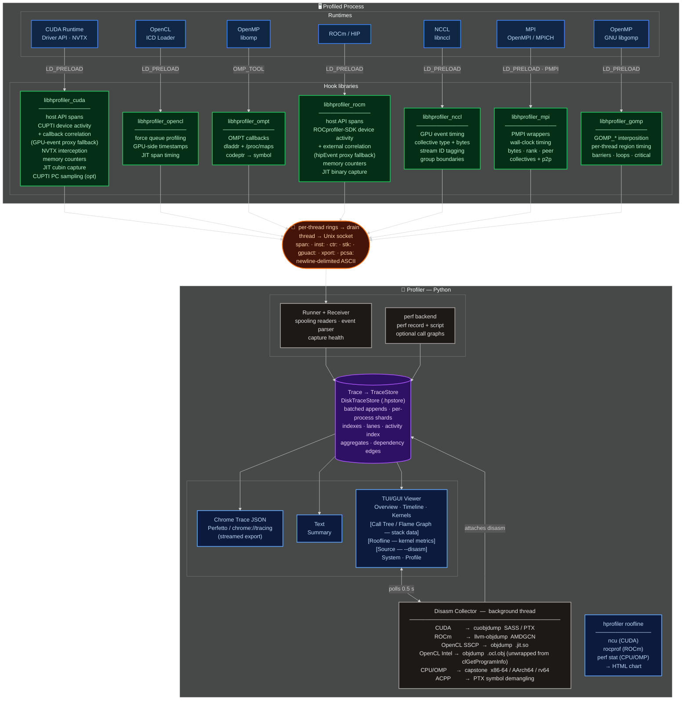

# hprofiler — Reference Documentation

hprofiler is a command-line CPU/GPU profiler for Linux. It traces programs
across CUDA, ROCm/HIP, OpenCL, OpenMP (LLVM libomp and GNU libgomp), NCCL and
MPI through injected hook libraries, samples the CPU with Linux `perf`, and
records everything one run produces into a single indexed trace. On that
trace it builds one cross-runtime dependency graph — every edge graded by
how directly the data proves it — and derives a formal critical path,
POP-style efficiency metrics and structure-aware comparisons of two runs.
Traces are explored in a terminal UI, an optional Qt/QML GUI, text reports
or Perfetto.

This is the reference manual. The [README](README.md) covers installation,
a first run and the common workflows; `hprofiler <command> --help` gives
exact option syntax.

Values are labeled by provenance throughout: **measured** (read directly
from a clock or counter), **proxy** (a measured quantity standing in for one
that was not available, e.g. a GPU-event pair instead of a device trace),
**derived** (computed exactly from measured values) and **estimated** or
**heuristic** (a model or judgment with stated limits). What has been
verified, and how, is collected in one table,
[Verification status](#verification-status); every known limitation is in
[Known limitations](#known-limitations).

## Contents

1. [Installation and build](#1-installation-and-build)
2. [Capturing a trace](#2-capturing-a-trace) — `hprofiler run`, backends,
   launchers, output files, capture health, environment variables
3. [Backends and timing semantics](#3-backends-and-timing-semantics) —
   what each backend records and where every timestamp comes from
4. [Viewing and analysis](#4-viewing-and-analysis) — TUI, GUI, summary,
   call trees, critical path, efficiency, comparison, roofline,
   disassembly, multi-node merging, OTLP
5. [Trace format and architecture](#5-trace-format-and-architecture) —
   architecture, wire protocol, transport, trace store, JSON
6. [Accuracy, overhead, verification and limitations](#6-accuracy-overhead-verification-and-limitations)
7. [Development, testing and extension](#7-development-testing-and-extension)
8. [Experimental validation](#8-experimental-validation)

---

## 1. Installation and build

### Requirements

| Component | Requirement |
|-----------|-------------|
| Python | 3.10+ |
| Python packages | `click`, `textual`, `rich`, `numpy`, `capstone>=5.0` |
| C compiler | GCC 9+ or Clang 12+ |
| CMake | 3.16+ |
| CPU backend | Linux `perf` tool |
| OpenMP backend | LLVM `libomp` (OMPT) or GNU `libgomp` (`GOMP_*` interception) — see [Backends](#3-backends-and-timing-semantics) |
| CUDA backend | CUDA Runtime installed (`libcuda.so`) |
| CUDA device activity (optional, recommended) | Build: CUPTI headers (`cupti.h`, CUDA toolkit ≥ 12.0 record layouts). Run: `libcupti.so` (CUDA toolkit), loaded with `dlopen`. Without either, device timing falls back to GPU-event proxies ([Backends](#3-backends-and-timing-semantics)) |
| OpenCL backend | Any ICD loader (`libOpenCL.so`) |
| ROCm backend | `libamdhip64.so` findable via ldconfig, `$ROCM_PATH`/`$ROCM_HOME`, or a system/`/opt/rocm*` lib dir (not required to be exactly `/opt/rocm`) |
| ROCm device activity (optional, recommended) | Build: ROCprofiler-SDK headers (`rocprofiler-sdk/`, ROCm ≥ 6.2). Run: `librocprofiler-sdk` + `rocprofiler-register` (ROCm ≥ 6.2), found by the HIP runtime itself. Otherwise hipEvent proxies ([Backends](#3-backends-and-timing-semantics)) |
| NCCL backend | CUDA Runtime + `libnccl.so` at runtime |
| MPI backend | Any MPI implementation with `mpicc`, **or** a Cray Programming Environment (`$CRAY_MPICH_DIR` + the `cc` compiler wrapper) — no `mpicc` needed there |
| Call-path unwinding (optional) | `libunwind-dev` (apt) / `libunwind-devel` (dnf) — for accurate C++ stack capture without frame pointers |
| Disasm (CUDA AoT) | `cuobjdump` (CUDA toolkit) |
| Disasm (CPU/ELF) | `capstone>=5.0` (fast path) or `objdump` / `llvm-objdump` |
| Disasm (ROCm) | `llvm-objdump` |
| Roofline (CUDA) | `ncu` (Nsight Compute, ships with CUDA toolkit) |
| Roofline (CPU/OpenMP) | `perf stat` (linux-tools) |
| Roofline (ROCm) | `rocprof` (ships with ROCm) |
| GUI (optional) | `PySide6>=6.5` — popup Qt/QML viewer (`hprofiler run --gui`, `hprofiler gui <trace>`); falls back to the TUI automatically if unavailable, so nothing else needs this |
| GUI (optional, system lib) | `libxcb-cursor0` (Debian/Ubuntu) / `xcb-util-cursor` (RHEL/Rocky/Fedora/conda-forge) — Qt ≥6.5's `xcb` platform plugin hard-requires this to open a window over X11 (including `ssh -X`/`-Y`), even though PySide6 itself imports fine without it |

### Python packages

```bash
pip install -r requirements.txt          # click, textual, rich, capstone, numpy
pip install plotly "kaleido==0.2.1"   # required for the TUI roofline viewer (Flame Graph tab needs neither)
# kaleido 0.2.1 specifically — 0.3+ requires an external Chrome install and breaks on clusters

pip install "hprofiler[gui]"          # optional: popup Qt/QML viewer instead of the TUI
```

### GUI system library and remote displays

If the GUI opens the TUI instead of the popup window, or fails with `Could not
load the Qt platform plugin "xcb"`, the system library above is missing —
PySide6 can't install it (it isn't a PyPI package). On a machine without root
(e.g. an HPC login node), install it without sudo via:

```bash
conda install -c conda-forge xcb-util-cursor   # or: spack install xcb-util-cursor
export LD_LIBRARY_PATH="$CONDA_PREFIX/lib:$LD_LIBRARY_PATH"   # conda activation doesn't always set this
```

If installing it isn't an option at all, Qt's built-in VNC platform plugin
sidesteps `xcb` entirely (no X11 involved) at the cost of needing a separate
VNC viewer + SSH tunnel instead of direct X forwarding:

```bash
export QT_QPA_PLATFORM='vnc:addr=127.0.0.1:port=5901:size=1280x800'
hprofiler gui trace.hprofiler.json
# then, from your local machine: ssh -L 5901:localhost:5901 <login-node>
# and point a VNC viewer (TigerVNC, RealVNC, macOS Screen Sharing) at localhost:5901
```

`addr=127.0.0.1` is not optional here — the open-source Qt VNC plugin has no
built-in authentication, so keep it loopback-only and reachable only through
your own SSH tunnel on a shared login node.

### Building the hook libraries

```bash
./hprofiler build                     # CMake configure + build into build/lib/
./hprofiler build --build-dir build -j 8   # defaults: --build-dir build, -j <number of CPUs>
# or manually:
cmake -S . -B build -DCMAKE_BUILD_TYPE=Release
cmake --build build -j"$(nproc)"
```

```
build/lib/
├── libhprofiler_cuda.so      # CUDA Runtime + Driver API + NVTX, CUPTI device activity
├── libhprofiler_opencl.so    # OpenCL API
├── libhprofiler_ompt.so      # OpenMP OMPT tool (LLVM libomp, Intel OpenMP)
├── libhprofiler_gomp.so      # OpenMP GOMP_* interception (GNU libgomp)
├── libhprofiler_rocm.so      # ROCm/HIP, ROCprofiler-SDK device activity
├── libhprofiler_nccl.so      # NCCL collectives
└── libhprofiler_mpi.so       # MPI PMPI wrappers (only when MPI is found)
```

The hooks resolve every runtime symbol at run time (`dlsym`), so CUDA, ROCm
and NCCL themselves are not needed to build them, only to profile with
them. Re-run `hprofiler build` after pulling new hook code; existing
libraries are overwritten. The `hprofiler` script at the project root runs
directly with the module path configured — no `pip install` of the package
is needed.

Optional build inputs, detected at configure time:

| Input | When found | Otherwise |
|---|---|---|
| libunwind (`libunwind-dev` / `libunwind-devel`) | Hooks are built with `HPROFILER_USE_LIBUNWIND`: accurate `--call-tree` stacks without frame pointers | glibc `backtrace()`; the profiled binary needs `-fno-omit-frame-pointer` |
| CUPTI headers (`cupti.h`, searched in `$CUDA_HOME`, `/usr/local/cuda`, `/usr/include`, `extras/CUPTI`) | Native CUDA device activity ([CUDA and ROCm](#cuda-and-rocm-host-calls-and-device-work)) | A stub that reports `built_without_cupti_headers`; GPU-event proxy timing |
| ROCprofiler-SDK headers (`rocprofiler-sdk/rocprofiler.h`, ROCm ≥ 6.2, via `$ROCM_PATH`, `/opt/rocm` or `-DROCPROFILER_SDK_INCLUDE_DIR=`) | Native ROCm device activity | A stub that reports `built_without_rocprofiler_sdk_headers`; hipEvent proxy timing |
| MPI (`mpicc`, or a Cray Programming Environment) | `libhprofiler_mpi.so` | The MPI hook is not built |

`-DHPROFILER_NO_CUPTI=ON` / `-DHPROFILER_NO_ROCPROFILER=ON` force the stubs.
The build test-compiles exactly the vendor record types it uses (CUDA 12.9
documents `CUpti_ActivityMemcpy6` and `CUpti_ActivitySynchronization2`;
older toolkits `...Memcpy5` / `...Synchronization` — the newer ones only
append fields, and the newest available is used). The vendor libraries are
never linked; the hook libraries load and run either way.

**Cray Programming Environment:** on Cray systems (e.g. Dardel) there is
often no `mpicc` — the `cc` compiler wrapper supplies MPI headers/libs
automatically. `hooks/mpi_hook/CMakeLists.txt` detects this via
`$CRAY_MPICH_DIR` and confirms the current `CMAKE_C_COMPILER` can already
compile+link a trivial MPI program with no extra `-I`/`-L` (via
`check_c_source_compiles`) before trusting it; if so, no manual include/link
flags are added — the wrapper injects its own, and adding your own can
conflict. Falls back to the conventional `mpi.h` search (honoring
`$MPI_HOME`/`$MPI_ROOT` hints) on non-Cray systems or if that probe fails.
On a Cray login node `cc` is normally already the default C compiler CMake
picks up, so `hprofiler build` should detect it with no extra flags;
if it doesn't, force it with `CC=cc hprofiler build`.

The eBPF scheduler tracer is built separately (`make -C hooks/os_tracer`,
see [OS scheduler tracer](#os-scheduler-tracer-ebpf)).

---

## 2. Capturing a trace

### `hprofiler run`

Profiles a program, writes the trace, prints a summary and opens a viewer.

```
hprofiler run [OPTIONS] -- COMMAND [ARGS...]
```

| Option | Default | Description |
|--------|---------|-------------|
| `--backend`, `-b` | `auto` | Comma-separated list of backends to enable |
| `--output`, `-o` | `<prog>.hprofiler.json` | Output trace. A `.json` path writes the indexed trace store `<name>.hpstore` next to it plus the Chrome Trace JSON export; a `.hpstore` path writes only the store. See [Trace store](#trace-store). |
| `--json / --no-json` | `--json` | Also export Chrome/Perfetto JSON next to the store. `--no-json` skips the export (and its time and disk space) for very large captures; the store alone is enough for every hprofiler command. |
| `--ui / --no-ui` | `--ui` | Open the TUI viewer after profiling |
| `--summary / --no-summary` | `--summary` | Print the text summary after profiling |
| `--perf-freq` | `9999` | Sampling frequency in Hz (CPU/perf backend only) |
| `--perf-callgraph` | off | Record CPU call stacks with `perf` (`fp`, `dwarf` or `lbr`) — the Call Tree and Flame Graph data; `dwarf` needs no frame pointers |
| `--disasm / --no-disasm` | `--no-disasm` | Collect per-kernel disassembly after the run; adds the Source tab |
| `--gpu-pc-sampling` | off | Enable CUPTI PC sampling for per-instruction GPU heat and stall annotation (CUDA only; **AoT-compiled kernels only** — see [Disassembly](#disassembly)). `libcupti.so` is loaded at runtime via `dlopen` — no recompile or CUPTI headers needed. Adds **Heat %** and **Stall** columns to the Source tab. Requires `--disasm`. |
| `--call-tree / --no-call-tree` | `--no-call-tree` | Capture C++ call stacks at every API interception point; adds the Call Tree tab to the TUI and a CCT hotspot section to the text summary. When libunwind is available (detected at build time), unwinding is accurate without requiring `-fno-omit-frame-pointer`. Source file:line annotations are resolved automatically via `addr2line` / `llvm-symbolizer` when available. Adds roughly 5–15 µs (libunwind) to 50–90 µs (glibc `backtrace()`) per intercepted call — do not use during benchmarking ([Overhead](#overhead)). |
| `--gui` | off | Open the native Qt/QML GUI instead of the TUI after profiling (falls back to the TUI automatically if PySide6/X11 aren't available). See [GUI](#gui). |
| `--otlp-endpoint URL`, `--otlp-file PATH` | — | Also export to an OTLP collector or file ([OpenTelemetry export](#opentelemetry-export)) |

Always separate the profiler's options from the target program with `--`:

```bash
# Correct
hprofiler run --backend cuda -- ./app --iterations 1000

# Wrong — --iterations would be parsed as a profiler option
hprofiler run --backend cuda ./app --iterations 1000
```

**Backend names:** `cpu`, `cuda`, `opencl`, `rocm`, `openmp`, `nccl`, `mpi`, `likwid`
**Aliases:** `omp` = `openmp`, `hip` = `rocm`, `cl` = `opencl`, `perf` = `cpu`, `hwc` = `likwid`

```bash
# Multiple backends
hprofiler run --backend cuda,openmp,cpu -- ./app

# Auto-detect everything available
hprofiler run -- ./app

# With disassembly (adds the Source tab)
hprofiler run --backend cuda --disasm -- ./app

# Very long run: store only, no JSON export
hprofiler run --no-json -o big.hpstore -- ./app
hprofiler view big.hpstore
```

Events are written to the on-disk trace store in bounded batches while the
program runs, so capture memory does not grow with the trace ([Trace store](#trace-store)). After
the program exits, the store is *finalized*: indexes, timeline lanes,
per-name and exclusive-time aggregates and the multiresolution activity
index are built once and persisted, so viewers open it immediately.

### Selecting backends

Without `--backend` (or with `--backend auto`) every backend whose
availability check passes is enabled; `hprofiler backends` shows the result
and an install hint for each missing dependency. Aliases are accepted
everywhere a backend name is.

```bash
hprofiler backends
```

```
Available backends:

  cpu         ✗  unavailable  CPU sampling via Linux perf (DWARF call-graph, JIT-aware)  [alias: perf]
  cuda        ✓  available    CUDA Runtime + Driver API tracing via LD_PRELOAD
  opencl      ✓  available    OpenCL command-queue profiling via LD_PRELOAD  [alias: cl]
  rocm        ✓  available    ROCm/HIP kernel tracing via LD_PRELOAD hook  [alias: hip]
  openmp      ✓  available    OpenMP parallel region / task tracing — OMPT (clang libomp) + direct GOMP_* interception (GCC libgomp)  [alias: omp]
  likwid      ✓  available    Hardware PMU counters via likwid-perfctr (FLOPS, bandwidth, cache, CPI)  [alias: hwc]
  mpi         ✓  available    MPI call tracing via PMPI wrapper (Send/Recv/Allreduce/Barrier/…)
  nccl        ✗  unavailable  NCCL collective tracing via LD_PRELOAD (AllReduce, Broadcast, Send/Recv, …)
                               → libnccl not found — install NCCL from developer.nvidia.com/nccl
```

| Backend | Attached to the program by | Library or tool |
|---|---|---|
| `cpu` | `perf record -F<freq> -e cycles:u --clockid=monotonic -p <pid>`, attached right after launch; `--call-graph=<method>` only with `--perf-callgraph` | `perf` |
| `cuda`, `opencl`, `rocm`, `nccl`, `mpi` | `LD_PRELOAD` | `libhprofiler_<name>.so` |
| `openmp` | the OMPT tool through `OMP_TOOL_LIBRARIES` (also preloaded) **and** the GNU libgomp interposer through `LD_PRELOAD` | `libhprofiler_ompt.so`, `libhprofiler_gomp.so` |
| `likwid` | the command is wrapped: `likwid-perfctr -C <cores> -g <group> ...` | `likwid-perfctr` |

Whenever `perf` is installed and any CPU-side backend is active, `perf stat`
is also attached for IPC, cache-miss and branch-miss counters (shown in the
summary and System tab). Auto-detection checks only that `likwid-perfctr`
is installed: if it cannot access the PMUs it refuses to start the program
at all, and the run captures nothing (see
[Known limitations](#known-limitations)) — list backends explicitly in that
case.

### Launchers and MPI jobs

Profile a launcher-started job by putting the launcher itself after `--`:

```bash
hprofiler run --backend mpi,openmp -o app.json -- mpirun -np 4 ./app
hprofiler run --backend mpi -o gmx.json -- srun --export=ALL -n 4 gmx_mpi mdrun -s topol.tpr
```

Give `-o`: the default output name comes from the first word of the
command, so the trace above would otherwise be called
`mpirun.hprofiler.json`.

The collector is an `AF_UNIX` socket in a private temporary directory on
the node that runs `hprofiler run`. Every rank must receive
`HPROFILER_SOCKET`, `LD_PRELOAD`, `OMP_TOOL_LIBRARIES` and any `HPROFILER_*`
settings. Launchers that start ranks on the local node normally pass their
environment through (MPICH/Hydra, Open MPI for local ranks, `srun` with its
default `--export=ALL`). If yours filters the environment, export the
variables explicitly, e.g. `mpirun -x LD_PRELOAD -x HPROFILER_SOCKET -x
OMP_TOOL_LIBRARIES ...` (Open MPI) or `srun --export=ALL ...` (SLURM).

Ranks on other nodes cannot reach the socket: capture one trace per node
and combine them with `hprofiler merge-nodes`
([Multi-node traces](#multi-node-traces)). For call-site disassembly of a
launcher-started program, the hooks record the ELF file each call site was
resolved in (`symfile=`), and the collector records each connected
process's real executable, so the launcher's own binary is never
disassembled by mistake.

A run that ends with zero events from every backend prints a warning that
the hooks never reached the collector, with launcher-specific advice when
the command starts with `srun`, `mpirun`, `mpiexec`, `aprun`, `jsrun` or
`ibrun`. With SLURM this has been seen to be intermittent (the identical
command capturing tens of thousands of events on the next invocation),
which points at the site's environment-export configuration rather than at
the hooks: a hook retries its connection on every event, so a startup race
would lose only the first few events.

### Output files

| File | Written | Contents |
|---|---|---|
| `<name>.hpstore/` | always | The indexed trace store every hprofiler command reads ([Trace store](#trace-store)) |
| `<name>.json` | unless `--no-json` | Chrome Trace JSON for Perfetto / `chrome://tracing`, lossless ([Chrome Trace JSON](#chrome-trace-json)) |
| text summary on stdout | unless `--no-summary` | [Text summary](#text-summary) |
| OTLP JSON / OTLP endpoint | with `--otlp-file` / `--otlp-endpoint` | [OpenTelemetry export](#opentelemetry-export) |

Naming: without `-o`, `<name>` is `<basename of the first command word>.hprofiler`.
`-o trace.json` writes `trace.hpstore` and `trace.json`; `-o trace.hpstore`
writes only the store (as does `--no-json`). With `--disasm`, disassembly
is collected on a background thread after the run (the viewer opens after
at most 60 s of waiting) and written into the store and JSON when it
finishes (`Disasm added to: …`). Binaries captured for disassembly
(`/tmp/hprofiler_*_<pid>_*`) and the `perf` recording are deleted after
processing; leftovers from a crashed run are removed at the end of the
next run.

### Capture health and warnings

Nothing that is lost or degraded during a capture is dropped silently:

- **Hooks** count every record they produce, deliver, drop because the
  thread's ring stayed full (`dropped_full`), cannot deliver
  (`dropped_lost`) or reject as oversize, and report it in `xport:` status
  records ([Transport status record](#transport-status-record)).
- **The collector** counts malformed lines, unknown record kinds, partial
  records, processing errors and connections still open at the end of the
  run (bounded by `HPROFILER_RECEIVER_TIMEOUT_S`).
- **GPU tracers** report whether native device activity was active, how
  timestamps were mapped, and dropped or untimed records
  ([CUDA and ROCm](#cuda-and-rocm-host-calls-and-device-work)).

All of it is stored with the trace (`metadata.captureHealth`,
`metadata.deviceActivity`) and turned into one-line warnings, printed at
the end of `hprofiler run`, at the top of `hprofiler summary`, in a
"Capture warnings" panel on the TUI and GUI Overview, and per process in
the GUI inspector. Example (rings deliberately undersized):

```
[hprofiler][warn] gomp hook, pid 1524292: 55389 dropped (ring full after waiting)

  Capture warnings:
    ! gomp hook, pid 1524292: 55389 dropped (ring full after waiting)
```

Other diagnostics:

- A missing, truncated or damaged trace makes every command print one line
  (`[hprofiler] error: …`) and exit with status 2; `HPROFILER_DEBUG=1` shows
  the traceback.
- The GUI writes a rotating log to
  `~/.local/share/hprofiler/hprofiler/hprofiler-gui.log` (Help → Open Log
  File) and prints its rendering tier and load progress to stderr
  (`[hprofiler][gui] …`).
- With `HPROFILER_DEBUG=1` the OpenCL hook writes
  `/tmp/hprofiler_ocl_<pid>.log`.
- A run with OpenMP enabled but no OpenMP events prints how to check which
  runtime the binary links.

### Environment variables

Settings read by the hooks or the collector (export them before
`hprofiler run`; they are inherited by the profiled program):

| Variable | Default | Effect |
|---|---|---|
| `HPROFILER_DEVICE_ACTIVITY` | `auto` | CUDA/ROCm device timing: `auto` (native tracer when available, else proxy), `off` (proxy only), `both` (both, for comparison; analyses keep the native span) |
| `HPROFILER_CUPTI_LIB` | — | Path of the `libcupti` to load |
| `HPROFILER_CUPTI_FLUSH_MS` | `1000` | CUPTI periodic buffer flush interval |
| `HPROFILER_CUPTI_EAGER` | set automatically for static-runtime binaries | `1`: start CUPTI when the hook loads |
| `HPROFILER_CLOCK_SYNC` | off | `1`: each MPI rank estimates its clock offset to rank 0 in `MPI_Init` ([Multi-node traces](#multi-node-traces)) |
| `HPROFILER_LIKWID_GROUP` | `FLOPS_DP` | LIKWID counter group |
| `HPROFILER_LIKWID_CORES` | all cores | LIKWID core range, e.g. `0-7` |
| `HPROFILER_TRANSPORT` | ring | `sync`: send every record synchronously (A/B overhead comparison) |
| `HPROFILER_RING_KB` | `512` | Per-thread ring size in KiB |
| `HPROFILER_RING_WAIT_MS` | `1000` | Longest a producer waits for ring space before dropping a record (`0`: never wait) |
| `HPROFILER_DRAIN_US` | `500` | Idle interval of the hook drain thread |
| `HPROFILER_SHUTDOWN_MS` | `10000` | Bound on the final drain at process exit |
| `HPROFILER_RECEIVER_TIMEOUT_S` | `120` | How long the collector waits for connections a lingering child keeps open |
| `HPROFILER_JSON_MEMORY_LIMIT_MB` | `256` | JSON traces above this size are imported into a disk store instead of memory |
| `HPROFILER_CUDA_SM` | `sm_80` | Architecture passed to `nvdisasm -b` when `cuobjdump` cannot read a captured cubin |
| `HPROFILER_DEBUG` | off | CLI tracebacks; OpenCL hook debug log |

Set by `hprofiler run` itself (do not set them by hand): `HPROFILER_SOCKET`
(collector socket), `HPROFILER_CALLSTACK` (`--call-tree`),
`HPROFILER_CALLGRAPH` (`--perf-callgraph`), `HPROFILER_GPU_PCSAMPLING`
(`--gpu-pc-sampling`), `LD_PRELOAD`, `OMP_TOOL_LIBRARIES`. Used only by the
test suite or internally: `HPROFILER_GUI_SELFTEST`,
`HPROFILER_READY_MARKER`, `HPROFILER_STRESS_EVENTS`,
`HPROFILER_CUPTI_INCLUDE`, `HPROFILER_ROCPROFILER_SDK_INCLUDE`.

---

## 3. Backends and timing semantics

### Backend overview

| Backend | Records | Host-side timing | Device-side timing | Call-site / stack data | Verified |
|---|---|---|---|---|---|
| `cpu` | `perf` samples (one span per sample, nominal one-interval weight), `perf stat` counters | sampled (estimate) | — | stacks with `--perf-callgraph` | parser only |
| `cuda` | Runtime/Driver API calls, NVTX v2 ranges, allocations, JIT modules | measured | CUPTI: measured; else GPU-event proxy | stacks with `--call-tree` | functionally, on one GPU |
| `rocm` | HIP API calls, allocations, JIT modules | measured | ROCprofiler-SDK: measured; else hipEvent proxy | stacks with `--call-tree` | decoder only |
| `opencl` | enqueues, transfers, program builds | measured | `CL_PROFILING_*` event timestamps, calibrated to the host clock | stacks with `--call-tree` | Intel CPU OpenCL device |
| `openmp` (OMPT) | regions, implicit tasks, work-sharing, tasks, sync regions, target | measured | — | `sym=`/`lib=`/`symfile=` call sites | ground truth |
| `openmp` (GNU libgomp) | parallel regions, non-static loops, barriers, critical sections, single | measured | — | call sites | ground truth; one HPC site |
| `nccl` | collectives, send/recv, groups, communicators | — | `cudaEvent` pair (waited for), else host clock (`timing=cpu`) | — | not run |
| `mpi` | point-to-point, requests, collectives, RMA synchronization, communicators | measured | — | call site on every span | single process |
| `likwid` | PMU counter groups over the whole run | counters | — | — | not run |
| eBPF tracer | off-CPU periods, wakeups, migrations | measured in-kernel | — | — | never loaded |

"Verified" summarizes [Verification status](#verification-status).

### Clocks, units and timing provenance

- **One clock.** Every hook timestamp is `CLOCK_MONOTONIC` in nanoseconds;
  `perf` is run with `--clockid=monotonic`, and the trace's profiling
  window (`startTimeNs`/`endTimeNs`) uses the same clock. Stored and
  analysed values are integer ns; the Chrome Trace JSON uses µs for `ts` and
  `dur` (rounded back to ns on load).
- **Device clocks.** CUPTI device timestamps are delivered directly in
  `CLOCK_MONOTONIC` when CUPTI supports a timestamp callback, otherwise —
  and always for ROCprofiler-SDK — through a measured offset with an error
  bound (`clock=`, `clock_err_ns`, see
  [CUDA and ROCm](#cuda-and-rocm-host-calls-and-device-work)). OpenCL device
  timestamps are converted with one calibration sample at the first event.
- **Several nodes.** Each node has its own monotonic clock; merged traces
  are aligned by per-node offsets ([Multi-node traces](#multi-node-traces)).
- **Counters** carry their unit (`counterUnits` in the trace metadata).

**Host and device.** For CUDA and ROCm every submission is two spans: the
**host span** is the API call on the calling thread (`side=cpu`); the
**device span** is the work on the GPU (`side=gpu`), drawn on its stream's
Timeline lane and never counted as host-thread time. OpenCL kernels
likewise have a `side=cpu` enqueue span and a `side=gpu` execution span.

**How an interval was obtained** is recorded per span in `timing=`:

| `timing=` | Meaning | Provenance |
|---|---|---|
| `host` | The host call itself, `CLOCK_MONOTONIC` around the call | measured |
| `device` | Start/end measured on the GPU by CUPTI or ROCprofiler-SDK | measured |
| `proxy_event` | Duration from a GPU event pair around the submission, placed at the host submission time | duration measured (includes event overhead), start estimated |
| `proxy_host` | No device information: the host call's own interval | proxy |
| `proxy_flush` | Launch-to-flush time after a failed event query | upper bound |
| `cpu` (NCCL) | Host wall-clock time because CUDA events were unusable | proxy |

`hprofiler summary` names the timing source GPU-active time was computed
from, the GUI inspector shows it per span, and `hprofiler compare` labels
every value measured, graph-derived, heuristic or unavailable.

### `cpu` backend

Runs `perf record -F<freq> -e cycles:u --clockid=monotonic -p <pid>`
alongside the profiled process and parses `perf script` after it exits.
Call stacks are recorded only with `--perf-callgraph fp|dwarf|lbr`; each
sample then becomes one span named after the sampled frame, with the
ancestor frames as its stack and a nominal duration of one sampling
interval (the input to the Call Tree and Flame Graph tabs). Samples are
estimates: in exclusive-time breakdowns they count only while their thread
is not inside an instrumented call.

**Requirements:** `perf` (`apt install linux-tools-$(uname -r)`) and
`kernel.perf_event_paranoid` ≤ 1 (≤ 0 for uncore counters).

**JIT note:** DWARF unwinding works with JIT-compiled code if the JIT emits
`/tmp/perf-<pid>.map` entries (LLVM/OpenJDK convention). ACPP with the LLVM
backend does this automatically.

```bash
hprofiler run --backend cpu --perf-freq 199 -- ./my_program
```

### CUDA and ROCm: host calls and device work

Every intercepted CUDA/HIP call that submits work to the GPU (kernel launch,
async or blocking copy, memset, graph launch) is reported as **two kinds of
span**, linked by a correlation id:

| Span | Tags | What it is |
|---|---|---|
| **Host API span** | `side=cpu`, `timing=host`, `lid=`, `sid=` (+ `corr=`/`corr2=` with CUPTI) | The call itself (`cudaLaunchKernel`, `hipMemcpyAsync`, ...) on the calling thread. Named after the API; `type=launch` for submissions (Runtime overhead), `type=memcpy` for a blocking copy (the call spans the transfer), `type=sync` for sync calls, `type=event_record` / `type=stream_wait` for event bookkeeping. |
| **Device span** | `side=gpu`, `timing=device` or `timing=proxy_*` | The work on the GPU: kernel (category `cuda`/`rocm`, named after the kernel), copy (`memory`, `memcpy HtoD` ...), memset (`memory`, `memset`). On its stream's Timeline lane, never in host-thread time. |

All of them carry `rt=cuda|rocm`, `op=` (`kernel`, `memcpy`, `memset`,
`graph`, `sync`, `event_record`, `stream_wait`) and `stream=` (the
program's stream handle, hashed -- the same id in the CUDA, ROCm and NCCL
hooks). Native device spans add `dev=`, `ctx=` (CUDA), `nstream=` (the
vendor's stream id) or `queue=`/`dispatch=` (ROCm), and `src=cupti` /
`src=rocprofiler`.

#### Native tracing (preferred) and the proxy fallback

* **CUDA -- CUPTI.** Activity API for `CONCURRENT_KERNEL`, `MEMCPY`,
  `MEMCPY2` (peer), `MEMSET` and `SYNCHRONIZATION` records; Callback API on
  the runtime and driver domains. The hook arms a thread-local capture
  around each intercepted call and records the CUPTI correlation ids of the
  outermost runtime and driver call made inside it (`corr`, `corr2` --
  kernel records may carry either; memcpy records carry the driver id plus
  the runtime id). Kernel launches, copies and memsets made through calls
  the LD_PRELOAD layer cannot see (libraries with a statically linked
  runtime, e.g. cuBLAS) get a host span from the callback itself
  (`src=cupti_cb`). `libcupti` is opened with `dlopen` at the first
  intercepted CUDA call -- never in shells or launchers that merely
  inherit `LD_PRELOAD` -- trying, in order: a copy already loaded in the
  process (a second copy is never loaded next to it), `$HPROFILER_CUPTI_LIB`,
  the toolkit whose headers were compiled in, `$CUDA_HOME`, then the loader
  path. A libcupti older than the compiled headers is refused (it could
  deliver older record versions).
* **ROCm -- ROCprofiler-SDK buffered tracing.** `KERNEL_DISPATCH` and
  `MEMORY_COPY` buffer records plus the code-object callback for kernel
  names. The hook exports `rocprofiler_configure`; when the HIP runtime
  starts, rocprofiler-register finds it and loads `librocprofiler-sdk`
  (nothing is linked). Around each intercepted HIP call the hook pushes its
  `lid` as ROCprofiler's *external* correlation id, so the records carry
  the exact host call that submitted them. The hook forces HIP
  initialization before the first submission so the native/proxy decision
  is made with the tracer already running.
* **Proxy fallback.** Without a native tracer the hooks time submissions
  themselves: a GPU event pair around each submission (`timing=
  proxy_event`), or the host call's own interval when events can't be used
  (`timing=proxy_host`), or launch-to-flush time when the event query
  failed (`timing=proxy_flush`). Proxy device spans start at the host
  submission time.

`HPROFILER_DEVICE_ACTIVITY` selects the mode: `auto` (default: native when
available, else proxy), `off` (proxy only), `both` (native and proxy for every launch, for comparing
them; the analysis keeps the native span). Other knobs:
`HPROFILER_CUPTI_LIB` (libcupti path), `HPROFILER_CUPTI_FLUSH_MS` (CUPTI
periodic flush, default 1000 ms), `HPROFILER_CUPTI_EAGER=1` (start CUPTI
when the hook loads; set automatically for static-runtime binaries, below).

**Statically linked CUDA runtime.** `nvcc`'s default `libcudart_static.a`
cannot be intercepted with LD_PRELOAD. The Runner detects such binaries
(`nm`) and sets `HPROFILER_CUPTI_EAGER=1`, so CUPTI starts in the hook's
constructor and its callbacks report launches, copies, memsets, syncs,
event records and stream waits (without stream/event handles, which only
the wrappers see -- device spans then use CUPTI's stream ids, and event
syncs fall back to the device-wide wait rule). Without libcupti a static
binary still records nothing.

#### What each timestamp is

| Quantity | Native tracer | Proxy |
|---|---|---|
| Host call start / duration (host span) | **measured** -- `CLOCK_MONOTONIC` around the call | same |
| Device start / end | **measured** on the GPU by CUPTI / ROCprofiler-SDK, mapped onto `CLOCK_MONOTONIC` (below) | start **estimated**: the host submission time |
| Device execution time | **measured** (end - start) | `proxy_event`: **measured** by a GPU event pair, including event overhead; `proxy_host`: host call only (no device information); `proxy_flush`: upper bound |
| `api_ns` on a device span | **measured** host call duration, copied from the correlated host span | -- |
| `queue_ns` | **derived**: device start - host call end, clamped at 0 (time between the call returning and the work starting) | not available |
| `launch_ns` | **derived**: device start - host call start | -- |
| `queued=` / `submitted=` / `submit_ns` (CUDA kernels) | **measured** by CUPTI latency timestamps (command-buffer queue/submit); `submit_ns` = start - submitted (**derived**) | -- |
| `xs=` | -- | **estimated** execution start from a one-time event calibration (see the `cuda` section) |
| CUPTI synchronization records | **measured on the host** by CUPTI (`timing=host`): the wait interval of a sync call | -- |

Clock mapping. CUPTI's default timestamps are `CLOCK_REALTIME`; when
`cuptiActivityRegisterTimestampCallback` is available the hook registers
`CLOCK_MONOTONIC` before enabling any activity kind, so device timestamps
are in the hooks' clock directly (`clock=monotonic_callback`). Otherwise,
and always for ROCprofiler-SDK, an offset is measured by bracketing the
tracer's own timestamp call between two `CLOCK_MONOTONIC` reads (best of 5,
re-measured for every buffer; `clock=offset`, `clock_err_ns` = half the
tightest bracket). A wall-clock step while a CUPTI buffer is filling shifts
that buffer's records by the step in offset mode.

#### Correlation, de-duplication and streams (`src/core/gpu_activity.py`)

Native records arrive in buffers, out of order and often after the host
spans they belong to, so the Runner correlates once on the complete trace
(`gpu_activity.assemble`), and the result is saved in the JSON:

* **Matching.** `lid` first (hook-assigned, exact; ROCm records carry it as
  the external id), otherwise the union of hosts sharing `corr`/`corr2`.
  A correlation id can repeat (CUPTI's are 32-bit and wrap): the latest
  submission that started no later than the device operation wins. Only if
  every candidate started after it is a 50 µs clock-mapping tolerance
  allowed; beyond that the record is counted as `precedes_submission`.
  Graph launches legitimately have many device operations per host call.
* **De-duplication.** A proxy device span whose host call also has a
  native record (`both` mode) is removed (`deduplicated_proxy`); identical
  native records delivered twice are removed (`duplicate_records`). In
  `both` mode the hook's own event synchronizations would produce CUPTI
  sync records; those are dropped in the hook (`internal_records`).
* **Streams.** A native device span takes its host call's `stream=`; other
  records with the same vendor stream/queue id inherit the mapping learned
  from 1:1 submissions; anything else keeps a vendor lane (`stream=n7`,
  `stream=q160`). HIP streams that share one HSA queue are never merged.
* The device span gets the launching thread as `tid`, its host span as
  `parent_span_id`, and the derived tags above.

**GPU-active time never mixes sources.** `gpu_activity.kernel_activity`
uses device-measured kernels when the trace has any, otherwise
`proxy_event` kernels -- never the union, which would count one kernel at
its submission time *and* at its execution time. `proxy_host` /
`proxy_flush` kernels are never interval sources. Every consumer (Overview
diagnosis, `gpu_starvation`, Profile tab, `hprofiler summary`) uses it and
reports which source it used and how many kernel spans it left out.

**Provenance in the trace.** The hooks report tracer status over the wire
(`gpuact:` lines, [Wire protocol](#wire-protocol)). It is merged with the assembly counts into
`metadata.deviceActivity` (keyed `"<pid>/<rt>"`): `status` (`active` /
`unavailable` + `reason` / `disabled`), `clock`, `clock_err_ns`,
`correlation`, record counts, `correlated`, `unmatched_device`,
`host_without_device` (a submission whose device record never arrived
while native tracing was producing records -- e.g. dropped),
`dropped`, `notime` (records without timestamps from the at-exit forced
flush), `bad_records`, and `timing` (`device`, `proxy`, `device+proxy`).
`hprofiler summary` prints it; the GUI Inspector shows per-span provenance
("Device timing: measured on the device (cupti)" vs. "estimated").

**Buffer overflow.** CUPTI counts records it had to drop
(`cuptiActivityGetNumDroppedRecords`) and the hook adds buffer allocation
failures; ROCprofiler-SDK uses a DISCARD buffer and reports its
`drop_count`. Both arrive as `dropped=` and are summed per process.

**Limitations** — one CUPTI subscriber per process, newer record layouts,
records lost on abnormal exit — are listed in
[Known limitations](#known-limitations). Per-kernel hardware counters are
not collected here; see [Roofline](#roofline).

### `cuda` backend

Injects `libhprofiler_cuda.so` via `LD_PRELOAD` to wrap CUDA API calls, and
uses CUPTI (loaded at run time) for the device side -- see "CUDA and ROCm:
host calls, device work, and where each timestamp comes from" above.

**Wrapped functions** (host API spans; every one carries `side=cpu,rt=cuda,
timing=host,lid=N,sid=N` and, with CUPTI, `corr=`/`corr2=`):

| Function | Category | Tags | Device span |
|----------|---------|------|-------------|
| `cudaLaunchKernel` / `cuLaunchKernel` | `cuda` | `type=launch,op=kernel,stream=N` | kernel (`type=kernel,grid=,block=`) |
| `cudaGraphLaunch` / `cuGraphLaunch` | `cuda` | `type=launch,op=graph,stream=N` | native: one per graph node; proxy: one `graph` span |
| `cudaMemcpyAsync`, `cuMemcpyAsync`, `cuMemcpyHtoDAsync`, `cuMemcpyDtoHAsync` | `memory` | `type=launch,op=memcpy,dir=,bytes=,stream=N` | `memcpy <dir>` |
| `cudaMemsetAsync` / `cudaMemset` | `memory` | `type=launch,op=memset,bytes=,stream=N` | `memset` |
| `cudaMemcpy` (blocking) | `memory` | `type=memcpy,op=memcpy,dir=,bytes=` | native only |
| `cudaDeviceSynchronize` / `cuCtxSynchronize` / `cudaDeviceReset` | `sync` | `type=sync,op=sync,sync=device` | -- |
| `cudaStreamSynchronize` / `cuStreamSynchronize` | `sync` | `type=sync,op=sync,sync=stream,stream=N` | -- |
| `cudaEventSynchronize` | `sync` | `type=sync,op=sync,sync=event,event=N` | -- |
| `cudaEventRecord` | `cuda` | `type=event_record,op=event_record,event=N,stream=N` | -- |
| `cudaStreamWaitEvent` | `cuda` | `type=stream_wait,op=stream_wait,event=N,stream=N` | -- |
| `cudaMalloc*` / `cudaFree*` / `cudaHostAlloc` / `cuMemAlloc*` / `cuMemFree*` | `memory` | `type=alloc...,bytes=N` / `type=free...` | -- |
| `nvtxRangePushA/W/Ex` + `nvtxRangePop` | `nvtx` | `type=nvtx_range` | -- |

`stream=` and `event=` are the same pointer hash, so an event sync or a
cross-stream wait can be resolved to the stream its event was recorded on
([Critical path](#critical-path)). A failed call carries `err=<code>` and produces no device span.

All memory-transfer variants use category `memory`, not `cuda`; only the
kernel-launch/graph-launch calls and event bookkeeping are category `cuda`.
Host submission calls are *Runtime overhead* in time breakdowns; the device
work they submit is never counted as host-thread time.

**Proxy device timing (no CUPTI):** The hook creates `cudaEvent_t` pairs
around each submission. The end event is recorded *before* acquiring the
pending-kernel mutex so that no CUDA API call is ever made while holding a
lock. At each sync point the pending events are flushed and
`cudaEventElapsedTime` gives the GPU-side duration; the span is placed at
the host submission time and tagged `timing=proxy_event`. Proxy spans name
a kernel by `dladdr` on its host stub, which only works for exported
symbols (`<jit-kernel>` otherwise); CUPTI records carry the real name.

**Exec-start calibration (`xs=` tag, proxy spans only):** `start_ns` on
a proxy kernel span is the CPU-side *launch-call* time, not when the GPU actually
began executing it — under stream queue backlog (several kernels launched
back-to-back on a busy stream), only the first can start immediately; the
rest wait on the GPU for however long their predecessors take, but
`start_ns` alone reports every one of them as if it began at launch-call
time. Every kernel/memcpy span additionally carries `xs=<ns>`: the real
GPU-timeline execution-start wall-clock time, from a one-time reference-
event calibration (record a calibration `cudaEvent_t`, synchronize on it
immediately, pair it with a CPU wall-clock reading taken at that same
instant — mirrors `opencl_hook.c`'s `cl_calibrate_if_needed`; a `cudaEvent_t`
recorded into a stream completes exactly when the GPU's execution reaches
that point in the stream's FIFO queue, and this holds across streams since
CUDA events mark points on one single per-device timeline). Purely
additive — never changes what `start_ns`/`duration_ns` mean, so anything
reading spans without knowing about `xs=` is unaffected.
`src/analysis/criticalpath.py`'s dependency-graph DP ([Critical path](#critical-path)) prefers `xs=`
over `start_ns` when computing causal gate/gap times for GPU spans, so idle-
time attribution around a queued kernel is accurate even though the
Timeline/roofline/CCT views still show `start_ns` (deliberately — "when I
issued this kernel" is itself useful information for a programmer
optimizing their code's launch pattern, a different question than "what
was on the critical path"). Measured against CUPTI in one run it was
~2.4 ms late ([GPU functional checks](#gpu-functional-checks)); with CUPTI
available the device span carries the measured start and `xs=` is not used.

**NVTX range interception:** Fully replaced — no `libnvToolsExt.so` required.
NVTX v3 (header-only inline API) is not intercepted.

**GPU memory counters:** `cudaMalloc`/`cudaFree` emit counter events tracking
the running total of device allocations.

**Stream ID tagging:** Every kernel/memcpy span carries `stream=N`. The TUI
Timeline groups CUDA spans into `cuda/stream-N` lanes.

**JIT kernel capture:** `cuModuleLoadData` is wrapped; the PTX/fatbinary blob
is saved to `/tmp/hprofiler_cubin_<pid>_<n>.bin` for post-run disassembly.

**Requirements:** `libcuda.so.1` on the library path, or `nvidia-smi` present.

**Prefer the shared CUDA runtime.** hprofiler's wrappers are injected via
LD_PRELOAD, which only intercepts symbols resolved at runtime from shared
libraries. With the dynamic CUDA runtime every call is intercepted (stream
and event handles, kernel launch geometry, NVTX parents):

```bash
# nvcc
nvcc -cudart shared -o myapp myapp.cu

# CMake (add to CMakeLists.txt)
set_target_properties(myapp PROPERTIES CUDA_RUNTIME_LIBRARY Shared)
```

The default (`libcudart_static.a`) bakes the runtime into the binary at compile
time, so the LD_PRELOAD wrappers are never called. The Runner detects this and
starts CUPTI when the hook loads instead (`HPROFILER_CUPTI_EAGER=1`): host calls
then come from CUPTI callbacks and device work from activity records, without
stream/event handles (see above). **Without libcupti such a binary still
records 0 CUDA events.** Switching to `-cudart shared` has no runtime
performance impact -- only the binary size changes.

**CUPTI PC sampling** is available via `--gpu-pc-sampling` (see [`hprofiler run`](#hprofiler-run) and [Disassembly](#disassembly)).
`libcupti.so` is loaded at runtime with `dlopen`. CUPTI accepts one
buffer-callback registration per process, so when the hook was built with
CUPTI headers the device-activity code owns it and hands PC-sampling records
back; without headers the PC-sampling path registers its own (hand-mirrored
record layouts). When `libcupti.so` is absent, the flag is
silently ignored.

```bash
hprofiler run --backend cuda -- ./my_cuda_program
hprofiler run --backend cuda --disasm --gpu-pc-sampling -- ./my_cuda_program
```

### `rocm` backend

Injects `libhprofiler_rocm.so` via `LD_PRELOAD`. Same host/device model as
`cuda`: `hipLaunchKernel`, `hipLaunchKernelGGL`, `hipModuleLaunchKernel`,
`hipGraphLaunch`, `hipMemcpyAsync`, `hipMemsetAsync`/`hipMemset` emit host
API spans (`type=launch`); `hipMemcpy`/`hipMemcpyHtoD`/`hipMemcpyDtoH` are
blocking host spans (`type=memcpy`); the sync calls carry `sync=device|
stream|event`; `hipEventRecord`/`hipStreamWaitEvent` carry `event=`/
`stream=`. Device work comes from **ROCprofiler-SDK** buffered tracing when
the SDK is installed (kernel dispatches with queue, dispatch id and the
launching thread; memory copies with source/destination agents), matched to
the host call through the external correlation id the hook pushes around
each call -- see "CUDA and ROCm: host calls, device work ..." above.
Otherwise `hipEvent_t` pairs give proxy device spans (`timing=proxy_*`,
same `xs=` estimate as the `cuda` backend). Also tracks device memory with
counter events and saves JIT binaries for disassembly.

**Requirements:** `libamdhip64.so` findable at runtime. Checked, in order: the
system ldconfig cache; `$ROCM_PATH`/`$ROCM_HOME` (if set) plus their `lib`/
`lib64` subdirs; `/opt/rocm`, `/usr/local/rocm`, and any `/opt/rocm-*` /
`/usr/local/rocm-*` versioned install (newest version picked first, by
numeric — not lexicographic — sort); and common system lib dirs
(`/usr/lib/x86_64-linux-gnu`, `/usr/lib64`, `/usr/lib`, `/usr/lib/aarch64-linux-gnu`).
A full ROCm SDK at `/opt/rocm` is *not* required — a standalone
`libamdhip64` runtime package (e.g. Debian/Ubuntu's `libamdhip64-5`) is
enough for the hook to load; ROCm's own `hipcc`/headers are only needed to
compile the HIP program being profiled.

```bash
hprofiler run --backend rocm -- ./my_hip_program
```

### `opencl` backend

Injects `libhprofiler_opencl.so` via `LD_PRELOAD`. Forces
`CL_QUEUE_PROFILING_ENABLE` on every queue, captures GPU-side kernel and
buffer-transfer timestamps via event callbacks, and emits `jit` spans for
`clBuildProgram`.

**Wrapped functions:**

| Function | Category | What is captured |
|----------|----------|-----------------|
| `clCreateCommandQueue` / `clCreateCommandQueueWithProperties` | — | Forces `CL_QUEUE_PROFILING_ENABLE` on every queue |
| `clEnqueueNDRangeKernel` | `opencl` | GPU-side kernel duration from `CL_PROFILING_COMMAND_START/END` |
| `clEnqueueReadBuffer` / `clEnqueueWriteBuffer` / `clEnqueueSVMMemcpy` | `memory` | Buffer/SVM transfer timing (GPU-accurate when non-blocking; see below) |
| `clBuildProgram` / `clCompileProgram` | `jit` | JIT compile time; `clBuildProgram` also extracts the compiled binary for disassembly |
| `clCreateBuffer` / `clReleaseMemObject` | `memory` | Allocation spans and the `opencl_memory_bytes` counter (live buffer bytes) |
| `dlopen` / `dlsym` | `jit`, `opencl` | ACPP SSCP `.jit.so` CPU kernels, which never go through an enqueue call: a `jit` span per loaded module and an `opencl` span (`type=jit_kernel,side=cpu`) per kernel call via a trampoline (up to 256 kernels) |
| `clFinish` / `clWaitForEvents` | `sync` | Host-side synchronisation barriers |

**Kernel launches emit two spans, memory transfers emit one:** each
`clEnqueueNDRangeKernel` call produces a CPU-side span (`type=kernel,
side=cpu` — enqueue/scheduling latency) and a GPU-side span (`type=kernel,
side=gpu` — the real execution time, from the async completion callback),
both category `opencl`, distinguished by `side=`. A memory transfer
(`clEnqueueReadBuffer`/`WriteBuffer`/`SVMMemcpy`) emits only **one**: for a
**blocking** call the CPU-side span alone already spans the full transfer
(the call doesn't return until it's done), so the GPU-event callback isn't
also registered; for a **non-blocking** call the GPU-event callback fires
instead, giving GPU-accurate timing. Either way there's exactly one span
per transfer, never both.

**JIT binary extraction for disassembly:** After every successful `clBuildProgram`
call the hook calls `clGetProgramInfo(CL_PROGRAM_BINARIES)` to retrieve the
compiled binary. The binary is saved to `/tmp/hprofiler_ocl_<pid>_<n>.bin` and
a `jit_load` span is emitted so the disassembly extractor picks it up.

- **ACPP SSCP / POCL:** the binary is a standard ELF relocatable — `objdump`
  reads it directly.
- **Intel CPU OCL (`libintelocl.so`):** the driver wraps the compiled x86-64 ELF
  inside a proprietary outer ELF (`e_type = 0xff04`). The hook's
  `_unwrap_intel_ocl()` function detects this format, locates the `.ocl.obj`
  section (a standard `elf64-x86-64` relocatable), and saves only that inner
  object — making it readable by `nm` and `objdump` for the Source tab.

**RTLD_DEEPBIND compatibility:** ACPP loads its OCL backend
(`librt-backend-ocl.so`) in a private `RTLD_DEEPBIND` namespace, which causes
`dlsym(RTLD_NEXT, "cl...")` to return NULL inside the hook. The hook's
`find_real_ocl()` helper falls back to `dlopen("libOpenCL.so.1", RTLD_NOLOAD)`
(which works across namespaces) to resolve real OpenCL symbols even when the
library is not visible via `RTLD_NEXT`. The fallback handle is opened exactly
once via `pthread_once` — safe when multiple driver threads call into the hook
concurrently at startup.

```bash
hprofiler run --backend opencl -- ./my_ocl_program

# ACPP SYCL targeting Intel CPU OCL with disassembly
ACPP_VISIBILITY_MASK=ocl hprofiler run --backend opencl,cpu --disasm -- ./app
```

### `openmp` backend

Two independent capture paths, **both always injected together** whenever
this backend is active — which OpenMP runtime the profiled binary actually
links against isn't known in advance, so rather than guess, both are
covered and whichever is irrelevant for a given binary is a harmless
no-op (it intercepts symbol names that binary never calls).

**Path 1 — OMPT** (`libhprofiler_ompt.so`, loaded via `OMP_TOOL_LIBRARIES`
and also `LD_PRELOAD`ed so its `dlopen()` interposer is in the global
interposition chain, not just a private-namespace plugin): uses the
OpenMP 5.0 Tools Interface. **Requires LLVM's `libomp`** — GCC's `libgomp`
does not implement OMPT in typical distro/vendor builds (confirmed
empirically: `nm -D libgomp.so.1 | grep ompt` finds no OMPT symbols
exported at all on Ubuntu 24.04/GCC 13). Registered callbacks:

| Callback | Category | What it captures |
|----------|---------|-----------------|
| `ompt_callback_parallel_begin/end` | `openmp` | `parallel_region` spans (primary thread only) |
| `ompt_callback_implicit_task` | `openmp` | `omp_implicit_task` spans — each thread's own share of a region (`type=implicit_task`, `index=`, `psid=` region id); the initial task is skipped |
| `ompt_callback_work` | `openmp` | `omp_loop`, `omp_sections`, `omp_taskloop`, etc. |
| `ompt_callback_task_create` | `openmp` | `omp_task_create` spans (one per `#pragma omp task`) |
| `ompt_callback_task_schedule` | `openmp` | `omp_task` execution spans (start → complete/yield) |
| `ompt_callback_sync_region` | `sync` | Barriers, `taskwait`, `taskgroup` |
| `ompt_callback_target begin/end` | `openmp` | GPU offload spans |

**Note on task callbacks:** `task_create` and `task_schedule` use enum values 5 and 6 per the OpenMP 5.0 specification. `task_create` is called from user-code context so call-tree capture works for it. `task_schedule` is called from the runtime worker thread, so its call stack does not include `main` even with `--call-tree`.

**Thread-safe startup:** `cb_thread_begin` runs concurrently on every worker as the thread pool starts. Each thread only creates its own ring on its first event; the library's single drain thread owns the collector connection ([Hook transport and collector](#hook-transport-and-collector)).

```bash
# Compile with clang to get libomp
clang -O2 -fopenmp -o my_program my_program.c
ldd ./my_program | grep -E "gomp|omp"   # Good: libomp.so.5   Bad: libgomp.so.1
```

**Finding `libomp` on HPC/Cray clusters:** besides the usual distro package
paths, the backend also checks `/opt/rocm*/llvm/lib/` and
`/opt/rocm*/lib/llvm/lib/` (ROCm ships its own Clang+libomp), and honors
`$ROCM_PATH`/`$ROCM_HOME`/`$LLVM_HOME`/`$LLVM_ROOT`/`$LLVM_PATH` if set:

```bash
module load rocm  # or equivalent on your system
export ROCM_PATH=/opt/rocm-6.3.3   # adjust to the loaded version
hprofiler backends   # openmp should now show available
```

That fixes *detection* of an OMPT-capable `libomp` somewhere on the
system — it does **not** mean the profiled binary is linked against it.
GROMACS/Fortran/plain-C codes built by a typical HPC module-system
toolchain (`cpeGNU`, plain `gcc`/`gfortran`, …) are overwhelmingly linked
against GNU's `libgomp` instead, regardless of what `libomp` `hprofiler
backends` found — for those, Path 2 below is what actually captures
events; OMPT will produce 0.

**Path 2 — direct `GOMP_*` interception** (`libhprofiler_gomp.so`,
`hooks/gomp_hook/gomp_hook.c`, `LD_PRELOAD`ed unconditionally): for
binaries linked against **GNU's `libgomp`**. Rather than depend on
libgomp's OMPT support — unreliable, and per the above, often entirely
absent — this intercepts libgomp's own public ABI directly, the same
LD_PRELOAD function-interposition mechanism every other hook in this
codebase already uses, applied to the `GOMP_*` symbol family GCC-generated
code calls directly for every `#pragma omp` construct instead of a vendor
tools callback API. No detection/availability check beyond the hook itself
being built — it has no dependency on `libomp` or on libgomp having any
particular capability.

```bash
gcc -O2 -fopenmp -o my_program my_program.c
ldd ./my_program | grep -E "gomp|omp"   # libgomp.so.1 -> this path
hprofiler run --backend openmp -- ./my_program   # same command either way
```

**Intercepted constructs** (span category `openmp` unless noted):

| Construct | Span(s) | Notes |
|---|---|---|
| `GOMP_parallel` | `omp_parallel_region` — one per participating thread | Per-thread visibility via a trampoline function substituted for the region body, not just the initiating thread's outer-call duration — matches OMPT's per-thread granularity (`ompt_callback_implicit_task`) despite not using OMPT at all |
| `GOMP_loop_{dynamic,guided,runtime}_start`/`GOMP_loop_nonmonotonic_{dynamic,guided}_start`/`GOMP_loop_maybe_nonmonotonic_runtime_start`, closed by `GOMP_loop_end`/`_end_nowait` | `omp_work_loop`/`omp_work_loop_nowait` | Both the plain and "nonmonotonic"/"maybe_nonmonotonic" variants are intercepted since which one a given compiler/flags combination emits isn't assumed — verified empirically (see limitation below) that GCC 13 emits the nonmonotonic ones by default |
| `GOMP_barrier` | `omp_barrier` (category `sync`) | Both explicit `#pragma omp barrier` and a work-sharing construct's own implicit end-of-region barrier (compiler-inserted call to the same function) |
| `GOMP_critical_start`/`_end`, `GOMP_critical_name_start`/`_end` | `omp_critical_wait` (category `sync`, the acquisition-wait duration) + `omp_critical_hold` (the time actually spent inside the section) as two separate spans | Named (`critical(name)`) sections tagged `named=1` |
| `GOMP_single_start` | `omp_single` instant event | Emitted only on the one thread selected to execute the region (`GOMP_single_start`'s own return value) |

**Known limitation — unchunked (and, per GCC 13's actual lowering,
chunked) `schedule(static)` loops are not directly observable as a
distinct span.** Verified empirically by inspecting a real compiled test
binary's imported symbols (`nm -D -u`, at both `-O0` and `-O2`): GCC
computes a static loop's per-thread iteration range via **inline
arithmetic**, calling no `GOMP_loop_*` function at all — there is nothing
to intercept for the loop's start. Its trailing implicit barrier (unless
`nowait`) still goes through `GOMP_barrier`, so it's not entirely
invisible, but no `omp_work_loop` span is emitted for it — a real,
documented limitation of ABI-level interception (as opposed to OMPT,
which gets a callback for this case too via `ompt_callback_work`), not a
bug. `schedule(dynamic)`/`schedule(guided)`/`schedule(runtime)` — which
inherently require runtime dispatch, unlike static — are unaffected and
fully captured.

**Not covered:** `GOMP_task`/`GOMP_taskwait` (the
task ABI has changed more across GCC versions than the constructs above;
getting a calling-convention wrong risks crashing the profiled program,
and this was not verified against a specific enough range of GCC
versions to risk it), `sections`, `doacross`, `target` offload, and the
legacy split `GOMP_parallel_start`/`_end` ABI (superseded by combined
`GOMP_parallel` since GCC 4.9).

### `nccl` backend

Injects `libhprofiler_nccl.so` via `LD_PRELOAD`. Wraps NCCL collective and
point-to-point operations and times each one with a `cudaEvent_t` pair on
its stream. The wrapper waits for the end event before returning, which
serializes every NCCL operation with the host. Without usable CUDA events
it falls back to host wall-clock time (`timing=cpu`); if the end-event wait
or the elapsed-time query fails, no span is emitted.

**No NCCL headers required** — the hook uses minimal type stubs and resolves
all NCCL symbols at runtime via `dlsym(RTLD_NEXT, ...)`.

**Wrapped functions:**

| Function | Tag | Description |
|----------|-----|-------------|
| `ncclAllReduce` | `type=allreduce` | All-to-all reduction |
| `ncclBroadcast` | `type=broadcast` | One-to-all broadcast |
| `ncclReduce` | `type=reduce` | Many-to-one reduction |
| `ncclAllGather` | `type=allgather` | All-to-all gather |
| `ncclReduceScatter` | `type=reduce_scatter` | Reduce + scatter |
| `ncclAllToAll` | `type=alltoall` | All-to-all exchange |
| `ncclSend` | `type=send,peer=N` | Point-to-point send |
| `ncclRecv` | `type=recv,peer=N` | Point-to-point receive |
| `ncclGroupStart` / `ncclGroupEnd` | `type=group` | Group-operation boundary span |
| `ncclCommInitRank` / `ncclCommInitAll` / `ncclCommDestroy` | `type=comm_init` / `comm_init_all` / `comm_destroy` | Communicator lifecycle, host time (`rank=`/`nranks=`, `ndev=`) |

Every operation span carries `bytes=N` (count × dtype size), `stream=ID`,
`rank=` and `nranks=` (from `ncclCommUserRank`/`ncclCommCount`, `-1` when
unavailable), and `root=` for broadcast/reduce. A span
whose duration came from CPU wall-clock timing rather than a synced GPU
event pair (event creation/recording/sync failed) additionally carries
`timing=cpu`, so a degraded measurement is never silently indistinguishable
from a real GPU-accurate one.

**Stream IDs:** `stream=` is a hash of the `cudaStream_t` pointer, computed
exactly as in the CUDA hook, so one stream has one id across hooks; `0` is
the default stream.

**Group operations:** `ncclGroupStart` / `ncclGroupEnd` nest correctly — only
the outermost pair emits a `ncclGroup` span covering the full group
duration. That span's [start, end] interval structurally contains every
individual op called inside the group, each of which is *also* its own
separate span — `hprofiler efficiency`'s Serialization Efficiency ([POP-style efficiency](#pop-style-efficiency))
excludes the `ncclGroup` wrapper span itself from its "total communication
time" sum for exactly this reason (it would otherwise double-count every
grouped operation's duration); nothing else needs to, since no other
current analysis sums "nccl"-category durations additively. Timing of operations issued
*inside* a group is unverified ([Known limitations](#known-limitations)).

**GPU timing accuracy:** The CPU timestamp for each NCCL collective is captured
*before* `cuEventRecord` is called on the start event. This ensures the wall-clock
anchor never falls after the GPU start, keeping CPU and GPU timelines consistent.

**Requirements:** CUDA Runtime (`libcuda.so`) must be loaded in the same
process for GPU-accurate timing. NCCL itself need not be present at build time.

```bash
# Profile NCCL collectives alongside CUDA kernels
hprofiler run --backend cuda,nccl -- ./my_multi_gpu_app
```

### `mpi` backend

Provides `libhprofiler_mpi.so`, built with `mpicc`. Its wrappers use the
**PMPI profiling interface** — every conforming MPI implementation exposes
`PMPI_*` entry points — so no `dlsym` lookup is needed. `hprofiler run`
injects the library with `LD_PRELOAD`; linking it into the program works
too.

**Wrapped functions:**

| Category | Functions |
|----------|----------|
| Point-to-point | `MPI_Send`, `MPI_Recv`, `MPI_Isend`, `MPI_Irecv`, `MPI_Ssend`, `MPI_Bsend`, `MPI_Wait`, `MPI_Waitall`, `MPI_Waitany`, `MPI_Waitsome`, `MPI_Test`, `MPI_Testany`, `MPI_Testsome`, `MPI_Testall`, `MPI_Cancel` |
| Non-blocking collectives | `MPI_Ibcast`, `MPI_Iallreduce`, `MPI_Ireduce`, `MPI_Iallgather`, `MPI_Ialltoall`, `MPI_Iscatter`, `MPI_Igather` |
| Persistent requests | `MPI_Send_init`, `MPI_Recv_init`, `MPI_Start`, `MPI_Startall` |
| Collectives | `MPI_Bcast`, `MPI_Reduce`, `MPI_Allreduce`, `MPI_Alltoall`, `MPI_Allgather`, `MPI_Scatter`, `MPI_Gather`, `MPI_Barrier`, `MPI_Scan`, `MPI_Exscan` |
| One-sided | `MPI_Put`, `MPI_Get`, `MPI_Accumulate`, `MPI_Win_fence`, `MPI_Win_flush`, `MPI_Win_flush_all`, `MPI_Win_lock`, `MPI_Win_lock_all`, `MPI_Win_unlock`, `MPI_Win_unlock_all` |
| Lifecycle | `MPI_Init`, `MPI_Init_thread`, `MPI_Finalize` |
| Communicators | `MPI_Comm_dup`, `MPI_Comm_split`, `MPI_Comm_create` (hooked only to assign `commid=`, see below) |

Every span is in category `mpi` and carries `type=<call>`, `bytes=N`
(count × datatype size), `rank=<own rank>`, and where applicable `peer=<rank>`,
`tag=N`, and `commid=<N>`.

**One-sided (RMA) completion tracking:** the MPI standard permits an
implementation to let `MPI_Put`/`MPI_Get`/`MPI_Accumulate` return before the
transfer actually completes — real completion is only guaranteed after a
synchronization call. `MPI_Win_fence` (active-target/BSP-style epochs) and
`MPI_Win_flush`/`_flush_all`/`_lock`/`_lock_all`/`_unlock`/`_unlock_all`
(passive-target/lock-based epochs) are all tracked as their own `mpi`-
category spans (category `mpi`, like `MPI_Barrier`, not `sync`), so the real completion-wait cost is visible even
when it falls outside the Put/Get/Accumulate call's own (potentially much
shorter) span. This tracks the *synchronization calls' own* cost; it does
not retroactively attribute a specific Put/Get/Accumulate's real transfer
time to that call's span — the standard doesn't guarantee a 1:1
correlation exists between one RMA op and one later sync call in the
general case (arbitrarily many other RMA ops can occur in between).

**Timing:** All timings are **wall-clock** from `CLOCK_MONOTONIC` on the host
calling thread. For blocking collectives (`MPI_Allreduce`, `MPI_Barrier`, etc.)
this measures the full synchronisation cost including waiting for the slowest
rank.

**Datatype sizes:** Common built-in MPI types are resolved by a static table.
Unknown derived datatypes fall back to `PMPI_Type_size`.

**Wildcard receive resolution (`MPI_ANY_SOURCE`/`MPI_ANY_TAG`):** a receive
posted with a wildcard doesn't know its real peer/tag until the call
completes. Every completion path (`MPI_Recv`, `MPI_Wait`, `MPI_Waitall`,
`MPI_Waitany`, `MPI_Waitsome`, `MPI_Test`, `MPI_Testany`) resolves this from
the real `MPI_Status` the underlying call returns — including when the
*application* passed `MPI_STATUS_IGNORE`/`MPI_STATUSES_IGNORE`: the hook
transparently substitutes its own status buffer in that case (the caller
never observes either buffer, so this changes nothing about program
behavior) purely so the real match is always resolvable. A wildcard
`MPI_Irecv`'s own span carries `wildcard=1` and the input (sentinel)
`peer=`/`tag=` rather than a value it cannot know yet; the resolution
appears on whichever call later observes completion:

| Call | Resolved-match tags |
|------|---------------------|
| `MPI_Recv` | `peer=`/`tag=` in the span itself are the *resolved* values, plus `wildcard=1` |
| `MPI_Wait` | `rpeer=`/`rtag=` (only present if the awaited request was a wildcard recv) |
| `MPI_Waitall` | `rmatches=<req_id>/<peer>/<tag>;...` — one entry per wildcard request that completed |
| `MPI_Waitany` | `completed_index=`, plus `rpeer=`/`rtag=` if that one request was a wildcard |
| `MPI_Waitsome` | `rmatches=` list, same format as `MPI_Waitall` |
| `MPI_Test` / `MPI_Testany` | `flag=0` (checked, not ready — itself a real causal signal, not silence) or `flag=1` with `rpeer=`/`rtag=` |

`rmatches=` entries use `/` (not `:`) between `req_id`, `peer`, and `tag` —
tag *values* must never contain a colon, since the wire parser
(`_split_name_tags` in `src/core/runner.py`) locates the tags segment by
scanning for the record's *last* colon; a colon inside a value would be
misidentified as that boundary and corrupt the parsed name and every tag on
the line.

**`MPI_Cancel`** emits an instant event (`type=cancel,rank=,psid=<req_id>`),
giving the cancelled request's lifecycle an explicit terminal state distinct
from a normal completion.

**Communicator identity (`commid=`):** collective and point-to-point spans
carry `commid=<N>`: `0` for `MPI_COMM_WORLD` (a global constant, needs no
agreement), or a rank-agreed integer for any communicator created via
`MPI_Comm_dup`/`MPI_Comm_split`/`MPI_Comm_create`. The id is assigned by the
new communicator's own rank 0 and broadcast to every member immediately
after creation — safe because communicator creation is itself already
collective, so every member reaches the bootstrap `MPI_Bcast` together. The
id packs `(bootstrapping process's MPI_COMM_WORLD rank << 32) | local
sequence number)`, so two *different* communicators bootstrapped by two
different world ranks (e.g. two disjoint halves of an `MPI_Comm_split`)
cannot collide on the same id even though each starts counting from 1
independently (see `comm_id_register()` in `mpi_hook.c`). `commid=-1` means
"unregistered": `MPI_COMM_SELF` or a communicator created via an API this
hook doesn't intercept (`MPI_Comm_create_group`, `MPI_Cart_create`,
`MPI_Intercomm_create`, …) — matching for those falls back to the
call-order-only heuristic.

**Build and use:** `hprofiler build` builds the library when MPI is found
(CMake target `hprofiler_mpi`); `hprofiler run --backend mpi` preloads it.

```bash
hprofiler run --backend mpi -o app.json -- mpirun -np 4 ./my_mpi_app
```

Environment propagation to the ranks is covered in
[Launchers and MPI jobs](#launchers-and-mpi-jobs).

**Note:** The MPI hook uses host wall-clock timing only. Progress of
non-blocking operations is not observable; `MPI_Wait` / `MPI_Waitall` spans
cover the wait time, not the network transfer itself.

`MPI_Wait`, `MPI_Waitall`, `MPI_Waitany`, `MPI_Waitsome`, `MPI_Test`, and
`MPI_Testany` all emit a `psid=`/`completed_index=` tag containing the span
ID(s) of the originating `Isend`/`Irecv`/non-blocking-collective/persistent
request so the Timeline can draw cross-link arrows between post and
completion spans. `MPI_Finalize` drains the hook transport and sends
its final status, so no queued events are lost at program exit.

**Multi-node clock synchronization:** set `HPROFILER_CLOCK_SYNC=1` (off by
default) to have each rank estimate its clock offset relative to rank 0
during `MPI_Init`, for aligning multiple nodes' traces via `hprofiler
merge-nodes` — see [Multi-node traces](#multi-node-traces) for the full protocol and verification status.

### `likwid` backend

Wraps the target command with `likwid-perfctr` to collect hardware performance
counter data over the full program run. Results are emitted as `CounterEvent`
records in the trace and appear in the TUI Overview tab.

**Requirements:** `likwid-perfctr` in PATH (`apt install likwid` or build from
[github.com/RRZE-HPC/likwid](https://github.com/RRZE-HPC/likwid)). PMU access
requires either root or:

```bash
sudo sysctl -w kernel.perf_event_paranoid=-1
sudo sysctl -w kernel.nmi_watchdog=0
```

**Configuration (environment variables):**

| Variable | Default | Description |
|----------|---------|-------------|
| `HPROFILER_LIKWID_GROUP` | `FLOPS_DP` | Counter group to collect |
| `HPROFILER_LIKWID_CORES` | all cores | CPU core range, e.g. `0-7` |

**Common counter groups:**

| Group | What it measures |
|-------|-----------------|
| `FLOPS_DP` | Double-precision FLOPs and MFLOP/s |
| `FLOPS_SP` | Single-precision FLOPs and MFLOP/s |
| `MEM` | DRAM bandwidth (read/write GB/s) |
| `L2` / `L3` | Cache hit/miss rates |
| `BRANCH` | Branch prediction miss rate |
| `CLOCK` | CPI / clock frequency (always works, no special permissions) |

Per-core values are stored as `likwid.core<N>.<metric>` counters; an aggregate
(`likwid.total.<metric>` for rates, `likwid.avg.<metric>` for latency/CPI) is
also emitted.

```bash
HPROFILER_LIKWID_GROUP=MEM hprofiler run --backend likwid -- ./my_program
```

### OS scheduler tracer (eBPF)

`hooks/os_tracer/` answers a question none of the LD_PRELOAD/OMPT/PMPI
hooks can: when a thread's span shows an idle gap, was that gap actually
caused by the dependency the causal-path graph ([Critical path](#critical-path)) thinks it was waiting
on, or was the OS scheduler simply not running that thread on a CPU during
that window — preempted by another process, waiting for a free core,
migrated across NUMA nodes? That's invisible below the userspace boundary
every other hook operates at.

#### What it captures

An eBPF CO-RE (Compile Once – Run Everywhere) program,
`sched_trace.bpf.c`, attached to three kernel scheduler tracepoints:

| Tracepoint | Emitted as | Meaning |
|---|---|---|
| `sched_switch` | `span:sched:0:<tid>:<start>:<dur>:off_cpu:comm=<name>` | One event per off-CPU period: how long a thread was switched out before it ran again — directly comparable to any instrumented span's idle gap |
| `sched_wakeup` | `inst:sched:0:<tid>:<ts>:wakeup:comm=<name>,target_cpu=N` | A sleeping thread became runnable (pairing this with the next matching `off_cpu` span's end gives run-queue/scheduling latency — not decomposed in-kernel) |
| `sched_migrate_task` | `inst:sched:0:<tid>:<ts>:migrate:comm=<name>,orig_cpu=N,dest_cpu=N` | A thread moved to a different CPU (often cross-NUMA) — a common, otherwise-invisible cause of an unexplained slowdown |

Events use the same wire protocol ([Wire protocol](#wire-protocol)) every other hook does, over
`HPROFILER_SOCKET`, with the `sched` category (`src/core/events.py`).
The `pid` field is always `0` (process-grouping not resolved from the raw
tracepoint's `prev_pid`/`next_pid`/`pid` fields, which are kernel-level
thread ids only) — an explicit "not resolved" sentinel, not a guess;
`tid` is the real, directly-available kernel thread id. Thread names
(`comm`) are sanitized before being embedded as a tag value (`:`, `,`, `=`
replaced with `_`), because tag values must never contain `:`
([Wire protocol](#wire-protocol)) and a thread can set an arbitrary `comm`
via `prctl(PR_SET_NAME)`.

#### Why a separate process, not an LD_PRELOAD hook

Every other hook is injected into the profiled program itself via
`LD_PRELOAD`/`OMP_TOOL_LIBRARIES`/PMPI linking. Loading an eBPF program
needs `CAP_BPF` (in practice, usually root) — a property of how the
*loading process* was launched, which an LD_PRELOAD shim injected into an
arbitrary unprivileged profiled program cannot obtain for itself. Run
`os_tracer` as a separate, explicitly-privileged process alongside the
profiled program instead:

```bash
cd hooks/os_tracer && make          # builds sched_trace.bpf.o, the
                                     # bpftool-generated skeleton, and
                                     # os_tracer itself -- see Makefile
sudo HPROFILER_SOCKET=<collector socket> ./os_tracer &   # forwards until killed
```

`os_tracer` sends to whatever socket `HPROFILER_SOCKET` names. `hprofiler
run` creates its collector socket in a private temporary directory and
does not expose the path, so there is currently no supported way to feed
`os_tracer` events into an `hprofiler run` capture.

#### Build requirements

`clang` (BPF backend), `bpftool`, and libbpf headers + library. The
Makefile prefers `pkg-config libbpf` (i.e. a proper `libbpf-dev` install:
`sudo apt install clang llvm libbpf-dev linux-tools-common
linux-tools-$(uname -r)`); `vmlinux.h` (the CO-RE struct-layout header) is
generated fresh from the running kernel's own BTF on every build
(`bpftool btf dump file /sys/kernel/btf/vmlinux format c`) — not checked
into source control, since it's kernel-version-specific and ~150k lines.

**Status:** compiled, linked and run up to the kernel's privilege check;
never loaded into a kernel ([Verification status](#verification-status)).

### JIT compilation and ACPP

[ACPP (AdaptiveCpp / hipSYCL)](https://github.com/AdaptiveCpp/AdaptiveCpp)
compiles SYCL kernels to CUDA, ROCm, OpenCL, or a generic LLVM IR (SSCP)
target. Each mode is handled differently:

#### ACPP targeting CUDA (JIT mode)

```bash
ACPP_VISIBILITY_MASK=cuda hprofiler run --backend cuda -- ./acpp_program
```

ACPP compiles SYCL kernels to PTX at startup via `cuModuleLoadData`. The
profiler's CUDA hook intercepts this call and saves the PTX blob to
`/tmp/hprofiler_cubin_<pid>_<n>.bin`. After the run, the profiler parses the
PTX, demangles ACPP kernel symbols (e.g. `_Z18__acpp_sscp_kernel...ZZ10test_Relax...`
→ `test_Relax`), and populates the Source tab with the PTX listing.

#### ACPP targeting ROCm/HIP (JIT mode)

```bash
ACPP_VISIBILITY_MASK=hip hprofiler run --backend rocm -- ./acpp_program
```

`hipModuleLoadData` (and `hipModuleLoadDataEx`) are intercepted; the AMDGCN ELF
blob is saved to `/tmp/hprofiler_rocm_<pid>_<n>.bin` and the path is recorded in
the span's `path=` tag. After the run the disasm collector reads those paths (plus
a glob of `/tmp/hprofiler_rocm_<pid>_*.bin` as a fallback) and disassembles each
binary with `llvm-objdump`.

**`llvm-objdump` selection order:** `/opt/rocm/bin/llvm-objdump` →
`/opt/rocm/llvm/bin/llvm-objdump` → system `llvm-objdump`. The ROCm-bundled
binary is preferred because the system `llvm-objdump` often lacks the AMDGCN
target (built without GPU backend support).

#### ACPP with OpenMP backend

```bash
ACPP_VISIBILITY_MASK=omp hprofiler run --backend openmp -- ./acpp_omp_program
```

ACPP maps SYCL kernels to `#pragma omp parallel for` in its runtime library.
You will see `parallel_region` and `omp_loop` spans. The Source tab shows the
ACPP runtime's OMP dispatch function (resolved via a VMA cache built from
`/proc/self/maps` — the cache is populated once and reused across all callbacks
to avoid re-parsing the file on every OMPT event).

#### ACPP targeting OpenCL / SSCP

```bash
hprofiler run --backend opencl -- ./acpp_ocl_program
hprofiler run --backend opencl,cpu -- ./acpp_sscp_program
```

OpenCL queues get profiling forced on. `clBuildProgram` time appears as `jit`
spans. After each successful build the hook extracts the compiled binary via
`clGetProgramInfo(CL_PROGRAM_BINARIES)` and saves it to
`/tmp/hprofiler_ocl_<pid>_<n>.bin` for post-run disassembly.

**ACPP SSCP generic target:** ACPP compiles each SYCL lambda to a separate
`clBuildProgram` call. Five kernels produce five `.bin` files, each containing
one ACPP kernel symbol (`_Z18__acpp_sscp_kernel...`). The disasm extractor
uses `nm` to find the symbol and `objdump` to disassemble it, then
`_acpp_kernel_short()` produces a readable short name (e.g.
`curvilinear4sg_ci::$_0`).

**Intel CPU OCL (`libintelocl.so`):** The Intel driver returns a proprietary
outer ELF wrapper (`e_type = 0xff04`) from `clGetProgramInfo`. The hook
automatically unwraps it — locating the `.ocl.obj` section which is a standard
`elf64-x86-64` relocatable — and saves only the inner object. Standard tools
(`nm`, `objdump`) can then read it normally.

**OpenCL CPU runtime — instruction-level profiling:**

When ACPP uses the OpenCL CPU backend (`ACPP_VISIBILITY_MASK=ocl`), SYCL
kernels compile to JIT x86-64 code executed via the OpenCL CPU runtime. Because
the kernels run on the host CPU they are profiled by `perf record` like any
native function. Adding `--disasm` runs `perf annotate` after the profiling
run and populates instruction-level heat in the Source tab:

```bash
ACPP_VISIBILITY_MASK=ocl \
  hprofiler run --backend opencl,cpu --disasm -- ./my_sycl_app
```

This combination gives you:
- **OpenCL event timing** (GPU-accurate kernel duration from `clGetEventProfilingInfo`)
- **Per-kernel disassembly** (x86-64 assembly extracted from `clGetProgramInfo`)
- **CPU sampling** (which CPU functions are hot during kernel execution)
- **Instruction heat** (per-instruction sample % for the JIT-compiled kernel body)

---

## 4. Viewing and analysis

### Opening a saved trace

`TRACE_FILE` is anything hprofiler writes (every analysis command accepts
the same): a `.hpstore` trace store, the JSON `hprofiler run` exported (the
store next to it is opened instead of parsing the JSON, as long as the JSON
is unchanged), or any other hprofiler JSON (parsed into memory when small,
imported once into a cached `<file>.json.hpstore` when larger than 256 MB,
see [Trace store](#trace-store)).

```bash
hprofiler view   app.hprofiler.hpstore     # terminal UI
hprofiler gui    app.hprofiler.hpstore     # Qt/QML GUI (falls back to the TUI)
hprofiler summary app.hprofiler.json       # text report
```

`hprofiler view` options:

| Option | Default | Description |
|--------|---------|-------------|
| `--disasm / --no-disasm` | `--no-disasm` | Collect disassembly in the background; adds the Source tab |

```bash
hprofiler view my_program.hprofiler.json
hprofiler view --disasm my_program.hprofiler.json
```

Disassembly is collected in a background thread when `--disasm` is passed, so
the TUI opens immediately and the Source tab populates after a few seconds.
This happens only for JSON traces that open without a trace store; for a
`.hpstore` (or a run's JSON next to its store) record with `hprofiler run
--disasm` instead. `--otlp-endpoint URL` / `--otlp-file PATH` export the
opened trace ([OpenTelemetry export](#opentelemetry-export)).

### Terminal UI

The TUI is built with [Textual](https://textual.textualize.io/), as a
card-based dashboard: every panel is a rounded-border box with its own
title, a top bar replaces Textual's generic clock header with the command
being profiled (left) and whatever run context actually applies — rank
count, device, wall time — omitting anything that doesn't apply to this
trace (right), and a bottom bar shows plain "key  description" hints for
whichever tab is active instead of Textual's default reverse-video key
chips. Tabs are numbered (`1 Overview`, `2 Timeline`, …) and `1`-`9` jump
straight to a tab from anywhere. Three tabs are always present; the rest
appear conditionally based on recorded data:

| # | Tab | When shown |
|---|-----|-----------|
| 1 | Overview | Always |
| 2 | Timeline | Always |
| 3 | Kernels | Always |
| — | Call Tree | Only when the trace has captured call-stack data (`--call-tree` and/or `--perf-callgraph fp\|dwarf\|lbr` on `hprofiler run`) |
| — | Flame Graph | Same condition as Call Tree — same underlying data (analysis/call_tree.py's `_ct_build`), rendered as a proportional icicle chart instead of an indented list |
| — | Roofline | Only when hardware-counter or disassembly-estimated kernel metrics exist |
| — | Source | When the trace contains disassembly (`run --disasm`), or with `view --disasm` |
| — | System | Always (positioned after the conditional tabs) |
| — | Profile | Always (positioned after the conditional tabs) |

Tab numbers shift to stay contiguous depending on which conditional tabs
are actually present for a given trace — none of the conditional tabs are
ever shown as a numbered gap.

#### Overview Tab

The landing dashboard, built to answer "what's wrong with this run" in one
screen rather than requiring a tour through every other tab first:

- **Five headline stat cards** — Diagnosis (a one-line heuristic verdict:
  e.g. "GPU starvation", "Load imbalance", "cuda-bound", "Balanced"), Wall
  time, GPU Active % (merged kernel-active time; shows `n/a` when no GPU
  backend was used), MPI Wait % (the **average over ranks** of each rank's
  merged MPI time / wall — relabeled **Sync Wait %** when the trace has no
  MPI spans, then the exclusive `sync` time summed over host threads /
  (threads × wall)), and Peak Memory (process RSS, falling back to summed
  GPU VRAM peak when RSS wasn't captured). Wait % is a per-thread
  average, not the union across threads ("some thread was waiting"),
  which would read ~80% for a 4-thread program whose threads wait ~38%
  of the time.
- **Execution timeline preview** — a condensed density row per the top 3
  categories by accumulated time (reusing the same category colors as the
  Timeline tab), with a legend.
- **Top findings** — up to 4 actionable items, most-actionable first:
  low GPU occupancy / high GPU sync stall (from `analysis/cct.gpu_starvation`,
  same thresholds `hprofiler summary` uses), load imbalance (from
  `analysis/pop_efficiency.load_balance`), and — always tried, as a
  fallback so this panel is never empty even for a plain single-threaded
  CPU trace — whichever single function dominates total time, when it's
  above 30%.
- **Hot kernels** — the top 8 rows of the same aggregated-stats table the
  Kernels tab shows in full, condensed to Kernel/Calls/Total/Share.
- **Source correlation** — source lines around the single hottest
  function's `file=`/`line=` tag (the same tags the Kernels tab's
  location column already uses), with the hot line marked. Falls back to
  an explanatory message — not a blank panel — when the hottest function
  carries no file/line tag, or when its source file isn't present on
  *this* machine, which is the expected outcome when opening a trace that
  was collected on a different machine (e.g. downloaded from a cluster).

Diagnosis, findings, and the Profile tab's "Insight" tips all share one
`_bottleneck_analysis`/`_diagnose`/`_top_findings` implementation, so they
never disagree with each other or with `hprofiler summary`'s text output.

**How time is attributed in breakdowns and verdicts.** The Time breakdown
(TUI by category, GUI by activity bucket), the "*X*-bound" diagnosis and
the "*f* dominates" finding use **exclusive** time
(`analysis/activity_buckets.ExclusiveTime`): on each host thread every
instant belongs to the innermost instrumented span covering it, so a
barrier nested in a parallel region counts once, as synchronization — not
twice. Rules: device-timed spans (CUDA/ROCm kernels and async copies,
OpenCL `side=gpu`, NCCL collectives) keep their full duration and are
never nested under the thread that launched them; NVTX/ROCTX annotations
contribute nothing; perf samples (`cpu` spans, a nominal one-interval
weight each) are estimates that only count when their thread is *not*
inside an instrumented call. Dominance shares are relative to available
thread-time (host threads × wall), so a program that spends 2% of its run
in MPI — the only instrumented thing — is not called "mpi-bound". The
Hotspots/Kernels tables show **inclusive** per-function totals. Summing
inclusive durations instead would diagnose the same OpenMP program
"sync-bound" under LLVM libomp and "openmp-bound" under GNU libgomp.

#### System Tab

Hardware info card: command, hostname, total duration, active backends. Per-device
block showing: compute capability, SM/core count, clock speed, FP16/FP32/FP64/
Tensor TFLOP/s peaks, memory bandwidth, VRAM, and ridge point with a
compute-vs-memory-bound hint. CPU section (when CPU data present): IPC, LLC miss
rate, branch miss rate, and peak RSS.

**ROCm device query** probes `hipDeviceGetAttribute` using both the ROCm 5.x
attribute IDs (76/77) and ROCm 6.x IDs (87/88) for compute capability, picking
whichever returns a plausible value. **CPU FP16 peak** is reported as 0 unless
`/proc/cpuinfo` flags include `avx512_bf16` or `avx512fp16` — pre-AVX-512BF16
x86 CPUs have no native FP16 compute throughput.

#### Profile Tab

The deeper activity breakdown behind the Overview tab's headline stats: for
CUDA/ROCm backends, kernel active %, sync overhead %, GPU efficiency %,
kernel count and average duration. Time breakdown by category with
proportional bars. Top-12 hotspots table with name, category, share%,
total, average, and invocation count. An **Insight** section lists the
same actionable tips as the Overview tab's "Top findings" panel (shared
`_bottleneck_analysis` implementation — see the Overview Tab above).

**GPU kernel active %** is computed from the merged union of all kernel span
intervals so concurrent streams never produce a percentage above 100%. The
summary output shows both `active` (merged wall-clock time) and `accumulated`
(sum across all streams) so parallelism is visible.

#### Timeline Tab

A scrollable Gantt-style view. Lanes are grouped by (category, thread) for most
backends. CUDA and ROCm spans with a `stream` tag are grouped into per-stream
lanes (`cuda/stream-0`, `cuda/stream-1`, etc.) so kernel overlap across streams
is visible. MPI lanes are labeled by the rank's own `rank=` tag (`mpi rank0`,
`mpi rank3`, …) rather than a generic sequential thread number, since rank is
what you actually think in terms of when reading an MPI trace; any lane
without a resolvable rank (or a non-MPI lane) falls back to the sequential
`T1`, `T2`, … numbering.

Device-timed spans with no stream (OpenCL `side=gpu` kernels, `*_gpu`
transfers) get a per-category `device` lane rather than the lane of whichever
driver callback thread happened to report them. When a lane id is shared by
several processes — the default CUDA stream is `stream-0` in every rank, and
merged multi-node traces reuse tids — each process gets its own lane
(`cuda/stream-0@<pid>`, labeled with the rank when known, e.g. `cuda S0 r2`).
Single-process traces keep the plain names.

A thread lane whose thread also has a `sync` lane (barrier/lock waits)
draws the columns where that thread waits as `░` in grey instead of a solid
block, and its utilisation column excludes the wait time: spans such as
`omp_parallel_region` cover the whole region including the waits, which
otherwise made a waiting thread read as continuously busy. The footer shows
`░ = waiting (barrier/lock)` when any is drawn.

Only the visible window is read from the trace store, so a multi-million-
event trace opens and scrolls without being loaded into memory ([Viewer performance](#viewer-performance)). When a lane's visible window holds more
than 20,000 spans, its row is drawn from the store's activity index in the
lane's category color (columns with any activity filled); zoom in and the
row switches back to exact spans colored by function, with hover details.

**Keyboard controls:**

| Key | Action |
|-----|--------|
| `←` / `→` | Scroll left / right |
| `↑` / `↓` | Pan up / down (when lanes overflow screen) |
| `+` / `=` | Zoom in (2×) |
| `-` | Zoom out |
| `r` | Reset zoom, scroll, and pan |

**Cross-rank communication connectors:** hover over an MPI/NCCL span to draw
connector lines from it to whatever it was matched with — the sender for a
receive, the other participants' last-arriver for a collective rendezvous —
directly in the live Timeline, a Paraver/Extrae-style view of the actual
communication pattern instead of just isolated per-rank bars. The status bar
shows a `⇄N` hint when the hovered span has N such links, so the feature is
discoverable without needing to already know which spans have edges. Reuses
`criticalpath.py`'s already-resolved dependency-graph edges (resolved
wildcard matching, `commid=`-scoped rendezvous, confidence tiers — see [Critical path](#critical-path))
rather than re-deriving matching logic in the UI, so the same edges
`hprofiler critical-path` reports are what gets drawn here. Line color
signals confidence, the same tiers [Critical path](#critical-path)'s "Path evidence strength" uses:
bright white = `certain`, bright cyan = `high`, grey = `medium`.

Only the *hovered* span's own edges are drawn, not every edge in the trace at
once — rendering all of them simultaneously on a busy multi-rank trace
produces a hairball of overlapping lines that reads as noise rather than
information; hovering a specific call reveals just what it was waiting on,
on demand. Only cross-lane edges are drawn at all (same-lane ones are
already visually adjacent in one row); an edge with one endpoint scrolled
off the visible time window still draws a line running to that edge rather
than disappearing, but an edge with *both* endpoints off the same side is
skipped since nothing about it would be visible anyway.

Lines are routed as an elbow (vertical – horizontal – vertical), not a raw
diagonal: the horizontal traversal runs along the *source* lane's own spacer
row (the blank row between lanes), and only the short final vertical segment
into the target actually crosses other lanes' rows — as a single thin line
at one column, not a diagonal sweep painting over whatever span data
happens to lie along the way.

Rendered via `src/ui/braille_canvas.py`: Unicode Braille Patterns
(U+2800–U+28FF) pack 2×4 dots per character cell, giving roughly 8× the
effective resolution of plain characters for line art — the same
technique terminal-plotting libraries like `drawille`/`plotext` use to
get "canvas-like" output from pure text. Deliberately **not** built on a
terminal graphics protocol (Sixel, the Kitty graphics protocol, iTerm2
inline images): those need the terminal emulator *and* any `tmux`/`screen`
multiplexer in between to explicitly support the specific protocol, and
degrade to garbled escape-code text — not a graceful fallback — when they
don't. Braille rendering is plain Unicode text, so it works identically
over any SSH session into any terminal, including a bare HPC cluster
login-node terminal.

**Per-function colors are deterministic across runs**: a stable hash of the
function name (`zlib.crc32`, not Python's per-process-salted `hash()`) with
open-addressing collision resolution, so up to 16 distinct functions in one
trace (the palette size) always get distinct colors and a function keeps
its color from trace to trace (encounter order would depend on thread
scheduling).

**Idle columns render as blank space** (a dot per idle column would
dominate a sparse trace).

#### Kernels Tab

A filterable, sortable table of all events grouped by function name and
category. Type to filter by name; press `s` to cycle the sort column;
`j`/`k` (or `↑`/`↓`) navigate rows.

| Column | Description |
|--------|-------------|
| Function | Symbol or API call name |
| Backend | Category |
| Count | Number of invocations |
| Total / Avg / Min / Max | Duration statistics |
| % | Fraction of total profiled time |

#### Call Tree Tab *(only shown when call-stack data was captured)*

A from-main call tree built from captured call stacks. Shown when the
trace has stack data from either (or both) of two independent sources:

- **`--call-tree`** — CPU call stacks captured (libunwind, else glibc
  `backtrace()`) at every
  hook-intercepted API call (CUDA/ROCm/OpenCL/OpenMP/MPI).
- **`--perf-callgraph fp|dwarf|lbr`** — CPU stacks from `perf`'s own
  sampling, unwound with the chosen method. One `SpanEvent` per sample
  (leaf = the sampled frame, ancestors = the call stack), so this
  populates the SAME tree the hook-based path does, not a separate view.

**Two tree-building modes:**

- **Stack-based** (used whenever either source above provided stack
  data): frames are reversed (innermost-first → root-first) and merged
  into a trie rooted at `_start` / `main`. This gives accurate from-main
  call paths.

- **Temporal containment** (fallback): When no stack data is present at
  all, the tree is inferred from span start/end nesting on a per-thread
  basis. Less accurate than stack-based but works without either flag.

**Requirements for stack-based mode:** `--call-tree` needs the profiled
binary compiled with `-fno-omit-frame-pointer -rdynamic` (without
`-rdynamic`, symbol names resolve via `dladdr`, which works for shared-
library symbols but not static functions). `--perf-callgraph dwarf`
needs no special compilation; `--perf-callgraph fp` needs
`-fno-omit-frame-pointer` the same way `--call-tree` does.

**Keyboard controls:**

| Key | Action |
|-----|--------|
| `e` | Expand all nodes |
| `u` | Collapse all nodes |
| `↑` / `↓` | Navigate the tree |

**Known limitation:** OMPT callbacks for `task_schedule`, `sync_region`, and
`work` are invoked by the OpenMP runtime from worker threads. Their call stacks
do not include `main` even with `--call-tree`. Only `task_create` and
`parallel_begin` callbacks fire from user-code context and show the full call
path from `main`.

#### Flame Graph Tab *(same visibility condition as Call Tree)*

A proportional-width icicle chart of the same call-tree data the Call
Tree tab shows — reuses `analysis/call_tree.py`'s `_ct_build` directly
(via `analysis/flamegraph_tree.py`'s `build_flame_tree()`), so the two
tabs can never disagree about the call structure; only the rendering
differs (indented list there, icicle here). The root (`all`) is the
bottom row; each frame's width is proportional to its inclusive time
(its own + every descendant's), colored by category (same
category→color mapping every other tab uses, not a separate per-function
palette).

| Action | Control |
|--------|---------|
| Click a frame | Zoom into it (that frame becomes the new bottom row) |
| Right-click | Zoom out one level |
| `Escape` | Reset to full view |
| Type in the search box | Regex-highlight matching frames, dim the rest |

Combine `--backend cuda --perf-callgraph dwarf --call-tree` to see GPU
API overhead (`cudaLaunchKernel`, `cudaDeviceSynchronize`, …) alongside
CPU-sampled time in one flame graph — the hook-captured and perf-sampled
spans merge into one tree, same as the Call Tree tab.

#### Roofline Tab *(only shown when kernel metrics are available)*

A log-log arithmetic-intensity (FLOPs/byte) vs. achieved-TFLOP/s scatter
plot, one dot per profiled GPU kernel, rendered with the same Braille
sub-cell canvas (`src/ui/braille_canvas.py`) the Timeline tab uses for its
communication connectors — a genuine vector scatter plot, not a text
table, drawn entirely in Unicode text so it works over a bare SSH session.
Reuses `analysis/roofline.py`'s existing per-kernel metrics (hardware-
counter based when available, disassembly-based estimate otherwise — see
`KernelMetrics.data_source`) rather than computing anything new; this tab
only plots them. Dots are colored by `KernelMetrics.bound`: bright cyan
for compute-bound, bright magenta for memory-bound. The diagonal-then-flat
line is the profiled device's own roofline knee (bandwidth-bound diagonal
up to its ridge point, then a flat compute-bound ceiling at its peak
FP32 TFLOP/s), drawn once per distinct device present. Only appears when
`analyze_trace` actually returns at least one kernel with positive
arithmetic intensity and achieved TFLOP/s — a trace with no GPU kernel
metrics (no `--disasm`, no hardware counters) simply doesn't get this tab,
the same conditional-visibility pattern Call Tree and Source already use.

#### Source Tab *(shown when the trace has disassembly or `--disasm` is passed)*

Per-kernel disassembly with instruction-level color coding, runtime heat
annotation, and static optimization hints. `j`/`k` (or `↑`/`↓`) select a
kernel in the left pane.

**Left pane** — kernel list:
- `✓` prefix when disassembly is available
- **Arch** column: `ptx`, `sass`, `amdgcn`, `x86-64`, `aarch64`, `rv64`, or `—` while loading
- **Total** — cumulative profiled time

**Right pane** — annotated assembly, color-coded by instruction type:

| Color | Instruction class | Label |
|-------|-------------------|-------|
| Bright green | FP32 / single-precision SIMD (`vaddps`, `fadd v0.4s`) | `vsp` |
| Cyan | FP64 / double-precision SIMD (`vaddpd`, `fmul v0.2d`) | `vdp` |
| Orange | SIMD load / store (`vmovaps`, `vgatherdps`, `ld1`) | `vld` |
| Dark green | Integer / misc SIMD (`vpxor`, `vpcmpeq`) | `vec` |
| Steel blue | Scalar ALU | `scl` |
| Yellow | Scalar memory (load / store / atomic) | `mem` |
| Bright blue | Multiply-accumulate / FMA (`vfmadd*`, `fmadd`) | `fma` |
| Magenta | Branch / call / return | `ctl` |
| Red | Barrier / fence / sync | `syn` |

**Heat column** *(shown when perf annotation or CUPTI PC sampling data is available)*

Each instruction row gains a **Heat %** column showing its share of runtime
samples. Color thresholds:

| Heat % | Color |
|--------|-------|
| ≥ 10% | Bold red — critical hot instruction |
| ≥ 5% | Red |
| ≥ 1% | Yellow |
| > 0% | White |
| 0% | Blank |

For CPU and OpenCL-CPU kernels, heat comes from `perf annotate` run against
the `perf.data` recording. For CUDA kernels, heat comes from CUPTI PC sampling
(requires `--gpu-pc-sampling`).

**Stall column** *(CUDA only, with `--gpu-pc-sampling`)*

Shows the average stall cycle count at each instruction. Stall values ≥ 10 are
red; ≥ 5 are yellow; others are dimmed. A high stall count alongside a hot
instruction pinpoints the exact bottleneck within the kernel.

**Bottom bar** — instruction-mix percentages. The sub-type breakdown for vector
instructions lets you see the FP32 (`vsp`), FP64 (`vdp`), memory (`vld`), and
integer (`vec`) fractions at a glance. Percentages always cover the complete
function, not just the visible 500-line window.

**Optimization hints panel** — up to four static analysis hints from the
assembly advisor (`src/analysis/asm_advisor.py`) appear below the assembly
view, color-coded by severity:

| Severity | Color | Example |
|----------|-------|---------|
| `error` | Red | SASS global loads with no shared memory |
| `warn` | Yellow | x86-64 compute < 10% vectorised |
| `info` | Cyan | PTX no `.v2`/`.v4` vector loads |
| `ok` | Green | No issues detected |

Hints cover x86-64 (vectorisation, spills, scalar FP without FMA, SSE vs AVX),
SASS (memory access patterns, compute fraction, stall density, barriers,
atomics, HMMA, LDGSTS), PTX (global vs shared, atomics, vector loads), and
AMDGCN (VALU fraction, LDS usage, `waitcnt` density). See [Disassembly](#disassembly) for the full rule
set.

**Keyboard controls:**

| Key | Action |
|-----|--------|
| `↑` / `↓` | Select kernel in list |

**Loading behavior:** Disassembly runs in a background thread immediately after
the run. The TUI opens instantly; the Source tab populates within a few seconds.
Annotation data (heat, stall) is applied to already-displayed disassembly once
available — the TUI detects the update via a version counter and refreshes
without requiring a re-render.

### GUI

A native Qt/QML desktop GUI (`src/gui/`, PySide6), built as an alternative
to the Textual TUI for the same trace data — same underlying `Trace`
object, same analysis modules, real vector-rendered Canvas views instead
of terminal character-cell rendering. It opens in a **separate process**
from the CLI (`src/gui/app.py`, launched via `subprocess.run`), specifically
so a hard GLX/rendering crash — a real risk over indirect/forwarded X11,
the exact scenario the fallback chain below exists for — can't take the
profiling process down with it.

#### Launching

```bash
hprofiler run --gui --backend cuda -- ./app     # profile, then open the GUI
hprofiler gui trace.hprofiler.json              # open a previously saved trace
hprofiler gui --disasm trace.hprofiler.json      # + background disassembly collection
hprofiler run --gui --perf-callgraph dwarf -- ./app  # + populate the Flame Graph tab
hprofiler gui after.hprofiler.json --compare before.hprofiler.json  # open the Compare tab
```

| Option | Default | Description |
|--------|---------|-------------|
| `--disasm / --no-disasm` | `--no-disasm` | Collect disassembly in the background (JSON traces opened without a store only); populates the Source tab |
| `--compare BEFORE` | — | Compare against a baseline run (populates the Compare tab): the opened trace is the candidate, `BEFORE` the baseline -- the roles of `hprofiler compare BEFORE AFTER`; see Comparison mode below and [Comparing runs](#comparing-runs) |

#### Three-tier fallback

Every GUI entry point goes through the same fallback chain, so a machine
without a working GPU-accelerated X11 session (a common HPC login-node
situation) still gets *something* usable rather than a crash:

1. **GPU-rendered Qt Quick** — the default. Requires `check_x11()`
   (`src/gui/x11_check.py`) to confirm a real, reachable X11 display first
   — checked via an actual socket connect, not just `$DISPLAY` being set.
   Handles both a local Unix-domain-socket X server *and* SSH X11
   forwarding, which proxies over a plain TCP listener on
   `127.0.0.1:(6000+N)` instead (no Unix socket exists in that case).
2. **Software-rendered Qt Quick** (`QT_QUICK_BACKEND=software`) — retried
   automatically if tier 1's subprocess exits non-zero. Note this only
   changes the Qt Quick *scene graph* rendering backend, not the
   underlying X11 *platform plugin* (`xcb`) — a missing system library
   for the platform plugin itself (see below) fails identically on both
   tiers, since the platform plugin has to load successfully before
   either rendering path even starts.
3. **TUI fallback** (`src/ui/app.py`, the existing Textual viewer) — used
   automatically, with no error shown to the user, if PySide6 isn't
   installed, X11 isn't reachable at all, or both rendering tiers failed.
   The tier tried and the reason for any fallback are always printed
   to stderr (`[hprofiler][gui] …`).

**`libxcb-cursor0`/`xcb-util-cursor` note:** Qt ≥6.5's `xcb` platform
plugin has a hard runtime dependency on this system library (not a PyPI
package — `pip install hprofiler[gui]` cannot install it). See
[GUI system library and remote displays](#gui-system-library-and-remote-displays)
for root and root-free install paths and the VNC fallback.

#### Loading, errors and cancellation

- **Off the GUI thread.** `src/gui/loader.py` opens the trace and computes
  the Overview, Call Tree and Flame Graph data on a `QThread`
  (`src/gui/controller.py`'s `LoadController` owns its lifecycle); only the
  finished, internally consistent result is handed to the UI — there is no
  partially-loaded state to see. The window itself only opens once loading
  has finished: a second Qt Quick engine in one process corrupts Qt Quick
  Controls in this PySide6 build (even after a controls-free splash
  engine is torn down — tested), so progress goes to the terminal instead:
  `[hprofiler][gui] Parsing trace events…`, `  42%`, …
- **Cancellation.** Ctrl+C in that terminal cancels the load within about
  a quarter of a second mid-parse (checked every 5 000 events and between
  stages) and exits with code 130. The one exception is a legacy single-line JSON
  file, which is read by one uninterruptible `json.load`. Once the window is
  open, Ctrl+C closes it normally.
- **Errors.** Load failures are classified (`src/gui/errors.py`): invalid
  input (missing file, not JSON, a directory), unsupported data (valid JSON
  that isn't an hprofiler trace), missing dependency, permission denied,
  metric unavailable, internal error. The message is short; the detail,
  failing stage, file and traceback go to the rotating GUI log at
  `~/.local/share/hprofiler/hprofiler/hprofiler-gui.log` (**Help → Open Log
  File**). Inside the GUI, error panels have **Show technical details**,
  **Copy diagnostics** and **Open log** buttons. A trace that cannot be
  loaded at startup prints the classified message, the detail and the log
  path, and the process exits with status 1.
- **Opening another profile** (**File → Open Profile…**, Ctrl+O, or the
  command palette). The chosen file is checked first (exists, readable,
  a `.hpstore` store or JSON-shaped); if that fails the error is shown in the current window
  and nothing else happens. Otherwise a **new GUI process** loads it while
  the current window stays open and usable, showing an "Opening new
  profile…" overlay. The current window closes only once the new one has
  actually opened (a ready-marker handshake). If the new process fails,
  its error is shown with the same diagnostics and the current workspace
  is untouched — the two processes share nothing. A new process is used
  deliberately: reloading Qt Quick in the same process is not safe (see
  above). After 30 s without a response the current window stops waiting
  and says so, without killing the new process.
- **Per-tab states.** Tabs whose data doesn't exist for this trace show an
  explicit state instead of a blank panel: Roofline shows *unsupported*
  (with the command to collect roofline data), Compare shows *empty*
  (with the `--compare` syntax), Source shows *empty* when no kernels were
  profiled. The shared component (`ScreenState.qml`) also has loading,
  cancelled and error states.

#### Tabs

Mirrors the TUI's tab set ([Terminal UI](#terminal-ui)) closely, but with one real difference in
how conditional tabs are handled: the TUI hides a tab entirely when its
data isn't present, while the GUI's `TabBar` always shows all 10 tabs and
each screen renders its own empty-state message instead (e.g. Call Tree/
Flame Graph both show "No call-stack data..." pointing at `--call-tree`/
`--perf-callgraph` rather than disappearing, and Compare shows the exact
CLI syntax to load a comparison trace) — always-visible tabs with inline
empty states, not conditional visibility, is the deliberate GUI
convention throughout.

| # | Tab | Notes vs. the TUI equivalent |
|---|-----|-------------------------------|
| 1 | Overview | Same stat cards / top findings / hot kernels / source correlation as [Terminal UI](#terminal-ui)'s Overview Tab, plus the largest comparison changes when a `--compare` trace is loaded (see Comparison mode below) |
| 2 | Timeline | Real vector Gantt view, not character cells — see Timeline exploration below for filtering/grouping/search/bookmarks, all GUI-only |
| 3 | Kernels | Same aggregated stats as a sortable/filterable/exportable table — see Tables below |
| 4 | Call Tree | Same stack-frame tree, proportional-width tree rows instead of ASCII indentation, plus a text filter (keeps ancestors of a match, not a flat hide) and per-level sort |
| 5 | Flame Graph | Same tree as Call Tree (same `_ct_build` call, via `analysis/flamegraph_tree.py`), rendered as a Canvas-drawn proportional icicle chart instead of character-cell blocks — same interaction model as the TUI's Flame Graph tab |
| 6 | Roofline | Canvas-drawn scatter instead of a Plotly-rendered static image |
| 7 | Source | Same per-kernel disassembly, plus a third panel (see below) not present in the TUI |
| 8 | System | Same hardware info as sortable tables for devices and CPU metrics (unavailable metrics show *why*, e.g. "no PMU counters captured", instead of silently vanishing) |
| 9 | Profile | Same activity breakdown |
| 10 | Compare | GUI-only. Empty state (with the literal `--compare` CLI syntax) unless a second trace was loaded — see Comparison mode below |

**Waiting time within each thread lane (Timeline):** a span like an
OpenMP `omp_parallel_region` or an OpenCL kernel enqueue times its
*entire* call, including time spent blocked at a nested barrier/critical-
section/sync call — reported as its own `sync`-category span. Any lane
paired with a same-thread `sync` lane (`<category>/thread-N` with
`sync/thread-N`) cuts that waiting time out of its bars and paints it in
the neutral Idle colour with a thin stripe in the wait's own colour (the
same hue as on the sync lane, so the rows still correlate); work that ran
*inside* a wait (e.g. a task executed during a barrier) is painted on top
again. Zoomed out (occupancy bins), each column's busy share is the lane's
occupancy minus the wait occupancy (`tests/test_gui_timeline_waits.py`
checks the rendered pixels). A
legend ("waiting (barrier / lock), not working") appears in the status row
when at least one lane has this pairing. The TUI does the same ([Terminal UI](#terminal-ui)).

**Source tab, GUI-specific addition:** a third panel (kernel list |
assembly+source | mix+analysis) beyond what the TUI's Source tab shows —
instruction-type mix breakdown (vector/memory/branch/etc. percentages,
`KernelDisasm.itype_pcts()`) and static optimization hints
(`analysis/asm_advisor.py`'s `advise()` — the same deterministic,
threshold-based advisor described in [Disassembly](#disassembly)) rendered
side-by-side with the assembly instead of requiring a separate summary
view.

#### Timeline exploration

**Only the visible range is ever requested.** Each lane's Canvas asks
`TimelineModel.laneView(lane, start, end, pixelWidth, maxSpans)` for its
current view. When the window holds at most `maxSpans` (2,000) spans, the
answer is those exact spans (an indexed window query against the trace
store, [Trace store](#trace-store)). Otherwise it is one occupancy value per pixel column from the
multiresolution activity index built at finalization (union busy time per
bin, so overlapping spans never read as more than 100%), painted as bars —
zoomed-out views never create one object per event. Zooming in until the
window holds few enough spans switches the lane back to exact, hoverable
spans. With event-level filters active (name, duration, bucket, range),
occupancy is binned from the filtered window instead, since the
precomputed index covers all spans. On a 300k-span disk store the fully
zoomed-out view paints in bins and a zoomed window returns its 11 spans in
0.2 ms. MPI/NCCL connectors are built from persisted dependency edges
(p2p/arrival kinds only); above 500,000 spans they are drawn only once
`hprofiler critical-path` has persisted the edges, rather than building
the dependency graph just to open the view.

Beyond smooth wheel-zoom and drag-to-pan (custom horizontal scrollbar
thumb bound to the same pan state, plus a vertical `ScrollBar` for traces
with more lanes than fit the window), the Timeline tab supports:

- **Filters** (`TimelineFilterBar.qml`, the "Filters" button): rank,
  process, thread, runtime, stream, activity bucket, event name
  (substring or regex), minimum duration, and time range. Each control
  only appears when the trace actually has that dimension's data — e.g.
  "MPI rank" and "Stream" both honestly report "not available, no
  <rank/stream> tags in this trace" rather than showing an empty,
  confusing control. Filtering narrows both which *rows* stay visible
  (lane-level dimensions: rank/process/thread/runtime/stream) and which
  *events* paint within a visible row (event-level: name/duration/
  bucket/time-range) — "Show only active rows" hides a lane entirely
  once its event-level filters leave it with zero matches.
- **Grouping** (`TimelineViewControls.qml`, the "Group" button): by rank,
  process, runtime, stream, or thread — one collapsible group header per
  distinct value, "(unavailable)" honestly grouping together lanes with
  no data for that dimension rather than fabricating one. A collapsed
  group shows a coverage strip standing in for its member lanes'
  activity instead of just disappearing. "Collapse all"/"Expand all" and
  per-lane right-click "Hide this lane"/"Isolate this lane" (solo
  semantics — replaces, not adds to, the isolated set) round out
  reorganizing what's visible; "Show all lanes" undoes hide/isolate.
- **Event search** (`TimelineSearchBar.qml`): substring or regex against
  event names, resolved store-side (matching name ids, then an indexed
  query; at most 10,000 matches are collected) rather than a linear scan
  of every span held in memory. Matches are outlined on the Canvas; ◂/▸ step
  through them (wrapping), recentering the view at the *current* zoom
  level (search stepping never also changes zoom) and scrolling the
  matched row into view.
- **Color mode** (the "Color" button in `TimelineViewControls.qml`):
  cycles function-name coloring (the default, stable per-function hash)
  with activity-bucket coloring (`BucketLegend.qml` appears alongside)
  and runtime-category coloring.
- **Time ruler, bookmarks, named ranges** (`TimeRuler.qml`, above the
  lanes): "nice" round-number tick labels (the classic 1/2/5-times-a-
  power-of-ten interval selection), plus "+ Bookmark" (marks the current
  view's center; right-click a marker or its chip in the toolbar to
  remove it) and shift-drag-to-select a time range on the lanes area
  (`Nav.selectedTimeRange`) →
  "+ Range" promotes the current selection to a persistent named range,
  shown as a translucent band on the ruler.

**What persists across a relaunch** (`~/.config/hprofiler/hprofiler.conf`,
`src/gui/settings.py`):

- globally: window geometry, light/dark theme, the legend's collapsed
  state, the Timeline first-use tip's dismissal, and each table's column
  order/widths/visibility and %-mode (Kernels, findings, System devices and
  metrics, Compare);
- per profile: the Timeline's filters, grouping (and collapsed groups),
  colour mode, hidden/isolated lanes, row order, zoom and position,
  bookmarks and named ranges (`settings.ViewStatePersister`: restored when
  the GUI opens that trace, saved 1.5 s after a change and at quit).

A profile's state is filed under a hash of the trace's resolved path. Never
written: the trace path itself (an entry left by an older settings file is
removed on the next save), the profiled command line/arguments/environment, and
span data. Stale or malformed saved state degrades safely (unknown lanes
and columns are dropped, bookmarks outside the trace and invalid regex
filters are ignored, zoom/position are clamped). **File → Reset Current
View** clears the opened profile's state; **Reset All UI Settings** clears
everything. Search text and the cross-tab selection are not persisted.

#### Tables

Kernels, System's device/CPU-metric panels, Call Tree (flattened for
export only — it stays a real tree on screen, that's the point of a call
tree), and Overview's "Top bottlenecks" panel all share one table
implementation (`src/gui/tablemodel.py` + `src/gui/qml/components/
DataTable.qml` and friends) built on `QAbstractListModel` +
`QSortFilterProxyModel` (Qt's model/view architecture, rendered by a plain `ListView` rather than
the *styled* `TableView`/`HorizontalHeaderView`, whose component resolution
is fragile under offscreen-QPA testing):

- Click a header to sort (numeric-aware — a plain string sort would
  order "2" after "10"); drag a header's right edge to resize; the
  "Columns" button toggles visibility and offers "Reset layout".
- A text filter narrows rows live; Kernels' identifier column stays
  frozen (fixed, doesn't scroll horizontally) the same way Timeline's
  lane labels do.
- Hovering a cell shows its full, unformatted value plus a one-line
  metric definition where one exists (`columns.py`'s
  `METRIC_DEFINITIONS`).
- "Copy row"/"Copy all" (tab-separated, for pasting into a spreadsheet)
  and "Export CSV" (the currently sorted/filtered/visible view, raw
  values not display-formatted strings) are on every table.
- Sorting and filtering never reset the underlying model (asserted by
  `test_sort_and_filter_never_reset_the_source_model`).

#### Comparison mode

`hprofiler gui AFTER.json --compare BEFORE.json` opens a second trace for
comparison. **The opened trace is the candidate** (it is what every other
tab shows) and `--compare` names the **baseline**, the same roles as
`hprofiler compare BEFORE AFTER`. That way, "Show in Timeline" on a
regression lands on the trace the Timeline displays. Without `--compare` the Compare tab (always tab 10) shows how
to load one; single-profile use is unaffected. The comparison itself runs on
the loader's background thread ("Comparing runs…").

The tab presents the structure- and causality-aware comparison of [Comparing runs](#comparing-runs),
top to bottom:

- **Verdict**: wall time before → after (measured), critical-path length
  (graph-derived), the alignment method and its confidence with the phase
  and node-matching factors (heuristic), how the critical-path change
  splits between the ranked contributors and work that left the path, and
  — when confidence is too low — the reason the tab fell back to the
  aggregate view.
- **Phases**: one chip per aligned phase pair (iterations, prologue,
  epilogue or top-level segments), colored by status: regressed, improved,
  unchanged, inserted (only in the candidate) or removed (only in the
  baseline); an extra iteration whose position is arbitrary because its
  neighbours are identical says so in its tooltip. Clicking a chip filters
  the contributors and the critical-path view to that phase; "Show phase in
  Timeline" zooms the Timeline to it.
- **Ranked causal contributors**: each with its cause (increased work,
  more invocations, queueing, synchronization, communication, lost overlap,
  changed dependency edge, moved onto the critical path) and the
  critical-path time it accounts for. A wait caused upstream is listed with
  `← origin`.
- **Details** for the selected contributor: the explanation; before /
  after / Δ of calls, self time, inclusive time, queue delay, waiting,
  overlap with other work (measured), critical-path time and idle time
  blamed on it (graph-derived), each labeled; the graph evidence (dependency
  edges added or removed, stream changes, moving on or off the path,
  phases inserted or removed); the upstream chain; the match kind and
  confidence; the source location with a snippet when the file exists on
  this machine. **Show in Timeline** selects the function and zooms the
  Timeline to where it ran in the phase where it changed most (or in the
  selected phase) — `Nav.focusTimeRange()`, a one-shot request the
  Timeline honours when it becomes visible. **Open in Source** selects it in
  the Source tab, which follows the cross-tab selection.
- **Critical path composition**: before and after bars of critical-path
  time per identity (same color on both bars; click a segment to select
  it), for the whole run or the selected phase.
- **Waits caused upstream**, **off the critical path** (regressed but with
  no measured wall-time effect), **new / removed** work, **improvements**,
  and **conclusions not available** with the reason for each.
- The **(category, name) aggregate view** kept for compatibility: the
  noise-floor thresholds (changing them re-runs both layers), activity
  bucket deltas, execution-coverage strips (each normalized to its own
  wall time), largest aggregate regressions and improvements, and the full
  matched table. Aggregate matching: `(category, name)`, then the
  `fmt_kernel_name()`-normalized name; a row is never matched twice;
  missing sides show **—**, never 0.

**Export report** writes the aggregate tables under their existing keys plus
the full causal report under `causal`; **Export CSV** writes the aggregate
table.

#### Menus, command palette and keyboard shortcuts

| Menu | Items |
|------|-------|
| File | Open Profile… (Ctrl+O), Reset Current View, Reset All UI Settings… (asks for confirmation; clears window geometry, theme and dismissed tips) |
| View | Command Palette (Ctrl+K) |
| Help | Keyboard Shortcuts (F1), Open Log File |

**Command palette (Ctrl+K)** — one filtered list for: jumping to any of
the 10 tabs; running a command (toggle light/dark theme, reset view,
reset all settings, open the log, open another profile, show shortcuts);
and finding a function/kernel by name (type at least two characters —
choosing one selects it and opens the Kernels tab, the same selection the
Inspector and other tabs follow). ↑/↓ to move, Enter to run, Esc to close.

**Keyboard shortcuts** (Help → Keyboard Shortcuts / F1 lists them all;
the list is generated from `src/gui/shortcuts.py`, the same table the real
key bindings read, so the two can't disagree):

| Keys | Where | Action |
|------|-------|--------|
| Ctrl+K | anywhere | Command palette |
| Ctrl+O | anywhere | Open a different profile |
| F1 | anywhere | Keyboard shortcuts reference |
| ← / → | Timeline | Pan backward / forward |
| ↑ / ↓ | Timeline | Scroll lanes |
| + / − | Timeline | Zoom in / out around the view centre |
| Home / End | Timeline | Jump to the start / end of the trace |
| 0 | Timeline | Reset zoom and pan to the whole trace |
| Shift + drag | Timeline | Select a time range |
| Double-click a span | Timeline | Zoom to that span |

**Guidance and accessibility.** The first visit to the Timeline shows a
small, dismissible tip (zoom, pan, filter, select, reset) that stays
dismissed across relaunches. The activity-colour legend (Timeline, colour
mode "Activity") can be collapsed, and remembers it. Every icon-only
control (zoom ±, inspector ◀/▶, search ◂/▸/✕, …) has a tooltip and an
accessible name; clickable rows that aren't real buttons (call-tree
nodes, table rows and headers, column resize handles, group headers,
bookmarks, "investigate next" items) expose the Button accessibility role
with a name and description, so screen readers and keyboard-accessibility
tools can see them.

**What persists between sessions** — see the note at the end of Timeline
exploration above: window geometry, theme, legend state, dismissed tips and
table layouts globally; Timeline view state per profile.

### Text summary

Print a text summary of a saved trace file without opening the TUI.

```
hprofiler summary [OPTIONS] TRACE_FILE
```

| Option | Default | Description |
|--------|---------|-------------|
| `--top`, `-n` | `20` | Number of top hotspots to print |

```bash
hprofiler summary --top 10 my_program.hprofiler.json
```

Printed to stdout after each run (unless `--no-summary`). Groups spans by
(name, category), sorts by total time, shows count / total / avg / pct. Capture
warnings come first; GPU timeline analysis, CPU microarchitecture counters
and CCT hotspots follow when the trace has that data.

### Call trees, flame graphs and calling contexts

Flame-graph data is collected by a normal `hprofiler run` (pass `--perf-callgraph
fp|dwarf|lbr` to capture CPU call stacks; `--call-tree` for hook-captured
GPU/MPI/OpenMP API call stacks works too, and both can be combined) and
viewed live in the **Flame Graph tab**, alongside every other tab, in
both the TUI and the GUI — no second profiling run, no separate output
file. See [Terminal UI](#terminal-ui) (TUI) and [GUI](#gui) (GUI) for the tab itself, and [`hprofiler run`](#hprofiler-run) for `--perf-callgraph`/`--call-tree`.

```bash
# CPU flame graph (dwarf unwinding -- no -fno-omit-frame-pointer needed)
hprofiler run --perf-callgraph dwarf -- ./my_program

# CUDA program -- GPU API overhead in the flame graph too (--call-tree
# captures the hook-intercepted CUDA calls, combined with the CPU stacks)
hprofiler run --backend cuda --perf-callgraph dwarf --call-tree -- ./cuda_app
```

Three analyses build on call stacks and GPU activity: C++ call paths via
libunwind, the Calling Context Tree (CCT), and GPU starvation detection.

#### C++ call paths via libunwind

hprofiler can capture the full C++ call stack at every API interception point
(kernel launches, memory transfers, MPI collectives, etc.) and attribute time
back to the source code that initiated each operation.

**Enabling call-path capture:**

```bash
# Capture call stacks alongside profiling
hprofiler run --backend cuda --call-tree -- ./my_cuda_app

# Combined with other backends
hprofiler run --backend cuda,openmp --call-tree -- ./app
```

Setting `--call-tree` exports `HPROFILER_CALLSTACK=1` into the child process,
which activates `emit_callstack()` in every hook.

**Build requirements:**

```bash
# Install libunwind (recommended — accurate stacks without frame pointers)
apt install libunwind-dev          # Debian/Ubuntu
dnf install libunwind-devel        # RHEL/Fedora/Rocky
```

When `libunwind` is found at CMake configure time, all hooks are built with
`HPROFILER_USE_LIBUNWIND` and link against `libunwind`. The CMake output shows:

```
hprofiler: libunwind found (/usr/lib/.../libunwind.so) — accurate C++ stack unwinding enabled
```

Without libunwind the fallback is glibc's `backtrace()`, which requires the
profiled binary to be compiled with `-fno-omit-frame-pointer`:

```bash
# When not using libunwind: compile the target with frame pointers
gcc -O2 -fno-omit-frame-pointer -g -rdynamic -o myapp myapp.c
```

**Source file:line resolution:**

When `addr2line` or `llvm-symbolizer` is in PATH, hprofiler automatically
resolves raw IP addresses (captured in the `sym|lib|offset` frame format) to
source file and line number after the profiled process exits. This happens
transparently — no user action required.

```
# Frame in trace before resolution:
solve_pressure|/home/user/sim/build/libsolver.so|0x4a2f0

# After addr2line resolution:
solve_pressure (pressure_solver.cpp:142)|/home/user/sim/build/libsolver.so|0x4a2f0
```

The CCT and summary output display the resolved form automatically.

**What is filtered:** Hook-internal frames, CUDA/HIP/MPI/OpenCL runtime frames,
and C library frames are stripped. Only user application and user library frames
appear in call paths.

#### Calling Context Tree (CCT)

The CCT aggregates profiling events by their full call path, collapsing
repeated invocations from the same source location into a single node. This
solves two problems:

1. **Attribution**: instead of "cudaLaunchKernel called 10,000 times", the CCT
   shows "solver.cpp:247 → integrate_step → cudaLaunchKernel, 10,000 calls,
   3.2 s total".
2. **Scalability**: long-running simulations with many repeated operations
   produce a compact tree rather than an unbounded flat event list.

**CCT hotspots appear in the text summary** when `--call-tree` was active:

```
  Call-path hotspots (CCT, top 15):
  Function                                   Cat      Calls      Total        Avg  %wall
  -----------------------------------------------------------------------------------------
  …/integrate/cudaLaunchKernel               cuda      8000    2.341s     292µs   46.8%
  …/transfer/cudaMemcpyAsync                 cuda       800  487.3ms     609µs    9.7%
  …/init/cudaMalloc                          memory      12   23.1ms    1.93ms    0.5%
  …/main/MPI_Allreduce                       mpi         40  145.6ms    3.64ms    2.9%
```

The path shown is compressed to 2–3 callers above the leaf for readability.
The full call path is available in the TUI's Call Tree tab.

**Programmatic CCT access:**

```python
from src.core.trace_io import open_trace

trace = open_trace("my_app.hprofiler.hpstore")
cct = trace.cct()   # builds CCT from all stacked spans

# Top-10 GPU hotspots by exclusive time
for node in cct.top_self(n=10, category="cuda"):
    path = " → ".join(node.call_path()[-3:])   # last 3 callers
    print(f"{path:60}  {node.self_ns/1e6:.2f}ms  x{node.self_count}")

# Top call paths by inclusive time (hot subtrees)
for node in cct.top_incl(n=5):
    print(f"{node.display_name:40}  incl={node.incl_ns/1e6:.2f}ms")
```

**CCT node fields:**

| Field | Type | Description |
|-------|------|-------------|
| `frame` | str | Raw frame string (`sym` or `sym\|lib\|offset`) |
| `display_name` | str | Symbol name only |
| `lib_path` | str | Library path (from frame info, or `""`) |
| `lib_offset` | str | Hex offset string (or `""`) |
| `self_count` | int | Invocations where this is the leaf |
| `self_ns` | int | Exclusive (self) time in nanoseconds |
| `self_min_ns` / `self_max_ns` | int | Min / max exclusive duration |
| `incl_ns` | int | Inclusive time (subtree sum) |
| `incl_count` | int | Invocations in this subtree |
| `categories` | set[str] | Categories of spans charged here |

#### GPU starvation detection

The GPU starvation analysis identifies time the GPU spent idle while the CPU
was doing work, and separates it into two root causes:

- **Sync stalls**: CPU explicitly waiting for GPU via `cudaDeviceSynchronize`,
  `hipDeviceSynchronize`, `clFinish`, etc. The GPU is busy; the CPU is blocked.
  Too many sync calls serialize the CPU dispatch pipeline.
- **Launch gaps**: gaps between consecutive GPU kernel intervals where neither
  GPU nor a sync call is active. Typically caused by CPU-side compute (e.g.
  data preparation, boundary condition updates, I/O) between GPU launches.

Kernel intervals come from one timing source only
(`gpu_activity.kernel_activity`): device-measured kernels when the trace has
any (CUPTI / ROCprofiler-SDK, OpenCL's `side=gpu` spans), otherwise
GPU-event proxies placed at their submission time -- never both, and never a
host-timed fallback (`timing=proxy_host`). The result carries
`gpu_active_source` (`device` / `proxy`) and `gpu_kernels_excluded`; host
launch/enqueue calls are never kernel activity. With proxies, queued kernels
appear to start early, so GPU-active time is under-counted and launch gaps
over-counted under backlog.

**Output section in the text summary** (shown automatically for CUDA/ROCm/OpenCL):

```
  GPU timeline analysis:
    GPU kernel active      :   62.3%  (3.115s)
    CPU sync stalls        :   18.7%  (0.935s, 42 sync calls)
    GPU idle (launch gaps) :   19.0%  (0.950s)
    [!] High sync stall — consider async launches or batching kernel submissions
```

The `[!]` advisory lines fire when:
- Sync stall > 20% of wall time → suggests overlapping transfers with
  asynchronous launches and using `cudaStreamSynchronize` per-stream instead
  of `cudaDeviceSynchronize`.
- Launch gap > 30% of wall time → suggests CPU-side bottleneck; profile the
  CPU work between launches with `--backend cpu` or `--call-tree`.

**Programmatic access:**

```python
from src.analysis.cct import gpu_starvation

stats = gpu_starvation(trace)
print(f"GPU active:   {stats['gpu_active_pct']:.1f}%")
print(f"Sync stalls:  {stats['sync_stall_pct']:.1f}%  ({stats['sync_calls']} calls)")
print(f"Launch gaps:  {stats['launch_gap_pct']:.1f}%")
```

**CPU microarch counters for GPU workloads:**

`perf stat` (IPC, cache miss rate, branch miss rate) is collected
automatically for the CUDA, ROCm, NCCL and MPI backends as well as the
CPU/OpenMP/OpenCL backends, whenever `perf` is usable. This makes CPU-side bottleneck metrics available
without needing to explicitly add `--backend cpu`:

```
  CPU microarch:
    IPC                 : 1.43
    LLC cache miss rate : 8.21%
    Branch miss rate    : 0.54%
```

A low IPC (<1.0) alongside high launch gaps indicates the CPU is stalling on
memory accesses (e.g., reading particle positions before each kernel launch) —
a candidate for prefetching or restructuring data layout.

#### Recommended workflow for HPC C++ programs

```bash
# Step 1: baseline run without call trees (low overhead)
hprofiler run --backend cuda,cpu -- ./sim --steps 100

# Step 2: check GPU starvation in the summary output
#   → If launch_gap_pct > 30%, investigate what the CPU does between launches

# Step 3: enable call trees to attribute GPU time to source locations
hprofiler run --backend cuda --call-tree -- ./sim --steps 10
#   → The CCT section in the summary shows which functions are launching hot kernels
#   → (--call-tree sets HPROFILER_CALLSTACK=1 automatically)

# Step 4: check the Call Tree tab in the TUI for full call-path detail
#   → Drill down to find the exact file:line responsible for each bottleneck
```

### Critical path

Computes the N-way cross-runtime critical path of a saved trace.

```
hprofiler critical-path [OPTIONS] TRACE_FILE
```

| Option | Default | Description |
|--------|---------|-------------|
| `--top`, `-n` | `15` | Number of top categories to show in each breakdown |
| `--export FILE` | none | Write the trace back out as Chrome Trace JSON with critical-path spans tagged `on_critical_path=1`, for highlighting in Perfetto |

```bash
hprofiler critical-path trace.json
hprofiler critical-path trace.json --export trace.critpath.json
```

`hprofiler critical-path` builds a dependency graph over **every** captured
span — CUDA, ROCm, OpenCL, OpenMP, MPI, NCCL together in one graph, since
every hook in a run already reports to the same collector — finds the real
observed critical path via a formal DAG longest-path computation (see
"Formal critical path" below), and attributes idle time on that path to
whichever span was being waited on. This generalizes two established but
narrower techniques: CASITA's critical-path analysis (MPI+CUDA only) and
HPCToolkit's blame-shifting (CPU+GPU pairs only) to an arbitrary N-way
combination of hprofiler's backends.

#### Scope: structural synchronization, not data-flow

An edge in the graph means *"the destination provably cannot proceed until
the source reaches the marked point"* — never *"the destination reads data
the source wrote"*. Edges come only from each programming model's known
synchronization semantics:

| Edge kind | Meaning | Source |
|---|---|---|
| Program order | Sequential spans on the same OS thread | Timestamps only |
| Stream order | Sequential CUDA/ROCm spans on the same `stream=N` | `stream=` tag |
| Device sync | `cudaDeviceSynchronize`/`hipDeviceSynchronize` depends on every GPU span since the last device sync on that process | Category/name matching |
| Point-to-point | The Nth send-side event pairs with the Nth matching receive-side event for a given `(rank, peer, tag)` key, in each side's own post/arrival order — **not** "whichever send had already started" (MPI guarantees FIFO delivery per ordered pair+tag, so this holds regardless of which span starts first; a recv is commonly posted well before its matching send, to overlap communication setup with compute). Covers both blocking `MPI_Send`/`MPI_Recv` and non-blocking `MPI_Isend`/`MPI_Irecv` — for the latter, the edge lands on whichever call actually observes completion (`MPI_Wait`/`Waitall`/`Waitany`/`Waitsome`), not the `Irecv` itself, which returns almost instantly and isn't what blocks. A receive posted with `MPI_ANY_SOURCE`/`MPI_ANY_TAG` is matched using the *resolved* real peer/tag mpi_hook.c reports ([`mpi` backend](#mpi-backend)), not a sentinel. Gated by the send's **start**, evaluated against the completing event's **end**. `Isend`/`Irecv` → their own `Wait`/`Waitall`/`Waitany`/`Waitsome` additionally get a same-rank `explicit_span_id` edge via `sid=`/`psid=` ([Wire protocol](#wire-protocol)), including through a `;`-separated multi-request `psid=` on `Waitall`/`Waitsome` | `rank=`/`peer=`/`tag=`/`wildcard=`/`rpeer=`/`rtag=` tags, `span_id`/`parent_span_id` |
| Collective / barrier rendezvous | Every participant depends on the single **last-arriving** participant (by `start_ns`) — not a full mutual clique between all participants, which would let the walk keep chaining through arrival edges after the last arriver is already found. Gated the same way as point-to-point: by the last arriver's **start**, against the waiting participant's **end**. MPI collectives cluster per `(type, commid)` when a real communicator id is available ([`mpi` backend](#mpi-backend)), not just per `(type)` — so two *unrelated* communicators doing the same collective type at overlapping times are never merged into one rendezvous group | Overlapping-interval clustering per `(type, commid)` for MPI (falls back to `(type)` only when `commid` is unavailable), per `(type)` for NCCL (no communicator-identity mechanism yet), per `(pid, barrier name)` for OpenMP |

This does **not** attempt arbitrary data-flow analysis (e.g. "this kernel
depends on that MPI recv because it reads the buffer it filled") — only
these structural cases. The same scoping choice CASITA and Score-P make.

One stated gap: `MPI_Test`/`MPI_Testany`/`MPI_Testsome`/`MPI_Testall`/
`MPI_Cancel` are emitted as instant events, not spans (they're meant to be
non-blocking polls, not durations — [`mpi` backend](#mpi-backend)), and this graph is built only
over spans. A non-blocking receive completed *exclusively* via a `Test*`
poll loop (never `Wait`/`Waitall`/`Waitany`/`Waitsome`) gets no cross-rank
edge (a documented scope boundary).

#### Edge confidence: how directly each dependency is proven

Every edge also records how strong the evidence behind it is, so a
hardware-enforced ordering can be told apart from a best-effort match:

| Tier | Meaning |
|---|---|
| `certain` | Enforced by the runtime/hardware itself (same-thread program order; CUDA/HIP stream & event semantics), or an explicit id the hook itself assigned and later referenced (`sid=`/`psid=`) |
| `high` | MPI point-to-point matched using *resolved* `MPI_ANY_SOURCE`/`ANY_TAG` status data, or collective/barrier rendezvous scoped by a real communicator id (`commid=`) |
| `medium` | The same kind of matching without that extra evidence: exact (non-wildcard) tag matching by call order only, or rendezvous clustering with no `commid=` available |

`hprofiler critical-path`'s terminal output shows a "Path evidence
strength" breakdown (ns and % of the reported path at each tier); `--export`
tags each on-path span `path_confidence=<tier>` in addition to
`on_critical_path=1`, so it's visible per-span in Perfetto too. If over 30%
of the path's time rests on `medium`-or-below evidence, a note says so
explicitly rather than leaving a single number silently mixing strong and
weak evidence.

#### Formal critical path: DAG longest-path DP, not a greedy walk

A backward greedy walk — start at the last-ending span and repeatedly pick
the valid predecessor with the single *tightest* gate time — makes a local
choice that is not guaranteed to reach the same answer as the path that actually
accounts for the most wall-clock time when two predecessors compete — a
predecessor with a tighter gate but a short chain behind it can lose to one
with a looser gate but a much longer chain, and greedy has no way to see
that behind the immediate choice.

`compute_critical_path` instead solves a dynamic program over
the dependency DAG: `accounted[v] = max` over every causally-valid `(u, v)`
edge of `accounted[u] + gap + duration(v)`, computed in topological order,
with the reported path reconstructed by tracing the arg-max choices back
from whichever node achieves the global maximum. This is the textbook
"longest path in a DAG" algorithm — solvable exactly in O(V+E) time
(longest path in a *general* graph is NP-hard; the DAG's acyclic structure,
guaranteed here because every edge builder only ever points from an
earlier-enabling event to a later-gated one, is what makes it tractable).
`tests/test_criticalpath.py`'s `TestFormalDPBeatsGreedy` is a hand-verified
worked example where the two algorithms diverge: the DP finds a path
accounting for 650ns where greedy would have stopped at 60ns, on the exact
same graph. The DAG-ness is verified via topological sort rather than
assumed — if a cycle is ever detected (would indicate a bug in an edge
builder, since none is expected to produce one), it falls back to the
greedy walk, which stays correct in the presence of a cycle by
construction (its `visited` set prevents infinite loops), with the caller
free to notice the discrepancy rather than the tool silently hanging.

#### Large traces: streamed edge building, persisted edges

`analyze()` never needs the trace in memory. Nodes are numbered by arrival
order (the same numbering the reference `build_dependency_graph()` uses).
Program-order edges are built one thread at a time from start-ordered
store iterators, holding only that thread's still-open spans. Stream,
device-sync, CUDA/ROCm host/device and OpenMP-barrier edges never cross
processes, so they are built one process at a time. Explicit-id, MPI
point-to-point/collective and NCCL edges are built from one streaming pass
that keeps small tuples (ordinal, times, a few tag values), not span
objects. Edges go into compact typed arrays and the DP runs over per-node
arrays. Every builder reproduces its reference version's iteration order,
so each node receives the same predecessors in the same order and every
tie-break is preserved. `tests/test_trace_store_parity.py` checks edges
and paths against the dict-based pipeline, including MPI wildcard /
`rmatches` / multi-request cases, and real CUDA traces were checked the
same way.

The edges are persisted in the trace store (table `edges`, tagged with the
builder version `cp-1` and the store's content version), so a second
`critical-path`, `efficiency` (which uses the critical path by default) or the timelines' MPI
connectors reuse them; any change to the events (e.g. disassembly added
later) invalidates them. On a 1M-span disk store: 16 s and +171 MB peak
the first time, 7 s with persisted edges.

#### GPU exec-start calibration feeds the DP directly

The DP's gate/gap computation (`_edge_gap_and_gate`) uses each span's
*effective* start/end rather than raw `start_ns`/`duration_ns` directly —
for a GPU kernel/memcpy span carrying `xs=` ([`cuda` backend](#cuda-backend)'s exec-start calibration), that's the real GPU-timeline execution-start time instead of
the CPU-side launch-call time. This matters specifically for idle-time
attribution: under stream queue backlog, a kernel's CPU launch call can
happen microseconds after the one before it while the GPU itself doesn't
reach it until much later, and computing a gap from the misleadingly-early
`start_ns` would understate (or entirely miss) how long a downstream span
actually waited on it. `xs=` does **not** change which edges exist or what
order spans are chained in (a stream's FIFO submission order and FIFO
execution order are the same order, so plain `start_ns` sorting stays
correct for that); it only changes the *numeric* causal reasoning the DP
does once those edges already exist. Falls back to `start_ns` for any span
without an `xs=` tag — everything non-GPU, and any GPU span calibration
wasn't available for — so this is purely additive.

#### CUDA/ROCm: host-to-device, stream, and wait edges

For traces with the host/device split (spans carrying `rt=`, [CUDA and ROCm](#cuda-and-rocm-host-calls-and-device-work)), `_add_gpu_edges` builds the GPU part of the graph
from the same correlation `src/core/gpu_activity.py` uses everywhere:

| Edge | From → to | Semantics | Confidence |
|---|---|---|---|
| `launch` | host submission → its device work (by `lid` / `corr` / `corr2`) | The work cannot start before the call started; it **may** start before the call returns. Gate: call start ≤ work start. | `certain` for a unique id; `high` when a reused id was resolved by time |
| `sequential` | device op → next device op on the same program stream, in submission (= FIFO) order | Stream order | `certain` |
| `device_wait` | device work → the sync call that waited for it | Stream sync: the last work submitted to that stream before the call. Device/context sync: the last work on each stream. Event sync: the last work submitted to the event's stream before the matching `cudaEventRecord`/`hipEventRecord`. The call starts before the work ends -- that is the wait -- so the gate is work end ≤ call end. | `certain`; `medium` for an event sync whose record call was never seen (falls back to the device-wide rule) |
| `sequential` | last work before an event record → first work submitted to the waiting stream after `cudaStreamWaitEvent`/`hipStreamWaitEvent` | Cross-stream dependency | `certain` |

Device spans are left out of their launching thread's program order (they
did not run on it), and a sync call made from a CUPTI callback without a
`stream=` tag takes its stream from the correlated CUPTI synchronization
record. `launch` and `device_wait` hops add only the part of the successor
that lies beyond its predecessor's end (the queueing delay plus the work,
or the sync call's tail after the work finished), so on these edges the
reported path time never exceeds wall time. These edges make many chains
between the same two points account exactly the same time (a sync's full
duration via program order equals the work it waited for plus its tail);
among such ties the DP picks the predecessor that finished last -- the
one that actually gated the successor. On the real two-stream fixture this
is what routes the path through the producer kernel on the other stream
rather than an earlier, unrelated kernel on the consumer's own stream.
Traces captured before the host/device split use the stream-order and
device-sync rules with their own tie handling.

#### Across nodes

A single capture is single-node (the collector is an `AF_UNIX` socket).
Traces from several nodes are merged first
([Multi-node traces](#multi-node-traces)); MPI matching works across the
merge because it uses `rank=`/`peer=`/`commid=` tags rather than pids, but
cross-node gaps are only as accurate as the clock offsets used.

#### Collective/barrier pairing assumes SPMD ordering

Ranks are assumed to call the Nth collective of a given type in the same
relative order, and one round finishes before the next starts on most ranks
— true for typical GROMACS-style loop structure, not guaranteed in general.

#### Reading the output

```
Time ON the critical path, by category (productive work):
    cuda               812.4ms
    mpi                 45.2ms

Path evidence strength (how directly each hop is proven, not guessed):
    certain            790.1ms  ( 92.2%)
    high                45.2ms  (  5.3%)
    medium              21.8ms  (  2.5%)

Idle time on the critical path, blamed by category (what it was waiting on):
    mpi                203.7ms
    openmp              12.1ms
```

The first table is "what the critical path is actually doing" (where the
unavoidable time goes); the third is "what it's idle *waiting on*" — the
category of whichever span gated the next step. A large `mpi` entry in the
blame table means MPI communication is the thing most worth optimizing
*on the critical path specifically* (as opposed to MPI's total time in the
`hprofiler summary` breakdown, which includes MPI activity off the critical
path too). The middle "Path evidence strength" table is
`CriticalPathReport.confidence_breakdown_ns()` (see "Edge confidence"
above) — high `certain`/`high` percentages mean the reported path rests on
hardware/runtime-enforced ordering or resolved MPI status/communicator
data; a large `medium` share means more of it depends on call-order
matching without that stronger evidence, worth keeping in mind before
treating the exact reported chain as precise.

If `Time accounted for` in the header exceeds `Wall time`, `notes` will say
so explicitly: this happens when the path passes through multiple
rendezvous (`arrival`-gated) edges whose spans genuinely overlap in
wall-clock time across different threads/ranks — each still contributes its
own full duration to the category breakdown rather than being merged into
one interval, a known consequence of modeling dependencies at span
granularity rather than splitting every span into separate start/end
events.

#### `--export`: highlighting the critical path in Perfetto

`--export FILE` writes the trace back out as Chrome Trace JSON with every
critical-path span tagged `on_critical_path=1` and (for every span but the
first — see "Edge confidence" above) `path_confidence=<tier>`, which you
can filter/color on in [Perfetto](https://ui.perfetto.dev) or
`chrome://tracing`.

### POP-style efficiency

Prints a POP-style parallel efficiency breakdown for a saved trace.

```
hprofiler efficiency [OPTIONS] TRACE_FILE
```

| Option | Default | Description |
|--------|---------|-------------|
| `--baseline TRACE` | none | A trace of the same program at a lower rank/thread count, for Computational Scaling |
| `--interconnect-bw GB/S` | none | Peak interconnect bandwidth, to turn achieved NCCL bus bandwidth into an efficiency % |
| `--critical-path` / `--no-critical-path` | `--critical-path` | Also run critical-path analysis to compute Serialization Efficiency |

```bash
hprofiler efficiency trace.json
hprofiler efficiency trace.json --baseline trace_1rank.json --interconnect-bw 300
```

`hprofiler efficiency` decomposes a trace's parallel efficiency the way the
[POP (Performance Optimisation and Productivity) Centre of Excellence
standard metrics](https://pop-coe.eu/) do, computed directly from a single
hprofiler trace with **no offline network simulator** (POP's usual
methodology replays the trace over a simulated zero-contention network via
Dimemas to separate unavoidable serialization from avoidable network
slowdown — this module approximates that instead, see below), plus two
layers beyond stock POP (which only covers MPI+OpenMP): GPU and NCCL
efficiency.

#### Formula tree

```
Global Efficiency      = Parallel Efficiency × Computational Scaling
Parallel Efficiency    = Load Balance × Communication Efficiency
Communication Efficiency = Serialization Efficiency × Transfer Efficiency
```

| Factor | Formula | Exact or approximate? |
|---|---|---|
| Load Balance | avg(useful time per rank) / max(useful time per rank) | **Exact** — "useful time" is the merged (overlap-deduplicated) wall-clock interval covered by `cpu`/`cuda`/`rocm`/`opencl`/`openmp` category spans on that rank/process |
| Communication Efficiency | max(useful time per rank) / wall time | **Exact** |
| Transfer Efficiency | ideal message time (self-fitted α+bytes/β model) / actual message time | **Approximate** — see below |
| Serialization Efficiency | (communication time that is actually on the critical path) / (total communication time) | **Approximate**, and only computed when critical-path analysis ([Critical path](#critical-path)) is available — `--no-critical-path` disables it |
| Computational Scaling | mean IPC(this trace) / mean IPC(`--baseline` trace), capped at 1.0 | **Approximate proxy** — POP's stricter definition also scales instruction count, not just IPC; requires a `--baseline` trace at a lower rank/thread count (inherent to the metric itself, not a limitation of this implementation — POP's own methodology needs a reference case too) |
| GPU Efficiency | duration-weighted mean of the existing disassembly-based roofline `flops_pct` | Requires disassembly in the trace (`hprofiler run --disasm`) |
| NCCL Efficiency | achieved bus bandwidth (standard ring-allreduce formula, same metric `nccl-tests` reports) / `--interconnect-bw` | Achieved bus bandwidth is exact; the efficiency **percentage** requires `--interconnect-bw` (no reliable auto-detection of NVLink/PCIe/Slingshot peak across all platforms) |

#### The self-calibrated Transfer Efficiency proxy

Instead of a Dimemas replay, `fit_alpha_beta()` fits `duration_ns ≈ α +
bytes/β` (a standard latency+bandwidth / "Hockney" model) directly from the
trace's own population of `(bytes, duration)` pairs already captured on
every MPI/NCCL span — no separate micro-benchmark run needed. Transfer
Efficiency is then `Σ(ideal time) / Σ(actual time)` over those same
messages. This needs at least 4 messages with varying sizes to regress
meaningfully; with too little size variance it's omitted (reported in
`notes`, never silently guessed).

#### `--baseline` and `--interconnect-bw`

- `--baseline TRACE`: a trace of the *same program* run at a lower
  rank/thread count, used only for Computational Scaling. Requires an `ipc`
  counter in both traces (the `likwid` or `cpu` backend).
- `--interconnect-bw GB/S`: peak interconnect bandwidth, used only to turn
  the always-computed achieved NCCL bus bandwidth into an efficiency
  percentage.

Every field the report couldn't compute is `None`/`n/a`, never a silently
wrong guess — check `EfficiencyReport.notes` (also printed by the CLI) for
exactly why.

### Comparing runs

Explains what changed between two runs: BEFORE is the baseline, AFTER the
candidate. Both can be any trace hprofiler reads (`.hpstore` or JSON).

```
hprofiler compare [OPTIONS] BEFORE AFTER
```

| Option | Default | Description |
|--------|---------|-------------|
| `--format text\|json` | `text` | Text report, or the full comparison as JSON (schema `hprofiler-compare/1`) |
| `-o`, `--output PATH` | stdout | Write the report to a file |
| `--top N` | `10` | Entries per section (text) |
| `--min-pct`, `--min-ns` | `5`, `1000000` | The noise floor: a change must exceed both to count |
| `--min-confidence` | `0.5` | Alignment confidence below which the plain (category, name) comparison is reported instead |

```bash
hprofiler compare before.hprofiler.json after.hprofiler.json
hprofiler compare before.hpstore after.hpstore --format json -o diff.json
hprofiler gui after.hprofiler.json --compare before.hprofiler.json   # the same, in the GUI's Compare tab
```

`hprofiler compare BEFORE AFTER`, the GUI's Compare tab ([GUI](#gui)) and
`src/analysis/causal_compare.compare_traces()` answer "what got slower,
where, and why" for two runs of the same program. They match the runs by
structure: repeated phases, calling context, roles and dependencies. Every
change is explained by a cause, and contributors are ranked by the
critical-path time they account for. The comparison by `(category,
name)` totals (`src/analysis/compare.py`) is still computed and shown. It
is the fallback when the runs cannot be aligned confidently, and it is the
compatibility view. No language model is involved anywhere.

#### What kind of statement each value is

| Kind | Meaning | Examples | Trust it as |
|------|---------|----------|-------------|
| **measured** | Computed directly from both runs' timestamps and counts | wall time, calls, self time, queue delay (native device timing only), time overlapped with other work | Exact for the two runs recorded; single runs carry no variance information |
| **graph-derived** | Follows from the dependency graph and critical path of [Critical path](#critical-path) | critical-path time and its change, idle time on the path blamed on a node, added / removed dependency edges, moving onto or off the path, the upstream chain a wait is traced along | As good as the edges: each edge's confidence tier ([Critical path](#critical-path)) applies, and the critical path inherits [Critical path](#critical-path)'s semantics, including its known over-counting of overlapping rendezvous waits |
| **heuristic** | A judgment call with a stated confidence | phase detection, phase alignment, node matching, alignment confidence, which of identical iterations was the inserted one, phase-relative offsets used to pick the upstream chain | Read the confidence; low confidence falls back to the aggregate comparison |
| **unavailable** | Could not be concluded, with the reason | queueing without CUPTI / ROCprofiler-SDK timing, source locations without `file=`/`sym=` tags or stacks, rank roles without `rank=` tags, statistical significance (always) | Not a zero: the data needed to conclude it is missing |

The JSON report labels values the same way (`kind` on wall time, alignment,
critical-path views, impacts and evidence items; separate `measured` and
`derived` blocks per contributor; an `unavailable` list).

#### The trace projection

`src/analysis/projection.build_projection(trace)` turns one trace into a
run-independent model that other analyses can reuse; it is memoized per
trace content. It groups spans into **nodes**, one per (phase, calling
context, role):

- **Calling context**: the chain of enclosing host calls on the same thread
  (temporal containment, the call tree's rule), as `category:name` tokens.
  A device span's context is that of the host call that launched it (the
  CUDA/ROCm launch edge), or else of the host call open on its launching
  thread when it started. Names are normalized: JIT hash names shortened,
  code addresses and compiler clone suffixes removed.
- **Roles** replace raw ids, which differ between runs:

| Role | Value |
|------|-------|
| backend | category; GPU runtimes split into `.host` / `.device` |
| rank | `rank<N>` from MPI `rank=` tags, else `proc<k>` by order of first activity |
| thread | `main` (first active thread of its process), `worker`, or `device` |
| stream | `s<k>`: numeric stream ids in order, opaque handles by first use |
| device | the device ordinal tag |
| comm | `c<k>` by first use of the communicator within the process (`commid=`), `unregistered` for -1 |

- **Measured values per node**: calls, inclusive and self time, queue
  delay (from native device timing), and the time it overlapped work on
  another stream (device) or thread (top-level host calls), found by a sweep
  over each process.
- **Graph-derived values per node**: the critical-path time credited to it,
  and idle time on the path blamed on it. When the path runs through an
  enclosing call (an NVTX range, a parallel region), its credit is spread
  over the self time of that call and everything inside it, so the
  enclosing range is not blamed for its children.
- **Node-level dependency edges**: the span-level edges of [Critical path](#critical-path) aggregated
  per node pair and kind, with their best confidence.

Memory is O(spans) only for three int32 arrays (node, call path and phase
per span). On a 1M-span disk store: ~22 s and +270 MB peak, after which
comparing two projections takes under a second.

#### Phases and their alignment (heuristic)

**Detection.** The driver thread is the main thread of rank 0, or of the
first process. Its top-level calls are tokenized as `category:name`, plus
the kinds of cross-thread dependency edges under each call (p2p, arrival,
device_wait, device_sync), so recurring dependency patterns count as well as
recurring names. If one call covers ≥ 80% of the driver's time and has
children (a `solve()` wrapping the loop), detection descends into it.

Every recurring token is tried as an iteration marker. A token scores (the
share of iterations whose call multiset is ≥ 80% similar to the most common
one) × (the share of driver time they cover). The best scorer at ≥ 0.6
splits the run into prologue, iterations and epilogue. The cuts are then
moved back over calls that consistently precede the marker, so an iteration
`[launch, launch, sync]` starts at its first launch, not at the sync.
Without a recurring pattern the run is cut into segments of consecutive
same-token calls, and without any driver calls it is one whole-run phase.

Every span of every process belongs to the phase window that contains its
start; device work belongs to its launching call's phase. More than 400
iterations are grouped into blocks, and more than 200 segments are merged.

**Alignment.** The two phase sequences are aligned monotonically (edit
distance), maximizing the summed phase similarity, where similarity =
½ Jaccard(driver tokens) + ½ Jaccard(call paths present), halved across
phase kinds. Pairs below 0.4 never match. Unmatched phases are *inserted*
(only in the candidate) or *removed* (only in the baseline). A tiny
duration-similarity bonus places a gap among otherwise identical
iterations, and such a gap is marked ambiguous: with identical
iterations, *which* one is the extra one cannot be known.

**Phase confidence** is the time-weighted similarity of matched pairs. An
unmatched phase counts as explained when the same shape also occurs among
the matched phases (an extra iteration of the same loop is a real
difference, not an alignment failure), and as unexplained when it is a new
shape.

#### Matching work within aligned phases (heuristic)

1. Nodes with the same identity (call path and all roles) match exactly.
2. The rest are scored against candidates with the same leaf name or the
   same source location (`file:line` basename, or `sym=`). The score is
   40% call-path similarity, 20% roles, 20% source location and 20% graph
   neighbourhood (the kinds and names of its dependency-edge neighbours).
   Backends must agree, and a different name only matches through the same
   source location (a rename).
3. Pairs are assigned greedily by score above 0.55; whatever is left is
   new or removed work.

The **node-matching confidence** is the time-weighted score of matched
nodes. Raw pids, tids, stream handles, communicator ids and timestamps
never enter identity. A test relabels all of them and shifts the clock, and
the comparison stays an exact match.

#### Explaining a change

Matched nodes are summed across aligned phases into identities. A node of
an inserted or removed phase joins the identity with the same key, so an
extra iteration shows up as extra invocations of known work. For each
identity:

- **Measured components** of the own-time change (self time + queue delay):
  - *more invocations* = Δcalls × the baseline mean self time;
  - the per-call remainder is *increased work*, or *synchronization* /
    *communication* when the node is a wait (its activity bucket, [Terminal UI](#terminal-ui));
  - *queueing* = Δqueue delay, measured only when both runs have native
    device timing;
  - *lost overlap* = the decrease of time overlapped with other work.
- **Primary cause**:
  - If the own time changed beyond the noise floor, the cause is the
    largest measured component. Longer queueing combined with lost overlap
    and a structural change (a different stream, a new stream-order edge)
    counts as *lost overlap*: the work is now serialized behind other
    work.
  - If the own time did not change but the critical-path time did, the
    cause is structural, checked in this order:
    1. *lost overlap* with a new incoming edge or a stream change;
    2. *changed dependency edge*: a new incoming edge between work present
       in both runs;
    3. *moved onto the critical path*: it was off the path before;
    4. *lost overlap*;
    5. otherwise *moved onto the critical path*.
- **Upstream chain** (graph-derived, using heuristic phase offsets): for a
  wait or a delay, the chain repeatedly follows the incoming dependency
  whose source finished latest relative to its phase (among sources that
  finished within the node's own span). It stops at the first identity
  whose own measured time regressed through increased work, more
  invocations or queueing: the *origin*. Improvements are traced the same
  way, mirrored: along the *baseline's* dependencies, following the source
  whose end moved earliest, to an origin whose own time improved — a wait
  that shrank because its sender got faster is credited to the sender.
- **Critical-path impact** = Δ(critical-path time credited + idle time
  blamed). The critical path credits a blocking wait's whole duration to
  the wait, e.g. an `MPI_Recv` waiting for a late sender. So a wait's
  impact is moved to its origin, capped at the origin's own measured
  change; anything beyond the cap stays with the wait. The same transfer
  applies per phase, and to improvements with the sign reversed, so
  swapping baseline and candidate negates every identity's impact instead
  of changing the attribution.

Contributors are identities whose impact exceeds the noise floor, ranked
by impact; on equal impact, origins come before the waits they caused. The
report also lists waits and delays caused upstream (with their origin),
regressions off the critical path (own time grew with no measured
wall-time effect), new and removed work, improvements (mirrored labels:
*less work*, *fewer invocations*, *moved off the critical path*…), and per
phase the changed duration and its top contributors. The **critical-path
change** is decomposed into ranked contributors, work that left or shrank on
the path, and the remainder below the noise floor.

#### Confidence and fallback

Overall confidence = phase confidence × node-matching confidence. Below
`--min-confidence` (0.5), the runs are compared as whole runs (all phases
merged). The confidence is then the whole-run similarity × the
node-matching confidence. If that is also too low, the method becomes
`aggregate` and the report shows the `(category, name)` comparison with the
reason. Node-level explanations are not offered for runs whose structure
differs that much. Two unrelated programs get a confidence near 0.

#### Noise floor

The disclosed rule of the aggregate comparison applies everywhere: a change
must exceed both 5% and 1 ms (adjustable) to count. It applies to own time
and to critical-path impact, per identity and per phase. It is a heuristic
guard against single-run jitter, **not a statistical significance test**.
The report always lists statistical significance as unavailable.

#### Output

The text report has these sections: the verdict (wall time, critical path,
alignment with its notes), the ranked causal contributors (measured line,
call path, source, explanation, evidence, confidence), waits caused
upstream, regressions off the critical path, new and removed work,
improvements, changed phases, unavailable conclusions and the noise floor.
The JSON report (`--format json`, schema `hprofiler-compare/1`) has these
top-level keys:

| Key | Content |
|-----|---------|
| `baseline`, `candidate` | command, wall time, spans, phase method, driver, availability flags |
| `wallTime` | before / after / Δ / status (measured) and critical-path lengths |
| `alignment` | method, confidence and its factors, both phase lists, the aligned pairs (status, similarity, ambiguous), notes, fallback reason |
| `contributors`, `propagated`, `offCriticalPath`, `improvements`, `newWork`, `removedWork` | per identity: label, call path, roles, source, status, cause, components, `measured` and `derived` before/after pairs, evidence, upstream chain, match kind and score, confidence, timeline ranges (focus phase and whole run) |
| `phases` | per aligned pair: both phases, Δ duration, Δ critical path, top contributors |
| `criticalPath` | per side: composition by identity (whole run and per pair) and the merged path segments |
| `criticalPathChange` | the decomposition of the critical-path change |
| `unavailable` | conclusions that could not be drawn, with reasons |
| `aggregate` | the `(category, name)` comparison (`compare.report_dict`) |
| `noiseFloor` | the thresholds and their disclosure |

#### Limitations

- Phase detection relies on the driver thread's top-level structure.
  Programs whose ranks run different code paths (MPMD), or whose iterations
  differ structurally from one to the next, may get segments or a single
  phase; the comparison then works on whole runs.
- Critical-path semantics come from [Critical path](#critical-path): blocking waits are credited
  their full duration, and start-gated rendezvous edges can make the path
  longer than the wall time. The origin transfer corrects the ranking, but
  the critical-path change can still exceed the wall-time change.
- Upstream chains use phase-relative offsets averaged over phases, so a
  chain can stop early or pick a plausible but wrong predecessor when work
  moves between phases. The chain's evidence is labeled heuristic for this
  reason.
- Queueing needs native device timing in both runs. Perf samples
  (zero-duration spans) are not projected; they remain in the aggregate
  view. Worker threads of a process are aggregated (`worker`), so
  imbalance between individual workers is not separated.
- Cost: building a projection is a few streaming passes plus the critical
  path (about 22 s for 1M spans); it is memoized per trace.

### Roofline

Generates a roofline chart, either from **hardware performance counters**
(mode 1: re-runs the application under `ncu`, `rocprof`, LIKWID or
`perf stat`) or from a saved trace's disassembly-based estimates (mode 2).

By default a **native TUI viewer** is opened inline in the terminal using the
Kitty graphics protocol (or Sixel/iTerm2 as fallback). Pass `--html` to skip
the TUI and open the HTML file in a browser instead; the HTML file is
written in both cases.

The TUI viewer requires `pip install plotly "kaleido==0.2.1"`.

```
hprofiler roofline [OPTIONS] [-- COMMAND [ARGS...] | TRACE_FILE]
```

| Option | Default | Description |
|--------|---------|-------------|
| `--backend`, `-b` | — | Backend for hardware counters: `cuda`, `rocm`, `openmp`, `opencl` or `cpu` |
| `--output`, `-o` | `<program>.roofline.html` / `<trace stem>.roofline.html` | Output HTML file (always written) |
| `--html` | off | Open browser instead of TUI viewer |

**TUI keyboard controls:**

| Key | Action |
|-----|--------|
| `n` / `p` | Cycle kernels — show crosshairs with headroom annotation |
| Esc | Deselect kernel / hide crosshairs |
| `+` / `=` | Zoom in |
| `-` | Zoom out |
| `←` `→` `↑` `↓` | Pan |
| `r` | Reset zoom |
| `w` | Open HTML version in browser |
| `q` | Quit |

**Terminal requirements:** kitty, WezTerm, Ghostty (Kitty graphics protocol),
iTerm2, or xterm/mlterm (Sixel). Falls back to browser-open when no inline-image
protocol is detected.

**Mode 1 — run with hardware counters (recommended):**

```bash
# CUDA: uses ncu (Nsight Compute)
hprofiler roofline --backend cuda -- ./my_cuda_app

# CPU / OpenMP: uses perf stat
hprofiler roofline --backend openmp -- ./my_omp_program

# ROCm: uses rocprof
hprofiler roofline --backend rocm -- ./my_hip_app
```

**Mode 2 — from a saved trace (disasm-based estimates, less accurate):**

```bash
hprofiler roofline my_program.hprofiler.json
```

This mode counts each *static* disassembly line once per thread — it has no
information about dynamic execution counts. For any kernel containing a
loop (stencils, iterative solvers, anything with a trip count > 1), this
**under-estimates** true FLOPs/bytes roughly in proportion to the loop's
trip count (100 real loop iterations of FP work → roughly 100x less
`est_flops` than actually executed). Prefer Mode 1 (hardware counters) for
looping kernels; Mode 2 is most reliable for straight-line (unrolled,
non-looping) kernel bodies. In the TUI, mode 2 currently fails after
writing the HTML file; use `--html` ([Known limitations](#known-limitations)).

**Required tools per backend:**

| Backend | Tool | Install |
|---------|------|---------|
| `cuda` | `ncu` (Nsight Compute) | Ships with CUDA toolkit |
| `rocm` | `rocprof` | Ships with ROCm |
| `cpu`, `openmp`, `opencl` | LIKWID (preferred, when its access daemon or msr-safe is set up), else `perf stat` | `apt install likwid` / `apt install linux-tools-$(uname -r)` |

**Permissions:** Hardware counter access is restricted on many systems by
default. If you see "no counter data collected":

```bash
# Fix for CUDA (persist across reboots):
sudo sh -c 'echo "options nvidia NVreg_RestrictProfilingToAdminUsers=0" \
  > /etc/modprobe.d/nvprofiling.conf'
sudo update-initramfs -u && sudo reboot

# Fix for perf (temporary):
sudo sh -c 'echo 0 > /proc/sys/kernel/perf_event_paranoid'
```

**CPU/OpenMP notes:**
- `perf stat` automatically skips events not supported by the CPU (e.g.
  `fp_arith_inst_retired.512b_packed_single` on non-AVX-512 machines) and
  retries with the remaining events.
- Output handles both comma-separated (`2,582,617`) and space-separated
  (`2 582 617`) thousands separators, and hybrid CPU architectures that report
  separate `cpu_core/` and `cpu_atom/` PMU counters (which are summed).

`hprofiler roofline` writes a self-contained interactive HTML file. Open it in
any browser; no server required.

Counters collected by mode 1, per backend:

#### CUDA — ncu (Nsight Compute)

Collects per-kernel metrics:

| Metric | Meaning |
|--------|---------|
| `sm__sass_thread_inst_executed_op_ffma_pred_on.sum` | FP32 FMA count |
| `sm__sass_thread_inst_executed_op_fadd/fmul_pred_on.sum` | FP32 add/mul |
| `sm__sass_thread_inst_executed_op_dfma/dadd/dmul_pred_on.sum` | FP64 |
| `sm__sass_thread_inst_executed_op_hfma_pred_on.sum` | FP16 |
| `dram__bytes.sum` | DRAM read + write bytes |
| `l2tex__t_bytes.sum` | L2 cache traffic |

The application is re-run under `ncu --target-processes all`. If `ncu` produces
no counter data (empty CSV), a `CounterPermissionError` is raised with
instructions to disable `NVreg_RestrictProfilingToAdminUsers`.

#### ROCm — rocprof

Collects `SQ_INSTS_VALU_*` (wave-level instruction issue, FMA counted as 2
ops; MFMA counters where available) and the L2→memory request counters,
then computes:
- FP32 ops = `SQ_INSTS_VALU_ADD_F32 + SQ_INSTS_VALU_MUL_F32 + SQ_INSTS_VALU_FMA_F32 × 2`
- DRAM read bytes = `(TCC_EA_RDREQ_sum − TCC_EA_RDREQ_32B_sum) × 64 + TCC_EA_RDREQ_32B_sum × 32`, writes likewise
  (`GL2C_*` counters on GFX10+).

#### CPU / OpenMP — perf stat

Tried in order: (1) LIKWID `FLOPS_DP` and `MEM_DP` groups in two passes
(exact DRAM bytes from the IMC/UMC uncore); (2) Intel
`fp_arith_inst_retired.*` + `uncore_imc` (exact DRAM bytes, needs
`perf_event_paranoid` ≤ 0); (3) Intel FP events + an LLC-miss proxy for
DRAM traffic (write traffic missing); (4) AMD `fp_ret_sse_avx_ops` + the
LLC-miss proxy; (5) the LLC-miss proxy alone (no FP count). Intel FP events
already count FLOPs (an FMA counts twice), so the multipliers are SIMD
widths:

| Event | FLOPs |
|-------|-------|
| `scalar_single` | ×1 |
| `128b_packed_single` (SSE) | ×4 |
| `256b_packed_single` (AVX2) | ×8 |
| `512b_packed_single` (AVX-512) | ×16 |

LLC-miss proxy: DRAM bytes = `LLC-load-misses × 64`.

**Robustness:** Events unsupported by the CPU (e.g. AVX-512 on non-AVX-512
machines) are detected from perf's `"Unable to find event on a PMU of"` error
message and stripped one-by-one; `perf stat` is retried with the remaining
events. The parser handles:
- Both comma (`2,582,617`) and narrow-no-break-space (`2 582 617`) thousands
  separators (the latter appears with European locale settings)
- Hybrid CPU architectures where events appear as `cpu_core/event/` and
  `cpu_atom/event/` — the values are summed across PMUs
- Wall-clock elapsed time (`seconds time elapsed`) for computing achieved
  throughput

### Disassembly

The profiler collects per-kernel disassembly after every run when `--disasm` is
passed. Collection runs in a background thread — the TUI is not blocked.

#### How kernels are disassembled

| Backend | Source | Tool | Arch tag |
|---------|--------|------|----------|
| CUDA AoT | Fatbinary in ELF | `cuobjdump --dump-sass` / `--dump-ptx` | `sass` / `ptx` |
| CUDA JIT (ACPP) | PTX from `cuModuleLoadData` | Built-in PTX parser | `ptx` |
| ROCm AoT | ELF sections | `llvm-objdump` | `amdgcn` |
| ROCm JIT (ACPP) | AMDGCN ELF from `hipModuleLoadData` | `llvm-objdump` | `amdgcn` |
| OpenCL JIT (ACPP SSCP generic) | `.jit.so` emitted by ACPP SSCP | `objdump` | `x86-64` / `aarch64` |
| OpenCL CPU (Intel CPU OCL) | x86-64 ELF from `clGetProgramInfo`, inner `.ocl.obj` section unwrapped from Intel's proprietary outer ELF | `nm` + `objdump` | `x86-64` |
| OpenMP / MPI / CPU | ELF symbol at the call-site return address | `capstone` (fast) or `objdump` | `x86-64` / `aarch64` / `rv64` |

> **Requirement for source-line annotation:** compile your binary with `-g` (full debug) or at minimum `-lineinfo` (`nvcc -lineinfo`) to embed DWARF line tables. Without debug info, source file:line annotations are silently skipped — disassembly still works, but no `// file.cpp:42` comments appear in the Source tab.

#### CPU / OpenMP / MPI disasm pipeline

hprofiler's own event names (`omp_parallel_region`, `omp_barrier`,
`MPI_Bcast`, ...) are never themselves ELF symbols objdump/nm can find --
they're event labels this project invents, not functions in the profiled
binary. What IS meaningful to disassemble is the user's own call site: the
line of C/C++/Fortran code that actually invoked `#pragma omp parallel` or
`MPI_Bcast(...)`. Every hook capable of capturing that -- `ompt_tool.c`
(OMPT path), `gomp_hook.c` (direct `GOMP_*` interception, for binaries
linked against GNU's libgomp, which has no OMPT support in typical
builds), and `mpi_hook.c` (its collective calls and `MPI_Barrier`) --
captures the call's return address (`__builtin_return_address(0)` /
OMPT's own `codeptr_ra`) and resolves it via the shared
`hooks/common/codeptr_resolve.h` helper, tagging the span `sym=<name>`
(when `dladdr()` finds an exported symbol) or `lib=<path>,offset=0x<off>`
(a `/proc/self/maps`-derived fallback for non-exported/internal
symbols). The profiler then:

1. Reads whichever `sym=`/`lib=` tag the hook attached (falls back to
   trying resolution itself for perf-sampled CPU spans, which carry
   neither tag).
2. Looks up the symbol's address and size with `nm -S --defined-only`.
3. Reads only those function bytes from the ELF file (no subprocess) and
   disassembles with [capstone](https://www.capstone-engine.org/) (~40ms vs
   ~1500ms for `objdump` on the whole binary).
4. Falls back to `objdump` if capstone is not installed.

Every MPI span and instant carries the call site (point-to-point,
request completion, `Test*` and `Cancel` included, not only collectives),
as do `gomp_hook.c`'s `omp_critical_hold` spans (the call site of the
`GOMP_critical_start` that opened the section). All hooks also emit
`symfile=` with `sym=`, so a launcher-wrapped command (`srun`, `mpirun`,
`env`) is disassembled from the binary that really contains the symbol.
When several event names come from one function (e.g. `MPI_Send` and
`MPI_Recv` in the same routine), each name gets that function's listing.

The architecture is auto-detected from the ELF `e_machine` field
(`_elf_arch()` helper) so x86-64, AArch64, and RISC-V binaries all get the
correct instruction classifier without any user configuration.

#### Instruction classifier

`classify(arch, mnemonic, operands) → InsnType` dispatches to
per-architecture classifiers:

| Classifier | Architectures | Key heuristics |
|-----------|--------------|----------------|
| `classify_x86` | x86-64, amd64 | FMA (`vfmadd*`) → COMPUTE before SIMD checks; YMM/ZMM ops → `vsp`/`vdp`/`vld`/`vec`; `vmov*/vbroadcast*/vgather*` → VEC_MEM; `*ps/*ss` suffix → VEC_SP; `*pd/*sd` suffix → VEC_DP |
| `classify_aarch64` | AArch64, ARM64 | FMA first (`fmadd/madd`) → COMPUTE; `v`-register with `.4s`/`.2s`/`.8h` → VEC_SP; `.2d`/`.1d` → VEC_DP; `ld1`–`ld4`/`st1`–`st4` and SVE `ld1w`/`st1d` → VEC_MEM; `ldr/str` variants → MEMORY |
| `classify_rv64` | RISC-V 64, RV32 | `vfmadd*` → COMPUTE; `vle*/vse*/vlm*` → VEC_MEM; `vf*` → VEC_SP (FP RVV); `v*` → VECTOR (integer RVV); `fmadd.s/d` → COMPUTE; `fadd.s/d` → SCALAR; `flw/fld` → MEMORY |
| `classify_sass` | NVIDIA SASS | `LDG/STG` → MEMORY; `HMMA/BMMA/IMMA/DMMA` → TENSOR; `FFMA/DFMA/HFMA/FMUL/FADD/FDIV/DMUL/DADD` → COMPUTE; `IMAD/IMUL/XMAD` → INT_COMPUTE; `BAR/MEMBAR` → SYNC |
| `classify_amdgcn` | AMD GCN | `v_mfma*` → TENSOR; `v_*_f32/f16/bf16` → VEC_SP; `v_*_f64` → VEC_DP; `v_*_u32/i32/u16/i16` → INT_COMPUTE; other `v_*` → VECTOR; `s_*` → SCALAR; `ds_/flat_/global_/buffer_/scratch_` → MEMORY |
| `classify_ptx` | CUDA PTX IR | `ld/st/atom` → MEMORY; `mma/wmma` → TENSOR; `fma/mad/mul/add/div` with a float type suffix → COMPUTE, with only an integer suffix (e.g. `mad.lo.s32`) → INT_COMPUTE; `bar/membar` → SYNC |

**`InsnType` values:**

| Value | Label | Meaning |
|-------|-------|---------|
| `vec_sp` | `vsp` | FP32 / single-precision SIMD |
| `vec_dp` | `vdp` | FP64 / double-precision SIMD |
| `vec_mem` | `vld` | SIMD load / store |
| `vector` | `vec` | Integer / misc SIMD (catch-all) |
| `scalar` | `scl` | Scalar ALU |
| `memory` | `mem` | Scalar load / store / atomic |
| `compute` | `fma` | FMA / multiply-accumulate |
| `control` | `ctl` | Branch / call / return |
| `sync` | `syn` | Barrier / fence |
| `int_compute` | — | Integer multiply / MAD (address and index arithmetic); never charged FLOPs |
| `tensor` | — | Tensor-core / matrix tile instruction (one instruction is a whole tile) |

#### ARM64 / AArch64 support

`_disasm_elf_capstone` auto-detects the ELF architecture:
- `e_machine = 62` → x86-64 → `CS_ARCH_X86 / CS_MODE_64`
- `e_machine = 183` → AArch64 → `CS_ARCH_ARM64 / CS_MODE_ARM`
- `e_machine = 243` → RISC-V → `CS_ARCH_RISCV / CS_MODE_RISCV64` *(capstone ≥ 5.0)*

FMA instructions (`fmadd s0, s1, s2, s3`) are checked before SIMD so scalar
FP FMA correctly stays in COMPUTE rather than being pulled into a SIMD bucket.
Lane qualifiers in operands (`.4s`, `.2d`, `z0.s`, `z0.d`) determine the SP/DP
split for NEON and SVE instructions.

#### RISC-V support

RISC-V ELF binaries (`e_machine = 243`) are handled by:
- capstone ≥ 5.0 for the fast path (auto-detected from ELF header)
- `objdump` fallback (the instruction format is identical to x86 objdump output;
  only the classifier changes)

RVV (RISC-V Vector Extension) mnemonics are classified as:
- `vle32.v`, `vse32.v`, `vlm.v` → VEC_MEM (vector load/store)
- `vfadd.vv`, `vfmul.vf` → VEC_SP (FP RVV — precision from VTYPE configuration)
- `vfmadd.vv`, `vfwmacc.vv` → COMPUTE (FP vector FMA)
- `vadd.vv`, `vmul.vx`, `vsetvli` → VECTOR (integer RVV)

#### Instruction-level heat annotation

After disassembly is collected, the profiler overlays runtime hotness data on
each instruction line. This requires no extra flags for CPU kernels; for CUDA
it requires `--gpu-pc-sampling`.

##### CPU and OpenCL-CPU kernels

`perf annotate` is run against the `perf.data` file retained from the `perf
record` pass. It outputs per-instruction sample percentages, which are stored
in `DisasmLine.sample_pct` and displayed in the Heat column of the Source tab.

For SYCL programs using the OpenCL CPU runtime (`ACPP_VISIBILITY_MASK=ocl`),
kernels compile to JIT x86-64 code executed via the Intel CPU OCL driver. The
hook extracts the compiled x86-64 ELF from `clGetProgramInfo(CL_PROGRAM_BINARIES)`
after each `clBuildProgram` — automatically unwrapping Intel's proprietary outer
ELF wrapper — so disassembly is available with no extra tooling. Adding
`--backend cpu` also profiles the kernels with `perf record`, providing
instruction-level heat annotation:

```bash
ACPP_VISIBILITY_MASK=ocl hprofiler run --backend opencl,cpu --disasm -- ./app
```

##### ROCm kernels — PC sampling

Not implemented: `--gpu-pc-sampling` is ignored for ROCm runs. The `pcsa:`
record format and the Python-side annotation (`annotate_with_cupti`) are
architecture-agnostic; only a hook-side ROCprofiler-SDK PC-sampling service
is missing.

##### CUDA kernels — CUPTI PC sampling *(AoT only)*

> **Limitation:** CUPTI samples the SASS (compiled machine code) that actually
> executes on the GPU. For JIT-compiled kernels (ACPP/SYCL targeting CUDA via
> `cuModuleLoadDataEx`, or any program that compiles PTX at runtime), the GPU
> driver compiles PTX → SASS internally and CUPTI reports SASS PC offsets.
> hprofiler only captures the PTX source in these cases, not the SASS. PTX
> instruction positions and SASS PC offsets have no correspondence, so heat
> annotation is silently skipped and a warning is printed.
>
> `--gpu-pc-sampling` is only effective for **AoT-compiled CUDA programs**
> (NVCC-compiled binaries with a fatbinary embedded in the ELF), where
> `cuobjdump --dump-sass` gives SASS with addresses that match CUPTI samples.
> ACPP/SYCL users: compile with `--cuda-arch=sm_XX` and the `--cuda-format=fat`
> option to embed SASS in the binary, then use `--backend cuda --disasm
> --gpu-pc-sampling`.

Passing `--gpu-pc-sampling` activates the CUPTI PC sampling subsystem in the
CUDA hook. At runtime the hook:

1. Calls `dlopen("libcupti.so.12")` (or `.11` / `.so` fallback) — no CUPTI
   headers or compile-time linkage required.
2. Registers buffer callbacks and enables `CUPTI_ACTIVITY_KIND_PC_SAMPLING`
   and `CUPTI_ACTIVITY_KIND_FUNCTION`.
3. At program exit, flushes all CUPTI buffers and emits `pcsa:` records over
   the profiler socket (see [Wire protocol](#wire-protocol)).

PC offset values are matched to `DisasmLine.addr` fields. Matched lines get
`sample_pct` (fraction of total samples) and `stall_cycles` (CUPTI stall
count, 0–15 from the SASS control word on Volta+) populated. The `stall_reason`
string encodes the CUPTI stall category:

| Code | Reason | Meaning |
|------|--------|---------|
| 1 | `none` | No stall |
| 2 | `inst_fetch` | Instruction cache miss |
| 3 | `exec_dep` | Execution dependency (data hazard) |
| 4 | `mem_dep` | Memory dependency (L1/L2/HBM latency) |
| 5 | `texture` | Texture unit busy |
| 6 | `sync` | Warp synchronization |
| 7 | `const_mem` | Constant memory bank conflict |
| 8 | `pipe_busy` | Functional unit pipeline busy |
| 9 | `mem_throttle` | Memory throttling |
| 10 | `not_selected` | Warp eligible but not selected by scheduler |
| 11 | `other` | Other / unknown |
| 12 | `sleeping` | Warp sleeping |

A stall of `exec_dep` (3) alongside a high heat% on a load instruction is the
classic symptom of dependent loads with insufficient ILP — a candidate for
software pipelining or prefetching.

##### Static optimization hints — assembly advisor

`src/analysis/asm_advisor.py` produces up to four actionable hints from a
static analysis of the instruction mix, independent of runtime data. The
advisor runs for every kernel in the Source tab when the kernel is selected.

**x86-64 rules:**

| Condition | Severity | Hint |
|-----------|----------|------|
| `vsp + vdp + fma < 10%` of non-branch instructions | warn | Low vectorisation — check auto-vec or add intrinsics |
| `mem > 35%` | warn | Memory-bound — consider cache blocking or prefetch |
| Spill instructions > 8% | warn | Register spills — reduce live variables or split loops |
| Scalar FP (`addss/mulss`) without FMA | info | Use FMA (`vfmadd`) for 2× throughput |
| SSE instructions present in otherwise AVX kernel | info | Mixed SSE/AVX — avoid `_mm_` in AVX context |
| `ctl > 15%` (high branch density) | info | Consider branch-free patterns |

**SASS rules:**

| Condition | Severity | Hint |
|-----------|----------|------|
| Global loads (`LDG/STG`) > 15% with no shared memory (`STS/LDS`) | error | Missing shared-memory tiling |
| Compute instructions < 15% | warn | Compute-light kernel — likely memory-bound |
| Instructions with stall ≥ 10 are > 20% of all instructions | warn | High stall density — check instruction-level parallelism |
| `BAR` (barriers) > 4% | warn | Excessive `__syncthreads()` — reduce barrier frequency |
| Atomics > 5% | info | High atomic rate — consider warp-level reduction |
| FP16 multiply (`HMUL`) without tensor (`HMMA`) | info | Use `wmma` / `mma` ops for tensor-core throughput |
| No `LDGSTS` (async copy) on Ampere+ | info | Use `cuda::memcpy_async` / `__pipeline_memcpy_async` |

**PTX rules:**

| Condition | Severity | Hint |
|-----------|----------|------|
| `ld.global` without `ld.shared` | warn | No shared memory — add tiling |
| Atomics > 5% | info | High atomic use — consider warp reduction |
| No `.v2`/`.v4` vector loads | info | Use vector load instructions for better memory throughput |

**AMDGCN rules:**

| Condition | Severity | Hint |
|-----------|----------|------|
| VALU instructions < 30% | warn | Low VALU occupancy |
| `global_load` without `ds_read` (LDS) | warn | No LDS tiling |
| `s_waitcnt` > 5% | info | Frequent wait instructions — check memory access pattern |

#### Tips

- **CUDA AoT:** install `cuobjdump` from the CUDA toolkit.
- **CPU/OpenMP fast path:** install `capstone >= 5.0` (`pip install capstone`).
- **ROCm disasm:** install `llvm-objdump` (`apt install llvm`).
- **OpenCL Intel CPU disasm:** no extra tools needed — `objdump` (GNU binutils)
  is sufficient. The hook extracts a standard ELF relocatable from the driver
  automatically. Use `--backend opencl --disasm` (add `cpu` for instruction heat).
- **Instruction-mix percentages** always count the complete function, including
  instructions not visible due to the 500-line display cap.
- **CUDA heat map:** add `--gpu-pc-sampling` to a `--disasm` run for AoT-compiled (NVCC fatbinary) kernels. Has no effect on JIT/PTX kernels — a warning is printed in that case.
- **OpenCL CPU heat:** use `--backend opencl,cpu --disasm` — perf profiles the JIT x86-64 code and annotates instruction heat automatically.

#### Dumping disassembly: `hprofiler disasm`

Writes the disassembly stored in a trace (recorded with `hprofiler run
--disasm`) as text:

```bash
hprofiler disasm app.hprofiler.hpstore --list          # kernel names, arch, instruction count
hprofiler disasm app.hprofiler.hpstore -k omp_barrier  # kernels whose name contains PATTERN
hprofiler disasm app.hprofiler.json -o kernels.asm     # everything, to a file
```

`-k` is a case-insensitive substring match; output is one block per kernel
with its architecture, source binary and instruction listing.

### Multi-node traces

Merges per-node traces from a multi-node run onto one timeline.

```
hprofiler merge-nodes [OPTIONS] TRACE_FILES...
```

| Option | Default | Description |
|--------|---------|-------------|
| `-o`, `--output` | *(required)* | Where to write the merged trace: a `.json` path writes the merged trace store `<name>.hpstore` plus the JSON export, a `.hpstore` path only the store. Events are streamed node by node into the store, never all held in memory. |
| `--offset-ns NS` | none | Explicit per-node clock offset in ns, repeatable, same order as `TRACE_FILES` — overrides embedded `HPROFILER_CLOCK_SYNC` counters for that node |

```bash
hprofiler merge-nodes node0.json node1.json node2.json -o merged.json
hprofiler merge-nodes node0.json node1.json -o merged.json --offset-ns 0 --offset-ns 15000
hprofiler critical-path merged.json   # analyze across node boundaries
```

hprofiler's collector is a local `AF_UNIX` socket ([Wire protocol](#wire-protocol)), so a single trace
is inherently single-node regardless of clock synchronization — a
multi-node job produces one independent trace file per node (profile each
node separately, e.g. via your job launcher's per-node wrapper). This
section covers aligning and combining those per-node traces.

#### Clock offset estimation: `HPROFILER_CLOCK_SYNC`

Set `HPROFILER_CLOCK_SYNC=1` when launching a multi-node MPI job to have
`mpi_hook.c` estimate each rank's clock offset relative to rank 0's clock,
once, during `MPI_Init`/`MPI_Init_thread`. **Off by default** — this adds
a real, blocking round-trip exchange to a function every MPI program
calls, so it must never run unless explicitly requested.

**Protocol** (Cristian's algorithm — the same round-trip technique NTP
itself is built on): rank R sends a zero-byte ping to rank 0 at its own
local time `T1`; rank 0 records its own local times `T2` (ping received)
and `T3` (about to reply) and returns both to R; R records `T4` (reply
received). Assuming symmetric network latency (a real approximation, not
an exact guarantee):

```
round_trip  = T4 - T1
offset      = (T2+T3)/2 - (T1 + round_trip/2)   # rank 0's clock minus R's, same instant
error_bound = round_trip / 2                     # standard bound under the symmetry assumption
```

Rank 0 loops over every other rank sequentially (O(size) round trips —
simple to reason about correctly; this runs once per job, not once per
profiled call). Each non-root rank emits three counters into its own
trace: `clock_offset_vs_rank0_ns`, `clock_offset_error_bound_ns`,
`clock_sync_round_trip_ns` (category `mpi`).

**Verification status:** the offset/error-bound *arithmetic* is
independently, fully unit-tested (`tests/test_multinode.py`) against
hand-derived synthetic `(T1,T2,T3,T4)` scenarios — including one with
asymmetric forward/return latency, confirming the error bound correctly
brackets the actual estimation error rather than the point estimate being
silently treated as exact. The C-side round-trip *capture itself*
(`clock_sync_if_requested` in `mpi_hook.c`) is compiled and its
zero-effect-when-disabled and size-under-2 no-op paths are exercised, but
the real 2-or-more-rank exchange has never executed on this development
machine, which cannot form a real multi-rank `MPI_COMM_WORLD` at all (see
[Known limitations](#known-limitations)) — the same limitation already affecting
cross-process `commid=` agreement ([`mpi` backend](#mpi-backend)).

#### Merging: `hprofiler merge-nodes`

```bash
hprofiler merge-nodes node0.json node1.json node2.json -o merged.json
hprofiler critical-path merged.json   # analyzes across node boundaries
```

The first file is the reference node (offset 0). Each other node's offset
comes from its embedded `HPROFILER_CLOCK_SYNC` counters, or `--offset-ns`
if given explicitly. `src/analysis/multinode.py`'s `merge_traces()`:

- Shifts every span/instant/counter timestamp by that node's offset.
- Remaps `pid` into a per-node-unique namespace (`node_index *
  10_000_000`) — pid 1234 on node A and pid 1234 on node B are unrelated
  processes; without this, every `(pid, tid)`-keyed piece of existing
  analysis code (program-order edges, stream-order edges, …) could
  conflate two different nodes' threads that happen to share numbers.
  `tid` is deliberately left unchanged: everywhere in this codebase that
  groups by thread already groups by `(pid, tid)` together, so a
  per-node-unique `pid` alone keeps those tuples unique post-merge.
- Leaves MPI `rank=`/`peer=`/`commid=` tags completely untouched —
  `MPI_COMM_WORLD` ranks and communicator identities are already globally
  unique across a job regardless of which node a rank runs on, so
  `criticalpath.py`'s cross-rank P2P/collective matching (built on those
  tags, not `pid`/`tid`) works across a merge unchanged.
- Adds a `node=<index>` tag to every merged event, and warns (rather than
  silently proceeding) about any non-reference node merged at an
  uncorrected 0 offset because no `HPROFILER_CLOCK_SYNC` data or
  `--offset-ns` was available for it.

Events are streamed node by node into the output's trace store (`<output
stem>.hpstore`, or the output itself when it ends in `.hpstore`) in bounded
batches, so merging never holds every node's events in memory at once; the
merged store is finalized and, for a `.json` output, exported as JSON.

Selective aggregation (merging only a subset of nodes/ranks) needs no
separate API: just pass fewer `TRACE_FILES`.

#### Post-merge validation

A matched MPI send can never causally complete after its receive already
finished. `merge_nodes_cmd` automatically runs
`multinode.validate_causality()` (reusing `criticalpath.py`'s own p2p
matching, so it checks exactly the pairing the critical-path engine
itself will use) and reports any violation as a warning — a violation
means either a wrong clock-offset estimate for one of the merged nodes or
a genuine anomaly, surfaced explicitly rather than silently accepted into
a critical-path report that would then misattribute blame across a false
ordering.

### OpenTelemetry export

hprofiler can export profiling data to any
[OTLP](https://opentelemetry.io/docs/specs/otlp/)-compatible collector via HTTP
or to a JSON file. No extra Python packages required — the exporter is built on
the standard library.

**CLI options (on `run` and `view`):**

| Option | Description |
|--------|-------------|
| `--otlp-endpoint URL` | POST to an OTLP HTTP collector, e.g. `http://localhost:4318` |
| `--otlp-file PATH` | Write OTLP traces JSON to a file |

Both options can be combined (export to file *and* send live).

**Usage:**

```bash
# Send live during a profiling run
hprofiler run --backend cuda --otlp-endpoint http://localhost:4318 -- ./app

# Write to file
hprofiler run --backend cuda --otlp-file trace.otlp.json -- ./app

# Export from a saved trace (no re-run)
hprofiler view --otlp-endpoint http://localhost:4318 app.hprofiler.json
hprofiler view --otlp-file trace.otlp.json app.hprofiler.json

# Replay a saved OTLP file to any collector
curl -X POST http://localhost:4318/v1/traces \
     -H 'Content-Type: application/json' -d @trace.otlp.json
```

**Compatible backends (OTLP/HTTP port 4318):**
[Grafana Alloy](https://grafana.com/docs/alloy/),
[otelcol](https://opentelemetry.io/docs/collector/),
[Jaeger ≥ 1.35](https://www.jaegertracing.io/),
[Grafana Tempo](https://grafana.com/docs/tempo/),
DataDog Agent, Honeycomb, New Relic, and any other OTLP receiver.

**Data model mapping:**

| hprofiler | OTLP |
|-----------|------|
| `SpanEvent` | Span — all root-level (no parent inference) |
| `InstantEvent` | Zero-duration Span |
| `CounterEvent` | Gauge metric (POSTed to `/v1/metrics`) |
| `TraceMetadata` | Resource attributes (`service.name`, `host.name`, `process.pid`, …) |
| `Category` | InstrumentationScope name (`hprofiler.cuda`, `hprofiler.openmp`, …) |
| `SpanEvent.tags` | Span attributes (`hprofiler.tag.<key>`) |
| `SpanEvent.pid/tid` | `process.pid`, `thread.id` attributes |

**Flat span structure:** hprofiler spans have no parent-child relationships —
CUDA kernels are not linked to the host thread that launched them in the OTLP
output. All spans appear as independent root spans grouped by category
(InstrumentationScope).

**Time alignment:** hprofiler timestamps are monotonic-relative and are
converted to Unix epoch nanoseconds at export time using
`time.time_ns() − time.monotonic_ns()`. The error is sub-millisecond for
immediately post-run exports.

**Implementation:** `src/output/otlp.py`

---

## 5. Trace format and architecture

### Architecture


```mermaid
%%{init: {"theme": "dark", "flowchart": {"curve": "linear", "nodeSpacing": 40, "rankSpacing": 50}}}%%
flowchart TB

    subgraph PROC["  🖥️  Profiled Process  "]
        subgraph RT["  Runtimes  "]
            direction LR
            R1["CUDA Runtime\nDriver API · NVTX"]
            R2["OpenCL\nICD Loader"]
            R3["OpenMP\nlibomp"]
            R7["OpenMP\nGNU libgomp"]
            R4["ROCm / HIP"]
            R5["NCCL\nlibnccl"]
            R6["MPI\nOpenMPI / MPICH"]
        end

        subgraph HK["  Hook libraries  "]
            direction LR
            H1["libhprofiler_cuda\n─────────────\nhost API spans\nCUPTI device activity\n+ callback correlation\n(GPU-event proxy fallback)\nNVTX interception\nmemory counters\nJIT cubin capture\nCUPTI PC sampling (opt)"]
            H2["libhprofiler_opencl\n─────────────\nforce queue profiling\nGPU-side timestamps\nJIT span timing"]
            H3["libhprofiler_ompt\n─────────────\nOMPT callbacks\ndladdr + /proc/maps\ncodeptr → symbol"]
            H4["libhprofiler_rocm\n─────────────\nhost API spans\nROCprofiler-SDK device activity\n+ external correlation\n(hipEvent proxy fallback)\nmemory counters\nJIT binary capture"]
            H5["libhprofiler_nccl\n─────────────\nGPU event timing\ncollective type + bytes\nstream ID tagging\ngroup boundaries"]
            H6["libhprofiler_mpi\n─────────────\nPMPI wrappers\nwall-clock timing\nbytes · rank · peer\ncollectives + p2p"]
            H7["libhprofiler_gomp\n─────────────\nGOMP_* interposition\nper-thread region timing\nbarriers · loops · critical"]
        end

        R1 -->|LD_PRELOAD| H1
        R2 -->|LD_PRELOAD| H2
        R3 -->|OMP_TOOL| H3
        R4 -->|LD_PRELOAD| H4
        R5 -->|LD_PRELOAD| H5
        R6 -->|LD_PRELOAD · PMPI| H6
        R7 -->|LD_PRELOAD| H7
    end

    WIRE(["🔌  per-thread rings → drain thread → Unix socket\nspan: · inst: · ctr: · stk: · gpuact: · xport: · pcsa:\nnewline-delimited ASCII"])

    H1 & H2 & H3 & H4 & H5 & H6 & H7 --> WIRE

    subgraph PY["  🐍  Profiler — Python  "]
        direction TB

        subgraph INGEST[" "]
            direction LR
            RUNNER["Runner + Receiver\nspooling readers · event parser\ncapture health"]
            PERF["perf backend\nperf record + script\noptional call graphs"]
        end

        TRACE[("Trace → TraceStore\nDiskTraceStore (.hpstore)\nbatched appends · per-process shards\nindexes · lanes · activity index\naggregates · dependency edges")]

        RUNNER & PERF --> TRACE

        subgraph OUTPUTS[" "]
            direction LR
            J["Chrome Trace JSON\nPerfetto / chrome://tracing\n(streamed export)"]
            S["Text\nSummary"]
            T["TUI/GUI Viewer\nOverview · Timeline · Kernels\n[Call Tree / Flame Graph — stack data]\n[Roofline — kernel metrics]\n[Source — --disasm]\nSystem · Profile"]
        end

        TRACE --> J & S & T

        D["Disasm Collector  —  background thread\n──────────────────────────────────────\nCUDA         →  cuobjdump  SASS / PTX\nROCm         →  llvm-objdump  AMDGCN\nOpenCL SSCP  →  objdump  .jit.so\nOpenCL Intel →  objdump  .ocl.obj (unwrapped from clGetProgramInfo)\nCPU/OMP      →  capstone  x86-64 / AArch64 / rv64\nACPP         →  PTX symbol demangling"]

        RF["hprofiler roofline\n──────────────\nncu   (CUDA)\nrocprof   (ROCm)\nperf stat   (CPU/OMP)\n→ HTML chart"]

        T <-->|"polls 0.5 s"| D
        D -->|"attaches disasm"| TRACE
    end

    WIRE --> RUNNER

    classDef runtime  fill:#0f2744,stroke:#3b82f6,stroke-width:2px,color:#bfdbfe
    classDef hook     fill:#052e16,stroke:#22c55e,stroke-width:2px,color:#bbf7d0
    classDef wire     fill:#431407,stroke:#f97316,stroke-width:2px,color:#fed7aa
    classDef store    fill:#2e1065,stroke:#a855f7,stroke-width:2px,color:#e9d5ff
    classDef output   fill:#0c1a3d,stroke:#60a5fa,stroke-width:2px,color:#bfdbfe
    classDef engine   fill:#1c1917,stroke:#a8a29e,stroke-width:2px,color:#e7e5e4

    class R1,R2,R3,R4,R5,R6,R7 runtime
    class H1,H2,H3,H4,H5,H6,H7 hook
    class WIRE wire
    class TRACE store
    class J,S,T,RF output
    class RUNNER,PERF,D engine
```

#### Data flow summary

1. `hprofiler run` creates a Unix domain socket and sets `HPROFILER_SOCKET`.
2. C hook libraries are injected via `LD_PRELOAD` (CUDA, OpenCL, ROCm, NCCL, MPI — whose wrappers call the PMPI entry points — and GNU libgomp), the OMPT tool via `OMP_TOOL_LIBRARIES`.
3. Each hook writes newline-delimited records (`span:`, `inst:`, `ctr:`, `stk:`, …) into the calling thread's ring; one drain thread per hook library sends them to the socket in batches ([Hook transport and collector](#hook-transport-and-collector)). `stk:` records are emitted only when `HPROFILER_CALLSTACK=1` (set by `--call-tree`).
4. The Python receiver parses each record into an event and appends it to
   the trace's store -- for `hprofiler run`, a `DiskTraceStore` that writes
   bounded batches into per-process SQLite shards while the program runs
   ([Trace store](#trace-store)), so capture memory does not grow with the trace. It matches `stk:`
   records to their preceding `span:` by `(pid, tid, start_ns)` and attaches
   the call stack to that span (in the write buffer, before it is flushed).
   CUDA/ROCm native device records (CUPTI / ROCprofiler-SDK, delivered in
   buffers and out of order) and the hooks' `gpuact:` status lines arrive on
   the same connections; once the process has exited,
   `gpu_activity.assemble()` correlates device spans to their host calls,
   removes duplicates and derives queueing tags ([Backends](#3-backends-and-timing-semantics) "CUDA and ROCm: host
   calls...").
5. After the process exits, the store is finalized (indexes, timeline lanes,
   aggregates, exclusive time and the multiresolution activity index, all
   persisted -- [Trace store](#trace-store)) and, unless `--no-json`, exported to Chrome Trace JSON,
   streamed one event per line and lossless (span/request ids, real GPU
   thread ids, the profiling window; see [Chrome Trace JSON](#chrome-trace-json)). The GUI and every command
   other than `run` (`view`, `summary`, `efficiency`, `critical-path`,
   `merge-nodes`) work from the store (or the JSON, which opens its store
   when one is next to it), not from an in-memory copy; viewers fetch only
   the visible time window. The GUI runs in its own process and opens the
   trace on a background thread ([GUI](#gui)).
6. When `--disasm` is passed, a background thread starts `_collect_disasm`:
   - CUDA: parses PTX/cubin blobs from `/tmp/hprofiler_cubin_<pid>_*.bin`
   - ROCm: parses AMDGCN blobs from `/tmp/hprofiler_rocm_<pid>_*.bin`
   - OpenCL SSCP: disassembles ACPP `.jit.so` files
   - OpenCL Intel CPU: disassembles `/tmp/hprofiler_ocl_<pid>_*.bin` — standard
     x86-64 ELF relocatables extracted and unwrapped from the Intel OCL driver
   - OpenMP/MPI/CPU: resolves `sym=` / `lib=,offset=` tags to ELF symbols; auto-detects
     x86-64, AArch64, or RISC-V from `e_machine`; uses capstone (fast) or objdump
   - All `/tmp/hprofiler_*_<pid>_*` scratch files are deleted after processing;
     any left over from a crashed run are cleaned up at the end of the next run
7. After disassembly, `_collect_disasm` runs annotation passes:
   - CPU/OpenCL-CPU kernels: `annotate_with_perf(kd, perf_data)` — runs `perf annotate`
     and sets `DisasmLine.sample_pct` from the `perf.data` recording (then deletes it).
   - CUDA kernels (when `--gpu-pc-sampling`): `annotate_with_cupti(kd, samples)` — matches
     accumulated `pcsa:` records to `DisasmLine.addr`, setting `sample_pct`,
     `stall_cycles`, and `stall_reason`.
   Each annotation increments `trace._disasm_version` so the TUI can detect the change.
8. The TUI's and GUI's Source tab polls `trace._disasm_version` every
   0.5 s. A version change clears the render cache and refreshes heat/stall columns and
   the optimization hints panel without requiring user interaction.
9. `hprofiler roofline` (mode 1) is a separate pass that re-runs the application under
   `ncu` / `rocprof` / `perf stat` to collect exact hardware counter measurements.

### Wire protocol

All C hooks communicate with the profiler via a Unix domain stream socket.
The socket path is passed via the `HPROFILER_SOCKET` environment variable.
Data is newline-terminated ASCII, one record per line.

#### Span record

```
span:<cat>:<pid>:<tid>:<start_ns>:<dur_ns>:<name>[:<key=val,...>]
```

**Common tags:**

| Backend | Tag | Meaning |
|---------|-----|---------|
| `cuda`, `rocm` | `type=kernel,grid=NxNxN,block=NxNxN` | Launch configuration |
| `cuda`, `rocm`, `nccl` | `stream=N` | Stream id: a hash of the stream handle, the same in every hook (0 = default stream) |
| `cuda`, `rocm` | `xs=<ns>` | Proxy device spans only: estimated GPU-timeline execution start, vs. `start_ns` (the launch-call time) — see [`cuda` backend](#cuda-backend) |
| CUDA/ROCm host & device spans | `side=cpu\|gpu`, `rt=cuda\|rocm`, `op=`, `timing=host\|device\|proxy_event\|proxy_host\|proxy_flush`, `src=cupti\|cupti_cb\|rocprofiler` | Host submission vs. device work and how each interval was obtained — [CUDA and ROCm](#cuda-and-rocm-host-calls-and-device-work) (`timing=cpu`/`cpu_flush` in older traces = `proxy_host`/`proxy_flush`) |
| CUDA/ROCm host & device spans | `lid=`, `corr=`, `corr2=` | Correlation ids: hook-assigned launch id; CUPTI correlation ids (runtime/driver) or ROCprofiler's internal id |
| CUDA/ROCm device spans | `dev=`, `ctx=`, `nstream=`, `queue=`, `dispatch=`, `graph=`, `queued=`, `submitted=` | Native record fields (device/agent, context, vendor stream id, HSA queue, dispatch id, CUDA graph id, CUPTI latency timestamps) |
| CUDA/ROCm device spans (added by the Runner) | `api_ns`, `queue_ns`, `launch_ns`, `submit_ns` | Host call duration, call-end→start, call-start→start, submitted→start |
| CUDA/ROCm sync / event spans | `sync=device\|stream\|event`, `event=` | Which wait; event handle hash (same scheme as `stream=`) |
| `memory` | `type=memcpy,bytes=N` | Transfer size |
| `memory` | `type=alloc,bytes=N` | Device allocation |
| `openmp` | `sym=<mangled>` | Symbol resolved via `dladdr()` |
| `openmp` | `symfile=<path>` | The ELF file `dladdr()` actually found `sym=` in (its own `dli_fname`) -- NOT necessarily the profiled command's own binary, since that command is routinely a launcher (`srun`/`mpirun`) wrapping the real one; absent means an older hook build, and disasm falls back to the command's own binary |
| `openmp` | `lib=<path>,offset=0x<n>` | Library + static offset (fallback) |
| `openmp` | `type=work,count=N` | Work-sharing iteration count |
| `nvtx` | `type=nvtx_range` | NVTX push/pop range |
| `jit` | `type=jit_load,path=<file>` | ACPP SSCP `.jit.so` or Intel CPU OCL `.bin` extracted from `clGetProgramInfo` |
| `nccl` | `type=allreduce\|broadcast\|...` | Collective type |
| `nccl` | `bytes=N,stream=ID,rank=R,nranks=N` | Transfer size, CUDA stream, communicator rank and size |
| `nccl` | `type=group` | `ncclGroupStart/End` boundary |
| `nccl` | `peer=N` | Target rank for `ncclSend`/`ncclRecv` |
| `mpi` | `type=send\|recv\|allreduce\|...` | MPI call type |
| `mpi` | `bytes=N,rank=R,peer=P,tag=T,commid=C` | Message size, own rank, remote rank, communicator identity |
| `mpi` | `wildcard=1` | `MPI_Irecv` posted with `MPI_ANY_SOURCE`/`MPI_ANY_TAG`; real peer/tag not yet known (see [`mpi` backend](#mpi-backend)) |
| `mpi` | `rpeer=P,rtag=T` | Resolved wildcard match, on the completing `Wait`/`Waitany`/`Test`/`Testany` span |
| `mpi` | `rmatches=<req_id>/<peer>/<tag>;...` | Resolved wildcard matches for `MPI_Waitall`/`MPI_Waitsome` (multiple requests at once) |
| `mpi` | `completed_index=N` | Which array slot completed, on `MPI_Waitany`/`MPI_Testany` |
| `mpi` | `sym=<mangled>` | Call-site symbol of every MPI span and instant (collectives, `MPI_Barrier`, point-to-point, `Isend`/`Irecv`, `Wait*`, `Test*`, `Cancel`), resolved via `dladdr()` |
| `mpi` | `psid_omitted=N`, `rmatches_omitted=N` | `Waitall`/`Waitsome`/`Testsome`/`Testall`: request ids that did not fit the bounded (8 KiB) list; listed + omitted = completed requests |
| all | `codeptr=truncated` | The call-site tags did not fit the record and were left out rather than cut (any name or path is either complete or absent) |
| `mpi` | `symfile=<path>` | Same meaning as `openmp`'s `symfile=` above |
| `mpi` | `lib=<path>,offset=0x<n>` | Library + static offset (fallback, same as `openmp`'s) |

**Names containing `:`:** hook-side names (e.g. demangled C++ kernel names
like `Namespace::kernel`, or NVTX labels) are not escaped before being
written into the record, so the `<name>[:<key=val,...>]` boundary can be
ambiguous. The Python receiver resolves this by taking the text after the
*last* `:` and checking whether it matches the `key=val[,key=val...]` tag
grammar; if it doesn't, the whole remainder — colons included — is treated
as the name. This correctly handles a name with colons plus real trailing
tags (`Layer::forward:sid=5,psid=3` → name `Layer::forward`, tags `sid=5`,
`psid=3`), but a tagless name that itself ends in something that happens to
look like `key=val` would still be misread as carrying a (bogus) tag.

**Tag values must never contain `:`:** since the boundary check above scans
for the record's *last* colon, a colon embedded in a tag *value* (not just a
name) is indistinguishable from that boundary and corrupts both the parsed
name and every tag on the line. A tag that needs an internal sub-delimiter
uses `/`, as `rmatches=2/0/12` packs `(req_id, peer, tag)`; `,` and `;` are
also unsafe (`,` separates tags, `;` separates multiple `rmatches=`/`psid=`
entries).

#### Call-stack record *(emitted only when `HPROFILER_CALLSTACK=1`)*

Emitted right after the `span:` record it annotates, on the same thread, so it
follows that span in the thread's ring. The `start_ns` field matches the
preceding span for correlation.

```
stk:<pid>:<tid>:<start_ns>:<frame0>;<frame1>;...
```

Each frame has one of two forms:

```
sym_name                             # symbol name only (demangled C++)
sym_name|/path/to/lib.so|0xoffset   # symbol + library path + IP offset from load base
```

The `lib.so` and `offset` fields are present when the hook was built with
libunwind or when `dladdr()` successfully resolved the address. The offset is
suitable for `addr2line -e /path/to/lib.so 0xoffset` to get source file:line
without re-running the program. hprofiler automatically runs this resolution
after the profiled process exits (best-effort — requires addr2line or
llvm-symbolizer in PATH).

Frames are in **innermost-first** order. The Python receiver reverses them to
build a root→leaf call path.

**Unwinding strategy (in priority order):**

| Condition | Unwinder | Requirement |
|-----------|----------|-------------|
| Built with libunwind | `unw_step` loop | `libunwind-dev` at build time |
| Fallback | glibc `backtrace()` | Binary built with `-fno-omit-frame-pointer` |

C++ names are demangled via `__cxa_demangle`. The function pointer is resolved
once in `cs_init()` (the hook constructor) via `dlsym(RTLD_DEFAULT,
"__cxa_demangle")` — never lazily inside `emit_callstack()`, which runs inside intercepted
calls where a `dlsym` (it takes the loader lock and may allocate) is not safe. Hook and runtime frames are filtered out via a prefix skip-list
(`libhprofiler_`, `libcuda`, `libmpi`, `libgomp`, `libomp`, etc.). Characters
`|` and `;` within names are replaced with `,` to preserve the field/frame
separator semantics.

**Set by** `--call-tree` flag → `HPROFILER_CALLSTACK=1` in the child environment.

#### Counter record

```
ctr:<cat>:<pid>:<ts_ns>:<name>:<value>[:<unit>]
```

#### Instant record

```
inst:<cat>:<pid>:<tid>:<ts_ns>:<name>[:<key=val,...>]
```

The optional trailing tags segment follows the same `<name>[:<tags>]`
boundary rule as `span:` records (see "Names containing `:`" above) and
populates `InstantEvent.tags` the same way `SpanEvent.tags` is populated;
the `MPI_Test*`/`MPI_Cancel` instants carry `flag=`/`psid=`/`rpeer=`/`rtag=`
there.

#### Device-activity status record

```
gpuact:<pid>:<cupti|rocprofiler>:<key=value,...>
```

Native GPU tracer status and counters from `cupti_trace.c` /
`rocprof_trace.c`: `status=active|unavailable|disabled`, `reason=`,
`clock=monotonic_callback|offset|unmapped`, `offset_ns=`, `clock_err_ns=`,
`correlation=callback|external|unavailable`, `api_version=`,
`headers_version=`, `latency=`; per-buffer deltas `dropped=`, `notime=`,
`bad_records=`, `buffer_alloc_failed=`, `internal_records=` (summed by the
Runner). Stored in the trace's `metadata.deviceActivity`
(`src/core/gpu_activity.py`).

`final_marker=1` on the `status=active` line promises a later
`final_flush=1` status, sent after the tracer's forced final flush at exit
(CUPTI's atexit handler / the hook destructor; ROCprofiler-SDK's
finalization). An active tracer that promised it but never sent it ended
before that flush (crash, `_exit`, kill): device records still buffered in
CUPTI/ROCprofiler-SDK are missing, and the trace says so (capture warnings,
below). Traces from hooks without `final_marker` are not flagged.

#### Transport status record

```
xport:1:<pid>:<hook>:mode=ring|sync,final=0|1,emitted=,sent=,bytes=,dropped_full=,dropped_lost=,oversize=,format_errors=,blocked_ns=,max_block_ns=,waits=,threads=,ring_kb=,reconnects=,send_errors=,sanitized=,image=
```

Sent by `hooks/common/hp_transport.h` (version 1; fields are additive
`key=value`, unknown ones are ignored): periodically when a loss counter
changed, and with `final=1` after the final drain (hook destructor,
`MPI_Finalize`, OMPT finalize, before `exec`). `emitted` counts every
record a hook produced; `sent` those delivered to the socket;
`dropped_full` those dropped after waiting `HPROFILER_RING_WAIT_MS` for
ring space; `dropped_lost` those that could not be delivered (no collector,
send failure after one reconnect); `oversize` records over 64 KiB
(rejected, never cut); `sanitized` records whose embedded line breaks were
replaced; `blocked_ns`/`max_block_ns`/`waits` the time producers spent
waiting for ring space; `image` the hook's start time in this process image
(the images before and after an `exec` share a pid). The collector adds the
number of records it actually `received` and whether the connection ended
without `final=1` (`ended_without_final`) and stores everything in
`metadata.captureHealth` (JSON key `captureHealth`): `state`
(`running` → `complete`; a store still `running` when reopened is reported
as `interrupted`), `receiver` (connections, lines, malformed and partial
records with samples, unknown record kinds, processing errors, spool
errors, connections still open at the deadline) and `transport`
(`"<pid>/<hook>"`, or `"<pid>/<hook>#n"` for the n-th image of a pid).
Older collectors ignore `xport:` lines (they counted as unknown records).

**Capture warnings.** `src/core/receiver.py`'s `run_warnings()` turns
`captureHealth` and degraded `deviceActivity` (tracer unavailable, dropped
or untimed device records, unmapped clock, missing final flush) into
one-line warnings, printed at the end of `hprofiler run`, at the top of
`hprofiler summary`, in a "Capture warnings" panel on the GUI Overview and
the TUI Overview, and per process in the GUI inspector. An empty list means
nothing was lost or degraded.

#### PC sample record *(emitted only when `HPROFILER_GPU_PCSAMPLING=1`)*

Sent in a batch from the CUDA hook's destructor after all CUPTI buffers are
flushed. One record per unique `(function, pc_offset, stall_reason)` tuple:

```
pcsa:<pid>:<ts_ns>:<func_name>:<pc_offset_hex>:<stall_reason_int>:<count>
```

| Field | Description |
|-------|-------------|
| `pid` | Process ID |
| `ts_ns` | Timestamp at flush (nanoseconds, `CLOCK_MONOTONIC`) |
| `func_name` | Kernel function name (from CUPTI `CUpti_ActivityFunction.name`) |
| `pc_offset_hex` | PC byte offset within the function, hex (e.g. `0x1a0`) |
| `stall_reason_int` | CUPTI stall reason code (1–12, see [Disassembly](#disassembly)) |
| `count` | Number of samples at this `(pc_offset, stall_reason)` |

The Python receiver calls `trace.add_pc_sample(func_name, pc_offset, stall_reason, count)`
for each record. After `_collect_disasm` finishes, `annotate_with_cupti` walks
the accumulated samples and sets `DisasmLine.sample_pct`, `stall_cycles`, and
`stall_reason` on matching lines.

**CUPTI implementation notes:**
- `libcupti.so` is loaded at runtime via `dlopen` — no compile-time CUPTI
  linkage required. The hook tries `libcupti.so.12`, then `.11`, then `.so`.
  If none is found, the PC sampling block is silently skipped.
- CUPTI accepts one buffer-callback registration per process. When the hook
  was built with CUPTI headers, the device-activity code owns it and hands
  PC-sampling records to this path; otherwise the PC-sampling path
  registers its own, with struct layouts mirrored by hand in `cuda_hook.c`
  from `cupti_activity.h` (`CUPTILP64=1`, the x86-64 layout).
- `CUPTI_ACTIVITY_KIND_PC_SAMPLING` (kind 30) and
  `CUPTI_ACTIVITY_KIND_FUNCTION` (kind 26) are enabled. The function activity
  builds a `funcId → name` map; the PC sampling activity provides
  `(funcId, pcOffset, stallReason, samples)` tuples.

### Hook transport and collector

Every hook (CUDA, ROCm, OpenCL, NCCL, MPI, OMPT, GNU libgomp) emits through
one shared transport, included once per hook library:

- **Hot path:** `hp_tx_emitf()`/`hp_tx_emit()` format the record (1 KiB
  stack buffer, heap up to 64 KiB) and copy it into the *calling thread's*
  lock-free single-producer ring (`rb_bytes_t` in `ringbuffer.h`, 512 KiB,
  allocated on the thread's first event): no lock and no syscall. Records
  over 64 KiB are rejected and counted (`oversize`), never truncated;
  embedded `\n`/`\r`/NUL are replaced so a record can never become two
  lines (`sanitized`).
- **Drain:** one background thread per hook library empties the rings into
  the socket in batches of up to 128 KiB. Per-thread order is preserved;
  records of different threads interleave.
- **Full ring:** the producer kicks the drain thread and waits for space —
  at most `HPROFILER_RING_WAIT_MS` (default 1000 ms) per record — and only
  then drops and counts the record (`dropped_full`). With
  `HPROFILER_RING_WAIT_MS=0` it never waits.
- **No collector / send failure:** one reconnect, then the records are
  counted as `dropped_lost`. Connection attempts are rate-limited (one per
  100 ms) so a missing collector costs almost nothing.
- **Shutdown** (`hp_tx_shutdown()`: destructor, `MPI_Finalize`, OMPT
  finalize, `exec*`): stops the drain thread (bounded by
  `HPROFILER_SHUTDOWN_MS`, default 10 s, so a collector that stopped
  reading cannot hang `exit()`), drains every ring and sends the final
  status. Later events (other libraries' destructors) go out synchronously,
  after the calling thread's own leftover ring, so its order is kept.
- **fork:** the child drops the parent's buffered records (the parent sends
  them), its socket copy and cached pid/tids, and starts its own transport
  on its first event.
- **exec:** preloaded hooks interpose `execve`/`execv`/`execvp`/`execvpe`/
  `execl`/`execlp`/`execle` and drain before the image is replaced (a
  `vfork` child is detected and left alone).
- `HPROFILER_TRANSPORT=sync` selects synchronous sends (same records, same
  status) for A/B comparisons; `HPROFILER_RING_KB` (default 512) and
  `HPROFILER_DRAIN_US` (idle drain interval, default 500) tune the rings.

The collector (`src/core/receiver.py`) mirrors this: one reader thread per
connection only `recv()`s and appends raw bytes to a spool file, and one
parser thread decodes complete lines (UTF-8 per line, never per chunk) and
ingests them, so hooks are never back-pressured by Python parsing. At the
end of a run it accepts connections still in the listen backlog, waits for
EOF on every connection (`HPROFILER_RECEIVER_TIMEOUT_S`, default 120 s, for
connections a lingering child keeps open) and for the parser to finish the
backlog — nothing is cut off by a fixed join timeout.
A record that fails to parse or process is counted and sampled; the rest of
its connection is still read.

Tests: `tests/test_transport_native.py` builds `tests/native/
transport_test.c` plain, under AddressSanitizer+UBSan and under
ThreadSanitizer and asserts exact accounting for in-order delivery, long
and oversize records, embedded newlines, overflow (received + dropped =
emitted), bounded waits, short-lived threads, fork, exec and a missing
collector; `tests/test_receiver.py` covers the collector side.

### Trace store

Every `Trace` keeps its events in a **trace store** (`src/core/store/`), so
a large trace can be captured, opened and explored without every event
living in Python memory. There are two implementations behind one
interface:

| Store | Used for | Holds |
|-------|----------|-------|
| `DiskTraceStore` | `hprofiler run`, `merge-nodes`, opening a `.hpstore`, opening JSON larger than 256 MB | An indexed SQLite store on disk (`<name>.hpstore/`), written in bounded batches |
| `MemoryTraceStore` | Small JSON files, unit tests, programmatic traces | Every event as a Python object |

The collector parses wire records ([Wire protocol](#wire-protocol)) and
appends the resulting events to the store.

#### The store API

`Trace` offers a list API (`add`, `spans`, `counters`, `lanes()`,
`aggregated_stats()`, …) on top of the store.
`trace.spans` and `trace.lanes()` still return complete lists, though,
which materializes every event, so hprofiler's own viewers and analyses
use the query API instead:

| Call | Returns |
|------|---------|
| `iter_spans(order="seq"\|"start", pid=, tid=, lane=, categories=, window=, has_stack=, gpu_model=, with_ids=, filt=)` | Spans matching every constraint, streamed in arrival or start order |
| `events_in_window(start, end)` / `lanes_in_window(start, end)` | Spans overlapping a time range, flat (start order) or per lane |
| `store.window(lane, start, end)` / `count_window(...)` / `window_columns(...)` | One lane's spans overlapping a range (or their count, or numpy start/end arrays plus names) |
| `event_by_id(eid)` | One event by its stable id (`span.eid`) |
| `lane_infos()` | Display lanes with count, extent and longest span, no span data |
| `aggregate_stats()` | Per-(category, name) count/total/min/max/avg/pct |
| `store.exclusive_aggregate()` | Exclusive (self) time per thread, name and activity bucket (the Overview time breakdown) |
| `store.activity(lane)` / `occupancy(lane, start, end, n)` | The multiresolution activity index, and occupancy resampled to `n` bins |
| `store.iter_intervals(...)` / `interval_arrays(...)` / `first_with_tag(key)` / `iter_spans_light(...)` | Lightweight scans for whole-trace numbers (intervals, numpy chunks, the first span per name carrying a tag, spans without tags) |
| `store.save_edges(version, edges)` / `load_edges(version, kinds=)` | Persisted critical-path dependency edges |
| `update_span(s)` / `update_spans(...)` / `delete_spans(eids)` | In-place changes (call-stack attachment, GPU correlation, source annotation) |
| `finalize()` | Build indexes and derived tables (below) |

`store.memo(key, fn)` caches any derived result until the events change.
Both stores share one implementation of every derived algorithm (lane
assignment, aggregate ordering, the exclusive-time sweep, the activity
builder), which is how they give identical answers.

#### Which store a file opens with

`src/core/trace_io.open_trace(path)` is what every command and both
viewers use:

1. A `.hpstore` directory opens directly. A store that was never finalized
   (the collector was killed) is finalized first.
2. A `.json` file that `hprofiler run` or `merge-nodes` exported opens the
   `.hpstore` next to it instead of parsing the JSON. The store records the
   export's name, size and mtime (`meta.json_export`); if the JSON was
   edited or replaced since, the JSON itself is read.
3. Any other JSON up to 256 MB (`HPROFILER_JSON_MEMORY_LIMIT_MB`) loads
   into a `MemoryTraceStore`.
4. Larger JSON is imported once into a `DiskTraceStore` cached as
   `<file>.json.hpstore` beside it (in a temp directory if that isn't
   writable), streamed line by line, so memory stays bounded. The cache is
   reused only while its `meta.imported_from` stamp (name, size, mtime,
   written as the last step of a completed import) matches the JSON, so an
   interrupted import is never mistaken for a complete one.

**Incomplete and damaged traces are reported, not treated as complete:**

- A store whose capture never completed (`captureHealth.state` still
  `running`: the collector was killed) opens with every event stored
  before the interruption, `state` `interrupted`, and a warning.
- A store with a missing shard, a shard that is not an SQLite file, or an
  unreadable catalog raises `StoreError` naming the problem; a zero-length shard (capture killed right
  after creating it) just gets its tables.
- Streamed JSON that was cut short (interrupted export or copy) loads every
  complete event before the cut and records `captureHealth.load =
  {truncated, events, disasm_missing, metadata_missing}`; an unreadable
  line in the middle is skipped and counted (`bad_lines`). Both show up as
  capture warnings (and survive the disk-import cache). A single-object
  legacy JSON that is truncated cannot be partially read and fails with a
  JSON error.
- The CLI turns any of these into one line (`[hprofiler] error: …`) and
  exit status 2 (`HPROFILER_DEBUG=1` shows the traceback); the GUI shows
  its error screen with the store's message.

#### On-disk layout (schema version 1)

```
<name>.hpstore/
    catalog.sqlite        store info, dictionaries, metadata, batch log,
                          and every derived table
    shards/p<pid>.sqlite  one per process (pm<n>.sqlite for pid -n):
                          that process's spans, instants and counters
```

Per-process shards keep each shard's indexes small, let process-local
queries (one thread, one lane, one process) touch one file, and keep
appends from different processes in separate transactions. Every
connection uses WAL journaling, `synchronous=NORMAL`, file-backed temp
storage (index-build sorts spill to disk, not RAM) and a small page cache
(2 MB per shard, 8 MB for the catalog), so memory does not grow with the
number of processes. Shard connections are opened lazily, at most 256 at
a time (LRU).

**Catalog tables**

| Table | Contents |
|-------|----------|
| `store_info(key, value)` | `format` = `hprofiler-trace-store`, `schema_version`, `derived_version`, `finalized`, `content_version`, `next_seq`, `next_batch` |
| `categories(code, value)`, `buckets(code, value)` | Category and activity-bucket dictionaries. Codes are assigned when the store is created; categories unknown to the store are added on first use. |
| `names(id, name)` | Event-name dictionary (spans store `name_id`) |
| `lane_keys(id, cat, kind, ident)` | Lane identity per span: `(category, thread\|stream\|device\|"", id)` |
| `shards(shard, pid, file)` | Process → shard file |
| `batches(id, shard, kind, first_seq, last_seq, rows)` | One row per committed append batch |
| `meta(key, value)` | JSON blobs: `metadata` (the `TraceMetadata` fields), `flags`, `devices`, `disasm`, `pc_samples`, `json_export`, `imported_from` |
| `lanes(...)` | Derived: display lane name, shard, lane key, pid, count, first seq, min start, max end, longest span |
| `activity(lane, level, t0, nbins, bin_ns, busy, starts)` | Derived: activity index, zlib-compressed float32 busy-ns per bin (int64 start counts at the finest level) |
| `agg_names(cat, name_id, count, total_ns, min_ns, max_ns, first_seq)` | Derived: per-name aggregates |
| `exclusive(pid, tid, cat, name_id, bucket, device, ns)`, `exclusive_threads(pid, tid)` | Derived: exclusive-time aggregate |
| `extents(key, lo, hi)` | Derived: timed-span, all-span and all-event extents |
| `edges(version, ord, dst, src, kind, conf)` | Critical-path edges (dst/src are arrival-order ordinals) tagged `<builder version>@<content_version>` |

**Shard tables**

| Table | Columns |
|-------|---------|
| `spans` | `row` (id within the shard), `seq` (global arrival order), `batch`, `start_ns`, `end_ns`, `tid`, `cat`, `name_id`, `lane_key`, `bucket`, `flags` (1 device-timed, 2 has stack, 4 CUDA/ROCm host/device model, 8 perf sample), promoted tag columns `stream`, `corr`, `lid`, `type`, `side`, `span_id`, `parent_span_id`, and `tags` / `stack` (compact JSON) |
| `instants` | `row`, `seq`, `batch`, `ts_ns`, `tid`, `cat`, `name_id`, `tags` |
| `counters` | `row`, `seq`, `batch`, `ts_ns`, `cat`, `name_id`, `value`, `unit` |

Tags are stored losslessly: the full tag dictionary (any JSON value: strings,
numbers, booleans, null, lists) is kept in `tags`, and the promoted columns
duplicate the keys queries filter or join on. The same holds for stacks, span/parent ids, and therefore every
dependency the critical path, call tree and GPU correlation use.

**Indexes** (built at finalization, not during capture, so appends stay
cheap): `spans(seq)`, `spans(start_ns, seq)` (time windows),
`spans(lane_key, start_ns, seq)` (lane windows), `spans(tid, start_ns,
seq)` (per-thread order), `spans(cat, name_id)`, and partial indexes on
`stream`, `span_id`, `parent_span_id`, `corr` and `lid` (rows where the
value is present); `instants(ts_ns, seq)`; `counters(name_id, ts_ns, seq)`.
PID is the shard.

**Event ids.** `eid = (shard << 38) | (kind << 36) | row`, where kind is
0 span, 1 instant, 2 counter. Ids stay below 2^53, so they survive a
round trip through QML/JavaScript numbers (the GUI passes them to and from
QML). They are stable for the life of the store. `seq` is the global
arrival order: iteration "in arrival order" means by `seq`, and every
order-dependent tie-break in the analyses uses it.

#### Capture

`hprofiler run` creates the store and hands it to the `Runner`; each
parsed event is appended to an in-memory buffer, and every 8,192 events
the buffer is written out: one transaction per shard, logged in `batches`.
A call stack (`stk:` record) that arrives for a span still in the buffer
replaces it there, with no extra write. After the program exits, CUDA/ROCm
correlation (`gpu_activity.assemble`) reads just the host/device-model
spans and writes changes back in place. Every flush, update or delete bumps
`content_version`. Anything flushed before a crash of the collector is
kept: the store reopens as not finalized and is finalized on open.

Measured capture rate: about 119,000 spans/s through `Trace.add`, with
peak RSS +29 MB independent of trace size (200k, 2M and 5M spans alike).

#### Finalization

`trace.finalize()`, run by `hprofiler run`/`merge-nodes` after capture and
by `open_trace` on an unfinalized store, builds the indexes and then the
derived tables, each streamed from the store:

- **Lanes**: the display-lane rule from `Trace.lanes()` ([Terminal UI](#terminal-ui) → Timeline Tab):
  per-stream lanes for CUDA/ROCm, per-category `device` lanes, a per-process
  `@<pid>` suffix when several processes share a lane id, plus each lane's
  count, extent and longest span (the look-back that makes time-window
  queries exact).
- **Activity index**: per lane, busy time of the *union* of its spans
  (nested or overlapping spans count once) in 65,536 equal bins over the
  trace's timed-span extent, pre-summed to 16,384, 4,096, 1,024 and 256
  bins, plus how many spans start in each finest bin. Built in one
  start-ordered pass per lane with bounded state.
- **Aggregates**: per-name count/total/min/max (the Kernels table, text
  summary, hotspot lists), the exclusive-time aggregate (Overview
  breakdown, wait %), and extents.

On the 2M-span stress trace this takes 14.6 s (+51 MB peak). The result is
persisted, so reopening a finalized store takes ~40 ms. Any later change
to the events marks the store not finalized and invalidates persisted
edges; reopening it then rebuilds the derived tables.

#### What viewers ask for

- **Time windows**: spans with `start_ns <= end` and `end_ns > start`, in
  `(start_ns, seq)` order, through the lane index with a look-back of that
  lane's longest span. Answers are exact. The parity tests compare them
  against brute-force filtering.
- **Zoomed-out views** use occupancy: the coarsest activity level whose
  bin is no wider than one output bin, resampled to the requested width. A
  window finer than the finest level, or a filtered view, is binned from
  the window's spans instead (streamed). The GUI switches a lane to exact
  spans at ≤ 2,000 spans in view ([GUI](#gui)), the TUI at ≤ 20,000 ([Terminal UI](#terminal-ui)).
- **Whole-trace numbers** (Overview, Profile, POP efficiency, wait %,
  hot-kernel table, source correlation) come from the persisted aggregates
  or from lightweight scans that read only start/end or one tag column.
  None of them builds a span object per event, and their results are
  memoized per trace content.

#### Versioning and migrations

Four independent version numbers decide what an older or newer hprofiler
does with a store:

| Version | Where | Changes when | On mismatch |
|---------|-------|--------------|-------------|
| `SCHEMA_VERSION` (now 1) | `store_info.schema_version` | The meaning or columns of an existing table, the event-id encoding or the tag encoding change | Newer than supported: refused with "upgrade hprofiler". Older: `disk.migrate()` upgrades in place, one step per version |
| `DERIVED_VERSION` (now 1) | `store_info.derived_version` | A derived table (lanes, activity, aggregates, exclusive, extents) changes meaning | Derived tables are rebuilt on open; events are untouched |
| `EDGES_VERSION` (`cp-1`) | `edges.version` | A critical-path edge builder changes what it emits | Edges are rebuilt on next use |
| `hprofilerJsonLayout` (1) | First line of exported JSON | The streamed JSON layout changes | Unknown layouts fall back to the whole-file parser |

Policy for future changes: adding a table needs no version bump, because
tables are created with `IF NOT EXISTS` on every open. Changing an existing
table bumps `SCHEMA_VERSION` and adds the upgrade step to `migrate()`.
Migrations must preserve events, their `seq` (persisted edges are numbered
by arrival order) and event ids (`row` within each shard). They may simply
drop derived tables, since those rebuild from events. `content_version` is not a format version: it
counts changes to one store's events and keys the validity of everything
derived from them.

#### Measured scale

`tests/integration/test_store_stress.py` (run by name; see [Running the tests](#running-the-tests)): synthetic spans over 4 processes × 8 threads, captured
through `Trace.add`, finalized, then reopened and explored in a fresh
process.

| | 2M spans | 5M spans |
|--|--|--|
| Capture | 17.0 s, +29 MB | 43.7 s, +29 MB |
| Finalize | 14.6 s, +51 MB | 40.5 s, +52 MB |
| Store size | 374 MB | 928 MB |
| Reopen | 40 ms | 43 ms |
| Window queries (median / p95 / max) | 0.6 / 3.7 / 5.2 ms | 0.7 / 10.6 / 14.5 ms |
| TUI timeline: init, per lane window | 55 ms, 3.0 ms | — |
| Overview numbers, call tree | 5.2 s, 11.6 s | — |

The test asserts that peak memory growth in each phase stays under
300 MB and grows by less than 120 MB between a 200k-span and the full
run, that window queries stay interactive, and that answers are exact
(per-name totals and windows against the generator). Exploring, with
PySide6 and Textual loaded, costs +130 MB at 200k spans, +140 MB at 1M
and +155 MB at 2M, almost all of it fixed import cost. For comparison,
holding 2M `SpanEvent` objects in Python alone takes well over 1 GB.
What still scales with trace size is listed in
[Known limitations](#known-limitations).

`tests/test_trace_store_parity.py` writes one synthetic trace into both
stores. The trace covers several processes and threads, nesting, perf
samples, CUDA host/device and legacy GPU spans, MPI point-to-point,
collectives and requests, OpenMP barriers, stacks, NVTX, instants,
counters and JSON-typed tags. The test requires identical events, lanes,
windows (also checked against brute force), aggregates, exclusive time
(also checked against the `ExclusiveTime` reference implementation), activity bins, text
summary, dashboard numbers, call tree, critical path (also checked against
the dict-based pipeline, including MPI edge cases), multi-node merge,
GUI timeline answers, byte-identical JSON export and its reload, and the
same metadata after save and reopen. It also checks schema-version
refusal, rebuilding of outdated derived tables, edge invalidation,
concurrent appends from 8 threads, source annotation write-back, and the
JSON-to-store reuse rules above.

### Chrome Trace JSON

Unless `--no-json` is given, every `hprofiler run` also saves a `.json` file in
[Chrome Trace Format](https://docs.google.com/document/d/1CvAClvFfyA5R-PhYUmn5OOQtYMH4h6I0nSsKchNAySU).
It can be opened in **[ui.perfetto.dev](https://ui.perfetto.dev)** or
`chrome://tracing`.

`ts` and `dur` fields are in **microseconds**. The `metadata` block records the
command, backends, hostname, and `cwd` (used to resolve relative binary paths
when reloading), plus `startTimeNs`/`endTimeNs`/`pid` (the profiling window on
the hooks' CLOCK_MONOTONIC), `counterUnits`, and `deviceActivity` (CUDA/ROCm
native-tracer status, clock mapping and correlation counts per process --
[CUDA and ROCm](#cuda-and-rocm-host-calls-and-device-work)).

Reloading must reproduce the captured trace exactly, because every other
entry point (GUI, `view`, `summary`, `critical-path`, `merge-nodes`) can work
from the file (when the run's `.hpstore` is next to it and unchanged, they
open the store instead). The export is streamed one event per line (see below), so writing it doesn't need the trace in memory. Span `args` therefore also carry `_stack` (call-stack frames, innermost
first), `sid`/`psid` (request
and parent ids — critical-path request linking, MPI wildcard resolution and
call-tree parent links depend on them) and, for GPU device spans, `_tid` (the
real launching thread; the event's own `tid` is a virtual per-stream track for
Perfetto's layout). CUDA/HIP host API calls (`side=cpu`) stay on their real
thread's track. Instant events keep their tags in `args`. Timestamps are
rounded, not truncated, back to integer ns. Files written before these fields
existed load with ids absent and the profiling window taken from the event
extent.

`chrome_trace.write` streams the export from the store, one event per
line, with constant memory. The file starts with the layout marker
`{"hprofilerJsonLayout": 1,` and remains one ordinary JSON document, so
Perfetto, `chrome://tracing` and `json.load` read it unchanged. Files in
that layout are read back line by line (bounded memory when importing into
a disk store). Older hprofiler JSON (one single-line document) loads through the
whole-file parser. Export and import of a
1M-span trace: 7.0 s / +16 MB and 19.3 s / +17 MB. `critical-path --export`
adds its `on_critical_path`/`path_confidence` args to the exported copy
only, without changing the trace.

### Source tree

| Path | Role |
|---|---|
| `hprofiler` | The CLI (click): every command, option and help text |
| `hooks/common/` | `hp_transport.h` (per-thread rings + drain thread), `ringbuffer.h`, `callstack.h` (`stk:` records), `codeptr_resolve.h` (call-site `sym=`/`lib=`/`symfile=` tags) |
| `hooks/<runtime>_hook/`, `hooks/ompt_tool/` | One preloaded library per runtime; `cupti_trace.c` / `rocprof_trace.c` hold the native GPU tracers |
| `hooks/os_tracer/` | eBPF scheduler tracer (separate privileged process) |
| `src/backends/` | One `Backend` class per backend: availability check, libraries to preload, environment, command wrapping |
| `src/core/runner.py` | Starts the program with the hooks, attaches `perf`, collects, finalizes, starts disassembly |
| `src/core/receiver.py` | Collector: per-connection readers spooling raw bytes, one parser thread, capture health and warnings |
| `src/core/events.py`, `trace.py` | Event types (`SpanEvent`, `InstantEvent`, `CounterEvent`), `Trace`, `TraceMetadata` |
| `src/core/store/` | `MemoryTraceStore` and the SQLite `DiskTraceStore` behind one API |
| `src/core/trace_io.py` | `open_trace()` (which store a file opens with), disk captures, JSON export |
| `src/core/gpu_activity.py` | CUDA/ROCm host/device correlation, de-duplication, `kernel_activity()` |
| `src/analysis/` | Critical path, POP efficiency, CCT and GPU starvation, call tree, flame-graph tree, activity buckets / exclusive time, projection and causal comparison, roofline, hardware counters, device peaks, assembly advisor, multi-node merge |
| `src/disasm/` | Disassembly extraction (`extractor.py`), instruction classifier, source annotation |
| `src/output/` | Chrome Trace JSON, text summary, roofline HTML/TUI, OTLP |
| `src/ui/` | Textual TUI (`app.py`) and the Braille canvas |
| `src/gui/` | Qt/QML GUI: bridges and models (Python), screens and components (QML) |

Event model (`src/core/events.py`):

```
SpanEvent      name, category, start_ns, duration_ns, pid, tid, tags, stack_frames, span_id, parent_span_id
InstantEvent   name, category, timestamp_ns, pid, tid, tags
CounterEvent   name, category, timestamp_ns, value, unit, pid
```

All timestamps are absolute `CLOCK_MONOTONIC` nanoseconds. `stack_frames`
(innermost first) is attached by the collector when a matching `stk:`
record arrives. `Trace` keeps a lock around its non-store state
(disassembly, PC samples, devices) because the collector, the disassembly
thread and a viewer can use it concurrently; `trace._disasm_version` is
bumped on every `add_disasm()` (including annotation updates), which is
what the TUI and GUI poll to refresh the Source tab.

`Trace`'s list properties (`spans`, `instants`, `counters`, `all_events`)
and `lanes()` materialize every event from the store — fine for small
traces; viewers and analyses use the iterator and query API instead
([Trace store](#trace-store)). `TraceMetadata` records the command, its
arguments, backends, hostname and `cwd` (used to resolve relative binary
paths when a trace is reopened elsewhere).

#### Module notes

**Runner** (`Runner.run()`): creates the collector socket, injects the
hooks through each backend's environment, attaches `perf`, waits for the
program, runs `gpu_activity.assemble()`, and starts `_collect_disasm` on a
background thread when `--disasm` is given. The `perf` recording is kept
until `annotate_with_perf` has used it, then deleted. `_parse_perf_script`
resets its current-sample timestamp after each flushed sample, so two
sample headers without a blank line between them never produce a duplicate
span.

**GPU activity** (`src/core/gpu_activity.py`): `timing_source(span)`
(`host` / `device` / `proxy_event` / `proxy_host` / `proxy_flush`, also
classifying traces without the host/device split and OpenCL spans);
`correlate(spans)` (device span → host submission by `lid`, else
`corr`/`corr2`, reused ids resolved by time, 50 µs clock tolerance);
`assemble(trace)` (run once after collection: correlation,
de-duplication, stream unification, launching tid and parent link, the
derived `api_ns`/`queue_ns`/`launch_ns`/`submit_ns` tags, the summary in
`metadata.deviceActivity`; idempotent); `kernel_activity(spans)` (kernel
intervals from one timing source, for every GPU-active metric);
`parse_status_line` / `record_status` / `describe` (the hooks' `gpuact:`
lines).

**Disassembly engine** (`src/disasm/extractor.py`):

| Function | Purpose |
|----------|---------|
| `_elf_arch(path)` | ELF `e_machine` → `"x86-64"`, `"aarch64"` or `"rv64"` |
| `_disasm_elf_capstone(path, addr, size, name)` | Disassembles one symbol by reading only its bytes (ELF section-header walk, no subprocess, ~40 ms regardless of binary size); x86-64, AArch64, RISC-V 64 (capstone ≥ 5.0) |
| `disasm_elf(path, symbol, arch)` | `objdump` fallback; the architecture comes from `_elf_arch()` |
| `disasm_cuda_cubin(path)` | Captured CUDA blob: PTX text is parsed directly; otherwise `cuobjdump --dump-sass`, then `nvdisasm -b $HPROFILER_CUDA_SM` |
| `disasm_cuda_sass(path)` / `disasm_cuda_ptx(path)` | `cuobjdump --dump-sass` / `cuobjdump --dump-ptx` |
| `disasm_rocm_binary(path)` | `llvm-objdump` on an AMDGCN ELF or offload bundle |
| `_parse_ptx_text(text, source)` | PTX source → `KernelDisasm` per kernel |
| `_acpp_kernel_short(mangled)` | Readable name for an ACPP kernel symbol |
| `annotate_with_perf(kd, perf_data)` | `perf annotate` → `DisasmLine.sample_pct` |
| `annotate_with_cupti(kd, samples)` | `(pc_offset, stall_reason, count)` samples → `sample_pct`, `stall_cycles`, `stall_reason` |

Intel CPU OpenCL binaries (`/tmp/hprofiler_ocl_<pid>_*.bin`, already
unwrapped by the hook) are treated like ACPP `.jit.so` files: `nm` finds
the kernel symbol, `objdump` (or capstone) disassembles the `.ltext`
section, `_acpp_kernel_short()` names it, and the file is deleted
afterwards.

**Instruction classifier** (`src/disasm/classifier.py`): FMA is checked
before SIMD in the x86 and AArch64 classifiers, so `vfmadd231ps ymm0, …`
stays COMPUTE rather than VEC_SP; x86 vector sub-types come from
`_x86_vec_subtype()` (`vmov*/vbroadcast*/vgather*` → VEC_MEM, `*ps/*ss` →
VEC_SP, `*pd/*sd` → VEC_DP); RISC-V `vf*` → VEC_SP, other `v*` → VECTOR,
`vle*/vse*` → VEC_MEM, `fmadd.s/d` → COMPUTE, remaining `f*` → SCALAR.

**Assembly advisor** (`src/analysis/asm_advisor.py`): `advise(kd:
KernelDisasm) → list[AsmAdvice]` dispatches to `_advise_cpu`,
`_advise_sass`, `_advise_ptx` or `_advise_amdgcn`, which read
`kd.itype_pcts()` and walk `kd.lines` for architecture-specific patterns;
an `AsmAdvice` has `severity` (`error`/`warn`/`info`/`ok`), `category`,
`message`, `detail`, and derived `icon` and `rich_color`. The rules are in
[Disassembly](#disassembly).

**Hardware counters** (`src/analysis/hwcounters.py`): `collect(backend,
command, env)` dispatches to `collect_cuda` (`ncu --csv --log-file …`;
an empty CSV — counter access blocked by
`NVreg_RestrictProfilingToAdminUsers=1` — raises `CounterPermissionError`
with the fix, and stdout is read in case an `ncu` version writes the CSV
there), `collect_rocm` (`rocprof --stats -i <counters> …`) or
`collect_cpu` (LIKWID, then `perf stat` tiers; unsupported events named
in perf's `"Unable to find event on a PMU of '<name>'"` error are removed
and the run retried). The perf parser handles narrow-no-break-space and
comma thousands separators, hybrid `cpu_core/`/`cpu_atom/` PMU prefixes
(summed), and the elapsed time used for `KernelCounters.duration_ns`.

**Roofline model** (`src/analysis/roofline.py`): `_FLOPS[arch][InsnType]`
gives estimated FLOPs per instruction — e.g. x86 VEC_SP 16 (YMM FP32 ×8),
VEC_DP 8, VEC_MEM 0; AArch64 VEC_SP 8 (NEON FP32 ×4), VEC_DP 4; RV64 VEC_SP
4, VEC_DP 2 (LMUL=1); tensor instructions per tile (see the comments in
the table). `compute_kernel_metrics(span, kd, device)` counts both
`InsnType.MEMORY` and `InsnType.VEC_MEM` (e.g. `vmovups`, SASS `LDG`)
toward estimated bytes; `metrics_from_counters(counters, device)` builds
`KernelMetrics` from hardware counters.

**TUI** (`src/ui/app.py`): `ProfilerApp.compose()` always yields Overview,
Timeline, Kernels, System and Profile, plus Call Tree and Flame Graph when
`trace._has_stacks`, Roofline when `_has_roofline_data(trace)`
(`analysis/roofline.analyze_trace` returns a kernel with positive
arithmetic intensity and achieved TFLOP/s) and Source when
`collect_disasm=True` or `trace.disasm` is populated. Each tab id is
appended to `self._tab_ids` in display order, so `action_goto_tab(n)`
(keys `1`–`9`) maps a digit to the Nth tab present. `TopBar`/`BottomBar`
replace Textual's `Header`/`Footer`; the bottom bar's hints switch per tab
(`_TAB_HINTS`, via `on_tabbed_content_tab_activated`), skipping the
Timeline, which shows its own key footer. `FlameGraphWidget` wraps a
search `Input` and `_FlameCanvas`, a separate `Widget` so it can implement
`render()` (Textual guarantees `self.size` only once layout has settled).
`CallTreeWidget` (a Textual `Tree`) uses `_ct_build()`: stack-based
(`_ct_build_from_stacks`: reversed frame lists merged into a trie of
`_StackNode`s, aggregated by name and category) when spans have stacks,
otherwise temporal containment (`_ct_build_raw` + `_ct_aggregate`: a
per-thread stack infers parents from start/end nesting, then same-named
siblings are aggregated; a span with an explicit `parent_span_id` is
placed under that parent and still pushed on the containment stack so its
own nested children land under it). The Source tab's mix bar orders
`VEC_SP, VEC_DP, VEC_MEM, VECTOR, COMPUTE, MEMORY, SCALAR, CONTROL, SYNC`.

---

## 6. Accuracy, overhead, verification and limitations

### Overhead

#### Where overhead comes from

Every intercepted API call (kernel launch, memcpy, sync, collective, OpenMP
construct) does the following on the application's thread:

1. `clock_gettime(CLOCK_MONOTONIC)` before and after the real call
2. Format the record with `vsnprintf` into a stack buffer
3. Copy it into the calling thread's own ring buffer (no lock, no syscall;
   [Hook transport and collector](#hook-transport-and-collector))

Sending happens on a background drain thread per hook library, in batches.
The application thread only waits when its ring is full (the collector fell
behind), at most `HPROFILER_RING_WAIT_MS` per record; the time is reported
(`blocked_ns`, `waits` in `metadata.captureHealth`) and a run with more
than 100 ms of such waiting gets a capture warning. Call-site resolution
(`dladdr`) for OpenMP/MPI call sites and `--call-tree` stack walks are the
largest remaining per-event costs.

The design the ring transport replaced — a per-process mutex around a
synchronous `send()` per event — serialized threads on the mutex, so
heavily multi-threaded OpenMP or MPI+OpenMP programs paid the most; the
measurement below compares the two.

#### Measured hot-path overhead

`tests/fixtures/omp_hotpath.c` (8 OpenMP threads × 20,000 iterations of a
`critical` section plus a `barrier` = 480,008 GNU libgomp events, i7-1265U,
three runs each, 2026-10-02, `hprofiler run --backend openmp --no-ui
--no-json`):

| Configuration | Program time | Events captured | Total `hprofiler run` wall | Collector max RSS |
|---|---|---|---|---|
| Unprofiled | 0.08–0.10 s | — | — | — |
| Replaced design (mutex + synchronous `send()`, non-spooling collector) | 6.64–6.77 s | 480,008 | 15.8–16.2 s | 122 MB |
| Shared ring transport (default) | 0.45–0.51 s | 480,008 (0 dropped, 9 bounded waits, 7.9 ms total) | 16.2–16.5 s | 127–129 MB |
| `HPROFILER_TRANSPORT=sync` | 2.10–2.28 s | 480,008 | 17.9–18.1 s | 123–129 MB |

The profiled program runs ~13–14× faster under profiling than with the replaced design; the
total time to a finished trace is unchanged because it is dominated by the
Python collector ingesting ~35k events/s after the program ends (spooled to
disk, so the program never waits for it). That ingestion rate is the
main cost of very event-dense runs. The ring primitive itself
(`tests/native/ringbuffer_stress.c`, `bash tests/native/run_native_tests.sh`)
measures ~110–230 ns per push regardless of thread count, against 0.3–14 µs
for mutex + `write(2)` at 1–8 threads.

#### `--call-tree` overhead

When `--call-tree` is active (`HPROFILER_CALLSTACK=1`), each intercepted API
call additionally runs `emit_callstack()` on the calling thread. Overhead
depends on which unwinder was compiled in:

**With libunwind (recommended — detected automatically at build time):**

| Operation | Cost |
|-----------|------|
| `unw_getcontext` + `unw_init_local` | ~1 µs |
| `unw_step` per frame (up to 32) | ~0.5 µs/frame |
| `unw_get_proc_name` (symbol) | ~1 µs/frame |
| `dladdr` (lib + offset) | ~0.5 µs/frame |
| `__cxa_demangle` | <1 µs (first call; cached) |
| **Total per intercepted call (~8 frames)** | **~5–15 µs** |

libunwind works on optimised binaries without `-fno-omit-frame-pointer`. It also
provides raw IP addresses used for `addr2line` source-level resolution post-run.

**Without libunwind (glibc `backtrace()` fallback):**

| Operation | Measured cost |
|-----------|---------------|
| `backtrace()` (up to 32 frames) | ~4 µs |
| `backtrace_symbols()` (malloc + symbol lookup) | ~47 µs |
| `dladdr()` fallback (PIE without `-rdynamic`) | ~44 µs |
| **Total per intercepted call** | **~50 µs** (with `-rdynamic`) or **~90 µs** (without) |

`backtrace_symbols()` dominates and requires `-fno-omit-frame-pointer` to unwind
correctly. Install `libunwind-dev` and rebuild to use the faster path.

**Impact by workload:**

| Workload | Calls | Added overhead |
|----------|-------|----------------|
| MPI collectives (large, infrequent) | 10–100 | 0.5–5 ms — negligible |
| CUDA kernels (moderate density) | 100–1 000 | 5–50 ms — measurable |
| CUDA kernels (tight loop) | 10 000+ | 500 ms+ — significant |
| OpenMP tasks | 10–1 000 | 0.5–50 ms |

**Without `--call-tree`:** zero overhead — `emit_callstack()` returns immediately
on the `if (!g_callstack) return;` guard. Never use `--call-tree` during
benchmarking; it is intended for debugging call paths only.

#### When the collector falls behind

Hooks never block the application on the socket; the drain thread does. If the collector stops reading, rings fill, producers wait up to
`HPROFILER_RING_WAIT_MS` per record and then drop and count records
(`dropped_full`), and the final drain at exit is bounded by
`HPROFILER_SHUTDOWN_MS`. Every such loss is reported ([Transport status record](#transport-status-record)); nothing is discarded silently.

#### Viewer performance

The TUI Timeline widget never holds a lane's spans. Per render it asks the trace
store ([Trace store](#trace-store)) for each visible lane's window only:

- **Window query**: an indexed `(lane, start)` range query with a per-lane
  look-back of that lane's longest span returns just the spans overlapping
  the viewport, as numpy start/end arrays plus names (no span objects).
  Results are cached per view, so hover-driven re-renders don't re-query.
- **Activity bins when dense**: when a lane's window holds more than 20,000
  spans, the row is drawn from the store's multiresolution activity index
  (union occupancy per column, in the lane's category color) instead;
  zooming in far enough brings back exact spans and per-function colors.
- **Numpy accumulation**: pixel activity and dominant-function color are
  computed with numpy broadcast + diff/cumsum — no Python loop over spans.
- **Hover** looks up the spans under the cursor with the same window query;
  MPI/NCCL connectors come from the persisted dependency edges (only the
  p2p/arrival kinds are loaded), keyed by store event id.

Measured on a 1M-span, 32-lane disk store (200x60 terminal): widget
construction 137 ms / +15 MB, render 1.2 ms fully zoomed out (bins),
~150 ms for the first render at a new 8x-zoomed window (exact spans, ~110k
fetched across 28 visible lanes), 16 ms at 128x, 8 ms cached re-render. The
whole TUI (all tabs) opens the same store in ~3 s with a peak of +55 MB.

### Measurement artifacts

Systematic effects to keep in mind when reading numbers (measured values
are in [Experimental validation](#8-experimental-validation)):

- **Hook entry/exit cost falls outside the measured call**, so durations
  are slightly *shorter* than the program's own bracketing timestamps
  (µs-scale; see the ground-truth table).

- **LLVM libomp** reports a worker's implicit end-of-region barrier as
  lasting until the *next* region's fork, so serial time between regions
  shows up as synchronization on worker threads (≈ +40 ms sync on the
  ground-truth program vs GNU libgomp). The first region's start also lags
  by ~3 ms (runtime initialization precedes the first `parallel_begin`).
- **CUDA/ROCm proxy device spans start at the host launch time** with the
  GPU-event duration (`timing=proxy_event`, only when no native tracer is
  available or `HPROFILER_DEVICE_ACTIVITY=off`). Kernels queued behind
  others then appear earlier than they ran and can overlap within a stream
  lane, which under-counts GPU Active % and over-counts launch gaps under
  queue backlog. With CUPTI / ROCprofiler-SDK the device span carries the
  measured device start instead ([CUDA and ROCm](#cuda-and-rocm-host-calls-and-device-work)). The
  proxy `xs=` estimate was ~2.4 ms late in one MX550 run ([`cuda` backend](#cuda-backend)).

- **perf samples are estimates**: one span per sample with a nominal
  one-interval duration; exclusive-time breakdowns count them only outside
  instrumented calls.
- **OMPT call stacks**: callbacks that the OpenMP runtime invokes from
  worker threads (`task_schedule`, `sync_region`, `work`) have stacks that
  do not reach `main` even with `--call-tree`.

### Verification status

What was verified, how, and what was not. "Development machine" is an
Intel i7-1265U laptop with a GeForce MX550 (driver 580.173.02, CUDA 12.9),
no AMD GPU, an MPICH/Hydra installation that cannot form a multi-rank
`MPI_COMM_WORLD` (every rank of `mpirun -np N` sees size 1 — a PMI/KVS
rank-discovery failure in its MPICH/UCX/PMIx setup, confirmed with
`UCX_LOG_LEVEL=info` and reproducible with the plain `mpi_mini.c` fixture,
unrelated to hprofiler), `kernel.perf_event_paranoid=4`, and no root/`CAP_BPF`.
Evidence details are in [Experimental validation](#8-experimental-validation).

| Component | Status | Evidence | Not covered |
|---|---|---|---|
| Hook transport (per-thread rings) | ✅ Verified | Native scenario tests plain, ASan+UBSan and TSan (order, overflow accounting, bounded wait, fork, exec, no collector); all hook integration tests; a 480,008-event GNU libgomp run with none lost | GPU-heavy and multi-node workloads |
| Collector (spooling receiver, capture health) | ✅ Unit tested | `tests/test_receiver.py` | — |
| OpenMP via OMPT (LLVM libomp) | ✅ Verified against ground truth | `tests/integration/test_profiling_accuracy.py` | — |
| OpenMP via GNU libgomp interception | ✅ Verified against ground truth; confirmed at an HPC site | Ground-truth suite, `test_gomp_hook.py`, `run_matrix.sh`; a GROMACS run on the Dardel cluster (`srun`, 4 ranks) produced populated OpenMP/sync/MPI lanes | The exact Cray `cpeGNU` code paths beyond what the local GCC emits |
| MPI hook semantics (wildcard resolution, `Waitany`/`Waitsome`/`Test*`/`Cancel`, `commid=`, RMA synchronization) | ✅ Verified end to end in one process | `test_mpi_protocol.py`, `test_mpi_rma.py`: real hook, real wire bytes, production parser; ground-truth suite (1 rank to itself) | Any real multi-rank exchange, including cross-process `commid=` agreement; the 4-rank fixture `tests/fixtures/mpi_proto.c` is compile-checked only |
| Call-site attribution and disassembly (OMPT, libgomp, MPI) | ✅ Verified end to end | `test_callsite_e2e.py` on MPICH, LLVM libomp, GNU libgomp, launched through a wrapper | — |
| CUDA native device activity (CUPTI) | ✅ Functionally verified on one GPU | `test_cuda_native_activity.py` on the MX550 in all three `HPROFILER_DEVICE_ACTIVITY` modes plus a static-runtime build | Any comparison against Nsight Systems or other vendor tools; other GPUs |
| CUDA PC sampling (`--gpu-pc-sampling`) | ❌ Not working on the development machine | On the MX550 (CUDA 12.9) enabling it made CUPTI refuse kernel activity (`enable_kernel_activity_failed_14`): device timing fell back to proxies (with a capture warning) and no samples were attributed to instructions | Other GPUs and drivers |
| CUDA proxy exec-start estimate (`xs=`) | ⚠️ Observed inaccurate | One MX550 run: ~2.4 ms late for 8 of 9 kernels vs. CUPTI | ROCm |
| ROCm native device activity (ROCprofiler-SDK) | ⚠️ Decoder tested only | Compiled against ROCprofiler-SDK 1.0 headers (ROCm 7.1), synthetic records | Registration, external correlation and the hipEvent proxy have never run (no AMD GPU) |
| GPU record decoders and correlation | ✅ Unit tested | `test_native_gpu_records.py` (real vendor headers, synthetic records), `test_gpu_activity.py` | — |
| OpenCL | ✅ Verified on an Intel CPU OpenCL device | Ground truth: kernel device time equals `CL_PROFILING` exactly | GPU OpenCL devices |
| NCCL | ❌ Not run | Compile only | Everything at run time (no NCCL, no multi-GPU) |
| `perf` CPU sampling | ⚠️ Parser tested only | `test_perf_script_parsing.py` with synthetic `perf script` text | Real `perf record` (blocked by `perf_event_paranoid=4`) |
| LIKWID, hardware-counter roofline (ncu, rocprof, perf stat) | ❌ Not run on the development machine | Output parsers | PMU access denied; `ncu` and `rocprof` not installed |
| Critical-path DAG (confidence tiers, longest-path DP) | ✅ Verified | Hand-computed unit tests (`test_criticalpath.py`), including a case where the DP finds 650 ns vs. a greedy walk's 60 ns; precision/recall suite | — |
| Run comparison | ✅ Verified on constructed scenarios | `test_causal_compare.py` scenarios with known single differences; GUI interaction test | Real program pairs beyond the scenarios |
| Multi-node merge and clock offsets | ✅ Python side verified; ⚠️ C-side exchange compile-checked | Offset/error-bound unit tests incl. asymmetric latency; a real CLI merge of two traces | A real 2+-rank clock exchange |
| eBPF scheduler tracer | ⚠️ Compiled, linked, run to the privilege check — never loaded | `bpftool gen skeleton` structure check; `EPERM` exactly where `unprivileged_bpf_disabled=2` puts it | The kernel BPF verifier, event correctness, attaching to an `hprofiler run` capture |
| Trace store | ✅ Verified at scale | Memory/disk parity test; 2M/5M-span stress test | — |
| TUI | ✅ Interaction tests | Textual `run_test()` tests (dashboard, timeline, connectors, flame graph, disassembly messages) | — |
| GUI | ✅ Interaction tests and live displays | Synthesized-input QML tests, real-process tests (`test_gui_cancel.py`, Compare launch, Open Profile), screenshots on a real X server, use over `ssh -Y` to an HPC cluster | The platform file-picker dialog; menus clicked with the mouse |
| Device peak values | ⚠️ Mostly computed | MX550 bandwidth matched real hardware; the formula is unit-tested against published attribute values of V100/A100/H100/RTX 4090/MI100/MI210/MI250X/MI300 | Other devices' detected values |

### Known limitations

| Area | Limitation | Workaround |
|---|---|---|
| **Program exit status** | `hprofiler run` does not report the profiled command's exit status; a crash or a launcher that never started the program shows up only as missing events (and the zero-event warning). | Check the program's own output; rerun without hprofiler if events are missing. |
| **LIKWID in auto-detection** | `likwid` is auto-selected whenever `likwid-perfctr` is installed. Without PMU access `likwid-perfctr` refuses to start the program, so the run captures nothing. | Pass `--backend` without `likwid`, or grant PMU access. |
| **Collector ingestion rate** | The Python collector ingests ~35k events/s after the run; tens of millions of events take minutes to ingest (memory stays bounded). If it falls behind *during* the run long enough to fill a thread's ring, producers wait (bounded) and then drop — always counted and warned about. | Raise `HPROFILER_RING_KB`, or narrow the backends or region. |
| **Single-node capture** | The collector socket is reachable only on the node running `hprofiler run`. Multi-node traces need one capture per node plus `merge-nodes`, whose clock-offset capture (`HPROFILER_CLOCK_SYNC`) has never run against a real multi-node job. | Treat cross-node edges as unverified until confirmed; `merge-nodes` checks send/receive causality and warns. |
| **OpenCL GPU timing** | Device timestamps are converted with one calibration sample at the first event; sub-millisecond kernels may carry ±50 µs timestamp error. | Use the CUDA or ROCm backend for short-kernel timing. |
| **OpenCL depth** | Only host-API events (kernel name, transfer size); no intra-kernel constructs. | Inherent: OpenCL has no construct callback API. |
| **CUDA/ROCm records arrive late** | Native records come in buffers (CUPTI flushes every `HPROFILER_CUPTI_FLUSH_MS` and at exit); correlation runs once after the run. | Expected. |
| **Abnormal exit loses GPU records** | Records still buffered in CUPTI/ROCprofiler-SDK are lost if the process dies (signal, `_exit`); the trace says so (missing `final_flush`). | Let the program exit normally. |
| **One CUPTI subscriber per process** | Under Nsight Systems, or in an application that uses CUPTI itself, correlation is unavailable (`correlation=unavailable`) and device spans stay uncorrelated. | Profile with one tool at a time. |
| **Newer CUPTI record layouts** | Layouts newer than the compiled headers are assumed to extend the old ones (true for every version pair in the CUDA 12.9 headers); implausible records are skipped and counted. | Rebuild against current headers. |
| **Static CUDA runtime** | `libcudart_static.a` cannot be intercepted; CUPTI is started at load time instead, without stream/event handles (event syncs use the device-wide wait rule). Without libcupti: 0 CUDA events. | Build with `-cudart shared` (no run-time cost). |
| **CUDA/ROCm proxy timing** | Without a native tracer, device spans start at the host launch time; the `xs=` exec-start estimate was ~2.4 ms late in the one measured run. | Use native tracing (CUPTI / ROCprofiler-SDK). |
| **ROCm** | Native tracing has never run on an AMD GPU; `--gpu-pc-sampling` is ignored for ROCm. | Check `hprofiler summary` for the device-activity status. |
| **CUDA PC sampling** | AoT-compiled kernels only: JIT-compiled PTX has no SASS addresses to match samples to (a warning is printed). On the development machine's MX550 it also disabled native device activity (`enable_kernel_activity_failed_14`, reported as a capture warning) and attributed no samples. | Compile with embedded SASS; check the capture warnings. |
| **NCCL** | Each wrapper waits for its end event, serializing NCCL operations with the host (perturbs overlap). Durations of operations issued inside `ncclGroupStart`/`ncclGroupEnd` are unverified (NCCL defers their launch to `ncclGroupEnd`). If the end-event wait or elapsed-time query fails, no span is emitted and the loss is not counted. Never run on real hardware. | Treat NCCL timings as unverified. |
| **NVTX v3** | Header-only NVTX v3 is inlined and cannot be intercepted; only NVTX v2 (library-dispatched) calls are captured. | Compile with `NVTX_DISABLE`, or use `nvtxRangePushA` (the v2 path). |
| **GNU libgomp coverage** | `schedule(static)` loops are computed inline by GCC (no `GOMP_loop_*` call), so they get no loop span (their implicit barrier is still seen). Tasks, `sections`, `doacross`, `target` and the legacy `GOMP_parallel_start`/`_end` ABI are not intercepted. | Use an LLVM libomp build for full construct coverage. |
| **Call-site resolution** | A call site in a non-exported function of an executable built without `-rdynamic` resolves as `lib=`+offset and is disassembled only if the binary has a symbol table. | Build with `-rdynamic` or keep symbols. |
| **`view`/`gui --disasm` on stores** | Background disassembly is collected only for JSON traces that open without a store; opening a `.hpstore`, or a run's JSON whose store is next to it, does not collect. | Record with `hprofiler run --disasm`. |
| **`hprofiler roofline <trace>` in the TUI** | The TUI path for a saved trace fails with `AttributeError: 'Trace' object has no attribute 'kernel_counters'` after the HTML file has been written. | Use `--html` (or open the written HTML file). |
| **Disassembly-based roofline** | Each static instruction is counted once per thread, so looping kernels are under-estimated roughly by their trip count. | Prefer hardware-counter mode. |
| **Roofline ceiling** | DRAM bandwidth is the memory ceiling; L2-resident kernels appear memory-bound. | Read it as a conservative bound for cache-resident work. |
| **Device peak values** | Computed from driver attributes (DRAM: memory clock × bus width × data-rate factor ×2, ×4 for CDNA3/MI300), datasheet tables only as fallback; L2/L3 bandwidths are architecture estimates; CPU DRAM bandwidth falls back to 50 GB/s without readable `dmidecode` (root). Each value carries its provenance, shown in the System tab: `detected` (read from the driver/OS), `computed` (exact formula from detected values), `datasheet` (vendor peak for the model), `estimate` (architecture-level rule of thumb), `fallback` (generic default). Only the MX550 value was checked against real hardware. | Check provenance before treating ceilings as exact. |
| **Record size** | Records up to 64 KiB are sent intact; larger ones are rejected and counted (`oversize`). Stacks over 16 KiB end in a `[truncated]` frame; frame names are capped at 1 KiB; call-site tags that do not fit become `codeptr=truncated`. | — |
| **Critical path: `Test*`-only completion** | `MPI_Test*`/`MPI_Cancel` are instant events; a non-blocking receive completed only by `Test*` polling gets no cross-rank edge. | — |
| **Critical path: SPMD assumption** | Collective/barrier pairing assumes ranks call the Nth collective of a type in the same order. | — |
| **Critical path: overlapping rendezvous** | At span granularity, a path through several overlapping rendezvous waits can account more time than wall time (reported in the notes). | — |
| **POP Transfer Efficiency** | Fitted from the trace's own messages (latency/bandwidth model), not a network replay. | Treat it as a proxy; see the report's notes. |
| **Run comparison** | See [Comparing runs](#comparing-runs) → Limitations. | — |
| **eBPF tracer** | Never loaded into a kernel. `hprofiler run` creates its collector socket in a private temporary directory, so there is currently no supported way to point `os_tracer` at a run's collector. | — |
| **What still scales with trace size** | Viewers read windows and aggregates from the store, but some whole-trace analyses hold a subset in memory: the call tree without stacks (one thread's light spans at a time), the stack-based call tree and flame graph (the stacked spans), the critical path (~170 bytes/span: +171 MB at 1M spans, plus each process's CUDA/ROCm host/device spans) and the OTLP exporter. 1M spans: overview ~2.5 s, call tree ~4.6 s, critical path ~16 s cold / ~7 s with persisted edges. | Capture with `--no-json` and open the `.hpstore`; run `hprofiler critical-path` once to persist edges. |
| **OTLP export** | Spans are exported flat (no parent links); the payload is built in memory. | — |

---

## 7. Development, testing and extension

### Running the tests

```bash
# Unit tests (pure Python + headless Qt; ~12 s)
QT_QPA_PLATFORM=offscreen python3 -m unittest discover -s tests -p 'test_*.py'

# Integration tests -- build and run real programs through the hooks.
# tests/integration/ has no __init__.py, so discovery skips it: run the
# modules by name. Each skips (not fails) when its toolchain is missing.
python3 -m unittest tests.integration.test_profiling_accuracy \
    tests.integration.test_gomp_hook tests.integration.test_mpi_protocol \
    tests.integration.test_mpi_rma tests.integration.test_gui_cancel \
    tests.integration.test_native_gpu_records \
    tests.integration.test_cuda_native_activity \
    tests.integration.test_callsite_e2e
# test_callsite_e2e rebuilds the hook libraries in build/ (cmake), then runs
# the real CLI on MPI / LLVM-libomp / GNU-libgomp fixtures started through
# `env` and checks call-site tags, symfile= and the attached disassembly.

# The shared hook transport and the OpenCL JIT trampolines are covered by
# tests/test_transport_native.py (part of discovery above): it compiles
# tests/native/*.c plainly, with ASan+UBSan and with TSan (TSan runs under
# `setarch -R`; skipped if TSan cannot start).

# Trace-store stress test: 2M synthetic spans captured into a disk store,
# finalized, reopened and explored in fresh processes; asserts bounded,
# non-scaling peak memory, window-query latency and exact answers (~1 min).
# HPROFILER_STRESS_EVENTS=5000000 for a bigger run (~2 min).
python3 -m unittest tests.integration.test_store_stress

# test_native_gpu_records compiles the CUPTI / ROCprofiler-SDK record
# decoders against the real vendor headers (found via the CMake cache or
# the usual install paths) and feeds them synthetic records; point it at a
# ROCm SDK with HPROFILER_ROCPROFILER_SDK_INCLUDE=<rocm>/include.
# test_cuda_native_activity needs nvcc and a working CUDA GPU.

# End-to-end CLI matrix (run/summary/efficiency/critical-path per backend)
bash tests/integration/run_matrix.sh

# Repeated-trial accuracy statistics (overhead, timestamp error, ...)
python3 tests/integration/accuracy_report.py --trials 10

# Causal-graph precision/recall against ground-truth edges, and determinism
python3 -m unittest discover -s tests/validation -p 'test_*.py'

# Ring-buffer primitives: concurrency, overflow accounting, TSan, latency
bash tests/native/run_native_tests.sh
```

Any analysis that reads span fields should be tested on a trace that has
been through `chrome_trace.write` → `load_trace_from_json`, and on a
disk-backed store: the GUI and every command except `run` only ever see a
reloaded trace, and in-memory-only tests cannot catch a lossy round trip. `tests/test_trace_store_parity.py` runs the
same synthetic trace through `MemoryTraceStore` and `DiskTraceStore` and
requires identical results from every consumer ([Trace store](#trace-store)).

`tests/README.md` maps the test files to what they cover.

### Extending hprofiler

#### Adding a new backend

1. Create `src/backends/mybackend.py`:

```python
from .base import Backend
from pathlib import Path

_HOOK_LIB = Path(__file__).parent.parent.parent / "build" / "lib" / "libhprofiler_mybackend.so"

class MyBackend(Backend):
    name = "mybackend"
    description = "My custom backend"

    def is_available(self) -> bool:
        return _HOOK_LIB.exists()

    def preload_libs(self) -> list[str]:
        return [str(_HOOK_LIB)] if _HOOK_LIB.exists() else []
```

2. Register it in `src/backends/__init__.py`.
3. Write the C hook in `hooks/mybackend/mybackend.c`: call
   `hp_tx_init("mybackend")` from its constructor and emit records in the
   [wire protocol](#wire-protocol) with `hp_tx_emitf()`
   (`hooks/common/hp_transport.h`).
4. Add a `CMakeLists.txt` and include it in `hooks/CMakeLists.txt`.

#### Adding a new instruction classifier

1. Add a `classify_myarch()` function in `src/disasm/classifier.py` following
   the existing pattern (precompile regexes, check in priority order).
2. Register it in `classify()`.
3. Add `InsnType → float` entries in `_FLOPS["myarch"]` in `roofline.py`.
4. Add `e_machine` detection in `_elf_arch()` and `_disasm_elf_capstone()`
   in `extractor.py`.

### Using the trace from Python

```python
from src.core.trace_io import open_trace

# A .hpstore directory, or any hprofiler JSON (large JSON is imported
# into a disk store -- see "Trace store")
trace = open_trace("my_program.hprofiler.hpstore")

# Top 10 hotspots (store-side aggregate)
for row in trace.aggregated_stats()[:10]:
    print(f"{row['name']:40} {row['total_ns']/1e6:.2f}ms  {row['pct']:.1f}%")

# All CUDA kernel spans longer than 1ms -- streamed, never all in memory
for span in trace.iter_spans(categories=("cuda",)):
    if span.duration_ns > 1_000_000:
        print(span.name, span.tags.get("stream"), span.duration_ns / 1e6)

# What one timeline lane shows between t0 and t1 (indexed query)
lane = trace.lane_infos()[0].name
for span in trace.store.window(lane, t0, t1):
    ...

# GPU memory usage over time
for ctr in trace.iter_counters():
    if ctr.name == "gpu_memory_bytes":
        print(f"t={ctr.timestamp_ns/1e9:.3f}s  {ctr.value/1e6:.1f} MB")

# `trace.spans` / `trace.counters` still work and return lists -- fine for
# small traces, but they materialize every event.

# Access disassembly (may need a short wait if called right after load)
import time; time.sleep(2)
for name, kd in trace.disasm.items():
    mix = kd.itype_pcts()
    from src.disasm.classifier import InsnType
    print(f"{name}: {kd.arch}  "
          f"vsp={mix.get(InsnType.VEC_SP, 0):.0f}%  "
          f"vdp={mix.get(InsnType.VEC_DP, 0):.0f}%  "
          f"vld={mix.get(InsnType.VEC_MEM, 0):.0f}%  "
          f"fma={mix.get(InsnType.COMPUTE, 0):.0f}%  "
          f"mem={mix.get(InsnType.MEMORY, 0):.0f}%")
```

---

## 8. Experimental validation

The measurements and checks behind [Verification status](#verification-status).
No independent comparison against vendor profilers (Nsight Systems, rocprof,
Score-P, …) has been made yet.

### Ground-truth timing accuracy

`tests/fixtures/{omp,mpi,ocl}_truth.c` are small deterministic programs that
log their own CLOCK_MONOTONIC stamps (the hooks' clock) around every
operation. `tests/integration/test_profiling_accuracy.py` checks them
end-to-end (hook → socket → Runner → JSON → reload → analysis) with
explicit tolerances; `python3 tests/integration/accuracy_report.py
--trials 10` prints the repeated-trial statistics. Results on the dev laptop
(i7-1265U), 10 trials each:

| Workload | Overhead on program's own elapsed time (median) | Missing events | Start error median / p95 | Duration error median | Aggregate error |
|---|---|---|---|---|---|
| OpenMP, LLVM libomp (OMPT), 4 thr | +0.2 % … +1.1 % | 0 / 240 | 1.9 µs / 4.7 µs | −12 µs (on ~6 ms waits) | −0.15 … −0.26 % |
| OpenMP, GNU libgomp (GOMP hook), 4 thr | +0.08 % | 0 / 240 | 0.25 µs / 1.4 µs | −8 µs | −0.20 % |
| MPI, 1 rank to itself | +1.2 % | 0 / 240 | 0.22 µs / 1.7 µs | −1.5 µs (on ~3 µs calls) | −1.65 µs per call |
| OpenCL, Intel CPU device | within noise (CV 2–4 %) | 0 / 50 | — | kernel device time = CL_PROFILING exactly | — |

Durations are slightly *shorter* than the program's own bracketing stamps
because the hook's entry/exit cost falls outside the measured call. No
per-thread ordering inversions were observed, and the program's own
barrier-wait totals changed by < 1 % when profiled. Per-thread compute
attributed by `ExclusiveTime` matches the known spin time within 5 %. On
call-bound loops the cost was ~5 µs per intercepted call, with no events
missing at 200,000 MPI calls (measured 2026-09-30 with the synchronous
transport that the ring transport replaced; the current hot path is in
[Overhead](#overhead)).

Not covered by this suite: CUDA/ROCm/NCCL (no ground-truth fixture; CUDA
has functional checks, below), real multi-rank MPI (the development
machine's MPICH/Hydra cannot form a multi-process communicator), and perf
sampling (`perf_event_paranoid=4`).

### Causal-graph accuracy

`tests/validation/test_causal_accuracy.py` checks measurement correctness
rather than "does not crash": instead of one hand-picked scenario per
assertion, it runs
a battery of synthetic scenarios with known ground-truth edge sets (exact
and wildcard-resolved MPI matching, `commid=`-scoped vs. unscoped
rendezvous — including a two-communicator case specifically checking a
false cross-communicator edge is *not* produced — async `Isend`/`Irecv`+
`Wait` pairing, program order, device sync, OpenMP barriers) through the
real dependency-graph builder and reports aggregate **precision and
recall, broken down per confidence tier**. Current result: 100%/100%
across 22 ground-truth edges spanning all three tiers — a regression that
starts producing spurious edges or missing real ones shows up as a drop
here even if every narrower unit test elsewhere still happens to pass on
its own fixed scenario. A companion determinism check re-runs every
scenario with its spans inserted in several different orders and confirms
byte-identical edge sets *and* critical paths — catching any latent
dependence on dict/set iteration order a single fixed-order test couldn't
surface.

### Run-comparison scenarios

`tests/test_causal_compare.py` builds before/after pairs whose single
difference is known (`tests/compare_scenarios.py`; the GPU ones use CUPTI
records and go through the same correlation step as a real run). Each
scenario checks a specific expected attribution:

- **identical function names under different call paths**: only
  `solve_y > update` is blamed, not `solve_x > update`, while the
  aggregate view sees one merged `update`;
- **reordered independent work**: nothing is reported;
- **inserted and removed iterations**: alignment gaps, and *more* or
  *fewer invocations*;
- **changed stream overlap**: *lost overlap*, with the new stream-order
  edge and the stream change as evidence, and the device sync as a wait
  caused by it;
- **MPI wait propagation**: the slower rank-0 compute is the top
  contributor, and `MPI_Recv` on rank 1 is a communication wait whose chain
  runs `MPI_Send ← compute`;
- **a non-critical kernel becoming critical**: *moved onto the critical
  path*, traced to the host work that delayed its launch.

The suite also covers renamed functions matched through their source
location, relabeled pids, tids, streams, communicators and clocks, phase
detection and rotation, the fallback for unrelated programs, memory /
disk-store parity, JSON output and the CLI. `tests/test_gui_compare_interaction.py`
drives the populated Compare tab with synthesized clicks in its own
process: selecting a contributor, Show in Timeline, Open in Source, phase
selection and thresholds. It also checks that no QML warning is emitted.

### GPU functional checks

* CUDA: run on a real GPU (GeForce MX550, driver 580.173.02, CUDA 12.9
  CUPTI) by `tests/integration/test_cuda_native_activity.py`: every
  submission of a two-stream fixture (async copies, memsets, a cross-stream
  event wait, event/stream/device syncs) correlated to exactly one measured
  device operation; in-order execution per stream and the cross-stream
  wait respected by the measured timestamps; `both` mode keeps exactly the
  measured span; a statically linked build is fully correlated through
  callbacks. These are functional checks -- no comparison against Nsight
  Systems or other vendor tools was made.
* ROCm: the record decoder and buffer callback are compiled against the
  real ROCprofiler-SDK 1.0 headers (ROCm 7.1) and tested with synthetic
  records (`tests/integration/test_native_gpu_records.py`); the tool
  registration path has **never run** -- no AMD GPU on the development
  machine.
* Both decoders: synthetic records built from the real CUPTI / ROCprofiler
  structs (concurrent streams, async copies, incomplete and corrupt
  records, drops, clock offset, callback correlation capture). The
  correlation/assembly logic: `tests/test_gpu_activity.py` (missing
  correlations, reused ids, buffer overflow, out-of-order delivery,
  de-duplication, never mixing sources, JSON round trip, critical-path
  edges).

**Proxy exec-start estimate (`xs=`).** In one run of the two-stream fixture
in `HPROFILER_DEVICE_ACTIVITY=both` mode on the MX550 (so CUPTI's measured
start of the same kernels was available), `xs=` was about **2.4 ms later**
than CUPTI's start for 8 of 9 kernels and 0.9 ms early for the first one,
whose proxy duration was also 3.3 ms too long (lazy module loading inside
the event pair). One run on one GPU — not an accuracy study.

### Component checks

- **MPI.** `tests/integration/test_mpi_protocol.py` builds the real hook,
  preloads it into a fixture that exercises every completion path, and
  asserts on the wire bytes captured over a real `AF_UNIX` socket, parsed
  by the production parser. Because the development machine cannot form a
  multi-rank communicator, the fixture (`tests/fixtures/mpi_proto_self.c`)
  communicates with itself: real `PMPI_*` completion semantics, but no
  genuine cross-process `commid=` agreement. `tests/fixtures/mpi_proto.c`
  is the 4-rank version for a working cluster. The RMA synchronization
  wrappers have the equivalent `tests/integration/test_mpi_rma.py`
  (`tests/fixtures/mpi_win_self.c`: a fence/Put/Get active-target epoch
  and a lock/Accumulate/flush/unlock passive-target epoch).
- **GNU libgomp hook.** Built, compiled against a real GCC/libgomp fixture
  and run through `hprofiler run` (`tests/integration/test_gomp_hook.py`,
  the `gomp` section of `tests/integration/run_matrix.sh`). Which loop entry
  points GCC emits was checked against a real binary (GCC 13 emits the
  `nonmonotonic` variants by default), and the barrier-span count is stable
  across repeated runs. A GROMACS run on the Dardel cluster (`srun`, 4 MPI
  ranks; `ldd gmx_mpi` showed `libgomp.so.1`) showed populated OpenMP, sync
  and MPI lanes.
- **Hook transport.** `tests/test_transport_native.py` (see
  [Hook transport and collector](#hook-transport-and-collector)); the
  measured end-to-end run is in [Overhead](#overhead).
- **Multi-node.** The offset/error-bound arithmetic is unit-tested
  (`tests/test_multinode.py`) against hand-derived `(T1,T2,T3,T4)`
  scenarios, including asymmetric forward/return latency (the error bound
  brackets the real error). The C-side exchange (`clock_sync_if_requested`
  in `mpi_hook.c`) is compiled and its disabled and single-rank paths run;
  a real 2+-rank exchange never has. A real CLI merge of two traces
  confirmed the pid remapping.
- **eBPF tracer.** The BPF program compiles (`clang -target bpf`) without warnings against the
  machine's own BTF-generated `vmlinux.h`; `bpftool gen skeleton` (offline)
  finds both maps (`offcpu_start`, `events`) and all three programs; the
  loader compiles and links against the system `libbpf.so.1` (headers from
  the `linux-headers` package's vendored libbpf; see the Makefile); running
  `sched_trace_bpf__open_and_load()` reaches libbpf's
  `bpf_object__probe_loading()` self-test and fails with `EPERM`, exactly
  what `kernel.unprivileged_bpf_disabled=2` produces, and exits cleanly. The
  kernel's BPF verifier has never run against it.
- **GUI.** Every tab and feature was exercised through the real CLI entry
  points on a real X server (screenshots via `grabWindow()`, the separate
  GUI process confirmed with `xwininfo`/`ps`), and over `ssh -Y` to the
  Dardel cluster. Timeline exploration, tables, comparison, loading,
  errors, Open Profile, menus and the command palette have synthesized-input
  QML tests (`QTest` mouse/keyboard against the real QML), unit tests for
  the models, loader, error classification and settings (including
  malformed settings files and a check that the profiled command line never
  reaches the settings file), a real `QThread` cancellation test, a real
  Open Profile child process, and `tests/integration/test_gui_cancel.py`
  (SIGINT to a real GUI process mid-load, exit code 130). The populated
  Compare tab runs in its own process (`tests/test_gui_compare_launch.py`),
  since the shared QML test engine can hold only one trace pairing.

### Trace store scale and parity

See [Trace store](#trace-store) → Measured scale.
